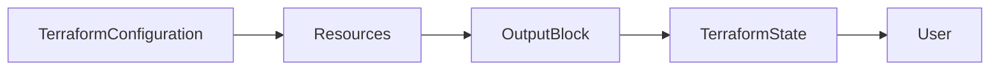

# Outputs

## Overview

**Outputs** are values that Terraform displays after successfully applying infrastructure changes.

They expose useful information about the resources Terraform has created, such as:

- Resource IDs
- Public IP addresses
- DNS names
- Storage Account names
- Virtual Machine names
- Load Balancer IPs

Outputs are similar to **return values of a function** in programming languages.

Instead of manually looking up information in the cloud portal, Terraform automatically displays the values.

> **Interview Tip**
>
> Outputs expose information **after infrastructure is created** and are commonly used to share values between modules and CI/CD pipelines.

---

## Why It Is Used

Outputs are used to:

- Display important resource information
- Share values between modules
- Pass infrastructure information to CI/CD pipelines
- Avoid manually retrieving resource details
- Simplify automation

---

## Architecture / Working



### Working Process

1. Terraform creates resources.
2. Resource attributes become available.
3. Output blocks reference those attributes.
4. Terraform stores outputs in the state file.
5. Outputs are displayed after `terraform apply`.

---

## Key Components

| Component | Purpose |
|-----------|----------|
| Output Block | Defines the output value |
| Value | Resource attribute or expression |
| Description | Documents the output |
| Sensitive | Hides confidential values |
| Terraform State | Stores output values |

---

## Types (if applicable)

Terraform supports outputs for:

- Resource attributes
- Variables
- Expressions
- Module outputs
- Function results

---

## Lifecycle / Workflow


---

## Configuration / Syntax (if applicable)

Basic Output

```hcl
output "resource_group_name" {

  value = azurerm_resource_group.rg.name

}
```

Output with Description

```hcl
output "vm_public_ip" {

  description = "Public IP of VM"

  value = azurerm_public_ip.vm.ip_address

}
```

Sensitive Output

```hcl
output "admin_password" {

  value = random_password.password.result

  sensitive = true

}
```

---

## Important Commands (if applicable)

Display All Outputs

```bash
terraform output
```

Display Specific Output

```bash
terraform output vm_public_ip
```

Display Output as JSON

```bash
terraform output -json
```

Apply Configuration

```bash
terraform apply
```

---

## Important Files (if applicable)

| File | Purpose |
|------|----------|
| outputs.tf | Defines output values |
| terraform.tfstate | Stores output values |
| main.tf | References outputs |

---

## Real-World Use Cases

- Display VM Public IP
- Show Storage Account Name
- Retrieve Kubernetes Cluster Endpoint
- Display Database Connection String
- Pass Resource IDs to CI/CD pipelines
- Share VPC IDs with other Terraform modules

---

## Advantages

- Eliminates manual lookups
- Supports module communication
- Useful in automation
- Improves readability
- Simplifies debugging

---

## Limitations

- Outputs are available only after resource creation
- Sensitive outputs are still stored in the state file
- Incorrect references cause validation errors

---

## Common Interview Questions (Concept Only)

- What are Terraform Outputs?
- Why are outputs used?
- Where are outputs stored?
- Can outputs reference resource attributes?
- How do you hide sensitive outputs?
- How do you display a specific output?
- Can outputs be shared between modules?

---

## Common Mistakes

- Referencing resources that do not exist
- Forgetting to mark passwords as sensitive
- Hardcoding output values
- Using incorrect resource references
- Assuming outputs are available before `terraform apply`

---

## Troubleshooting

| Problem | Solution |
|----------|----------|
| Output not displayed | Verify `output` block exists and run `terraform apply` |
| Invalid reference | Verify resource name and attribute |
| Output shows null | Ensure resource was successfully created |
| Sensitive value hidden | Use `terraform output -json` only if appropriate and authorized |

---

## Summary

Outputs expose useful information generated during infrastructure deployment. They are widely used to display resource details, integrate with automation pipelines, and share values between Terraform modules.

---

# Output Values

## Overview

An **Output Value** is the actual value returned by an output block.

It is typically a resource attribute, variable, expression, or function result.

Examples include:

- Virtual Machine Public IP
- Resource ID
- Storage Account Name
- Load Balancer DNS
- VPC ID

> **Interview Tip**
>
> Output values are evaluated only after Terraform successfully creates or updates the referenced resources.

---

## Why It Is Used

Output values help users:

- Retrieve infrastructure information
- Connect applications
- Automate deployments
- Pass values between Terraform modules

---

## Architecture / Working


---

## Key Components

| Component | Purpose |
|-----------|----------|
| Output Name | Identifier |
| Value | Resource attribute or expression |
| Description | Documentation |
| Sensitive Flag | Protect confidential values |

---

## Types (if applicable)

Output values can contain:

- Strings
- Numbers
- Booleans
- Lists
- Maps
- Objects
- Expressions

---

## Lifecycle / Workflow

Create Resource → Generate Attribute → Output Value → Display

---

## Configuration / Syntax (if applicable)

Output Resource ID

```hcl
output "resource_id" {

  value = azurerm_resource_group.rg.id

}
```

Output Variable

```hcl
output "deployment_region" {

  value = var.location

}
```

Output Expression

```hcl
output "vm_name" {

  value = upper(azurerm_linux_virtual_machine.vm.name)

}
```

---

## Important Commands (if applicable)

Show All Outputs

```bash
terraform output
```

Specific Output

```bash
terraform output resource_id
```

---

## Important Files (if applicable)

| File | Purpose |
|------|----------|
| outputs.tf | Stores output definitions |
| terraform.tfstate | Stores output values |

---

## Real-World Use Cases

- Retrieve Azure Resource Group ID
- Display EC2 Public IP
- Output Kubernetes Cluster Endpoint
- Display Database Endpoint
- Show Application URL after deployment

---

## Advantages

- Dynamic
- Easy to retrieve
- Reusable
- Supports automation

---

## Limitations

- Available only after apply
- Sensitive values remain in state

---

## Common Interview Questions (Concept Only)

- What is an output value?
- Can output values reference variables?
- Can output values use expressions?

---

## Common Mistakes

- Using unsupported attributes
- Referencing resources before creation
- Forgetting descriptions

---

## Troubleshooting

Verify the referenced attribute exists in the provider documentation.

---

## Summary

Output values expose useful infrastructure information and are commonly consumed by users, modules, and automation tools.

---

# Output References

## Overview

Output references allow Terraform configurations and modules to access values exposed by output blocks.

Outputs are commonly referenced:

- Between Terraform modules
- In automation pipelines
- By external tools
- By other Terraform configurations

> **Interview Tip**
>
> Outputs are the primary mechanism for **passing values from one module to another**.

---

## Why It Is Used

Output references enable:

- Module communication
- Infrastructure reuse
- Cleaner architecture
- Decoupled Terraform modules

---

## Architecture / Working


---

## Key Components

| Component | Purpose |
|-----------|----------|
| Output Block | Exposes value |
| Module Output | Makes value available outside module |
| Module Reference | Reads output value |

---

## Types (if applicable)

### Resource Output Reference

```hcl
azurerm_resource_group.rg.name
```

### Module Output Reference

```hcl
module.network.vnet_id
```

---

## Lifecycle / Workflow

Create Resource → Create Output → Reference Output → Consume Value

---

## Configuration / Syntax (if applicable)

Module Output

```hcl
output "vnet_id" {

  value = azurerm_virtual_network.vnet.id

}
```

Reference Module Output

```hcl
module.network.vnet_id
```

Output Referencing Variable

```hcl
output "region" {

  value = var.location

}
```

---

## Important Commands (if applicable)

Display Outputs

```bash
terraform output
```

JSON Output

```bash
terraform output -json
```

---

## Important Files (if applicable)

| File | Purpose |
|------|----------|
| outputs.tf | Module outputs |
| main.tf | References module outputs |

---

## Real-World Use Cases

- Pass VNet ID to another module
- Share Resource Group name
- Reuse Storage Account information
- Connect networking and compute modules
- Provide outputs to Azure DevOps and GitHub Actions pipelines

---

## Advantages

- Supports modular design
- Reduces code duplication
- Improves maintainability
- Enables module reuse

---

## Limitations

- Modules must explicitly expose outputs
- Invalid references prevent planning

---

## Common Interview Questions (Concept Only)

- What are output references?
- How do modules communicate in Terraform?
- How do you reference a module output?
- Can outputs reference variables and expressions?
- Why are outputs important in modular Terraform?

---

## Common Mistakes

- Forgetting to expose module outputs
- Incorrect module names
- Typographical errors in output references
- Referencing outputs that do not exist

---

## Troubleshooting

| Problem | Solution |
|----------|----------|
| Unsupported attribute | Verify the module exposes the output |
| Output not found | Check output block name |
| Module reference error | Verify module name and output name |
| Value is null | Ensure the referenced resource was created successfully |

---

## Summary

Output references enable Terraform modules and external systems to consume values generated during infrastructure deployment. They are fundamental to building reusable, modular, and production-ready Terraform configurations.
