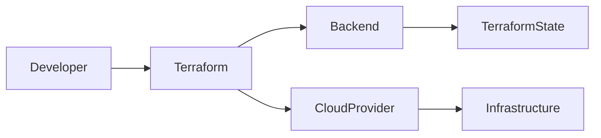
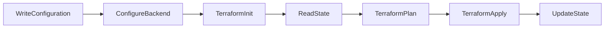
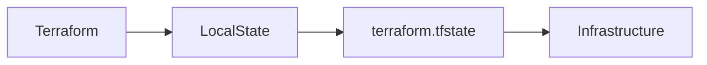
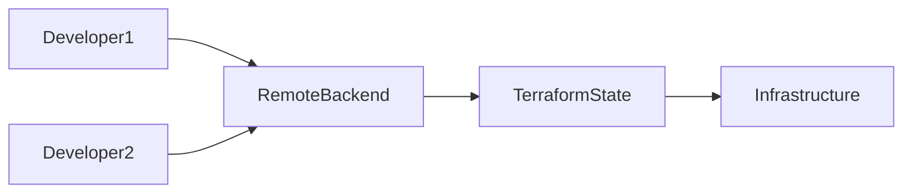
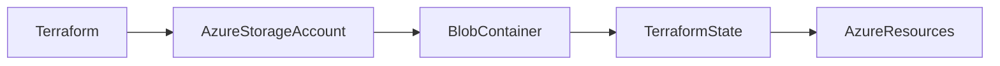

# Backend

## Overview

A **Terraform Backend** determines **where Terraform stores its state file** (`terraform.tfstate`) and **how Terraform performs operations** such as state locking and state retrieval.

By default, Terraform uses a **Local Backend**, where the state file is stored on the local machine.

For production environments and team collaboration, Terraform uses a **Remote Backend**, where the state file is stored in centralized storage such as:

- Azure Storage Account
- AWS S3
- Google Cloud Storage
- Terraform Cloud

> **Interview Tip**
>
> A backend **does not create infrastructure**. It only defines **where Terraform stores and manages its state**.

---

## Why It Is Used

Terraform Backends are used to:

- Store Terraform state
- Enable team collaboration
- Support state locking
- Improve security
- Enable state versioning
- Prevent state corruption
- Centralize infrastructure management

---

## Architecture / Working



### Working Process

1. Terraform initializes the backend.
2. Backend loads the current state.
3. Terraform compares the desired configuration with the current state.
4. Changes are planned.
5. Infrastructure is updated.
6. Backend saves the updated state.

---

## Key Components

| Component | Purpose |
|-----------|----------|
| Backend | Stores Terraform state |
| State File | Tracks infrastructure |
| Locking | Prevents concurrent modifications |
| Versioning | Maintains previous state versions |
| Authentication | Secure backend access |

---

## Types (if applicable)

Terraform commonly uses:

| Backend | Usage |
|----------|-------|
| Local | Single-user environments |
| Remote | Team collaboration |
| Azure Storage | Azure production deployments |
| AWS S3 | AWS production deployments |
| Terraform Cloud | Managed backend |
| Google Cloud Storage | GCP deployments |

---

## Lifecycle / Workflow



---

## Configuration / Syntax (if applicable)

Local Backend (Default)

```hcl
terraform {

}
```

Azure Backend

```hcl
terraform {

  backend "azurerm" {

    resource_group_name  = "rg-tfstate"

    storage_account_name = "tfstateprod"

    container_name       = "tfstate"

    key                  = "prod.terraform.tfstate"

  }

}
```

Initialize Backend

```bash
terraform init
```

---

## Important Commands (if applicable)

Initialize Backend

```bash
terraform init
```

Reconfigure Backend

```bash
terraform init -reconfigure
```

Migrate State

```bash
terraform init -migrate-state
```

View Current State

```bash
terraform show
```

---

## Important Files (if applicable)

| File | Purpose |
|------|----------|
| backend.tf | Backend configuration |
| terraform.tfstate | State file |
| terraform.tfstate.backup | State backup |

---

## Real-World Use Cases

- Azure DevOps pipelines
- GitHub Actions deployments
- Shared Infrastructure as Code projects
- Production cloud deployments
- Disaster recovery using state versioning

---

## Advantages

- Centralized state management
- Team collaboration
- Supports locking
- Secure storage
- Versioning support
- Better disaster recovery

---

## Limitations

- Remote backend requires additional setup
- Authentication is required
- Backend migration requires planning

---

## Common Interview Questions (Concept Only)

- What is a Terraform Backend?
- Why is a backend required?
- What is the default backend?
- Can the backend be changed later?
- Does the backend create infrastructure?

---

## Common Mistakes

- Committing local state to Git
- Using local backend for team projects
- Misconfiguring backend authentication
- Forgetting to initialize backend after changes

---

## Troubleshooting

| Problem | Solution |
|----------|----------|
| Backend initialization failed | Verify backend configuration |
| Authentication failed | Check cloud credentials |
| State migration failed | Run `terraform init -migrate-state` |
| Backend configuration changed | Run `terraform init -reconfigure` |

---

## Summary

A Terraform Backend defines where Terraform stores and manages its state. Local backends are suitable for individual development, while remote backends provide centralized storage, collaboration, state locking, and versioning for production environments.

---

# Local Backend

## Overview

The **Local Backend** is Terraform's **default backend**.

Terraform stores the state file on the local machine in:

```text
terraform.tfstate
```

No additional configuration is required.

> **Interview Tip**
>
> Local Backend is suitable only for **learning, testing, and single-user environments**.

---

## Why It Is Used

Local Backend is useful for:

- Learning Terraform
- Personal projects
- Development environments
- Quick testing

---

## Architecture / Working



---

## Key Components

| Component | Purpose |
|-----------|----------|
| terraform.tfstate | Stores state locally |
| Local Machine | Hosts state file |

---

## Types (if applicable)

Default Backend

No explicit configuration required.

---

## Lifecycle / Workflow

Create Configuration → Apply → Store State Locally

---

## Configuration / Syntax (if applicable)

Default

```hcl
terraform {

}
```

Explicit Configuration

```hcl
terraform {

  backend "local" {

    path = "terraform.tfstate"

  }

}
```

---

## Important Commands (if applicable)

```bash
terraform init

terraform show

terraform state list
```

---

## Important Files (if applicable)

| File | Purpose |
|------|----------|
| terraform.tfstate | Local state |
| terraform.tfstate.backup | Backup |

---

## Real-World Use Cases

- Learning Terraform
- Local testing
- Personal infrastructure

---

## Advantages

- Simple
- No cloud storage required
- Easy to set up

---

## Limitations

- No collaboration
- No locking
- Easy to lose state
- Not suitable for production

---

## Common Interview Questions (Concept Only)

- What is the Local Backend?
- Where is the state stored?
- Why isn't Local Backend recommended for teams?

---

## Common Mistakes

- Sharing local state manually
- Storing local state in Git
- Using local backend in production

---

## Troubleshooting

Keep backups of the state file and avoid manual edits.

---

## Summary

The Local Backend stores Terraform state on the local machine. It is best suited for development and learning but should not be used for collaborative or production environments.

---

# Remote Backend

## Overview

A **Remote Backend** stores Terraform state in a centralized location instead of the local machine.

It enables:

- Collaboration
- State locking
- Versioning
- Secure storage
- Automated deployments

Common remote backends include:

- Azure Storage
- Amazon S3
- Google Cloud Storage
- Terraform Cloud

> **Interview Tip**
>
> Remote Backend is the recommended choice for production and team-based Infrastructure as Code.

---

## Why It Is Used

Remote Backend provides:

- Shared state
- Secure storage
- Locking
- Backup
- Version history

---

## Architecture / Working



---

## Key Components

| Component | Purpose |
|-----------|----------|
| Backend | Stores state |
| Lock | Prevents simultaneous updates |
| Versioning | Tracks state history |

---

## Types (if applicable)

| Backend | Cloud |
|----------|-------|
| Azure Storage | Azure |
| Amazon S3 | AWS |
| Google Cloud Storage | GCP |
| Terraform Cloud | HashiCorp |

---

## Lifecycle / Workflow

Configure Backend → Initialize → Store State → Lock → Update State

---

## Configuration / Syntax (if applicable)

Example

```hcl
terraform {

  backend "azurerm" {

  }

}
```

---

## Important Commands (if applicable)

```bash
terraform init

terraform init -migrate-state

terraform init -reconfigure
```

---

## Important Files (if applicable)

backend.tf

---

## Real-World Use Cases

- Azure DevOps
- GitHub Actions
- Jenkins
- Enterprise Terraform

---

## Advantages

- Team collaboration
- Locking
- Versioning
- Centralized storage

---

## Limitations

- Requires cloud storage
- Authentication required

---

## Common Interview Questions (Concept Only)

- What is Remote Backend?
- Why is Remote Backend preferred?
- Which cloud services support Remote Backend?

---

## Common Mistakes

- Incorrect authentication
- Missing backend configuration
- Forgetting backend initialization

---

## Troubleshooting

Verify storage account access and backend configuration before running `terraform init`.

---

## Summary

A Remote Backend stores Terraform state centrally, enabling secure collaboration, locking, and versioning for production Infrastructure as Code.

---

# Azure Storage Backend

## Overview

The **Azure Storage Backend** stores Terraform state in an **Azure Storage Account Blob Container**.

It is the **most commonly used backend for Azure infrastructure**.

It supports:

- Centralized storage
- State locking through Azure Blob leases
- Secure authentication
- Versioning (when enabled on the storage account)
- Team collaboration

> **Interview Tip**
>
> Azure Storage Backend is the **recommended production backend** for Terraform deployments on Microsoft Azure.

---

## Why It Is Used

Azure Storage Backend provides:

- Shared Terraform state
- Secure storage
- Automatic state locking
- High availability
- Backup through blob versioning
- Integration with Azure DevOps

---

## Architecture / Working



---

## Key Components

| Component | Purpose |
|-----------|----------|
| Resource Group | Holds storage account |
| Storage Account | Stores state |
| Blob Container | Contains state file |
| State File | Infrastructure metadata |
| Blob Lease | State locking mechanism |

---

## Types (if applicable)

Azure Blob Storage Backend

---

## Lifecycle / Workflow

Create Storage Account → Create Blob Container → Configure Backend → Initialize → Store State

---

## Configuration / Syntax (if applicable)

```hcl
terraform {

  backend "azurerm" {

    resource_group_name  = "rg-tfstate"

    storage_account_name = "tfstateprod"

    container_name       = "tfstate"

    key                  = "production.tfstate"

  }

}
```

Initialize Backend

```bash
terraform init
```

Migrate Local State

```bash
terraform init -migrate-state
```

---

## Important Commands (if applicable)

Initialize

```bash
terraform init
```

Reconfigure

```bash
terraform init -reconfigure
```

Migrate

```bash
terraform init -migrate-state
```

---

## Important Files (if applicable)

| File | Purpose |
|------|----------|
| backend.tf | Backend configuration |
| terraform.tfstate | Stored in Azure Blob Storage |

---

## Real-World Use Cases

- Azure DevOps CI/CD pipelines
- Enterprise Azure deployments
- Shared infrastructure projects
- Multi-engineer Terraform workflows
- Disaster recovery using Blob versioning

---

## Advantages

- Secure Azure-native storage
- Automatic state locking
- Supports RBAC authentication
- High availability
- Centralized management
- Production ready

---

## Limitations

- Requires Azure Storage Account
- Initial setup is required
- Access permissions must be configured correctly

---

## Common Interview Questions (Concept Only)

- Why is Azure Storage used as a Terraform backend?
- What Azure service stores the Terraform state file?
- How does Azure Storage Backend implement state locking?
- Which Azure resource stores the state file?
- What is the purpose of the `key` property in the backend configuration?
- Why should versioning be enabled on the Storage Account?

---

## Common Mistakes

- Using a storage account without proper access controls
- Storing the backend configuration incorrectly
- Forgetting to run `terraform init`
- Disabling blob versioning
- Using the same state file (`key`) for multiple environments

---

## Troubleshooting

| Problem | Solution |
|----------|----------|
| Backend initialization failed | Verify Storage Account and Blob Container names |
| Authentication failed | Check Azure login, service principal, or managed identity permissions |
| Blob container not found | Create the container before initializing the backend |
| State lock cannot be acquired | Wait for the active operation to finish or release a stale blob lease if necessary |
| Incorrect state file used | Verify the `key` value points to the intended environment |

---

## Summary

The Azure Storage Backend is the recommended backend for Azure-based Terraform deployments. It stores state files securely in Azure Blob Storage, supports automatic state locking through blob leases, enables collaboration, and provides a reliable foundation for enterprise Infrastructure as Code workflows.
