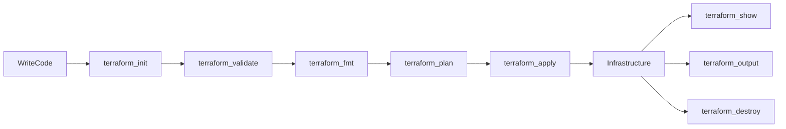
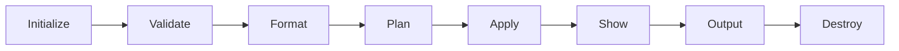
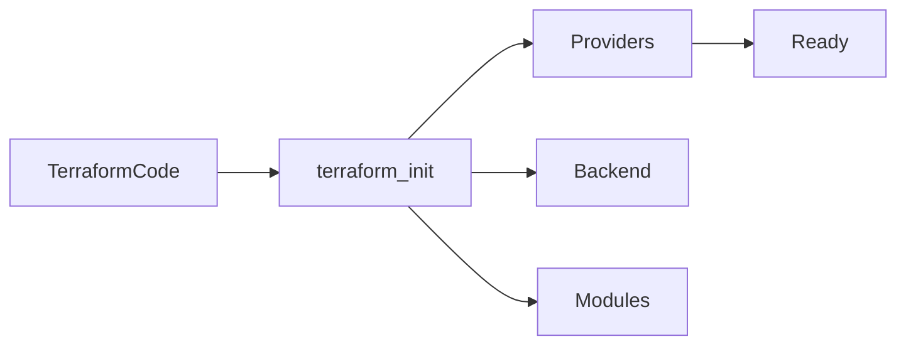
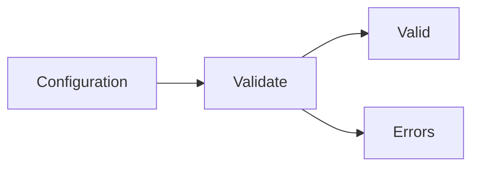
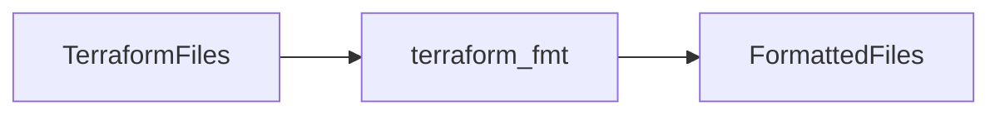
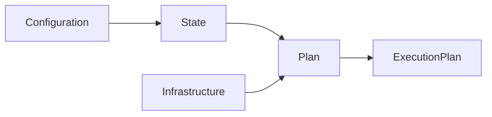
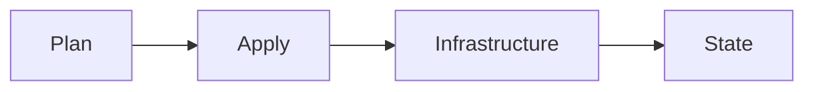
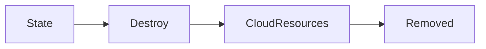
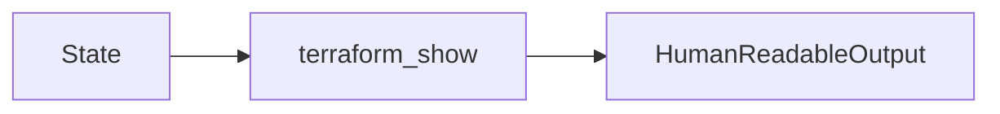
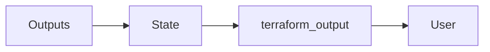

# Core Terraform Commands

## Overview

Terraform provides a set of **core CLI commands** that manage the complete Infrastructure as Code (IaC) lifecycle.

These commands are used to:

- Initialize Terraform projects
- Validate configurations
- Format code
- Preview infrastructure changes
- Create infrastructure
- Modify infrastructure
- Destroy infrastructure
- View state information
- Display outputs

> **Interview Tip**
>
> The most frequently used Terraform commands in interviews and production are:
>
> - `terraform init`
> - `terraform validate`
> - `terraform fmt`
> - `terraform plan`
> - `terraform apply`
> - `terraform destroy`

---

## Why It Is Used

Core Terraform commands help to:

- Automate infrastructure deployment
- Maintain consistent environments
- Reduce manual errors
- Validate Infrastructure as Code
- Manage infrastructure lifecycle
- Improve collaboration

---

## Architecture / Working



---

## Key Components

| Command | Purpose |
|----------|----------|
| init | Initialize project |
| validate | Validate configuration |
| fmt | Format Terraform files |
| plan | Preview changes |
| apply | Create or modify infrastructure |
| destroy | Delete infrastructure |
| show | Display infrastructure details |
| output | Display output values |

---

## Types (if applicable)

Terraform commands are generally grouped into:

| Category | Commands |
|-----------|----------|
| Initialization | init |
| Validation | validate, fmt |
| Deployment | plan, apply |
| Destruction | destroy |
| Inspection | show, output |

---

## Lifecycle / Workflow



---

## Configuration / Syntax (if applicable)

Basic Workflow

```bash
terraform init

terraform validate

terraform fmt

terraform plan

terraform apply
```

---

## Important Commands (if applicable)

```bash
terraform init

terraform validate

terraform fmt

terraform plan

terraform apply

terraform destroy

terraform show

terraform output
```

---

## Important Files (if applicable)

| File | Purpose |
|------|----------|
| main.tf | Main configuration |
| variables.tf | Variable definitions |
| outputs.tf | Output definitions |
| terraform.tfstate | Infrastructure state |
| terraform.tfvars | Variable values |

---

## Real-World Use Cases

- Deploy Azure infrastructure
- Create AWS resources
- Provision Kubernetes clusters
- Automate CI/CD deployments
- Manage Infrastructure as Code

---

## Advantages

- Fully automated infrastructure
- Consistent deployments
- Easy rollback planning
- Supports CI/CD
- Cloud agnostic

---

## Limitations

- Incorrect commands may modify infrastructure
- Requires proper authentication
- State must be managed securely

---

## Common Interview Questions (Concept Only)

- Which Terraform command initializes a project?
- What is the difference between `plan` and `apply`?
- Why should `validate` be executed?
- What does `terraform fmt` do?
- Which command removes infrastructure?

---

## Common Mistakes

- Running `apply` without reviewing the plan
- Forgetting to initialize providers
- Ignoring formatting
- Destroying the wrong environment

---

## Troubleshooting

| Problem | Solution |
|----------|----------|
| Provider not installed | Run `terraform init` |
| Invalid configuration | Run `terraform validate` |
| Formatting inconsistent | Run `terraform fmt` |
| Plan shows unexpected changes | Review variables, state, and configuration |

---

## Summary

Terraform core commands manage the complete Infrastructure as Code lifecycle—from project initialization and validation to deployment, inspection, and resource destruction. Mastering these commands is essential for both interviews and day-to-day DevOps work.

---

# terraform init

## Overview

`terraform init` initializes a Terraform working directory.

It performs several tasks:

- Downloads required providers
- Initializes the backend
- Downloads Terraform modules
- Creates the `.terraform` directory

> **Interview Tip**
>
> `terraform init` must be executed **before any other Terraform command** in a new or modified working directory.

---

## Why It Is Used

- Initialize providers
- Configure backend
- Download modules
- Prepare Terraform project

---

## Architecture / Working



---

## Key Components

| Component | Purpose |
|-----------|----------|
| Provider Download | Installs provider plugins |
| Backend Initialization | Configures state storage |
| Module Download | Retrieves referenced modules |
| .terraform Directory | Stores initialization data |

---

## Types (if applicable)

Initialization options include:

- Standard initialization
- Backend reconfiguration
- State migration

---

## Lifecycle / Workflow

Initialize → Download Providers → Configure Backend → Ready

---

## Configuration / Syntax (if applicable)

Initialize

```bash
terraform init
```

Reconfigure Backend

```bash
terraform init -reconfigure
```

Migrate State

```bash
terraform init -migrate-state
```

Upgrade Providers

```bash
terraform init -upgrade
```

---

## Important Commands (if applicable)

```bash
terraform init

terraform init -upgrade

terraform init -reconfigure

terraform init -migrate-state
```

---

## Important Files (if applicable)

| File | Purpose |
|------|----------|
| .terraform/ | Provider plugins |
| .terraform.lock.hcl | Provider version lock |

---

## Real-World Use Cases

- First deployment
- Backend migration
- Provider upgrades
- Module installation

---

## Advantages

- Automatic provider download
- Backend setup
- Module management

---

## Limitations

- Requires internet access for provider downloads
- Backend credentials must be valid

---

## Common Interview Questions (Concept Only)

- What does `terraform init` do?
- Is `terraform init` required after changing the backend?
- Does `terraform init` create infrastructure?

---

## Common Mistakes

- Skipping initialization
- Forgetting to reinitialize after backend changes

---

## Troubleshooting

If providers or backend configuration change, rerun:

```bash
terraform init
```

---

## Summary

`terraform init` prepares a Terraform project by downloading providers, configuring the backend, and initializing modules.

---

# terraform validate

## Overview

`terraform validate` checks whether Terraform configuration files are **syntactically correct and internally consistent**.

It does **not** contact cloud providers or create infrastructure.

> **Interview Tip**
>
> `terraform validate` verifies configuration correctness but does **not** verify cloud resources or credentials.

---

## Why It Is Used

- Detect syntax errors
- Validate resource references
- Catch configuration mistakes early

---

## Architecture / Working



---

## Key Components

| Component | Purpose |
|-----------|----------|
| Syntax Validation | Checks HCL syntax |
| Configuration Validation | Verifies references |
| Resource Validation | Checks configuration consistency |

---

## Types (if applicable)

Configuration validation

---

## Lifecycle / Workflow

Read Configuration → Validate → Report

---

## Configuration / Syntax (if applicable)

```bash
terraform validate
```

---

## Important Commands (if applicable)

```bash
terraform validate
```

---

## Important Files (if applicable)

All `.tf` files

---

## Real-World Use Cases

- CI/CD validation
- Pre-deployment checks
- Code reviews

---

## Advantages

- Fast
- Safe
- No infrastructure changes

---

## Limitations

- Does not detect runtime cloud errors
- Does not validate credentials

---

## Common Interview Questions (Concept Only)

- What does `terraform validate` check?
- Does `validate` contact Azure or AWS?

---

## Common Mistakes

- Assuming validation checks cloud resources

---

## Troubleshooting

Fix reported syntax or reference errors before proceeding.

---

## Summary

`terraform validate` ensures Terraform configurations are syntactically correct and internally consistent before deployment.

---

# terraform fmt

## Overview

`terraform fmt` automatically formats Terraform configuration files according to the official HashiCorp style guide.

> **Interview Tip**
>
> Teams commonly run `terraform fmt` before committing code to Git.

---

## Why It Is Used

- Improve readability
- Standardize formatting
- Reduce formatting differences in code reviews

---

## Architecture / Working



---

## Key Components

| Component | Purpose |
|-----------|----------|
| Formatter | Standardizes code style |
| HCL Parser | Reads Terraform files |

---

## Types (if applicable)

Recursive formatting

Check-only formatting

---

## Lifecycle / Workflow

Read → Format → Save

---

## Configuration / Syntax (if applicable)

Format Current Directory

```bash
terraform fmt
```

Recursive

```bash
terraform fmt -recursive
```

Check Formatting

```bash
terraform fmt -check
```

---

## Important Commands (if applicable)

```bash
terraform fmt

terraform fmt -recursive

terraform fmt -check
```

---

## Important Files (if applicable)

All `.tf` files

---

## Real-World Use Cases

- Git commits
- CI/CD quality checks
- Team collaboration

---

## Advantages

- Consistent formatting
- Better readability
- Faster code reviews

---

## Limitations

- Changes formatting only
- Does not validate configuration

---

## Common Interview Questions (Concept Only)

- What is the purpose of `terraform fmt`?
- Does `fmt` validate Terraform code?

---

## Common Mistakes

- Confusing formatting with validation

---

## Troubleshooting

Run `terraform fmt` before committing Terraform files.

---

## Summary

`terraform fmt` formats Terraform code according to HashiCorp standards without modifying infrastructure.

---

# terraform plan

## Overview

`terraform plan` creates an execution plan showing what Terraform **will do** without making any changes.

It compares:

- Desired configuration
- Current state
- Existing infrastructure

> **Interview Tip**
>
> `terraform plan` is a **preview**, not an execution.

---

## Why It Is Used

- Review upcoming changes
- Prevent accidental modifications
- Verify infrastructure before deployment

---

## Architecture / Working



---

## Key Components

| Component | Purpose |
|-----------|----------|
| Configuration | Desired state |
| State | Current state |
| Plan | Proposed changes |

---

## Types (if applicable)

- Create
- Update
- Destroy
- No changes

---

## Lifecycle / Workflow

Read → Compare → Generate Plan

---

## Configuration / Syntax (if applicable)

```bash
terraform plan
```

Save Plan

```bash
terraform plan -out=tfplan
```

---

## Important Commands (if applicable)

```bash
terraform plan

terraform plan -out=tfplan
```

---

## Important Files (if applicable)

terraform.tfstate

---

## Real-World Use Cases

- Change approval
- Production deployments
- CI/CD pipelines

---

## Advantages

- Safe preview
- Prevents mistakes

---

## Limitations

- Does not make changes

---

## Common Interview Questions (Concept Only)

- Difference between `plan` and `apply`?
- Can `plan` modify infrastructure?

---

## Common Mistakes

- Skipping plan review

---

## Troubleshooting

Review variables and state if the plan is unexpected.

---

## Summary

`terraform plan` previews infrastructure changes before execution, helping prevent accidental modifications.

---

# terraform apply

## Overview

`terraform apply` executes the Terraform plan and creates, updates, or deletes infrastructure.

> **Interview Tip**
>
> `terraform apply` changes real infrastructure and updates the Terraform state file.

---

## Why It Is Used

- Deploy infrastructure
- Update infrastructure
- Apply planned changes

---

## Architecture / Working



---

## Key Components

| Component | Purpose |
|-----------|----------|
| Plan | Execution instructions |
| Apply | Executes changes |
| State | Updated after execution |

---

## Types (if applicable)

Interactive

Automatic Approval

---

## Lifecycle / Workflow

Plan → Confirm → Apply → Update State

---

## Configuration / Syntax (if applicable)

```bash
terraform apply
```

Auto Approve

```bash
terraform apply -auto-approve
```

Apply Saved Plan

```bash
terraform apply tfplan
```

---

## Important Commands (if applicable)

```bash
terraform apply

terraform apply -auto-approve

terraform apply tfplan
```

---

## Important Files (if applicable)

terraform.tfstate

---

## Real-World Use Cases

- Deploy Azure infrastructure
- Deploy AWS infrastructure
- CI/CD pipelines

---

## Advantages

- Fully automated deployment
- Updates state automatically

---

## Limitations

- Modifies production infrastructure

---

## Common Interview Questions (Concept Only)

- What does `terraform apply` do?
- Does `apply` update the state file?

---

## Common Mistakes

- Applying without reviewing the plan

---

## Troubleshooting

Review the execution plan before approval.

---

## Summary

`terraform apply` executes infrastructure changes and updates the Terraform state.

---

# terraform destroy

## Overview

`terraform destroy` removes all infrastructure managed by the current Terraform configuration.

> **Interview Tip**
>
> `terraform destroy` only deletes resources tracked in the current Terraform state.

---

## Why It Is Used

- Clean up environments
- Remove temporary infrastructure
- Reduce cloud costs

---

## Architecture / Working



---

## Key Components

| Component | Purpose |
|-----------|----------|
| State | Determines resources to remove |
| Destroy | Deletes infrastructure |

---

## Types (if applicable)

Interactive

Auto Approved

---

## Lifecycle / Workflow

Read State → Destroy Resources → Update State

---

## Configuration / Syntax (if applicable)

```bash
terraform destroy
```

Auto Approve

```bash
terraform destroy -auto-approve
```

---

## Important Commands (if applicable)

```bash
terraform destroy

terraform destroy -auto-approve
```

---

## Important Files (if applicable)

terraform.tfstate

---

## Real-World Use Cases

- Delete test environments
- Temporary infrastructure
- Resource cleanup

---

## Advantages

- Automatic cleanup
- Cost savings

---

## Limitations

- Deletes managed resources permanently

---

## Common Interview Questions (Concept Only)

- What does `terraform destroy` remove?
- Does it remove unmanaged resources?

---

## Common Mistakes

- Destroying the wrong environment

---

## Troubleshooting

Verify the workspace and state before running the command.

---

## Summary

`terraform destroy` removes infrastructure managed by Terraform and updates the state accordingly.

---

# terraform show

## Overview

`terraform show` displays the current Terraform state or a saved execution plan in a human-readable format.

> **Interview Tip**
>
> `terraform show` is used for inspection only. It does not modify infrastructure.

---

## Why It Is Used

- Inspect state
- Review infrastructure
- Examine saved plans

---

## Architecture / Working



---

## Key Components

| Component | Purpose |
|-----------|----------|
| State | Current infrastructure |
| Plan | Saved execution plan |

---

## Types (if applicable)

State Display

Plan Display

---

## Lifecycle / Workflow

Read → Display

---

## Configuration / Syntax (if applicable)

Show State

```bash
terraform show
```

Show Saved Plan

```bash
terraform show tfplan
```

Show JSON Output

```bash
terraform show -json
```

---

## Important Commands (if applicable)

```bash
terraform show

terraform show tfplan

terraform show -json
```

---

## Important Files (if applicable)

terraform.tfstate

---

## Real-World Use Cases

- Troubleshooting
- State inspection
- Auditing infrastructure

---

## Advantages

- Easy inspection
- No infrastructure changes

---

## Limitations

- Read-only operation

---

## Common Interview Questions (Concept Only)

- What information does `terraform show` display?
- Can it display a saved plan?

---

## Common Mistakes

- Confusing `show` with `output`

---

## Troubleshooting

Ensure a valid state file or saved plan exists.

---

## Summary

`terraform show` displays Terraform state or execution plans for review and troubleshooting.

---

# terraform output

## Overview

`terraform output` displays values defined in Terraform output blocks after infrastructure deployment.

Outputs commonly include:

- Public IP addresses
- Resource IDs
- DNS names
- Storage Account names

> **Interview Tip**
>
> `terraform output` retrieves values from the Terraform state file—it does not query the cloud provider directly.

---

## Why It Is Used

- Retrieve deployment information
- Pass values to automation
- Display resource attributes

---

## Architecture / Working



---

## Key Components

| Component | Purpose |
|-----------|----------|
| Output Block | Defines exported values |
| State File | Stores output values |

---

## Types (if applicable)

All Outputs

Specific Output

JSON Output

---

## Lifecycle / Workflow

Read State → Retrieve Output → Display

---

## Configuration / Syntax (if applicable)

Display All Outputs

```bash
terraform output
```

Display Specific Output

```bash
terraform output vm_public_ip
```

JSON Output

```bash
terraform output -json
```

---

## Important Commands (if applicable)

```bash
terraform output

terraform output vm_public_ip

terraform output -json
```

---

## Important Files (if applicable)

outputs.tf

terraform.tfstate

---

## Real-World Use Cases

- Display VM IP addresses
- Retrieve Resource IDs
- CI/CD pipeline integration
- Module communication

---

## Advantages

- Easy access to infrastructure information
- Automation friendly
- No manual lookup

---

## Limitations

- Outputs must be explicitly defined
- Sensitive outputs are stored in the state file (though masked in normal CLI output)

---

## Common Interview Questions (Concept Only)

- What does `terraform output` display?
- Where are output values stored?
- Can you retrieve a specific output?

---

## Common Mistakes

- Forgetting to define output blocks
- Expecting outputs before running `terraform apply`

---

## Troubleshooting

Run `terraform apply` first to populate outputs, then verify the output block exists in `outputs.tf`.

---

## Summary

`terraform output` displays values defined in Terraform output blocks, making it easy to retrieve important infrastructure details for users, modules, and CI/CD pipelines.
