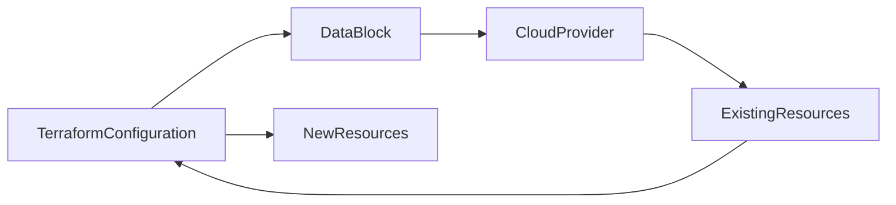
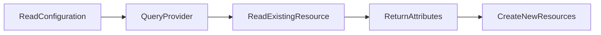
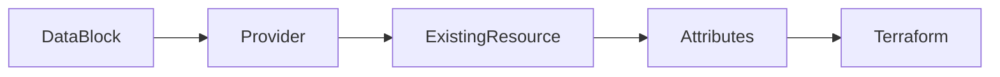
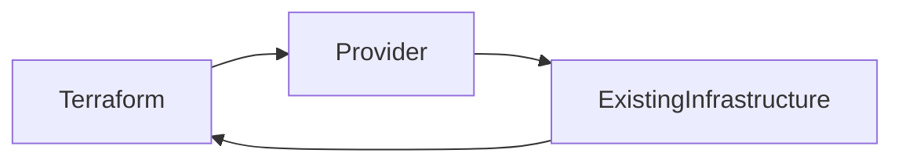
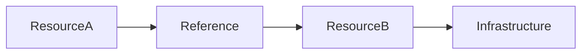

# Data Sources

## Overview

**Data Sources** allow Terraform to **read information about existing infrastructure** without creating or managing it.

Instead of provisioning a new resource, Terraform retrieves details about resources that already exist in the cloud provider.

Examples:

- Existing Resource Groups
- Existing Virtual Networks
- Existing Subnets
- Existing Storage Accounts
- Existing Security Groups
- Existing AMIs

Data sources are defined using the **`data` block**.

> **Interview Tip**
>
> **Resources create infrastructure.**
>
> **Data Sources read existing infrastructure.**
>
> This is one of the most frequently asked Terraform interview questions.

---

## Why It Is Used

Data Sources are used to:

- Reuse existing infrastructure
- Integrate Terraform with manually created resources
- Reference existing cloud resources
- Avoid duplicate resource creation
- Build modular Infrastructure as Code
- Share infrastructure across teams

---

## Architecture / Working



### Working Process

1. Terraform reads the configuration.
2. The provider queries the cloud platform.
3. Existing resource information is retrieved.
4. Terraform uses the returned attributes in resource creation.

---

## Key Components

| Component | Purpose |
|-----------|----------|
| Data Block | Reads existing resources |
| Provider | Connects to cloud platform |
| Existing Resource | Infrastructure already created |
| Resource Reference | Uses retrieved values |

---

## Types (if applicable)

Common Terraform Data Sources

| Cloud | Examples |
|--------|----------|
| Azure | Resource Group, VNet, Subnet, Storage Account |
| AWS | VPC, Subnet, Security Group, AMI |
| GCP | Network, Subnetwork |

---

## Lifecycle / Workflow



---

## Configuration / Syntax (if applicable)

Basic Data Block

```hcl
data "azurerm_resource_group" "existing" {

  name = "production-rg"

}
```

Reference Data Source

```hcl
location = data.azurerm_resource_group.existing.location
```

---

## Important Commands (if applicable)

Validate Configuration

```bash
terraform validate
```

Preview Values

```bash
terraform plan
```

Apply

```bash
terraform apply
```

---

## Important Files (if applicable)

| File | Purpose |
|------|----------|
| main.tf | Defines data sources |
| providers.tf | Provider configuration |
| terraform.tfstate | Stores references after apply |

---

## Real-World Use Cases

- Deploy VM into an existing VNet
- Create a subnet inside an existing Resource Group
- Attach VM to an existing Network Security Group
- Use an existing Storage Account
- Retrieve latest Ubuntu image
- Reference existing Kubernetes cluster

---

## Advantages

- Avoids duplicate infrastructure
- Supports existing cloud environments
- Improves code reuse
- Enables modular architecture
- Simplifies hybrid deployments

---

## Limitations

- Cannot modify existing resources
- Resource must already exist
- Incorrect lookup causes plan failure

---

## Common Interview Questions (Concept Only)

- What is a Terraform Data Source?
- What is the difference between Resource and Data Source?
- When should Data Sources be used?
- Can Data Sources create resources?
- Why are Data Sources useful in production?

---

## Common Mistakes

- Using a Resource instead of a Data Source
- Incorrect resource names
- Assuming Data Sources manage lifecycle
- Referencing non-existent resources

---

## Troubleshooting

| Problem | Solution |
|----------|----------|
| Resource not found | Verify resource exists in the cloud |
| Incorrect name | Check exact resource name |
| Provider authentication failed | Verify credentials |
| Invalid reference | Verify data source name and attribute |

---

## Summary

Data Sources allow Terraform to retrieve information about existing infrastructure without creating or managing it. They are essential for integrating Terraform with pre-existing cloud resources and are heavily used in production environments.

---

# Data Block

## Overview

A **Data Block** is the Terraform configuration block used to define a Data Source.

Syntax:

```hcl
data "<RESOURCE_TYPE>" "<LOCAL_NAME>" {

}
```

Unlike a `resource` block, a `data` block only reads existing infrastructure.

> **Interview Tip**
>
> Every Data Source starts with the keyword:

```hcl
data
```

---

## Why It Is Used

Data blocks allow Terraform to:

- Query existing infrastructure
- Read resource attributes
- Reference external resources
- Share infrastructure across modules

---

## Architecture / Working



---

## Key Components

| Component | Purpose |
|-----------|----------|
| data | Declares a data source |
| Resource Type | Cloud resource type |
| Local Name | Terraform identifier |
| Arguments | Lookup criteria |

---

## Types (if applicable)

Azure Example

```hcl
data "azurerm_resource_group" "rg" {

}
```

AWS Example

```hcl
data "aws_vpc" "vpc" {

}
```

---

## Lifecycle / Workflow

Define Data Block → Query Provider → Return Attributes

---

## Configuration / Syntax (if applicable)

Example

```hcl
data "azurerm_resource_group" "rg" {

  name = "production-rg"

}
```

Reference

```hcl
data.azurerm_resource_group.rg.location
```

---

## Important Commands (if applicable)

```bash
terraform plan

terraform apply
```

---

## Important Files (if applicable)

main.tf

---

## Real-World Use Cases

- Existing Resource Groups
- Existing VNets
- Existing Storage Accounts

---

## Advantages

- Simple
- Read-only
- Reusable

---

## Limitations

- Cannot create resources
- Requires existing infrastructure

---

## Common Interview Questions (Concept Only)

- What is a Data Block?
- How is a Data Block different from a Resource Block?

---

## Common Mistakes

- Using `resource` instead of `data`
- Incorrect lookup parameters

---

## Troubleshooting

Verify provider documentation for required lookup arguments.

---

## Summary

The Data Block is the Terraform construct used to retrieve information about existing cloud resources.

---

# Reading Existing Resources

## Overview

Terraform Data Sources are commonly used to **read infrastructure that already exists**.

Terraform queries the cloud provider and retrieves resource attributes.

Examples include:

- Existing Virtual Networks
- Existing Resource Groups
- Existing AWS VPCs
- Existing Storage Accounts
- Existing Security Groups

> **Interview Tip**
>
> Reading existing resources is one of the most common production use cases for Data Sources.

---

## Why It Is Used

Reading existing resources enables:

- Infrastructure reuse
- Hybrid deployments
- Integration with manually created resources
- Shared infrastructure

---

## Architecture / Working



---

## Key Components

| Component | Purpose |
|-----------|----------|
| Existing Resource | Infrastructure already deployed |
| Provider | Retrieves resource information |
| Terraform | Uses returned values |

---

## Types (if applicable)

Azure

AWS

Google Cloud

---

## Lifecycle / Workflow

Query → Retrieve → Reference → Deploy

---

## Configuration / Syntax (if applicable)

Example

```hcl
data "azurerm_virtual_network" "vnet" {

  name = "prod-vnet"

  resource_group_name = "network-rg"

}
```

---

## Important Commands (if applicable)

```bash
terraform plan
```

---

## Important Files (if applicable)

main.tf

---

## Real-World Use Cases

- Deploy VM into existing subnet
- Existing networking
- Existing security groups
- Existing resource groups

---

## Advantages

- Reuses infrastructure
- Avoids duplication
- Supports enterprise environments

---

## Limitations

- Resource must exist
- Lookup failures stop deployment

---

## Common Interview Questions (Concept Only)

- How does Terraform read existing resources?
- Why is reading existing resources useful?

---

## Common Mistakes

- Wrong lookup values
- Incorrect resource names

---

## Troubleshooting

Verify resource names in the cloud portal or CLI before deployment.

---

## Summary

Reading existing resources allows Terraform to integrate with infrastructure that was previously created, making deployments more flexible and reusable.

---

# Resource References

## Overview

A **Resource Reference** allows one Terraform resource or data source to access the attributes of another resource.

Terraform automatically creates dependencies based on these references.

Example:

```hcl
resource_group_name = azurerm_resource_group.rg.name
```

or

```hcl
location = data.azurerm_resource_group.rg.location
```

> **Interview Tip**
>
> References automatically create **implicit dependencies** in Terraform.

---

## Why It Is Used

Resource references:

- Connect infrastructure components
- Share resource attributes
- Build dependencies
- Reduce hardcoding

---

## Architecture / Working



---

## Key Components

| Component | Purpose |
|-----------|----------|
| Resource | Source of attributes |
| Attribute | Value being referenced |
| Reference | Connects resources |

---

## Types (if applicable)

### Resource Reference

```hcl
azurerm_resource_group.rg.name
```

### Data Source Reference

```hcl
data.azurerm_resource_group.rg.location
```

---

## Lifecycle / Workflow

Create Resource → Generate Attributes → Reference Attributes → Create Dependent Resource

---

## Configuration / Syntax (if applicable)

Resource Reference

```hcl
resource_group_name = azurerm_resource_group.rg.name
```

Data Source Reference

```hcl
location = data.azurerm_resource_group.rg.location
```

Reference ID

```hcl
subnet_id = azurerm_subnet.subnet.id
```

---

## Important Commands (if applicable)

```bash
terraform validate

terraform plan
```

---

## Important Files (if applicable)

main.tf

---

## Real-World Use Cases

- VM uses Resource Group name
- VM references existing subnet
- Network Interface references Public IP
- Virtual Machine references Network Interface
- Storage Account references Resource Group

---

## Advantages

- Eliminates hardcoding
- Automatic dependency management
- Easier maintenance
- Dynamic infrastructure

---

## Limitations

- Incorrect references cause validation errors
- Circular dependencies must be avoided

---

## Common Interview Questions (Concept Only)

- What is a Terraform Resource Reference?
- What is the difference between Resource and Data Source references?
- How does Terraform determine resource creation order?
- What are implicit dependencies?
- Can Resource References eliminate the need for `depends_on`?

---

## Common Mistakes

- Typographical errors in resource names
- Referencing unsupported attributes
- Creating circular dependencies
- Hardcoding values instead of using references

---

## Troubleshooting

| Problem | Solution |
|----------|----------|
| Unsupported attribute | Verify the attribute exists in the provider documentation |
| Reference not found | Check resource or data source name |
| Circular dependency detected | Remove the cyclic reference or redesign dependencies |
| Invalid resource type | Verify the correct provider resource type is being referenced |

---

## Summary

Resource References enable Terraform resources and data sources to share attributes dynamically. They eliminate hardcoded values, automatically establish dependencies, and are fundamental to writing maintainable, production-ready Infrastructure as Code.
