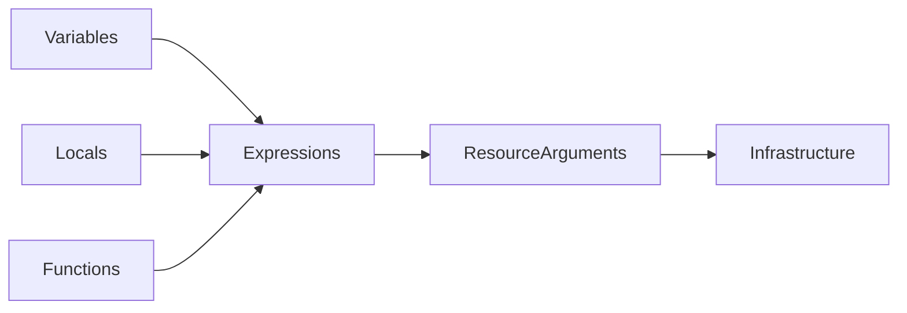
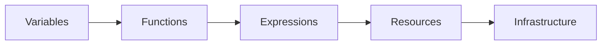
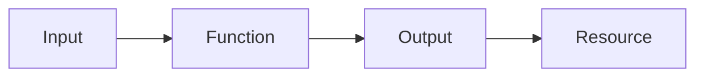
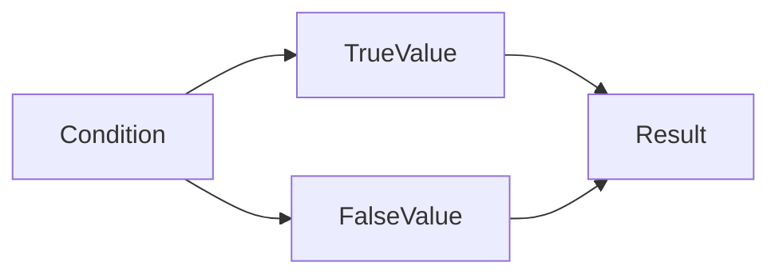

# Expressions & Functions

## Overview

**Expressions** and **Functions** make Terraform configurations dynamic by allowing you to calculate values, manipulate data, and make decisions instead of hardcoding values.

They help create reusable, flexible, and production-ready Infrastructure as Code (IaC).

Terraform expressions are used in:

- Resource arguments
- Variables
- Outputs
- Locals
- Module inputs
- Conditional logic

Terraform includes **100+ built-in functions** for string manipulation, collections, encoding, networking, dates, and more.

> **Interview Tip**
>
> - **Expressions** calculate values.
> - **Functions** manipulate values.
> - Functions are heavily used in production Terraform configurations.

---

## Why It Is Used

Expressions and functions help to:

- Avoid hardcoding
- Create reusable code
- Reduce duplication
- Dynamically configure resources
- Simplify complex configurations
- Support multi-environment deployments

---

## Architecture / Working



---

## Key Components

| Component | Purpose |
|-----------|----------|
| Expressions | Compute values |
| Functions | Manipulate values |
| Variables | User input |
| Locals | Reusable computed values |
| Conditionals | Decision making |

---

## Types (if applicable)

Terraform commonly uses:

| Type | Example |
|------|----------|
| Literal Expressions | `"eastus"` |
| Variable Expressions | `var.location` |
| Resource References | `azurerm_rg.rg.name` |
| Function Calls | `upper(var.env)` |
| Conditional Expressions | `condition ? value1 : value2` |
| Arithmetic Expressions | `count + 1` |

---

## Lifecycle / Workflow



---

## Configuration / Syntax (if applicable)

Variable Expression

```hcl
var.location
```

Function Expression

```hcl
upper(var.environment)
```

Conditional Expression

```hcl
var.env == "prod" ? "Standard" : "Basic"
```

---

## Important Commands (if applicable)

Validate

```bash
terraform validate
```

Preview

```bash
terraform plan
```

Interactive Expression Console

```bash
terraform console
```

---

## Important Files (if applicable)

| File | Purpose |
|------|----------|
| main.tf | Resource expressions |
| variables.tf | Variable definitions |
| locals.tf | Local expressions |
| outputs.tf | Output expressions |

---

## Real-World Use Cases

- Dynamic VM naming
- Multi-region deployments
- Environment-specific resources
- Conditional resource creation
- Standardized naming conventions

---

## Advantages

- Flexible infrastructure
- Less duplication
- Easier maintenance
- Highly reusable
- Cleaner code

---

## Limitations

- Complex expressions reduce readability
- Incorrect function usage causes validation errors
- Nested expressions become difficult to debug

---

## Common Interview Questions (Concept Only)

- What are Terraform expressions?
- What are Terraform functions?
- Where are expressions commonly used?
- What is the difference between variables and expressions?
- Which command can evaluate Terraform expressions interactively?

---

## Common Mistakes

- Hardcoding values instead of using expressions
- Overusing nested functions
- Using unsupported functions
- Ignoring variable types

---

## Troubleshooting

| Problem | Solution |
|----------|----------|
| Invalid expression | Verify syntax |
| Unsupported function | Check Terraform documentation |
| Type mismatch | Convert data types appropriately |
| Unexpected output | Test expressions using `terraform console` |

---

## Summary

Expressions and functions enable Terraform to generate dynamic, reusable, and maintainable infrastructure configurations. They eliminate hardcoded values and are essential for production-grade Infrastructure as Code.

---

# Built-in Functions

## Overview

Terraform provides numerous **built-in functions** to manipulate values, perform calculations, convert data types, and simplify infrastructure definitions.

Functions always return a value.

General syntax:

```hcl
function_name(arguments)
```

Example

```hcl
upper("terraform")
```

Output

```
TERRAFORM
```

> **Interview Tip**
>
> Terraform functions do **not** modify resources. They only return computed values.

---

## Why It Is Used

Built-in functions help to:

- Process input values
- Format resource names
- Perform calculations
- Convert data types
- Generate dynamic values

---

## Architecture / Working



---

## Key Components

| Component | Purpose |
|-----------|----------|
| Function Name | Operation to perform |
| Arguments | Input values |
| Return Value | Result of function |

---

## Types (if applicable)

Frequently Used Function Categories

| Category | Examples |
|----------|----------|
| String | upper(), lower(), trim() |
| Collection | length(), keys(), values() |
| Numeric | max(), min(), abs() |
| Encoding | jsonencode() |
| Conversion | tostring(), tonumber() |

---

## Lifecycle / Workflow

Input → Function → Output → Resource

---

## Configuration / Syntax (if applicable)

```hcl
upper(var.environment)
```

```hcl
length(var.subnets)
```

```hcl
lower("PRODUCTION")
```

---

## Important Commands (if applicable)

```bash
terraform console
```

---

## Important Files (if applicable)

main.tf

---

## Real-World Use Cases

- Uppercase environment names
- Count subnets
- Format tags
- Generate naming conventions

---

## Advantages

- Reduce manual work
- Dynamic configurations
- Easy data manipulation

---

## Limitations

- Cannot create infrastructure
- Some functions require compatible data types

---

## Common Interview Questions (Concept Only)

- What are Terraform built-in functions?
- How do functions differ from expressions?
- Which command tests functions interactively?

---

## Common Mistakes

- Passing incorrect argument types
- Using undefined variables

---

## Troubleshooting

Use

```bash
terraform console
```

to evaluate functions before deployment.

---

## Summary

Built-in functions simplify Terraform code by performing common data manipulation tasks and improving code reusability.

---

# String Functions

## Overview

String functions manipulate text values and are widely used for naming resources, formatting tags, and processing variables.

> **Interview Tip**
>
> String functions are among the most frequently used Terraform functions in production.

---

## Why It Is Used

They help:

- Standardize naming
- Remove extra spaces
- Change letter case
- Combine strings
- Split strings

---

## Architecture / Working


---

## Key Components

Common String Functions

| Function | Purpose |
|----------|----------|
| upper() | Convert to uppercase |
| lower() | Convert to lowercase |
| title() | Capitalize words |
| trim() | Remove characters |
| replace() | Replace text |
| split() | Split string |
| join() | Join strings |
| substr() | Extract substring |

---

## Types (if applicable)

Case Functions

Formatting Functions

Replacement Functions

Extraction Functions

---

## Lifecycle / Workflow

Input String → Function → Output String

---

## Configuration / Syntax (if applicable)

Uppercase

```hcl
upper("dev")
```

Output

```
DEV
```

Lowercase

```hcl
lower("PRODUCTION")
```

Replace

```hcl
replace("web-prod","prod","dev")
```

Split

```hcl
split("-", "web-prod")
```

Join

```hcl
join("-", ["web","prod"])
```

---

## Important Commands (if applicable)

```bash
terraform console
```

---

## Important Files (if applicable)

main.tf

---

## Real-World Use Cases

- Naming VMs
- Resource tags
- Environment names
- Resource prefixes

---

## Advantages

- Easy string manipulation
- Consistent naming
- Reusable configurations

---

## Limitations

- Case-sensitive behavior
- Invalid indexes may cause errors

---

## Common Interview Questions (Concept Only)

- Which function converts text to uppercase?
- What does `replace()` do?
- Difference between `split()` and `join()`?

---

## Common Mistakes

- Forgetting quotation marks
- Using incorrect delimiters

---

## Troubleshooting

Test string functions using

```bash
terraform console
```

---

## Summary

String functions help generate consistent naming conventions and manipulate textual data throughout Terraform configurations.

---

# Collection Functions

## Overview

Collection functions work with:

- Lists
- Maps
- Sets
- Tuples

They simplify handling multiple values in Terraform.

---

## Why It Is Used

Collection functions allow Terraform to:

- Count resources
- Access keys
- Retrieve values
- Merge maps
- Search collections

---

## Architecture / Working


---

## Key Components

Frequently Used Collection Functions

| Function | Purpose |
|----------|----------|
| length() | Count items |
| keys() | Return map keys |
| values() | Return map values |
| lookup() | Retrieve map value |
| contains() | Check existence |
| merge() | Merge maps |
| distinct() | Remove duplicates |
| element() | Get list item |

---

## Types (if applicable)

List Functions

Map Functions

Set Functions

---

## Lifecycle / Workflow

Collection → Function → Computed Value

---

## Configuration / Syntax (if applicable)

Length

```hcl
length(var.subnets)
```

Keys

```hcl
keys(var.tags)
```

Lookup

```hcl
lookup(var.tags,"Owner","Unknown")
```

Contains

```hcl
contains(var.regions,"eastus")
```

Merge

```hcl
merge(var.common_tags,var.app_tags)
```

---

## Important Commands (if applicable)

```bash
terraform console
```

---

## Important Files (if applicable)

variables.tf

---

## Real-World Use Cases

- Count virtual machines
- Merge tags
- Search regions
- Lookup configuration values

---

## Advantages

- Powerful collection processing
- Less repetitive code
- Better scalability

---

## Limitations

- Incorrect key names cause errors
- Type mismatches may occur

---

## Common Interview Questions (Concept Only)

- What does `length()` return?
- Difference between `keys()` and `values()`?
- What is the purpose of `lookup()`?

---

## Common Mistakes

- Accessing non-existent keys
- Using incorrect collection types

---

## Troubleshooting

Verify variable types using

```bash
terraform console
```

---

## Summary

Collection functions simplify working with lists, maps, and sets, making Terraform configurations more scalable and maintainable.

---

# Conditional Expressions

## Overview

Conditional expressions allow Terraform to choose between two values based on a condition.

Syntax

```hcl
condition ? true_value : false_value
```

Example

```hcl
var.environment == "prod" ? "Standard" : "Basic"
```

If the environment is **prod**, the result is **Standard**; otherwise, it is **Basic**.

> **Interview Tip**
>
> Terraform does **not** use traditional `if-else` statements. Instead, it uses the **ternary conditional operator**.

---

## Why It Is Used

Conditional expressions help:

- Deploy environment-specific resources
- Configure dynamic settings
- Reduce duplicate code
- Improve flexibility

---

## Architecture / Working



---

## Key Components

| Component | Purpose |
|-----------|----------|
| Condition | Boolean expression |
| True Value | Returned if condition is true |
| False Value | Returned if condition is false |

---

## Types (if applicable)

Simple Condition

Nested Condition

Conditional Assignment

---

## Lifecycle / Workflow

Evaluate Condition → Select Value → Apply Configuration

---

## Configuration / Syntax (if applicable)

Basic Example

```hcl
var.env == "prod" ? "Standard" : "Basic"
```

Conditional Tag

```hcl
Environment = var.env == "prod" ? "Production" : "Development"
```

Conditional Count

```hcl
count = var.create_vm ? 1 : 0
```

---

## Important Commands (if applicable)

```bash
terraform console
```

---

## Important Files (if applicable)

main.tf

variables.tf

---

## Real-World Use Cases

- Production vs Development VM sizes
- Optional resource creation
- Environment-specific tags
- Conditional networking
- Dynamic storage SKUs

---

## Advantages

- Flexible deployments
- Less duplicated code
- Easy environment management

---

## Limitations

- Complex nested conditions reduce readability
- Both return values must be compatible types

---

## Common Interview Questions (Concept Only)

- How are conditional expressions written in Terraform?
- Does Terraform support traditional `if-else` statements?
- Where are conditional expressions commonly used?
- How can you create optional resources using conditionals?
- What is the purpose of the ternary operator?

---

## Common Mistakes

- Returning incompatible data types
- Creating deeply nested conditional expressions
- Confusing assignment (`=`) with comparison (`==`)

---

## Troubleshooting

| Problem | Solution |
|----------|----------|
| Invalid expression | Verify ternary syntax |
| Type mismatch | Ensure both return values have compatible types |
| Unexpected result | Test the expression using `terraform console` |
| Boolean evaluation issue | Verify the condition evaluates to `true` or `false` |

---

## Summary

Conditional expressions allow Terraform to dynamically select values based on conditions. They are widely used for environment-specific configurations, optional resources, and reusable Infrastructure as Code, making them one of the most important Terraform language features for production deployments and technical interviews.
