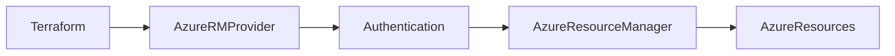
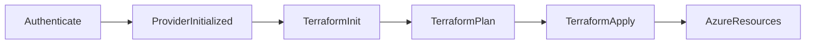
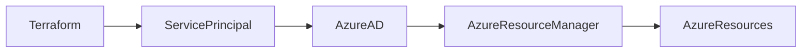
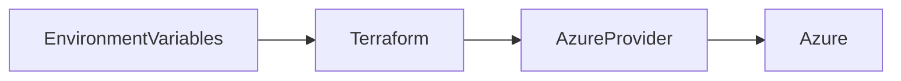
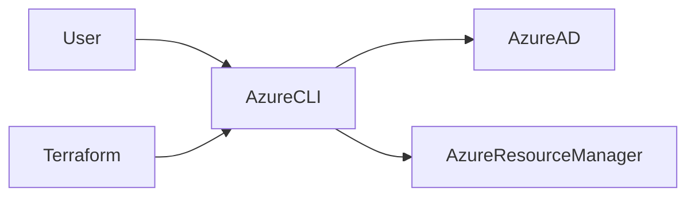

# Authentication

## Overview

Terraform Authentication is the process of securely allowing Terraform to communicate with a cloud provider (Azure, AWS, GCP, etc.) to create, update, or delete infrastructure.

For Azure, Terraform authenticates using the **AzureRM Provider**. The provider requires valid Azure credentials before it can manage Azure resources.

The most common authentication methods are:

- Azure Service Principal (Recommended for Automation)
- Azure CLI Authentication (Recommended for Development)
- Environment Variables
- Managed Identity (Common in Azure-hosted workloads)

> **Interview Tip**
>
> For Azure DevOps and Jenkins pipelines, **Azure Service Principal** is the standard authentication method. For local development, **Azure CLI Authentication** is the simplest and most common approach.

---

## Why It Is Used

Authentication enables Terraform to:

- Create Azure resources
- Update existing resources
- Delete infrastructure
- Read Azure resources
- Access Azure Resource Manager (ARM) APIs

Without authentication, Terraform cannot interact with Azure.

---

## Architecture / Working



---

## Key Components

| Component | Purpose |
|-----------|----------|
| AzureRM Provider | Connects Terraform to Azure |
| Azure Resource Manager (ARM) | Azure management API |
| Azure Service Principal | Non-interactive identity for automation |
| Azure CLI | User authentication for local development |
| Environment Variables | Secure credential storage |
| Subscription ID | Target Azure subscription |
| Tenant ID | Azure Active Directory tenant |
| Client ID | Service Principal application ID |
| Client Secret | Service Principal password |

---

## Types (if applicable)

| Authentication Method | Typical Usage |
|----------------------|---------------|
| Azure CLI | Local development |
| Service Principal | CI/CD pipelines |
| Environment Variables | Automation |
| Managed Identity | Azure-hosted workloads |

---

## Lifecycle / Workflow



---

## Configuration / Syntax (if applicable)

Provider Configuration

```hcl
provider "azurerm" {

  features {}

}
```

Authentication is performed outside the provider using Azure CLI, environment variables, or a Service Principal.

---

## Important Commands (if applicable)

Initialize Terraform

```bash
terraform init
```

Plan

```bash
terraform plan
```

Apply

```bash
terraform apply
```

Azure Login

```bash
az login
```

Show Current Account

```bash
az account show
```

List Subscriptions

```bash
az account list
```

Set Active Subscription

```bash
az account set --subscription "<subscription-id>"
```

Logout

```bash
az logout
```

---

## Important Files (if applicable)

| File | Purpose |
|------|----------|
| providers.tf | Azure provider configuration |
| main.tf | Infrastructure code |
| backend.tf | Remote backend configuration |
| terraform.tfvars | Variable values (never store secrets) |

---

## Real-World Use Cases

- Azure DevOps Pipelines
- Jenkins Pipelines
- Infrastructure deployment
- Enterprise Azure automation
- Local infrastructure development
- Multi-environment deployments

---

## Advantages

- Secure authentication
- Supports automation
- Integrates with Azure AD
- Enables Infrastructure as Code
- Multiple authentication options

---

## Limitations

- Incorrect credentials prevent deployments
- Secrets must be protected
- Permissions must be configured correctly

---

## Common Interview Questions (Concept Only)

- How does Terraform authenticate with Azure?
- Which authentication method is preferred for CI/CD?
- Which authentication method is recommended for local development?
- What is the difference between Azure CLI Authentication and a Service Principal?
- What information is required for Service Principal authentication?

---

## Common Mistakes

- Hardcoding secrets in Terraform files
- Using personal accounts in production pipelines
- Granting excessive permissions to Service Principals
- Forgetting to select the correct Azure subscription
- Storing credentials in Git repositories

---

## Troubleshooting

| Problem | Solution |
|----------|----------|
| Authentication failed | Verify Azure credentials |
| Authorization failed | Check RBAC permissions |
| Wrong subscription | Set the correct subscription |
| Expired credentials | Renew the Service Principal secret |
| Provider initialization fails | Verify AzureRM provider configuration |

---

## Summary

Authentication is required before Terraform can manage Azure resources. Azure CLI Authentication is commonly used for local development, while Azure Service Principals and Environment Variables are the preferred approaches for CI/CD and production environments.

---

# Azure Service Principal

## Overview

An **Azure Service Principal** is a non-human identity used by applications, scripts, and automation tools to securely access Azure resources.

Terraform uses a Service Principal to authenticate without requiring an interactive user login.

> **Interview Tip**
>
> A Service Principal is the most common authentication method for Azure DevOps and Jenkins pipelines because it supports secure, non-interactive automation.

---

## Why It Is Used

Service Principals provide:

- Automated authentication
- Secure CI/CD deployments
- Least-privilege access
- Azure AD integration
- Non-interactive logins

---

## Architecture / Working



---

## Key Components

| Component | Purpose |
|-----------|----------|
| Client ID | Application identifier |
| Client Secret | Authentication password |
| Tenant ID | Azure AD tenant |
| Subscription ID | Azure subscription |

---

## Types (if applicable)

- Service Principal with Client Secret
- Service Principal with Certificate

(Client Secret is the most common interview topic.)

---

## Lifecycle / Workflow

Create Service Principal → Assign RBAC Role → Store Credentials Securely → Authenticate Terraform → Deploy Infrastructure

---

## Configuration / Syntax (if applicable)

Example Environment Variables

```bash
export ARM_CLIENT_ID="xxxxxxxx"

export ARM_CLIENT_SECRET="xxxxxxxx"

export ARM_SUBSCRIPTION_ID="xxxxxxxx"

export ARM_TENANT_ID="xxxxxxxx"
```

---

## Important Commands (if applicable)

Create a Service Principal

```bash
az ad sp create-for-rbac
```

View Service Principal

```bash
az ad sp list
```

---

## Important Files (if applicable)

No dedicated files.

Credentials should be stored in:

- Azure DevOps Service Connections
- Jenkins Credentials
- GitHub Secrets
- Environment Variables

---

## Real-World Use Cases

- Azure DevOps Pipelines
- Jenkins Pipelines
- GitHub Actions
- Enterprise automation
- Infrastructure provisioning

---

## Advantages

- Secure automation
- No interactive login
- Supports least-privilege access
- Easily integrated with CI/CD

---

## Limitations

- Secrets expire
- Permissions must be managed carefully
- Compromised credentials can expose Azure resources

---

## Common Interview Questions (Concept Only)

- What is an Azure Service Principal?
- Why is it preferred over personal user accounts?
- What credentials are required?
- Where should Service Principal credentials be stored?

---

## Common Mistakes

- Hardcoding client secrets
- Assigning Owner permissions unnecessarily
- Not rotating expired secrets

---

## Troubleshooting

Verify the Client ID, Client Secret, Tenant ID, Subscription ID, and RBAC assignments if authentication fails.

---

## Summary

Azure Service Principals provide secure, non-interactive authentication for Terraform and are the preferred authentication method for production automation and CI/CD pipelines.

---

# Environment Variables

## Overview

Terraform automatically reads Azure authentication credentials from predefined environment variables.

This eliminates the need to hardcode credentials in Terraform configuration files.

> **Interview Tip**
>
> Environment variables are the recommended way to supply Service Principal credentials because Terraform detects them automatically.

---

## Why It Is Used

Environment variables:

- Improve security
- Separate credentials from code
- Simplify automation
- Work across CI/CD platforms

---

## Architecture / Working



---

## Key Components

| Variable | Purpose |
|----------|----------|
| ARM_CLIENT_ID | Service Principal ID |
| ARM_CLIENT_SECRET | Service Principal Secret |
| ARM_SUBSCRIPTION_ID | Azure Subscription |
| ARM_TENANT_ID | Azure AD Tenant |

---

## Types (if applicable)

- Linux Environment Variables
- Windows Environment Variables
- CI/CD Secret Variables

---

## Lifecycle / Workflow

Set Variables → Initialize Terraform → Provider Reads Variables → Authenticate

---

## Configuration / Syntax (if applicable)

Linux

```bash
export ARM_CLIENT_ID="xxxxxxxx"

export ARM_CLIENT_SECRET="xxxxxxxx"

export ARM_SUBSCRIPTION_ID="xxxxxxxx"

export ARM_TENANT_ID="xxxxxxxx"
```

Windows PowerShell

```powershell
$env:ARM_CLIENT_ID="xxxxxxxx"
```

---

## Important Commands (if applicable)

View Variables

Linux

```bash
echo $ARM_CLIENT_ID
```

Windows

```powershell
echo $env:ARM_CLIENT_ID
```

---

## Important Files (if applicable)

None

Secrets should not be stored in Terraform configuration files.

---

## Real-World Use Cases

- Azure DevOps Pipelines
- Jenkins Pipelines
- GitHub Actions
- Local automation scripts

---

## Advantages

- Secure
- Simple
- Portable
- CI/CD friendly

---

## Limitations

- Variables are session-specific unless configured persistently
- Secrets must still be protected

---

## Common Interview Questions (Concept Only)

- Which environment variables does Terraform use for Azure authentication?
- Why are environment variables preferred over hardcoded credentials?

---

## Common Mistakes

- Misspelling variable names
- Forgetting to export variables
- Exposing variables in logs

---

## Troubleshooting

Verify that all required variables are defined and correctly named before running Terraform commands.

---

## Summary

Environment variables provide a secure and convenient way to supply Azure authentication credentials to Terraform without embedding secrets in code.

---

# Azure CLI Authentication

## Overview

Azure CLI Authentication allows Terraform to use the credentials from an authenticated Azure CLI session.

After signing in with the Azure CLI, Terraform automatically reuses the existing login session.

> **Interview Tip**
>
> Azure CLI Authentication is ideal for local development but is generally **not** used for production CI/CD pipelines because it requires an interactive login.

---

## Why It Is Used

Azure CLI Authentication is used for:

- Local development
- Testing Terraform configurations
- Learning Terraform
- Individual administrator tasks

---

## Architecture / Working



---

## Key Components

| Component | Purpose |
|-----------|----------|
| Azure CLI | User login |
| Azure AD | Authentication |
| AzureRM Provider | Uses CLI session |

---

## Types (if applicable)

- Interactive login
- Device code login

---

## Lifecycle / Workflow

Install Azure CLI → Log In → Select Subscription → Run Terraform Commands

---

## Configuration / Syntax (if applicable)

Login

```bash
az login
```

View Current Subscription

```bash
az account show
```

Set Subscription

```bash
az account set --subscription "<subscription-id>"
```

Terraform automatically uses the active Azure CLI session.

---

## Important Commands (if applicable)

Login

```bash
az login
```

Show Account

```bash
az account show
```

List Subscriptions

```bash
az account list
```

Set Subscription

```bash
az account set --subscription "<subscription-id>"
```

Logout

```bash
az logout
```

---

## Important Files (if applicable)

Azure CLI stores authentication tokens locally.

Terraform configuration files do not require credential entries when Azure CLI Authentication is used.

---

## Real-World Use Cases

- Local Terraform development
- Testing Azure deployments
- Learning Terraform
- Administrative automation

---

## Advantages

- Easy setup
- No need to manually configure Service Principal credentials
- Ideal for development and testing

---

## Limitations

- Requires an interactive user login
- Not suitable for unattended production pipelines
- Depends on the local Azure CLI session

---

## Common Interview Questions (Concept Only)

- How does Terraform authenticate using Azure CLI?
- When should Azure CLI Authentication be used?
- Why is Azure CLI Authentication not preferred for production CI/CD?

---

## Common Mistakes

- Forgetting to run `az login`
- Using the wrong Azure subscription
- Assuming Azure CLI authentication will work in non-interactive pipeline environments

---

## Troubleshooting

| Problem | Solution |
|----------|----------|
| Not logged in | Run `az login` |
| Wrong subscription | Use `az account set` |
| Authorization error | Verify Azure RBAC permissions |
| Terraform cannot authenticate | Ensure Azure CLI is installed and the session is active |

---

## Summary

Azure CLI Authentication is the simplest authentication method for local Terraform development. It leverages the existing Azure CLI login session, making it convenient for testing and learning, while Service Principals remain the preferred choice for automated production deployments.
