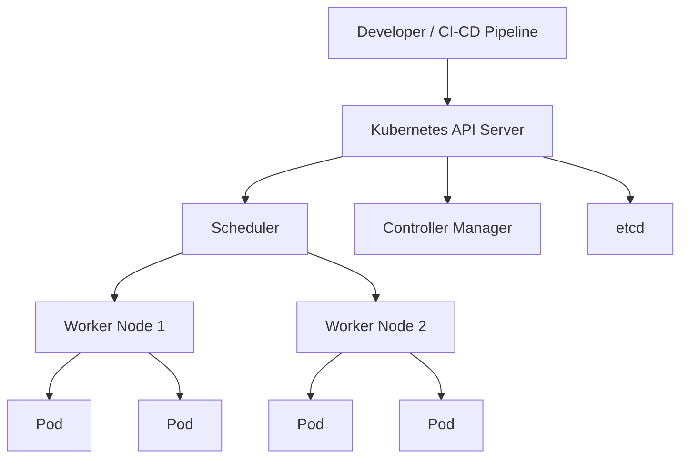
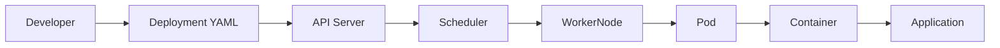

# Kubernetes Fundamentals

## Overview

Kubernetes (commonly abbreviated as **K8s**) is an open-source container orchestration platform used to automate the deployment, scaling, networking, and management of containerized applications.

While Docker manages **individual containers**, Kubernetes manages **groups of containers running across multiple servers (nodes)**.

Kubernetes ensures that applications remain available, scalable, and self-healing, making it the de facto standard for container orchestration in production environments.

> **Interview Tip**
>
> Kubernetes does **not** replace Docker (or another container runtime). It orchestrates containers created by a container runtime.

---

## Why It Is Used

Kubernetes is used to:

- Deploy applications across multiple servers
- Automatically restart failed containers
- Scale applications based on demand
- Perform rolling updates with minimal downtime
- Load balance application traffic
- Manage networking between containers
- Simplify container management in production
- Provide high availability

---

## Architecture / Working



### High-Level Working

1. Developer submits a deployment manifest (`deployment.yaml`).
2. API Server receives the request.
3. Desired cluster state is stored in **etcd**.
4. Scheduler selects an appropriate Worker Node.
5. Kubelet creates Pods on the assigned node.
6. Container Runtime starts the containers.
7. Controllers continuously compare the desired state with the actual state and make corrections if needed.

---

## Key Components

### Kubernetes Cluster

A Kubernetes Cluster consists of:

- Control Plane
- Worker Nodes

---

### Control Plane

The Control Plane manages the entire Kubernetes cluster.

It is responsible for:

- Scheduling Pods
- Managing cluster state
- Monitoring health
- Handling API requests
- Maintaining desired state

Main components:

- API Server
- Scheduler
- Controller Manager
- etcd

---

### Worker Nodes

Worker Nodes execute application workloads.

Each Worker Node contains:

- Kubelet
- Kube Proxy
- Container Runtime
- Pods

---

### Cluster Components

| Component | Purpose |
|------------|----------|
| API Server | Entry point for all Kubernetes operations |
| etcd | Stores cluster configuration and state |
| Scheduler | Assigns Pods to Worker Nodes |
| Controller Manager | Maintains desired state |
| Kubelet | Manages Pods on each Worker Node |
| Kube Proxy | Handles networking and load balancing |
| Container Runtime | Runs containers (containerd, CRI-O, etc.) |
| Pods | Smallest deployable Kubernetes object |

---

## Types (if applicable)

### Kubernetes Cluster Types

| Type | Description |
|------|-------------|
| Single Node Cluster | Used for learning and development |
| Multi-Node Cluster | Used in production environments |
| Managed Kubernetes | Cloud-managed clusters (AKS, EKS, GKE) |
| Self-Managed Kubernetes | Installed and managed manually |

---

## Lifecycle / Workflow



### Deployment Workflow

1. Write Kubernetes YAML
2. Apply configuration
3. API Server validates request
4. Desired state stored in etcd
5. Scheduler assigns node
6. Kubelet creates Pod
7. Container Runtime starts container
8. Application becomes accessible
9. Controllers monitor health continuously

---

## Configuration / Syntax (if applicable)

Example Deployment

```yaml
apiVersion: apps/v1

kind: Deployment

metadata:
  name: nginx

spec:
  replicas: 2

  selector:
    matchLabels:
      app: nginx

  template:
    metadata:
      labels:
        app: nginx

    spec:
      containers:

      - name: nginx

        image: nginx:latest

        ports:

        - containerPort: 80
```

Apply Configuration

```bash
kubectl apply -f deployment.yaml
```

---

## Important Commands (if applicable)

### Cluster Information

```bash
kubectl cluster-info
```

View Nodes

```bash
kubectl get nodes
```

View Pods

```bash
kubectl get pods
```

View All Resources

```bash
kubectl get all
```

Describe Node

```bash
kubectl describe node <node-name>
```

Describe Pod

```bash
kubectl describe pod <pod-name>
```

Apply YAML

```bash
kubectl apply -f deployment.yaml
```

Delete Deployment

```bash
kubectl delete deployment nginx
```

View Events

```bash
kubectl get events
```

View Logs

```bash
kubectl logs <pod-name>
```

---

## Important Files (if applicable)

| File | Purpose |
|------|----------|
| deployment.yaml | Deployment configuration |
| service.yaml | Service definition |
| namespace.yaml | Namespace creation |
| configmap.yaml | Configuration values |
| secret.yaml | Sensitive information |
| kubeconfig | Cluster access configuration |
| ~/.kube/config | Local Kubernetes configuration |

---

## Real-World Use Cases

- Hosting microservices
- Running containerized web applications
- CI/CD deployments
- High Availability applications
- Auto Scaling applications
- API gateways
- Batch processing
- Machine Learning workloads
- Multi-cloud deployments
- Enterprise application hosting

---

## Advantages

- Automatic container orchestration
- Self-healing
- Auto Scaling
- High Availability
- Rolling updates
- Rollbacks
- Service discovery
- Load balancing
- Efficient resource utilization
- Vendor-neutral platform

---

## Limitations

- Steeper learning curve compared to Docker
- More complex initial setup
- Requires cluster management
- Debugging distributed applications can be challenging
- Higher infrastructure overhead for small applications

---

## Common Interview Questions (Concept Only)

- What is Kubernetes?
- Why is Kubernetes needed when Docker already exists?
- Explain Kubernetes architecture.
- What is the Control Plane?
- What are Worker Nodes?
- What is a Kubernetes Cluster?
- What is the role of the API Server?
- What is etcd?
- How does Scheduler work?
- What is Kubelet?
- What is Kube Proxy?
- What is the Container Runtime?
- How does Kubernetes achieve High Availability?
- Explain the Kubernetes deployment workflow.
- What is the smallest deployable object in Kubernetes?

---

## Common Mistakes

- Confusing Docker with Kubernetes
- Assuming Kubernetes replaces Docker
- Treating Pods as Virtual Machines
- Ignoring resource requests and limits
- Deploying applications without health probes
- Running everything in the default namespace
- Storing secrets directly inside YAML files
- Not understanding Control Plane responsibilities
- Assuming Pods have permanent IP addresses
- Using Kubernetes for very small single-container applications

---

## Troubleshooting

| Problem | Possible Cause | Solution |
|----------|---------------|----------|
| Nodes not showing | Kubelet stopped | Restart Kubelet service |
| Pods stuck in Pending | No available resources or scheduling issue | Check node status and scheduler events |
| Pods in CrashLoopBackOff | Application crash | Review logs using `kubectl logs` |
| ImagePullBackOff | Invalid image or registry authentication | Verify image name and credentials |
| Node NotReady | Kubelet or network issue | Check Kubelet logs and node status |
| Application not reachable | Service or networking issue | Verify Service, Endpoints, and Pod status |
| Deployment not updating | Incorrect YAML or selector mismatch | Check Deployment configuration |
| API Server unreachable | Control Plane issue | Verify Control Plane components |

Useful Troubleshooting Commands

```bash
kubectl get nodes

kubectl get pods -A

kubectl describe pod <pod-name>

kubectl logs <pod-name>

kubectl get events

kubectl cluster-info

kubectl describe node <node-name>
```

---

## Summary

Kubernetes is the industry-standard platform for orchestrating containerized applications. It automates deployment, scaling, networking, self-healing, and lifecycle management across clusters of servers.

A Kubernetes cluster consists of a **Control Plane**, which manages the cluster, and **Worker Nodes**, which run application workloads. Core components such as the **API Server**, **Scheduler**, **Controller Manager**, **etcd**, **Kubelet**, **Kube Proxy**, and **Container Runtime** work together to maintain the desired state of applications.

Understanding Kubernetes architecture, cluster components, and deployment workflow is fundamental for DevOps, Cloud, Platform Engineering, and SRE roles and forms the foundation for more advanced Kubernetes concepts.
