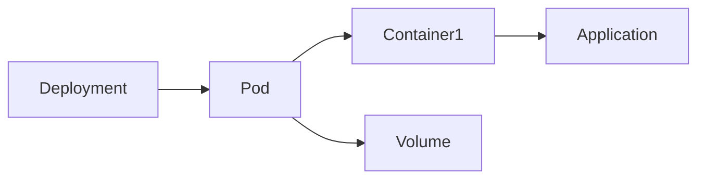
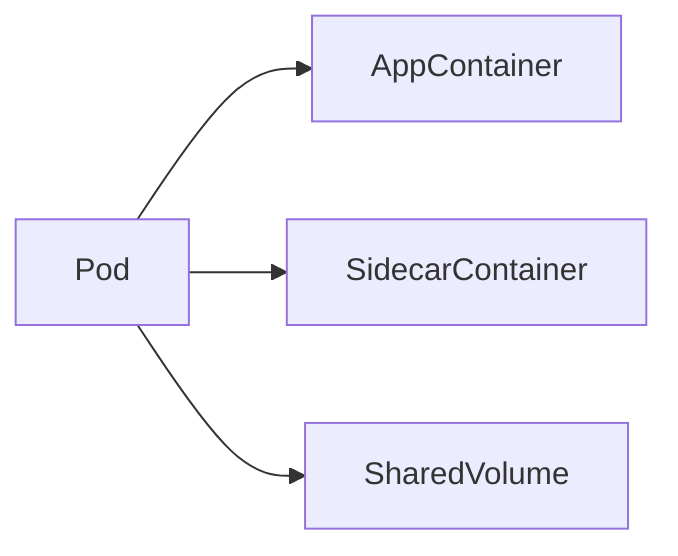
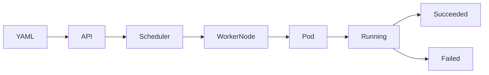
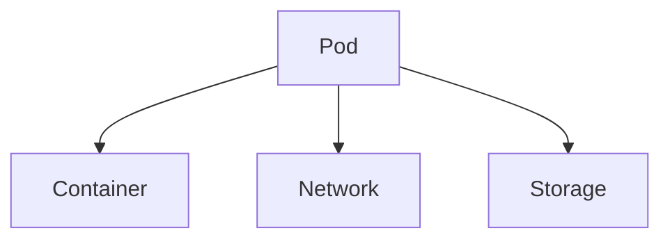
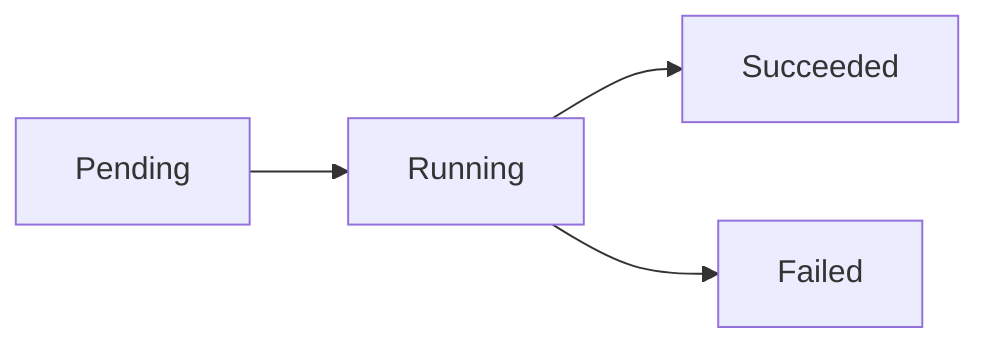
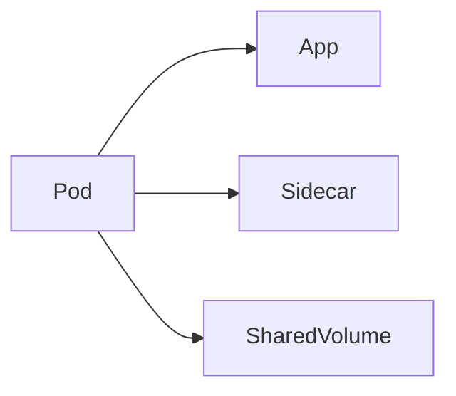
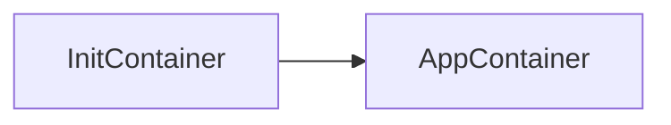
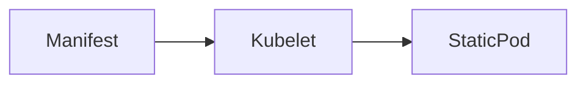

# Pods

## Overview

A **Pod** is the **smallest deployable and manageable unit** in Kubernetes.

A Pod is a wrapper around one or more containers that:

- Share the same network namespace
- Share the same storage volumes
- Are scheduled together on the same Worker Node
- Always run on the same node

A Pod represents **one running instance of an application**.

> **Interview Tip**
>
> Kubernetes manages **Pods**, not individual containers.
>
> One Pod can contain **one or multiple containers**, but **single-container Pods are the most common** in production.

---

## Why It Is Used

Pods provide:

- Logical grouping of containers
- Shared networking
- Shared storage
- Easy scaling through Deployments
- Simplified application deployment

---

## Architecture / Working



Multi-container Pod



---

## Key Components

| Component | Purpose |
|-----------|----------|
| Pod | Smallest deployable unit |
| Containers | Run applications |
| Shared Network | Same IP address |
| Shared Storage | Volumes |
| Metadata | Labels and annotations |
| Specification | Desired configuration |

---

## Types (if applicable)

| Pod Type | Description |
|-----------|-------------|
| Single Container Pod | One application container |
| Multi-Container Pod | Multiple tightly coupled containers |
| Init Container Pod | Runs initialization tasks before app containers |
| Static Pod | Managed directly by Kubelet |

---

## Lifecycle / Workflow



Lifecycle Steps

1. Pod created
2. Scheduler selects Worker Node
3. Kubelet receives Pod specification
4. Images downloaded
5. Containers started
6. Pod enters Running state
7. Pod terminated when deleted or failed

---

## Configuration / Syntax (if applicable)

Simple Pod

```yaml
apiVersion: v1

kind: Pod

metadata:
  name: nginx-pod

spec:
  containers:
  - name: nginx
    image: nginx:latest
    ports:
    - containerPort: 80
```

Create Pod

```bash
kubectl apply -f pod.yaml
```

---

## Important Commands (if applicable)

Create Pod

```bash
kubectl apply -f pod.yaml
```

List Pods

```bash
kubectl get pods
```

Detailed Information

```bash
kubectl describe pod <pod-name>
```

Delete Pod

```bash
kubectl delete pod <pod-name>
```

View Logs

```bash
kubectl logs <pod-name>
```

Execute Command

```bash
kubectl exec -it <pod-name> -- /bin/bash
```

View Pod YAML

```bash
kubectl get pod <pod-name> -o yaml
```

Watch Pods

```bash
kubectl get pods -w
```

---

## Important Files (if applicable)

| File | Purpose |
|------|----------|
| pod.yaml | Pod definition |
| deployment.yaml | Creates Pods through Deployments |
| configmap.yaml | Configuration |
| secret.yaml | Secrets |
| persistentvolumeclaim.yaml | Storage |

---

## Real-World Use Cases

- Running web applications
- Backend APIs
- Databases
- Monitoring agents
- Logging sidecars
- Batch jobs
- CI/CD runners
- Utility containers

---

## Advantages

- Smallest deployable unit
- Shared networking
- Shared storage
- Lightweight
- Easy scheduling
- Supports sidecar pattern

---

## Limitations

- Pods are ephemeral
- Pod IP changes after recreation
- Individual Pods should not be managed manually in production
- Not designed for scaling directly (Deployments should be used)

---

## Common Interview Questions (Concept Only)

- What is a Pod?
- Why is Pod the smallest deployable unit?
- Can a Pod contain multiple containers?
- Do containers inside a Pod share networking?
- Do containers inside a Pod share storage?
- Why should Pods not be created manually in production?
- What happens when a Pod fails?
- How does Kubernetes schedule Pods?

---

## Common Mistakes

- Confusing Pods with containers
- Deploying standalone Pods instead of Deployments
- Assuming Pod IP addresses are permanent
- Running unrelated containers in the same Pod
- Ignoring resource requests and limits

---

## Troubleshooting

| Problem | Cause | Solution |
|----------|--------|----------|
| Pod Pending | Scheduler cannot place Pod | Check node resources |
| ImagePullBackOff | Image unavailable | Verify image name and registry |
| CrashLoopBackOff | Application crash | Check logs |
| Pod Not Ready | Readiness probe failed | Verify application health |
| Evicted Pod | Resource pressure | Increase node resources |

Useful Commands

```bash
kubectl get pods

kubectl describe pod <pod-name>

kubectl logs <pod-name>

kubectl get events

kubectl exec -it <pod-name> -- /bin/bash
```

---

## Summary

Pods are the smallest deployable unit in Kubernetes and encapsulate one or more containers that share networking and storage. They are scheduled as a single unit onto Worker Nodes. In production, Pods are typically managed through higher-level controllers such as Deployments rather than being created directly.

---

# Pod Basics

## Overview

A Pod is a logical wrapper around one or more containers.

Key characteristics:

- One IP address
- Shared localhost network
- Shared storage volumes
- Scheduled together
- Same lifecycle

---

## Why It Is Used

- Run applications
- Group tightly coupled containers
- Share data between containers

---

## Architecture / Working



---

## Key Components

| Component | Purpose |
|-----------|----------|
| Pod | Wrapper |
| Containers | Applications |
| Volumes | Shared data |
| IP Address | Networking |

---

## Types (if applicable)

- Single-container Pod
- Multi-container Pod

---

## Lifecycle / Workflow

Create → Schedule → Run → Terminate

---

## Configuration / Syntax (if applicable)

```yaml
kind: Pod
```

---

## Important Commands (if applicable)

```bash
kubectl get pods

kubectl describe pod
```

---

## Important Files (if applicable)

pod.yaml

---

## Real-World Use Cases

- Web servers
- APIs
- Utility containers

---

## Advantages

- Simple deployment
- Shared resources

---

## Limitations

- Temporary
- Not scalable directly

---

## Common Interview Questions (Concept Only)

- What is a Pod?
- Can Pods contain multiple containers?

---

## Common Mistakes

- Confusing Pod with container

---

## Troubleshooting

Use `kubectl describe pod` and `kubectl logs`.

---

## Summary

A Pod groups one or more containers into a single deployable unit.

---

# Pod Lifecycle

## Overview

Every Pod moves through a series of lifecycle phases from creation until deletion.

Pod Phases:

- Pending
- Running
- Succeeded
- Failed
- Unknown

---

## Why It Is Used

Lifecycle phases allow Kubernetes to monitor and manage Pods automatically.

---

## Architecture / Working



---

## Key Components

| Phase | Meaning |
|--------|----------|
| Pending | Waiting for scheduling or image download |
| Running | Containers executing |
| Succeeded | Completed successfully |
| Failed | Container exited with failure |
| Unknown | Node communication lost |

---

## Types (if applicable)

Pod Phases

---

## Lifecycle / Workflow

Pending

↓

Container Creating

↓

Running

↓

Succeeded / Failed

---

## Configuration / Syntax (if applicable)

View Status

```bash
kubectl get pods
```

---

## Important Commands (if applicable)

```bash
kubectl get pods

kubectl describe pod
```

---

## Important Files (if applicable)

pod.yaml

---

## Real-World Use Cases

- Batch jobs
- Application deployment
- Monitoring

---

## Advantages

- Automatic status tracking

---

## Limitations

- Pods are recreated rather than restarted after deletion

---

## Common Interview Questions (Concept Only)

- Explain Pod lifecycle.
- What is the Pending state?

---

## Common Mistakes

- Assuming Pods live forever

---

## Troubleshooting

Check Events and Logs.

---

## Summary

Pods transition through well-defined phases that describe their current operational state.

---

# Multi-Container Pods

## Overview

A Multi-Container Pod contains **two or more containers** that work together.

All containers share:

- IP address
- Network namespace
- Storage volumes

> **Interview Tip**
>
> Multi-container Pods are used only when containers are tightly coupled. Most workloads use one container per Pod.

---

## Why It Is Used

- Sidecar logging
- Monitoring agents
- Service mesh proxies
- Shared configuration

---

## Architecture / Working



---

## Key Components

| Component | Purpose |
|-----------|----------|
| Main Container | Application |
| Sidecar | Supporting functionality |
| Shared Volume | Shared files |

---

## Types (if applicable)

- Sidecar Pattern
- Adapter Pattern
- Ambassador Pattern

---

## Lifecycle / Workflow

Pod Created

↓

Containers Started

↓

Containers Share Resources

---

## Configuration / Syntax (if applicable)

```yaml
containers:

- name: app

- name: sidecar
```

---

## Important Commands (if applicable)

```bash
kubectl logs pod-name -c container-name
```

---

## Important Files (if applicable)

pod.yaml

---

## Real-World Use Cases

- Log collection
- Monitoring
- Reverse proxy

---

## Advantages

- Shared resources
- Simplified communication

---

## Limitations

- Containers share lifecycle

---

## Common Interview Questions (Concept Only)

- When should Multi-Container Pods be used?

---

## Common Mistakes

- Running unrelated applications together

---

## Troubleshooting

Check logs for each container separately.

---

## Summary

Multi-container Pods are designed for tightly coupled containers that must share networking and storage.

---

# Init Containers

## Overview

Init Containers are special containers that run **before** application containers start.

Application containers begin only after all Init Containers complete successfully.

---

## Why It Is Used

- Initialize configuration
- Wait for dependencies
- Download files
- Prepare application environment

---

## Architecture / Working



---

## Key Components

| Component | Purpose |
|-----------|----------|
| Init Container | Setup |
| App Container | Main application |

---

## Types (if applicable)

Initialization Containers

---

## Lifecycle / Workflow

Init Container

↓

Success

↓

Application Container

---

## Configuration / Syntax (if applicable)

```yaml
initContainers:
```

---

## Important Commands (if applicable)

```bash
kubectl describe pod
```

---

## Important Files (if applicable)

pod.yaml

---

## Real-World Use Cases

- Database migration
- Dependency checking
- Configuration download

---

## Advantages

- Clean initialization
- Better reliability

---

## Limitations

- Delays application startup

---

## Common Interview Questions (Concept Only)

- What are Init Containers?
- When are they executed?

---

## Common Mistakes

- Using Init Containers for long-running processes

---

## Troubleshooting

Describe Pod to identify failed Init Containers.

---

## Summary

Init Containers perform setup tasks before application containers start, ensuring the application has the required environment.

---

# Static Pods

## Overview

Static Pods are Pods managed directly by the **Kubelet**, not by the API Server.

They are created from manifest files stored on the Worker Node.

They are commonly used for Control Plane components.

---

## Why It Is Used

- Bootstrap Kubernetes
- Run Control Plane components
- Ensure critical services start automatically

---

## Architecture / Working



---

## Key Components

| Component | Purpose |
|-----------|----------|
| Manifest File | Pod definition |
| Kubelet | Creates Static Pod |

---

## Types (if applicable)

Static Pods

---

## Lifecycle / Workflow

Manifest Created

↓

Kubelet Detects

↓

Pod Started

---

## Configuration / Syntax (if applicable)

Stored in:

```
/etc/kubernetes/manifests/
```

---

## Important Commands (if applicable)

```bash
kubectl get pods -A
```

---

## Important Files (if applicable)

```
/etc/kubernetes/manifests/
```

---

## Real-World Use Cases

- API Server
- Scheduler
- etcd

---

## Advantages

- Independent of API Server
- Reliable startup

---

## Limitations

- Cannot be managed using Deployments
- Limited functionality compared to regular Pods

---

## Common Interview Questions (Concept Only)

- What are Static Pods?
- Who manages Static Pods?

---

## Common Mistakes

- Confusing Static Pods with regular Pods

---

## Troubleshooting

Verify manifest files and Kubelet status.

---

## Summary

Static Pods are managed directly by the Kubelet and are primarily used for critical Kubernetes Control Plane components.

---

# Pod Commands

## Overview

`kubectl` provides commands to create, inspect, troubleshoot, and manage Pods.

These commands are among the most frequently used in daily Kubernetes administration.

---

## Why It Is Used

- Create Pods
- View Pod status
- Debug applications
- Access container logs
- Execute commands inside containers

---

## Architecture / Working

```mermaid
flowchart LR

kubectl --> API Server --> Pod
```

---

## Key Components

| Command | Purpose |
|----------|----------|
| kubectl get pods | List Pods |
| kubectl describe pod | View detailed information |
| kubectl logs | View logs |
| kubectl exec | Execute commands inside a container |
| kubectl delete pod | Delete a Pod |
| kubectl apply -f | Create or update Pods |

---

## Types (if applicable)

| Category | Commands |
|-----------|----------|
| View | get, describe |
| Create | apply, create |
| Delete | delete |
| Debug | logs, exec |

---

## Lifecycle / Workflow

Create

↓

View

↓

Monitor

↓

Debug

↓

Delete

---

## Configuration / Syntax (if applicable)

List Pods

```bash
kubectl get pods
```

Describe Pod

```bash
kubectl describe pod <pod-name>
```

Logs

```bash
kubectl logs <pod-name>
```

Interactive Shell

```bash
kubectl exec -it <pod-name> -- /bin/bash
```

Delete Pod

```bash
kubectl delete pod <pod-name>
```

Apply Manifest

```bash
kubectl apply -f pod.yaml
```

---

## Important Commands (if applicable)

```bash
kubectl get pods

kubectl get pods -o wide

kubectl describe pod <pod-name>

kubectl logs <pod-name>

kubectl logs <pod-name> -c <container-name>

kubectl exec -it <pod-name> -- /bin/bash

kubectl get pod <pod-name> -o yaml

kubectl delete pod <pod-name>

kubectl apply -f pod.yaml

kubectl get events
```

---

## Important Files (if applicable)

- pod.yaml
- deployment.yaml

---

## Real-World Use Cases

- Deploy applications
- Debug production issues
- Monitor Pods
- Troubleshoot container failures
- Verify deployments

---

## Advantages

- Simple administration
- Powerful debugging capabilities
- Supports automation

---

## Limitations

- Commands require appropriate RBAC permissions
- Some commands (e.g., `exec`) depend on the container image having a shell

---

## Common Interview Questions (Concept Only)

- Which command lists Pods?
- How do you view Pod logs?
- How do you execute a command inside a running Pod?
- What is the difference between `kubectl logs` and `kubectl describe pod`?
- How do you view the YAML definition of a running Pod?

---

## Common Mistakes

- Using `kubectl exec` without specifying the correct container in a multi-container Pod
- Forgetting to check `kubectl describe pod` before reviewing logs
- Deleting Pods directly instead of managing the owning Deployment

---

## Troubleshooting

| Problem | Command |
|----------|---------|
| Pod status | `kubectl get pods` |
| Detailed diagnostics | `kubectl describe pod <pod-name>` |
| Application errors | `kubectl logs <pod-name>` |
| Interactive debugging | `kubectl exec -it <pod-name> -- /bin/bash` |
| Cluster events | `kubectl get events` |

---

## Summary

Pod commands are essential for deploying, monitoring, and troubleshooting Kubernetes workloads. Mastering `kubectl get`, `describe`, `logs`, `exec`, `apply`, and `delete` is critical for both Kubernetes interviews and day-to-day production operations.
