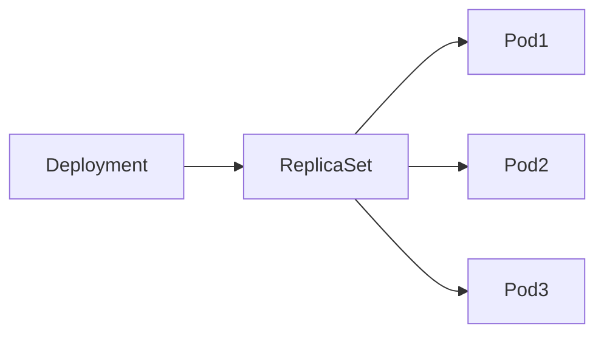
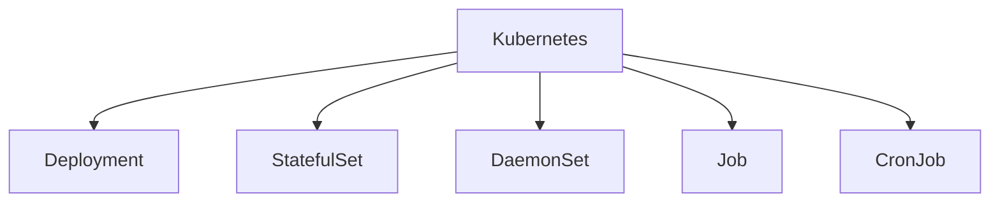
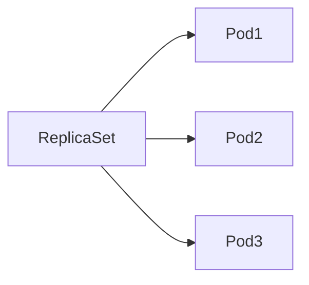
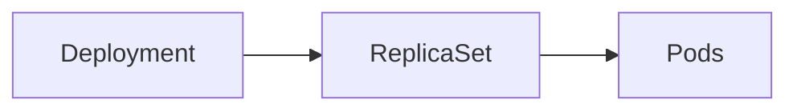
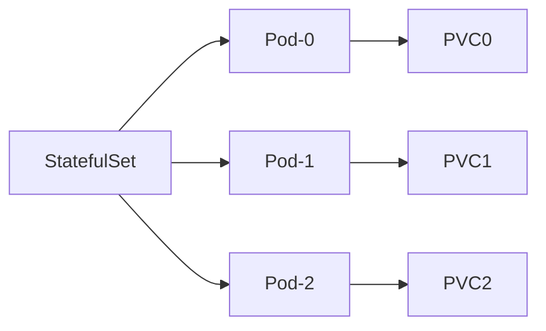
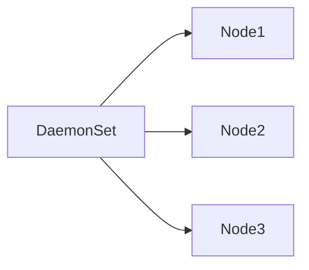
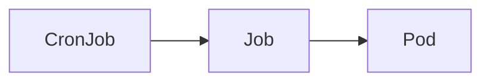

# Workloads

## Overview

A **Workload** in Kubernetes is a higher-level resource that manages Pods. Instead of creating Pods directly, workloads automate the creation, scaling, updating, and recovery of Pods.

Kubernetes provides several workload resources, each designed for a specific type of application.

The most commonly used workloads are:

- ReplicaSet
- Deployment
- StatefulSet
- DaemonSet
- Job
- CronJob

> **Interview Tip**
>
> In production, you almost never create standalone Pods. You typically use a workload resource such as a **Deployment** or **StatefulSet**, which manages the Pods for you.

---

## Why It Is Used

Workloads provide:

- Automatic Pod creation
- Self-healing
- Scaling
- Rolling updates
- Rollbacks
- High availability
- Scheduled execution
- Stateful application management

---

## Architecture / Working



Different Workloads



---

## Key Components

| Workload | Purpose |
|-----------|----------|
| ReplicaSet | Maintains desired number of Pods |
| Deployment | Manages ReplicaSets and updates |
| StatefulSet | Stateful applications |
| DaemonSet | One Pod per Node |
| Job | Run once and complete |
| CronJob | Scheduled Jobs |

---

## Types (if applicable)

| Type | Best Used For |
|------|---------------|
| Deployment | Stateless applications |
| StatefulSet | Databases |
| DaemonSet | Monitoring agents |
| Job | One-time tasks |
| CronJob | Scheduled tasks |

---

## Lifecycle / Workflow


---

## Configuration / Syntax (if applicable)

Create Deployment

```yaml
apiVersion: apps/v1

kind: Deployment
```

Create StatefulSet

```yaml
kind: StatefulSet
```

Create Job

```yaml
kind: Job
```

---

## Important Commands (if applicable)

View Deployments

```bash
kubectl get deployments
```

View ReplicaSets

```bash
kubectl get replicasets
```

View StatefulSets

```bash
kubectl get statefulsets
```

View DaemonSets

```bash
kubectl get daemonsets
```

View Jobs

```bash
kubectl get jobs
```

View CronJobs

```bash
kubectl get cronjobs
```

---

## Important Files (if applicable)

| File | Purpose |
|------|----------|
| deployment.yaml | Deployment |
| replicaset.yaml | ReplicaSet |
| daemonset.yaml | DaemonSet |
| statefulset.yaml | StatefulSet |
| job.yaml | Job |
| cronjob.yaml | CronJob |

---

## Real-World Use Cases

- Web applications
- APIs
- Databases
- Monitoring
- Log collection
- Scheduled backups
- Data migration
- Batch processing

---

## Advantages

- Automatic recovery
- Easy scaling
- Rolling updates
- Self-healing
- High availability

---

## Limitations

- Choosing the wrong workload type can cause operational issues
- Stateful applications require additional storage management
- Jobs and CronJobs are not suitable for continuously running services

---

## Common Interview Questions (Concept Only)

- What are Kubernetes Workloads?
- Why should Deployments be used instead of Pods?
- Which workload is used for databases?
- Which workload runs one Pod on every node?
- What is the difference between Job and CronJob?

---

## Common Mistakes

- Using Deployments for databases
- Creating Pods manually
- Using Jobs for long-running applications
- Using DaemonSets for web applications

---

## Troubleshooting

| Problem | Solution |
|----------|----------|
| Pods not created | Check workload events |
| Scaling failed | Verify ReplicaSet |
| Job never finishes | Check logs |
| DaemonSet missing Pods | Verify node selectors |
| StatefulSet issues | Check PVCs |

---

## Summary

Kubernetes Workloads automate the management of Pods. Choosing the correct workload type is critical for reliability, scalability, and maintainability. Deployments are used for stateless applications, StatefulSets for stateful workloads, DaemonSets for node-wide services, Jobs for one-time tasks, and CronJobs for scheduled execution.

---

# ReplicaSet

## Overview

A **ReplicaSet** ensures that a specified number of identical Pod replicas are always running.

If a Pod crashes or is deleted, the ReplicaSet automatically creates a replacement Pod to maintain the desired replica count.

> **Interview Tip**
>
> In production, you typically do **not** create ReplicaSets directly. They are automatically created and managed by Deployments.

---

## Why It Is Used

- Maintain desired number of Pods
- Self-healing
- High availability
- Automatic Pod recreation

---

## Architecture / Working



If Pod2 fails


---

## Key Components

| Component | Purpose |
|-----------|----------|
| ReplicaSet | Maintains replicas |
| Selector | Identifies managed Pods |
| Template | Defines new Pods |
| Replicas | Desired Pod count |

---

## Types (if applicable)

ReplicaSet

---

## Lifecycle / Workflow

Create ReplicaSet

↓

Pods Created

↓

Monitor Pods

↓

Replace Failed Pods

---

## Configuration / Syntax (if applicable)

```yaml
apiVersion: apps/v1

kind: ReplicaSet

spec:
  replicas: 3
```

---

## Important Commands (if applicable)

```bash
kubectl get replicasets

kubectl describe replicaset

kubectl delete replicaset
```

---

## Important Files (if applicable)

replicaset.yaml

---

## Real-World Use Cases

- High availability
- Automatic Pod replacement

---

## Advantages

- Self-healing
- Automatic recovery

---

## Limitations

- No rolling updates
- Usually managed through Deployments

---

## Common Interview Questions (Concept Only)

- What is ReplicaSet?
- Does ReplicaSet support rolling updates?
- Who creates ReplicaSets in production?

---

## Common Mistakes

- Creating ReplicaSets directly instead of Deployments

---

## Troubleshooting

Verify selectors, labels, and replica count if Pods are not created.

---

## Summary

ReplicaSets maintain the desired number of Pod replicas and provide automatic recovery. They are typically managed indirectly through Deployments.

---

# Deployment

## Overview

A **Deployment** is the most commonly used Kubernetes workload for managing stateless applications.

It manages ReplicaSets and provides:

- Rolling updates
- Rollbacks
- Scaling
- Self-healing

> **Interview Tip**
>
> Around **90% of production applications** are deployed using Deployments.

---

## Why It Is Used

- Deploy applications
- Scale Pods
- Update applications without downtime
- Roll back failed releases

---

## Architecture / Working



---

## Key Components

| Component | Purpose |
|-----------|----------|
| Deployment | Workload manager |
| ReplicaSet | Maintains Pods |
| Pods | Run applications |

---

## Types (if applicable)

Deployment

---

## Lifecycle / Workflow

Create Deployment

↓

Create ReplicaSet

↓

Create Pods

↓

Rolling Updates

↓

Rollback if Needed

---

## Configuration / Syntax (if applicable)

```yaml
kind: Deployment

spec:
  replicas: 3
```

---

## Important Commands (if applicable)

```bash
kubectl get deployments

kubectl describe deployment

kubectl rollout status deployment

kubectl rollout undo deployment

kubectl scale deployment nginx --replicas=5
```

---

## Important Files (if applicable)

deployment.yaml

---

## Real-World Use Cases

- Web servers
- APIs
- Microservices
- Frontend applications

---

## Advantages

- Rolling updates
- Rollbacks
- Scaling
- Self-healing

---

## Limitations

- Not suitable for stateful applications

---

## Common Interview Questions (Concept Only)

- What is Deployment?
- Why is Deployment preferred over ReplicaSet?
- Explain rolling updates.

---

## Common Mistakes

- Using Deployments for databases

---

## Troubleshooting

Review Deployment status, ReplicaSet health, and rollout history.

---

## Summary

Deployments provide automated management of stateless applications with scaling, self-healing, rolling updates, and rollback capabilities.

---

# StatefulSet

## Overview

A **StatefulSet** manages applications that require persistent identity and stable storage.

Each Pod has:

- Stable hostname
- Stable network identity
- Dedicated Persistent Volume
- Ordered deployment and termination

> **Interview Tip**
>
> StatefulSets are primarily used for databases and clustered applications.

---

## Why It Is Used

- Databases
- Distributed systems
- Persistent storage
- Stable Pod identity

---

## Architecture / Working



---

## Key Components

| Component | Purpose |
|-----------|----------|
| Stable Hostname | Persistent identity |
| PVC | Persistent storage |
| Ordered Startup | Predictable sequencing |

---

## Types (if applicable)

StatefulSet

---

## Lifecycle / Workflow

Pod-0

↓

Pod-1

↓

Pod-2

Deletion happens in reverse order.

---

## Configuration / Syntax (if applicable)

```yaml
kind: StatefulSet
```

---

## Important Commands (if applicable)

```bash
kubectl get statefulsets

kubectl describe statefulset
```

---

## Important Files (if applicable)

statefulset.yaml

---

## Real-World Use Cases

- MySQL
- PostgreSQL
- MongoDB
- Cassandra
- Kafka
- Elasticsearch

---

## Advantages

- Stable identity
- Persistent storage
- Ordered deployment

---

## Limitations

- Slower updates
- More complex than Deployments

---

## Common Interview Questions (Concept Only)

- What is StatefulSet?
- Why can't databases use Deployments?
- What is stable Pod identity?

---

## Common Mistakes

- Using Deployments for stateful applications

---

## Troubleshooting

Check PVC binding, Pod ordering, and storage class configuration.

---

## Summary

StatefulSets provide persistent identity and storage, making them the preferred workload for stateful applications such as databases.

---

# DaemonSet

## Overview

A **DaemonSet** ensures that one Pod runs on every eligible Worker Node.

When a new node joins the cluster, the DaemonSet automatically schedules a Pod on that node.

---

## Why It Is Used

- Monitoring
- Logging
- Security agents
- Node management

---

## Architecture / Working



Each node runs one Pod.

---

## Key Components

| Component | Purpose |
|-----------|----------|
| DaemonSet | Node-wide workload |
| Node Selector | Optional node targeting |

---

## Types (if applicable)

DaemonSet

---

## Lifecycle / Workflow

New Node

↓

DaemonSet detects Node

↓

Pod created automatically

---

## Configuration / Syntax (if applicable)

```yaml
kind: DaemonSet
```

---

## Important Commands (if applicable)

```bash
kubectl get daemonsets

kubectl describe daemonset
```

---

## Important Files (if applicable)

daemonset.yaml

---

## Real-World Use Cases

- Fluentd
- Prometheus Node Exporter
- Filebeat
- Security scanners

---

## Advantages

- Automatic deployment on all nodes
- Ideal for infrastructure services

---

## Limitations

- Not suitable for application workloads

---

## Common Interview Questions (Concept Only)

- What is DaemonSet?
- When should DaemonSets be used?

---

## Common Mistakes

- Using DaemonSets for web applications

---

## Troubleshooting

Verify node selectors, taints, tolerations, and node eligibility.

---

## Summary

DaemonSets ensure that every eligible Worker Node runs exactly one Pod, making them ideal for cluster-wide infrastructure services.

---

# Job

## Overview

A **Job** creates one or more Pods that execute a task to completion.

Once the task succeeds, the Job is marked as complete and no additional Pods are created.

---

## Why It Is Used

- One-time tasks
- Data migration
- Batch processing
- Database initialization

---

## Architecture / Working


---

## Key Components

| Component | Purpose |
|-----------|----------|
| Job | Batch workload |
| Pod | Executes task |

---

## Types (if applicable)

Job

---

## Lifecycle / Workflow

Create

↓

Run

↓

Complete

↓

Exit

---

## Configuration / Syntax (if applicable)

```yaml
kind: Job
```

---

## Important Commands (if applicable)

```bash
kubectl get jobs

kubectl describe job
```

---

## Important Files (if applicable)

job.yaml

---

## Real-World Use Cases

- Database backup
- Data migration
- Report generation
- Batch ETL

---

## Advantages

- Reliable completion
- Automatic retries on failure

---

## Limitations

- Not suitable for continuously running services

---

## Common Interview Questions (Concept Only)

- What is a Job?
- When should Jobs be used?

---

## Common Mistakes

- Using Jobs for web servers

---

## Troubleshooting

Inspect Job status, Pod logs, and completion count.

---

## Summary

Jobs execute finite tasks and ensure successful completion, making them suitable for batch and one-time workloads.

---

# CronJob

## Overview

A **CronJob** creates Jobs on a schedule using cron syntax.

It is the Kubernetes equivalent of Linux `cron`.

---

## Why It Is Used

- Scheduled backups
- Log cleanup
- Report generation
- Database maintenance
- Scheduled scripts

---

## Architecture / Working



---

## Key Components

| Component | Purpose |
|-----------|----------|
| CronJob | Scheduler |
| Job | Executes task |
| Pod | Runs workload |

---

## Types (if applicable)

CronJob

---

## Lifecycle / Workflow

Schedule

↓

Create Job

↓

Run Pod

↓

Complete

---

## Configuration / Syntax (if applicable)

```yaml
kind: CronJob

schedule: "0 2 * * *"
```

---

## Important Commands (if applicable)

```bash
kubectl get cronjobs

kubectl describe cronjob
```

---

## Important Files (if applicable)

cronjob.yaml

---

## Real-World Use Cases

- Nightly backups
- Daily reports
- Weekly cleanup
- Certificate renewal
- Scheduled maintenance

---

## Advantages

- Automated scheduling
- Native cron support
- Reliable execution

---

## Limitations

- Dependent on correct cron expressions
- Missed schedules can occur during prolonged controller outages

---

## Common Interview Questions (Concept Only)

- What is a CronJob?
- How is CronJob different from Job?
- What schedule format does CronJob use?

---

## Common Mistakes

- Using invalid cron expressions
- Running long-lived services as CronJobs

---

## Troubleshooting

Verify the cron schedule, Job history, and controller status if scheduled executions do not occur.

---

## Summary

CronJobs automate scheduled execution of Jobs, making them ideal for recurring operational tasks such as backups, cleanup, and maintenance.
