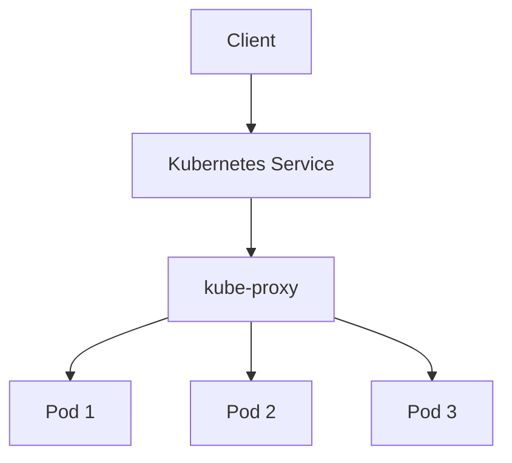
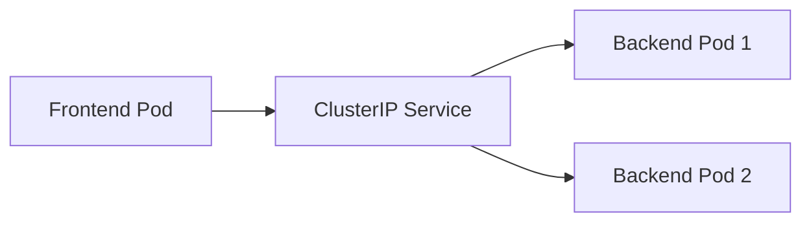
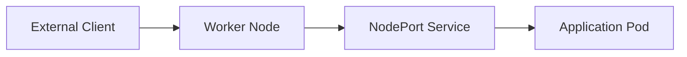
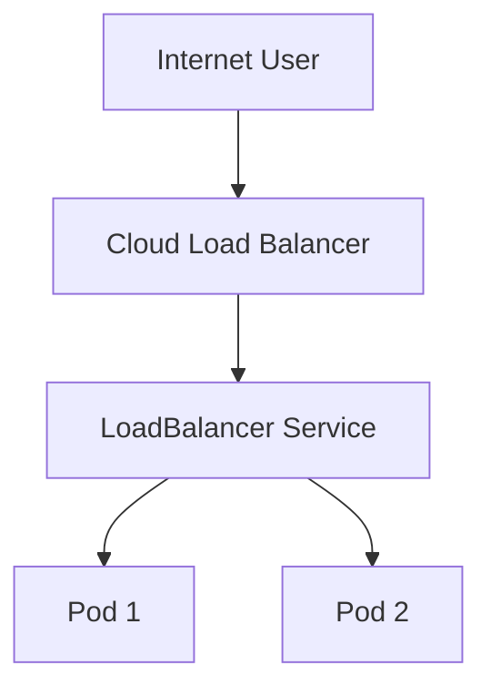

# Services

## Overview

A **Service** in Kubernetes is an abstraction that provides a **stable network endpoint** to access one or more Pods.

Since Pods are **ephemeral** (they can be created, deleted, or recreated), their IP addresses change over time. A Service provides a **fixed IP address (ClusterIP)** and **DNS name**, allowing applications to communicate reliably without knowing Pod IP addresses.

Services also provide:

- Service Discovery
- Internal Load Balancing
- High Availability
- Stable Networking

> **Interview Tip**
>
> Applications should **never communicate directly with Pod IPs**. Always access Pods through a **Service**.

---

## Why It Is Used

Services are used to:

- Provide a stable endpoint for Pods
- Load balance traffic across multiple Pods
- Enable Service Discovery using DNS
- Expose applications internally or externally
- Decouple applications from changing Pod IPs
- Improve availability of applications

---

## Architecture / Working



Traffic Flow


---

## Key Components

| Component | Purpose |
|-----------|----------|
| Service | Stable endpoint |
| Selector | Selects target Pods |
| Labels | Used by selectors |
| Endpoints | List of Pod IPs |
| kube-proxy | Routes traffic |
| ClusterIP | Internal Service IP |
| CoreDNS | DNS resolution |

---

## Types (if applicable)

Kubernetes supports four main Service types:

| Type | Accessible From | Common Use |
|------|-----------------|------------|
| ClusterIP | Inside Cluster | Internal applications |
| NodePort | Outside Cluster via Node IP | Testing and development |
| LoadBalancer | Internet | Production workloads |
| ExternalName | External DNS | External services |

---

## Lifecycle / Workflow


---

## Configuration / Syntax (if applicable)

Example Service

```yaml
apiVersion: v1
kind: Service

metadata:
  name: nginx-service

spec:
  selector:
    app: nginx

  ports:
    - port: 80
      targetPort: 80

  type: ClusterIP
```

---

## Important Commands (if applicable)

List Services

```bash
kubectl get svc
```

Describe Service

```bash
kubectl describe svc nginx-service
```

View Endpoints

```bash
kubectl get endpoints
```

View Service YAML

```bash
kubectl get svc nginx-service -o yaml
```

Delete Service

```bash
kubectl delete svc nginx-service
```

---

## Important Files (if applicable)

| File | Purpose |
|------|---------|
| service.yaml | Service definition |
| deployment.yaml | Pods used by Service |

---

## Real-World Use Cases

- Frontend to Backend communication
- Backend to Database communication
- Internal APIs
- External web applications
- Microservices
- Load balancing application traffic

---

## Advantages

- Stable IP address
- Built-in load balancing
- Automatic service discovery
- Decouples applications from Pods
- Supports scaling

---

## Limitations

- Incorrect selectors break routing
- Service itself does not perform health checks
- Pod IPs remain temporary

---

## Common Interview Questions (Concept Only)

- Why are Services required?
- Why shouldn't applications use Pod IPs?
- What are Endpoints?
- How does kube-proxy work?
- How does a Service find Pods?
- What is the difference between Service and Deployment?

---

## Common Mistakes

- Using Pod IPs directly
- Wrong Service selector
- Wrong targetPort value
- Assuming Service creates Pods

---

## Troubleshooting

| Problem | Cause | Solution |
|----------|--------|----------|
| Service has no endpoints | Label mismatch | Verify selectors |
| Service unreachable | Wrong port | Check port and targetPort |
| No traffic to Pods | Pods not Ready | Verify Pod health |
| External access fails | Wrong Service type | Verify Service type |

Useful Commands

```bash
kubectl get svc

kubectl get endpoints

kubectl describe svc nginx-service

kubectl get pods --show-labels
```

---

## Summary

A Kubernetes Service provides a stable network endpoint, built-in load balancing, and automatic service discovery, allowing applications to communicate reliably without depending on changing Pod IP addresses.

---

# ClusterIP

## Overview

**ClusterIP** is the **default Service type** in Kubernetes.

It exposes an application **only inside the Kubernetes cluster**.

Every ClusterIP Service receives:

- A stable internal IP address
- A DNS name
- Automatic load balancing

External clients **cannot access** a ClusterIP Service directly.

> **Interview Tip**
>
> If no Service type is specified, Kubernetes automatically creates a **ClusterIP** Service.

---

## Why It Is Used

ClusterIP is used for:

- Internal APIs
- Backend services
- Database access
- Microservices communication

---

## Architecture / Working



---

## Key Components

| Component | Purpose |
|-----------|----------|
| ClusterIP | Internal virtual IP |
| Selector | Finds Pods |
| Endpoints | Backend Pods |
| kube-proxy | Routes traffic |

---

## Types (if applicable)

Default Service Type

---

## Lifecycle / Workflow


---

## Configuration / Syntax (if applicable)

```yaml
spec:
  type: ClusterIP
```

---

## Important Commands (if applicable)

```bash
kubectl get svc

kubectl describe svc
```

---

## Important Files (if applicable)

| File | Purpose |
|------|---------|
| service.yaml | ClusterIP Service |

---

## Real-World Use Cases

- Backend APIs
- Internal databases
- Redis
- Internal microservices

---

## Advantages

- Secure
- Default Service type
- Internal communication
- Built-in load balancing

---

## Limitations

- Cannot be accessed externally

---

## Common Interview Questions (Concept Only)

- What is ClusterIP?
- Is ClusterIP externally accessible?
- Why is ClusterIP the default Service type?

---

## Common Mistakes

- Expecting external access
- Using ClusterIP for public applications

---

## Troubleshooting

```bash
kubectl get svc

kubectl get endpoints
```

---

## Summary

ClusterIP exposes applications only inside the Kubernetes cluster and is the most commonly used Service type.

---

# NodePort

## Overview

NodePort exposes an application through a **port on every Kubernetes Node**.

External clients access the application using:

```
<NodeIP>:<NodePort>
```

Default NodePort range:

```
30000–32767
```

---

## Why It Is Used

- Testing
- Development
- Small clusters
- Learning Kubernetes

---

## Architecture / Working



---

## Key Components

| Component | Purpose |
|-----------|----------|
| NodePort | External port |
| ClusterIP | Internal IP |
| kube-proxy | Traffic routing |

---

## Types (if applicable)

NodePort Service

---

## Lifecycle / Workflow


---

## Configuration / Syntax (if applicable)

```yaml
spec:
  type: NodePort
```

---

## Important Commands (if applicable)

```bash
kubectl get svc

kubectl describe svc
```

---

## Important Files (if applicable)

service.yaml

---

## Real-World Use Cases

- Development
- Testing
- Lab environments

---

## Advantages

- Easy external access
- No cloud provider required

---

## Limitations

- Limited port range
- Not recommended for production
- Requires Node IP

---

## Common Interview Questions (Concept Only)

- What is NodePort?
- Which ports does NodePort use?
- Difference between ClusterIP and NodePort?

---

## Common Mistakes

- Using NodePort in production
- Firewall blocking NodePort

---

## Troubleshooting

```bash
kubectl get svc

kubectl describe svc
```

---

## Summary

NodePort exposes applications using a port on every Kubernetes Node and is commonly used for development and testing.

---

# LoadBalancer

## Overview

LoadBalancer exposes an application to the internet using a **cloud provider's load balancer**.

Supported on:

- Azure AKS
- AWS EKS
- Google GKE

The cloud provider automatically provisions:

- Public IP
- External Load Balancer
- Traffic routing

---

## Why It Is Used

LoadBalancer is used for:

- Production applications
- Public APIs
- Websites
- Internet-facing services

---

## Architecture / Working



---

## Key Components

| Component | Purpose |
|-----------|----------|
| Cloud Load Balancer | Public access |
| Public IP | External endpoint |
| Service | Routes traffic |
| Pods | Application |

---

## Types (if applicable)

Cloud Service

---

## Lifecycle / Workflow


---

## Configuration / Syntax (if applicable)

```yaml
spec:
  type: LoadBalancer
```

---

## Important Commands (if applicable)

```bash
kubectl get svc
```

---

## Important Files (if applicable)

service.yaml

---

## Real-World Use Cases

- Production web applications
- REST APIs
- Internet-facing services

---

## Advantages

- Public access
- Cloud managed
- Highly available
- Easy configuration

---

## Limitations

- Requires cloud provider
- May incur additional cost

---

## Common Interview Questions (Concept Only)

- What is LoadBalancer Service?
- Does LoadBalancer work on bare-metal clusters?
- Difference between NodePort and LoadBalancer?

---

## Common Mistakes

- Expecting LoadBalancer on local clusters without additional components
- Forgetting cloud provider requirements

---

## Troubleshooting

```bash
kubectl get svc
```

Check cloud provider resources if the external IP remains pending.

---

## Summary

LoadBalancer exposes applications externally by provisioning a cloud-managed load balancer with a public IP.

---

# ExternalName

## Overview

ExternalName maps a Kubernetes Service to an **external DNS hostname** instead of Pods.

No proxying occurs. Kubernetes returns a DNS CNAME record pointing to the external service.

---

## Why It Is Used

ExternalName is used to:

- Access external databases
- Connect to third-party APIs
- Integrate legacy systems
- Simplify application configuration

---

## Architecture / Working


---

## Key Components

| Component | Purpose |
|-----------|----------|
| ExternalName | Alias Service |
| External DNS | Target hostname |
| CoreDNS | Returns CNAME |

---

## Types (if applicable)

ExternalName Service

---

## Lifecycle / Workflow


---

## Configuration / Syntax (if applicable)

```yaml
spec:
  type: ExternalName
  externalName: api.example.com
```

---

## Important Commands (if applicable)

```bash
kubectl get svc

kubectl describe svc
```

---

## Important Files (if applicable)

service.yaml

---

## Real-World Use Cases

- External databases
- SaaS integrations
- Legacy applications

---

## Advantages

- Simple configuration
- No proxy overhead
- Consistent DNS naming

---

## Limitations

- No load balancing
- Depends on external DNS availability

---

## Common Interview Questions (Concept Only)

- What is ExternalName?
- Does ExternalName route traffic through Pods?
- When should you use ExternalName?

---

## Common Mistakes

- Expecting Pod selectors with ExternalName
- Using it for internal applications

---

## Troubleshooting

```bash
kubectl describe svc

kubectl exec -it <pod-name> -- nslookup <service-name>
```

---

## Summary

ExternalName creates a DNS alias that allows Kubernetes applications to access external services using familiar Service names.

---

# Service Discovery

## Overview

Service Discovery allows applications to locate other applications automatically without knowing their IP addresses.

Kubernetes uses **CoreDNS** to provide DNS-based service discovery.

Every Service automatically receives a DNS name.

Examples:

```
nginx

nginx.default

nginx.default.svc.cluster.local
```

Applications communicate using these names instead of IP addresses.

> **Interview Tip**
>
> Service Discovery is one of the biggest advantages of Kubernetes. Since Pod IPs change frequently, DNS names remain the preferred and stable way for applications to communicate.

---

## Why It Is Used

Service Discovery enables:

- Automatic application discovery
- Stable communication
- Dynamic scaling
- Microservices communication
- Simplified configuration

---

## Architecture / Working


---

## Key Components

| Component | Purpose |
|-----------|----------|
| CoreDNS | DNS Server |
| Service | Stable endpoint |
| Endpoints | Backend Pods |
| kube-proxy | Routes traffic |

---

## Types (if applicable)

Service Discovery Methods

- DNS-based (most common)
- Environment variables (legacy)

---

## Lifecycle / Workflow


---

## Configuration / Syntax (if applicable)

Example FQDN

```
service-name.namespace.svc.cluster.local
```

---

## Important Commands (if applicable)

Test DNS Resolution

```bash
kubectl exec -it <pod-name> -- nslookup kubernetes.default
```

View CoreDNS Pods

```bash
kubectl get pods -n kube-system
```

---

## Important Files (if applicable)

| File | Purpose |
|------|---------|
| service.yaml | Service definition |
| coredns ConfigMap | DNS configuration |

---

## Real-World Use Cases

- Frontend to Backend communication
- Backend to Database connectivity
- Internal APIs
- Microservices architectures
- Service-to-Service communication

---

## Advantages

- Automatic service discovery
- Stable DNS names
- No hardcoded IP addresses
- Supports dynamic scaling
- Simplifies application configuration

---

## Limitations

- Depends on CoreDNS availability
- DNS failures impact application communication
- Environment variable discovery is limited to Services that exist when the Pod starts

---

## Common Interview Questions (Concept Only)

- What is Service Discovery?
- How does CoreDNS work?
- What is the default Kubernetes DNS domain?
- Can applications communicate without knowing Pod IPs?
- DNS vs Environment Variable Service Discovery?

---

## Common Mistakes

- Hardcoding Pod IPs
- Assuming Service Discovery works without DNS
- Ignoring CoreDNS health
- Using environment variables for dynamic discovery

---

## Troubleshooting

| Problem | Cause | Solution |
|----------|--------|----------|
| Service name not resolving | CoreDNS issue | Check CoreDNS Pods |
| DNS lookup fails | DNS configuration | Verify CoreDNS ConfigMap |
| Service unreachable | Selector mismatch | Check Endpoints |
| No backend Pods | Pods not Ready | Verify Pod status |

Useful Commands

```bash
kubectl get svc

kubectl get endpoints

kubectl get pods -n kube-system

kubectl exec -it <pod-name> -- nslookup kubernetes.default
```

---

## Summary

Service Discovery enables Kubernetes applications to locate and communicate with each other using stable DNS names instead of changing Pod IP addresses. CoreDNS automatically manages these DNS records, making Service Discovery a fundamental capability for scalable, resilient microservices.
