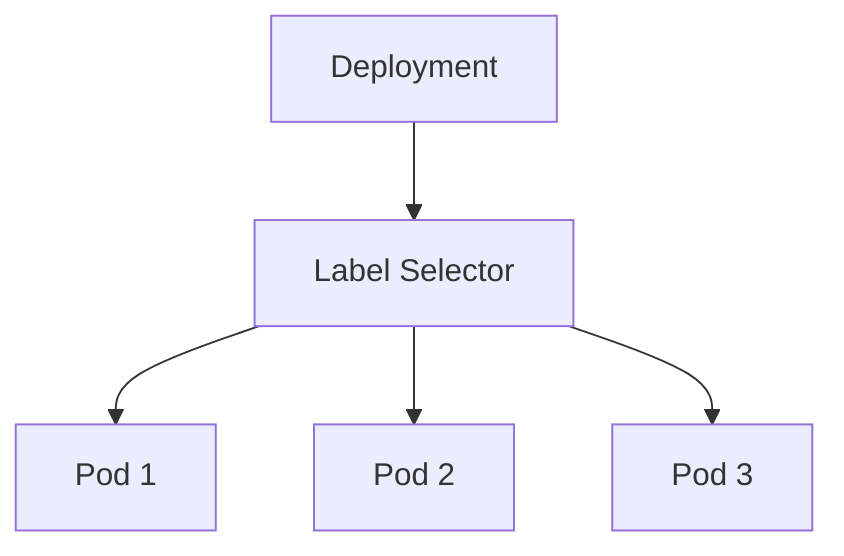
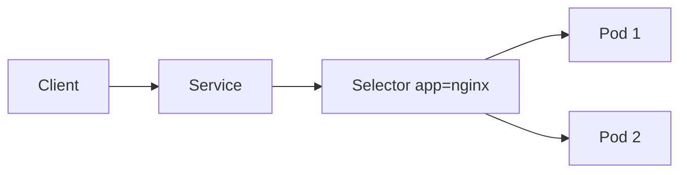
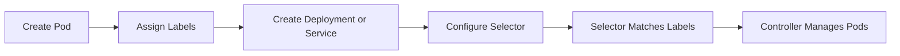
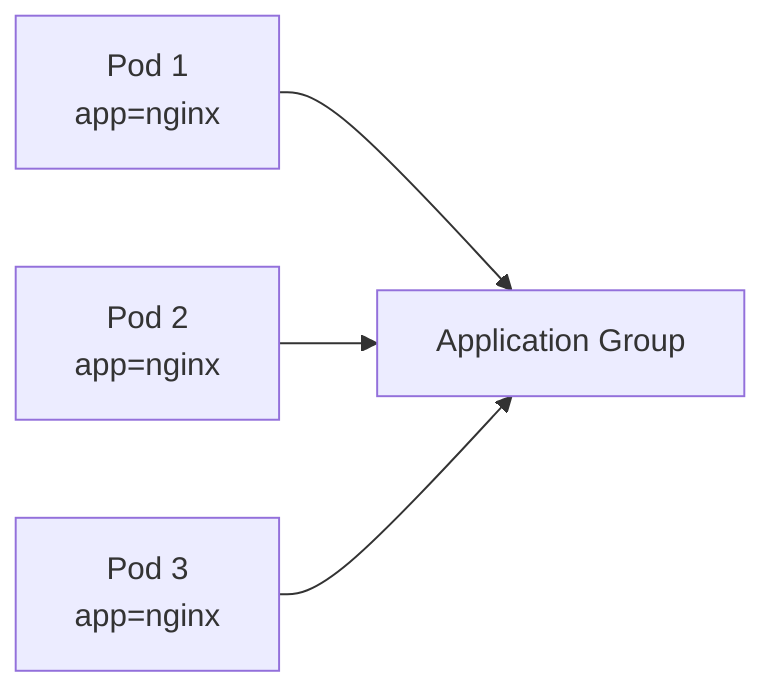
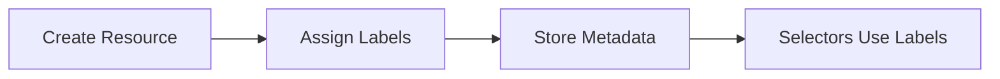
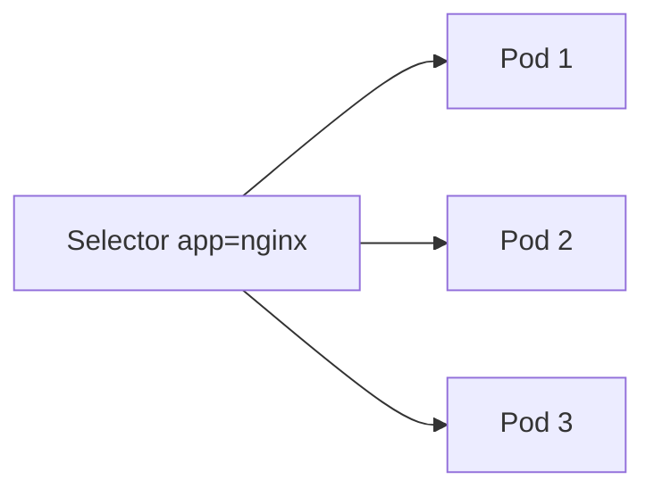
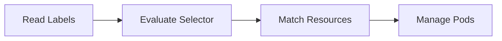
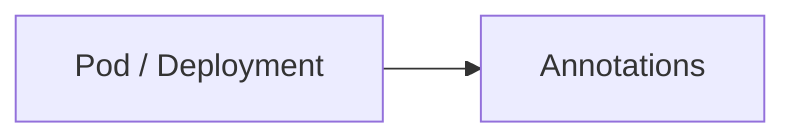
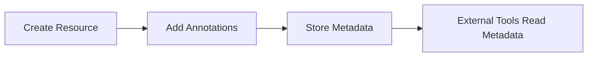

# Labels & Selectors

## Overview

**Labels** and **Selectors** are fundamental Kubernetes concepts used to organize, identify, and group Kubernetes resources.

- **Labels** are key-value pairs attached to Kubernetes objects.
- **Selectors** use Labels to identify and select a group of resources.
- **Annotations** store non-identifying metadata for Kubernetes objects.

Almost every Kubernetes controller (Deployment, ReplicaSet, Service, Job, etc.) relies on Labels and Selectors to manage resources.

> **Interview Tip**
>
> **Labels identify objects**, while **Selectors find objects**.
>
> Without matching Labels and Selectors, Kubernetes controllers and Services cannot manage Pods.

---

## Why It Is Used

Labels and Selectors are used to:

- Organize Kubernetes resources
- Group related Pods
- Enable Service discovery
- Connect Deployments with Pods
- Perform rolling updates
- Filter Kubernetes objects
- Simplify application management

Annotations are used to:

- Store metadata
- Store build information
- Store deployment details
- Store configuration information

---

## Architecture / Working



Service Using Labels



---

## Key Components

| Component | Purpose |
|-----------|---------|
| Label | Identifies an object |
| Selector | Finds matching objects |
| Annotation | Stores metadata |
| Deployment | Uses selectors to manage Pods |
| ReplicaSet | Uses selectors to maintain replicas |
| Service | Uses selectors to route traffic |

---

## Types (if applicable)

### Label Selectors

- Equality-based Selectors
- Set-based Selectors

### Metadata

- Labels
- Annotations

---

## Lifecycle / Workflow



---

## Configuration / Syntax (if applicable)

### Labels

```yaml
metadata:
  labels:
    app: nginx
    env: production
    tier: frontend
```

### Selector

```yaml
selector:
  matchLabels:
    app: nginx
```

### Annotation

```yaml
metadata:
  annotations:
    owner: DevOps Team
    version: "1.0"
```

---

## Important Commands (if applicable)

View Labels

```bash
kubectl get pods --show-labels
```

View Objects with Labels

```bash
kubectl get all --show-labels
```

Filter by Label

```bash
kubectl get pods -l app=nginx
```

Filter Multiple Labels

```bash
kubectl get pods -l app=nginx,env=production
```

Add Label

```bash
kubectl label pod nginx env=production
```

Remove Label

```bash
kubectl label pod nginx env-
```

View Annotations

```bash
kubectl describe pod nginx
```

---

## Important Files (if applicable)

| File | Purpose |
|------|---------|
| deployment.yaml | Labels and selectors |
| service.yaml | Service selector |
| pod.yaml | Labels and annotations |

---

## Real-World Use Cases

- Connecting Services to Pods
- Deploying multiple application versions
- Blue-Green deployments
- Canary deployments
- Environment separation
- Monitoring
- Logging
- CI/CD pipelines

---

## Advantages

- Simple resource organization
- Flexible resource grouping
- Automatic Service discovery
- Enables rolling updates
- Simplifies automation
- Easy filtering

---

## Limitations

- Incorrect labels break Services
- Changing labels can disconnect Deployments
- Labels should remain simple
- Labels are not suitable for large metadata

---

## Common Interview Questions (Concept Only)

- What are Labels?
- Why are Labels used?
- What is a Selector?
- Difference between Labels and Selectors?
- Difference between Labels and Annotations?
- Can multiple Pods have the same Label?
- What happens if a Service selector does not match any Pods?
- What are equality-based and set-based selectors?

---

## Common Mistakes

- Mismatched Labels and Selectors
- Using Labels for descriptive metadata
- Changing Labels used by Deployments
- Using duplicate keys incorrectly
- Forgetting to update Service selectors

---

## Troubleshooting

| Problem | Cause | Solution |
|----------|--------|----------|
| Service has no endpoints | Selector mismatch | Verify Labels |
| Deployment creates no Pods | Selector mismatch | Verify matchLabels |
| Pods not selected | Wrong Label values | Check Labels |
| Cannot filter Pods | Incorrect selector | Verify label syntax |

Useful Commands

```bash
kubectl get pods --show-labels

kubectl get pods -l app=nginx

kubectl describe pod nginx

kubectl get endpoints

kubectl describe svc <service-name>
```

---

## Summary

Labels are key-value pairs used to identify Kubernetes resources, while Selectors use those Labels to locate and manage resources. Services, Deployments, and ReplicaSets rely on Labels and Selectors for application management. Annotations complement Labels by storing additional metadata that is not used for resource selection.

---

# Labels

## Overview

Labels are **key-value pairs** attached to Kubernetes resources for identification and grouping.

Examples:

```yaml
labels:
  app: nginx
  env: production
  tier: frontend
```

Labels are used by almost every Kubernetes controller.

> **Interview Tip**
>
> Labels are intended for **identifying** resources, not for storing descriptive information.

---

## Why It Is Used

Labels enable:

- Resource grouping
- Service discovery
- Workload management
- Monitoring
- Scheduling
- CI/CD automation

---

## Architecture / Working



---

## Key Components

| Component | Purpose |
|-----------|---------|
| Key | Label name |
| Value | Label value |
| Metadata | Stores labels |

---

## Types (if applicable)

Common Labels

- app
- version
- env
- tier
- component

---

## Lifecycle /Workflow



---

## Configuration / Syntax (if applicable)

```yaml
metadata:
  labels:
    app: nginx
    version: v1
```

---

## Important Commands (if applicable)

```bash
kubectl get pods --show-labels

kubectl label pod nginx env=production
```

---

## Important Files (if applicable)

| File | Purpose |
|------|---------|
| deployment.yaml | Labels |
| pod.yaml | Labels |

---

## Real-World Use Cases

- Production environments
- Multi-tier applications
- Versioning
- Blue-Green deployment

---

## Advantages

- Simple
- Flexible
- Easy filtering

---

## Limitations

- Incorrect labels break workloads
- Labels should remain small

---

## Common Interview Questions (Concept Only)

- What are Labels?
- Why are Labels required?

---

## Common Mistakes

- Using Labels for metadata
- Inconsistent naming

---

## Troubleshooting

```bash
kubectl get pods --show-labels
```

---

## Summary

Labels uniquely identify Kubernetes resources and enable grouping, filtering, and controller management.

---

# Selectors

## Overview

Selectors identify Kubernetes resources based on their Labels.

Controllers like Deployments, ReplicaSets, and Services use Selectors to find Pods.

Without matching Labels, controllers cannot manage Pods.

---

## Why It Is Used

Selectors enable:

- Service routing
- Replica management
- Deployment management
- Resource filtering

---

## Architecture / Working



---

## Key Components

| Component | Purpose |
|-----------|---------|
| Selector | Matches labels |
| Labels | Resource identification |
| matchLabels | Exact matching |
| matchExpressions | Advanced matching |

---

## Types (if applicable)

### Equality-Based

```text
app=nginx
```

### Set-Based

```text
env in (prod,qa)
```

---

## Lifecycle / Workflow



---

## Configuration / Syntax (if applicable)

Equality

```yaml
matchLabels:
  app: nginx
```

Set-Based

```yaml
matchExpressions:
```

---

## Important Commands (if applicable)

```bash
kubectl get pods -l app=nginx

kubectl get pods -l env=production
```

---

## Important Files (if applicable)

deployment.yaml

service.yaml

---

## Real-World Use Cases

- Service routing
- Rolling updates
- Replica management

---

## Advantages

- Flexible
- Powerful filtering
- Automatic workload selection

---

## Limitations

- Wrong selectors break applications

---

## Common Interview Questions (Concept Only)

- What are Selectors?
- Equality vs Set-based selectors?

---

## Common Mistakes

- Selector mismatch
- Wrong Label values

---

## Troubleshooting

```bash
kubectl get pods --show-labels

kubectl get endpoints
```

---

## Summary

Selectors locate Kubernetes resources using Labels and are essential for Deployments, ReplicaSets, and Services.

---

# Annotations

## Overview

Annotations are **key-value metadata** attached to Kubernetes resources.

Unlike Labels:

- Annotations **cannot** be used for resource selection.
- They store descriptive or operational information.

Examples include:

- Build number
- Git commit ID
- Owner
- Deployment timestamp
- Documentation links

> **Interview Tip**
>
> **Labels are for identification and selection.**
>
> **Annotations are for storing metadata only.**

---

## Why It Is Used

Annotations are used to:

- Store build information
- Store deployment history
- Record Git commit IDs
- Store owner information
- Integrate with monitoring and CI/CD tools

---

## Architecture / Working



---

## Key Components

| Component | Purpose |
|-----------|---------|
| Key | Annotation name |
| Value | Annotation value |
| Metadata | Stores additional information |

---

## Types (if applicable)

Common Annotations

- Build number
- Owner
- Version
- Git SHA
- Documentation URL

---

## Lifecycle / Workflow



---

## Configuration / Syntax (if applicable)

```yaml
metadata:
  annotations:
    owner: DevOps
    build: "123"
```

---

## Important Commands (if applicable)

View Annotations

```bash
kubectl describe pod nginx
```

View YAML

```bash
kubectl get pod nginx -o yaml
```

---

## Important Files (if applicable)

| File | Purpose |
|------|---------|
| deployment.yaml | Annotation definition |
| pod.yaml | Annotation definition |

---

## Real-World Use Cases

- CI/CD pipelines
- Monitoring
- Logging
- GitOps
- Deployment tracking

---

## Advantages

- Stores unlimited metadata
- Does not affect scheduling
- Useful for automation
- Supports external integrations

---

## Limitations

- Cannot be queried using selectors
- Not used for resource identification

---

## Common Interview Questions (Concept Only)

- What are Annotations?
- Labels vs Annotations?
- Can Services use Annotations for selection?
- What information should be stored in Annotations?

---

## Common Mistakes

- Using Annotations for resource selection
- Storing identification data in Annotations
- Confusing Labels with Annotations

---

## Troubleshooting

```bash
kubectl describe pod nginx

kubectl get pod nginx -o yaml
```

---

## Summary

Annotations store descriptive metadata for Kubernetes resources. Unlike Labels, they are not used for selecting or grouping resources but are widely used by CI/CD pipelines, monitoring systems, and operational tools to store additional information.
