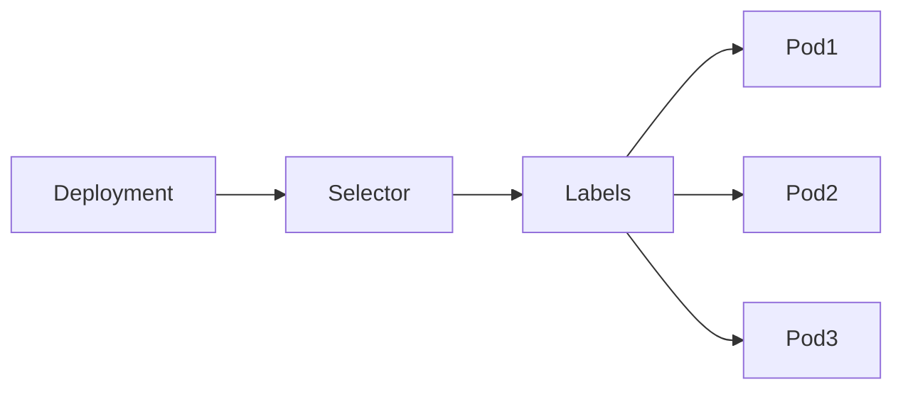
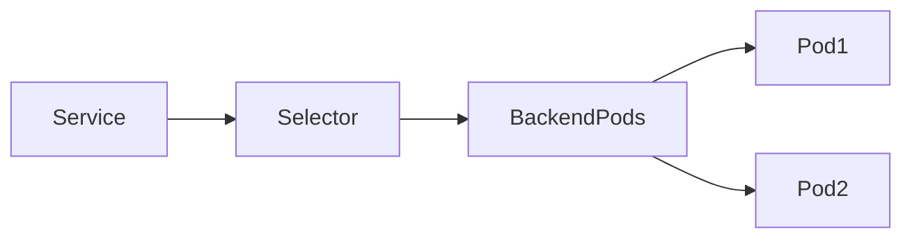
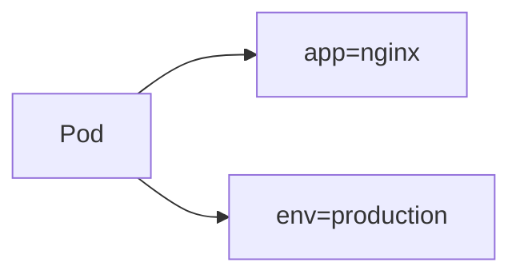
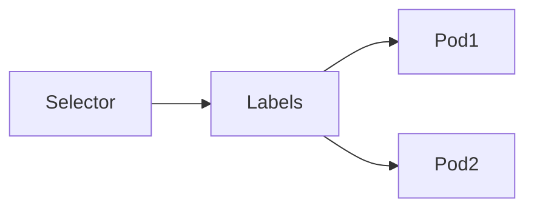
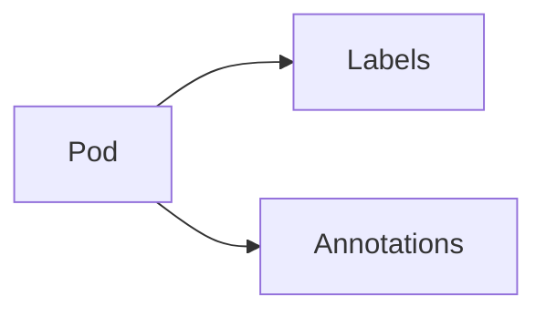

# Labels & Selectors

## Overview

**Labels** and **Selectors** are fundamental Kubernetes concepts used to organize, identify, and manage Kubernetes objects.

- **Labels** are key-value pairs attached to Kubernetes objects.
- **Selectors** use labels to identify and filter Kubernetes objects.
- **Annotations** store additional metadata that is **not used for object selection**.

Almost every Kubernetes workload relies on Labels and Selectors for communication and management.

> **Interview Tip**
>
> Labels identify resources.
>
> Selectors find resources.
>
> Annotations provide additional metadata.

---

## Why It Is Used

Labels and Selectors are used to:

- Organize Kubernetes resources
- Group related objects
- Connect Services to Pods
- Connect Deployments to ReplicaSets
- Filter resources
- Enable monitoring and automation
- Store metadata

---

## Architecture / Working



Service Example



---

## Key Components

| Component | Purpose |
|-----------|----------|
| Label | Identifies resources |
| Selector | Finds resources |
| Annotation | Stores metadata |
| Key | Label name |
| Value | Label value |

---

## Types (if applicable)

### Labels

- Application Labels
- Environment Labels
- Version Labels
- Team Labels

### Selectors

- Equality-Based Selector
- Set-Based Selector

### Annotations

- Informational metadata
- Tool-specific metadata
- Configuration metadata

---

## Lifecycle / Workflow

```mermaid
flowchart LR

Create Resource

↓

Assign Labels

↓

Selector Searches Labels

↓

Matching Resources Selected
```

---

## Configuration / Syntax (if applicable)

Resource with Labels

```yaml
apiVersion: v1

kind: Pod

metadata:
  name: nginx

  labels:
    app: nginx
    env: production
```

Service Selector

```yaml
selector:
  app: nginx
```

Annotation Example

```yaml
metadata:

  annotations:
    owner: devops-team
    description: Production Web Server
```

---

## Important Commands (if applicable)

View Labels

```bash
kubectl get pods --show-labels
```

Filter Resources

```bash
kubectl get pods -l app=nginx
```

View YAML

```bash
kubectl get pod nginx -o yaml
```

Add Label

```bash
kubectl label pod nginx env=production
```

Update Label

```bash
kubectl label pod nginx env=staging --overwrite
```

Remove Label

```bash
kubectl label pod nginx env-
```

View Annotations

```bash
kubectl describe pod nginx
```

Add Annotation

```bash
kubectl annotate pod nginx owner=devops
```

Remove Annotation

```bash
kubectl annotate pod nginx owner-
```

---

## Important Files (if applicable)

| File | Purpose |
|------|----------|
| deployment.yaml | Labels & Selectors |
| service.yaml | Service Selectors |
| pod.yaml | Labels |
| ingress.yaml | Metadata |

---

## Real-World Use Cases

- Connecting Services to Pods
- Selecting Pods for Deployments
- Blue-Green Deployments
- Canary Deployments
- Monitoring
- Logging
- Cost allocation
- Environment separation

---

## Advantages

- Easy resource organization
- Dynamic grouping
- Simplified management
- Automatic Service discovery
- Flexible filtering
- Supports automation

---

## Limitations

- Incorrect labels break resource relationships
- Labels cannot store large amounts of data
- Poor naming conventions make clusters difficult to manage
- Frequent label changes can affect workload selection

---

## Common Interview Questions (Concept Only)

- What are Labels?
- What are Selectors?
- Why are Labels used?
- How does a Service find Pods?
- What is the difference between Labels and Annotations?
- Can Labels be modified?
- What happens if Pod labels don't match the Service selector?
- Explain Equality-Based and Set-Based Selectors.

---

## Common Mistakes

- Confusing Labels with Annotations
- Using inconsistent label names
- Changing labels used by Deployments or Services without updating selectors
- Using annotations instead of labels for resource selection
- Forgetting that selector changes may orphan existing Pods

---

## Troubleshooting

| Problem | Cause | Solution |
|----------|--------|----------|
| Service has no endpoints | Labels don't match selector | Verify labels |
| Deployment creates no Pods | Selector mismatch | Compare labels and selectors |
| Resource not filtered | Wrong label | Check `kubectl get --show-labels` |
| Automation not working | Incorrect metadata | Verify annotations |
| Pod not managed | Missing labels | Add correct labels |

Useful Commands

```bash
kubectl get pods --show-labels

kubectl get pods -l app=nginx

kubectl describe pod nginx

kubectl get deployment -o yaml
```

---

## Summary

Labels organize Kubernetes resources using key-value pairs, Selectors locate resources based on those labels, and Annotations store additional metadata that is not used for selection. Together, they form the foundation of resource grouping, Service discovery, workload management, and automation in Kubernetes.

---

# Labels

## Overview

Labels are **key-value pairs** attached to Kubernetes objects.

They uniquely identify and organize resources.

Example:

```yaml
labels:
  app: nginx
  env: production
  tier: frontend
```

---

## Why It Is Used

Labels help Kubernetes:

- Group resources
- Filter resources
- Connect Services
- Connect Deployments
- Manage environments

---

## Architecture / Working



---

## Key Components

| Component | Purpose |
|-----------|----------|
| Key | Label name |
| Value | Label value |

---

## Types (if applicable)

Common Labels

| Label | Example |
|--------|----------|
| app | nginx |
| env | production |
| version | v1 |
| tier | frontend |
| team | devops |

---

## Lifecycle / Workflow

Resource Created

↓

Labels Assigned

↓

Selectors Use Labels

---

## Configuration / Syntax (if applicable)

```yaml
labels:
  app: nginx
```

---

## Important Commands (if applicable)

```bash
kubectl label pod nginx app=web

kubectl get pods --show-labels
```

---

## Important Files (if applicable)

deployment.yaml

---

## Real-World Use Cases

- Production vs Development
- Team ownership
- Application grouping
- Monitoring

---

## Advantages

- Flexible
- Lightweight
- Easy filtering

---

## Limitations

- Must be consistent
- Incorrect labels break workload relationships

---

## Common Interview Questions (Concept Only)

- What are Labels?
- Are Labels unique?

---

## Common Mistakes

- Using inconsistent naming

---

## Troubleshooting

Check labels using:

```bash
kubectl get pods --show-labels
```

---

## Summary

Labels are key-value identifiers used to organize, group, and manage Kubernetes resources.

---

# Selectors

## Overview

Selectors identify Kubernetes resources based on Labels.

Most Kubernetes controllers use Selectors.

Examples include:

- Deployment
- ReplicaSet
- Service

---

## Why It Is Used

Selectors:

- Find Pods
- Connect Services
- Connect Deployments
- Enable scaling

---

## Architecture / Working



---

## Key Components

| Component | Purpose |
|-----------|----------|
| Selector | Finds resources |
| Labels | Matching criteria |

---

## Types (if applicable)

### Equality-Based

```yaml
app=nginx
```

```yaml
env=production
```

---

### Set-Based

```yaml
env in (prod,test)
```

```yaml
env notin (dev)
```

```yaml
tier in (frontend,backend)
```

---

## Lifecycle / Workflow

Selector Created

↓

Compare Labels

↓

Return Matching Resources

---

## Configuration / Syntax (if applicable)

Equality

```yaml
selector:
  app: nginx
```

Set Based

```yaml
matchExpressions:
```

---

## Important Commands (if applicable)

```bash
kubectl get pods -l app=nginx

kubectl get pods -l env=production
```

---

## Important Files (if applicable)

deployment.yaml

service.yaml

---

## Real-World Use Cases

- Service discovery
- Deployments
- Scaling
- Monitoring

---

## Advantages

- Flexible filtering
- Automatic resource discovery

---

## Limitations

- Wrong selectors prevent workload management

---

## Common Interview Questions (Concept Only)

- What is a Selector?
- Difference between Equality and Set-Based Selectors?

---

## Common Mistakes

- Selector doesn't match labels

---

## Troubleshooting

Verify:

```bash
kubectl get pods --show-labels
```

---

## Summary

Selectors use Labels to identify Kubernetes resources and are essential for Services, Deployments, and ReplicaSets.

---

# Annotations

## Overview

Annotations are **key-value pairs** that store additional metadata about Kubernetes objects.

Unlike Labels:

- They **cannot** be used for selecting resources.
- They are intended for informational or tool-specific metadata.

Examples:

- Build number
- Git commit
- Owner
- Documentation
- CI/CD metadata

> **Interview Tip**
>
> **Labels are for identification and selection.**
>
> **Annotations are for additional information only.**

---

## Why It Is Used

Annotations are used to:

- Store build information
- Store Git commit IDs
- Record deployment history
- Store documentation
- Integrate with monitoring tools
- Support CI/CD pipelines

---

## Architecture / Working



---

## Key Components

| Component | Purpose |
|-----------|----------|
| Key | Metadata identifier |
| Value | Metadata value |

---

## Types (if applicable)

Common Annotation Examples

| Annotation | Example |
|------------|----------|
| owner | DevOps Team |
| build | 105 |
| commit | a7d98c |
| description | Production API |

---

## Lifecycle / Workflow

Create Resource

↓

Add Annotation

↓

Read by Tools

---

## Configuration / Syntax (if applicable)

```yaml
metadata:

  annotations:

    owner: DevOps

    build: "105"
```

---

## Important Commands (if applicable)

View

```bash
kubectl describe pod nginx
```

Add

```bash
kubectl annotate pod nginx owner=devops
```

Remove

```bash
kubectl annotate pod nginx owner-
```

---

## Important Files (if applicable)

deployment.yaml

---

## Real-World Use Cases

- Git commit tracking
- CI/CD metadata
- Documentation
- Monitoring
- Auditing

---

## Advantages

- Unlimited metadata
- No naming restrictions beyond key format
- Tool integration

---

## Limitations

- Cannot be used for resource selection
- Not suitable for grouping resources

---

## Common Interview Questions (Concept Only)

- What are Annotations?
- Difference between Labels and Annotations?
- Can Services use Annotations to find Pods?

---

## Common Mistakes

- Using annotations instead of labels for selectors
- Storing searchable metadata in annotations

---

## Troubleshooting

Verify annotations using:

```bash
kubectl describe pod nginx

kubectl get pod nginx -o yaml
```

---

## Summary

Annotations store additional metadata for Kubernetes resources. They are commonly used by CI/CD pipelines, monitoring tools, and administrators but cannot be used for selecting or grouping resources.
