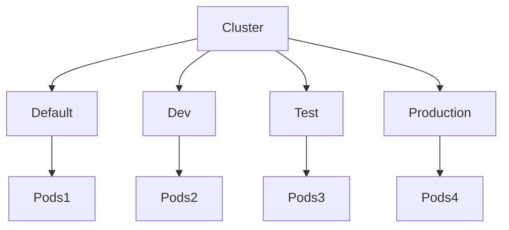
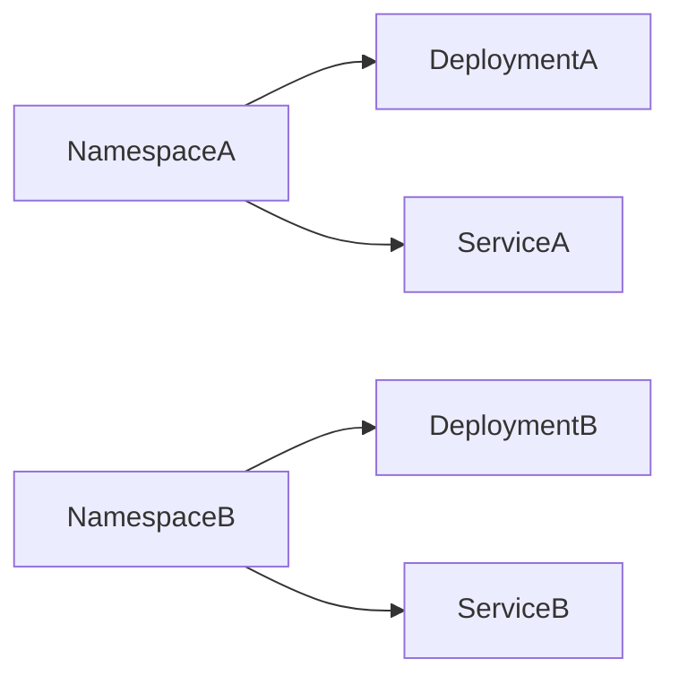
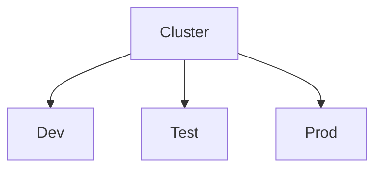
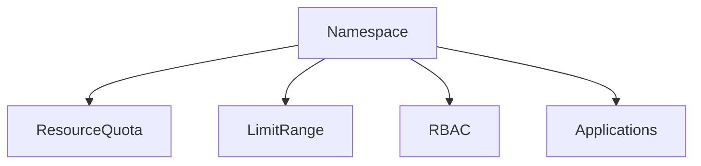

# Namespaces

## Overview

A **Namespace** is a logical partition within a Kubernetes cluster that provides isolation for Kubernetes resources.

Namespaces allow multiple teams, applications, or environments to share the same Kubernetes cluster while keeping their resources separate.

Without namespaces, all resources would exist in a single shared environment, making management difficult in large clusters.

> **Interview Tip**
>
> Namespaces provide **logical isolation**, **not physical isolation**.
>
> Pods in different namespaces can still communicate unless restricted by **Network Policies**.

---

## Why It Is Used

Namespaces are used to:

- Organize cluster resources
- Separate environments (Dev, Test, Prod)
- Support multiple teams
- Avoid naming conflicts
- Apply resource quotas
- Control access using RBAC
- Simplify administration

---

## Architecture / Working



Example



---

## Key Components

| Component | Purpose |
|-----------|----------|
| Namespace | Logical isolation |
| Resources | Pods, Services, Deployments |
| RBAC | Access control |
| Resource Quota | Resource limits |
| Limit Range | Default resource constraints |

---

## Types (if applicable)

| Namespace | Purpose |
|------------|----------|
| default | User workloads |
| kube-system | Kubernetes system components |
| kube-public | Public resources |
| kube-node-lease | Node heartbeat information |
| Custom Namespace | User-created isolation |

---

## Lifecycle / Workflow

```mermaid
flowchart LR

Create Namespace

↓

Deploy Resources

↓

Manage Resources

↓

Delete Namespace
```

---

## Configuration / Syntax (if applicable)

Namespace YAML

```yaml
apiVersion: v1

kind: Namespace

metadata:
  name: development
```

Create

```bash
kubectl apply -f namespace.yaml
```

---

## Important Commands (if applicable)

List Namespaces

```bash
kubectl get namespaces
```

Create Namespace

```bash
kubectl create namespace development
```

Delete Namespace

```bash
kubectl delete namespace development
```

View Resources

```bash
kubectl get pods -n development
```

Set Current Namespace

```bash
kubectl config set-context --current --namespace=development
```

Describe Namespace

```bash
kubectl describe namespace development
```

---

## Important Files (if applicable)

| File | Purpose |
|------|----------|
| namespace.yaml | Namespace definition |
| resourcequota.yaml | Resource limits |
| limitrange.yaml | Default limits |
| role.yaml | Namespace RBAC |

---

## Real-World Use Cases

- Development environment
- Testing environment
- Production environment
- Multiple project teams
- Department isolation
- Customer isolation
- Multi-tenant clusters

---

## Advantages

- Logical isolation
- Better organization
- Resource management
- RBAC integration
- Prevents naming conflicts
- Supports multi-tenancy

---

## Limitations

- Not physical isolation
- Network communication remains possible unless restricted
- Cluster-wide resources are not namespaced
- Requires additional management in large environments

---

## Common Interview Questions (Concept Only)

- What is a Namespace?
- Why are Namespaces needed?
- Do Namespaces provide complete isolation?
- What are the default Kubernetes namespaces?
- Can Pods in different namespaces communicate?
- Are Nodes namespaced?
- Can Services communicate across namespaces?
- What resources are cluster-wide?

---

## Common Mistakes

- Assuming Namespaces provide network isolation
- Deploying everything into the default namespace
- Forgetting to specify the namespace when managing resources
- Confusing Namespace isolation with cluster isolation
- Deleting a namespace without understanding that all contained resources will be deleted

---

## Troubleshooting

| Problem | Cause | Solution |
|----------|--------|----------|
| Resource not found | Wrong namespace | Verify namespace |
| Deployment missing | Created in another namespace | Use `-n` option |
| Access denied | RBAC restriction | Check permissions |
| Service cannot resolve | Wrong namespace | Use FQDN |
| Namespace stuck deleting | Remaining finalizers | Remove finalizers if appropriate |

Useful Commands

```bash
kubectl get namespaces

kubectl get all -n development

kubectl describe namespace development

kubectl config view

kubectl config current-context
```

---

## Summary

Namespaces provide logical separation of resources within a Kubernetes cluster. They enable multi-tenancy, simplify resource organization, support RBAC and quotas, and help isolate environments such as Development, Testing, and Production. However, they do not provide complete security or network isolation by themselves.

---

# Default Namespace

## Overview

The **default** namespace is the namespace automatically used when no namespace is specified.

Every new Kubernetes cluster includes the default namespace.

Unless explicitly configured otherwise, Kubernetes resources are created here.

> **Interview Tip**
>
> Production environments typically avoid using the default namespace for application deployments.

---

## Why It Is Used

- Quick testing
- Learning Kubernetes
- Small clusters
- Default location for workloads

---

## Architecture / Working

```mermaid
flowchart LR

kubectl

↓

Default Namespace

↓

Resources
```

---

## Key Components

| Component | Purpose |
|-----------|----------|
| default | Default namespace for workloads |

---

## Types (if applicable)

Built-in Namespace

---

## Lifecycle / Workflow

Resource Created

↓

Namespace Not Specified

↓

Placed in Default Namespace

---

## Configuration / Syntax (if applicable)

Create Pod

```bash
kubectl apply -f pod.yaml
```

View Resources

```bash
kubectl get pods
```

---

## Important Commands (if applicable)

```bash
kubectl get pods

kubectl get deployments

kubectl get svc
```

---

## Important Files (if applicable)

Standard Kubernetes YAML manifests

---

## Real-World Use Cases

- Labs
- Practice clusters
- Small internal environments

---

## Advantages

- Simple
- No additional configuration

---

## Limitations

- Poor organization
- Difficult to manage large environments
- Not recommended for production applications

---

## Common Interview Questions (Concept Only)

- What is the default namespace?
- Should production workloads use the default namespace?

---

## Common Mistakes

- Deploying every application into the default namespace

---

## Troubleshooting

Verify the current namespace using:

```bash
kubectl config view --minify
```

---

## Summary

The default namespace is the automatically selected namespace when no other namespace is specified. It is useful for testing but is generally avoided for production workloads.

---

# Custom Namespaces

## Overview

Custom Namespaces are user-created namespaces used to logically separate applications, teams, or environments.

Examples:

- development
- testing
- production
- monitoring
- logging

---

## Why It Is Used

- Environment separation
- Team isolation
- Security
- Resource management

---

## Architecture / Working



---

## Key Components

| Component | Purpose |
|-----------|----------|
| Namespace | Logical grouping |
| Resources | Applications |

---

## Types (if applicable)

Examples

- dev
- test
- staging
- prod

---

## Lifecycle / Workflow

Create Namespace

↓

Deploy Applications

↓

Manage Resources

---

## Configuration / Syntax (if applicable)

Create Namespace

```bash
kubectl create namespace production
```

Deploy

```bash
kubectl apply -f deployment.yaml -n production
```

---

## Important Commands (if applicable)

```bash
kubectl create namespace dev

kubectl get namespaces

kubectl delete namespace dev

kubectl get pods -n dev
```

---

## Important Files (if applicable)

namespace.yaml

---

## Real-World Use Cases

- Dev/Test/Prod
- Team isolation
- Customer isolation
- Multi-tenant Kubernetes

---

## Advantages

- Better organization
- Resource isolation
- Easier management
- RBAC support

---

## Limitations

- Requires planning
- Additional administration

---

## Common Interview Questions (Concept Only)

- Why create custom namespaces?
- How do you deploy to a specific namespace?

---

## Common Mistakes

- Creating unnecessary namespaces
- Poor namespace naming conventions

---

## Troubleshooting

Verify resource location using:

```bash
kubectl get all -A
```

---

## Summary

Custom Namespaces provide logical separation of workloads, making Kubernetes clusters easier to manage, secure, and organize.

---

# Resource Isolation

## Overview

Resource Isolation refers to limiting and organizing Kubernetes resources within a namespace.

Namespaces alone organize resources, but they become more effective when combined with:

- Resource Quotas
- Limit Ranges
- RBAC
- Network Policies

> **Interview Tip**
>
> **Namespaces organize resources.**
>
> **Resource Quotas limit resource usage.**
>
> **RBAC controls access.**
>
> **Network Policies restrict network communication.**

---

## Why It Is Used

Resource Isolation helps:

- Prevent resource exhaustion
- Ensure fair resource sharing
- Improve security
- Support multi-tenancy
- Control CPU and memory usage

---

## Architecture / Working



---

## Key Components

| Component | Purpose |
|-----------|----------|
| Namespace | Logical boundary |
| ResourceQuota | Limits resource consumption |
| LimitRange | Sets default requests and limits |
| RBAC | Controls user access |
| NetworkPolicy | Restricts network traffic |

---

## Types (if applicable)

| Isolation Type | Purpose |
|----------------|----------|
| Logical Isolation | Namespace |
| Resource Isolation | ResourceQuota |
| Access Isolation | RBAC |
| Network Isolation | NetworkPolicy |

---

## Lifecycle / Workflow

Create Namespace

↓

Apply ResourceQuota

↓

Deploy Applications

↓

Enforce Limits

---

## Configuration / Syntax (if applicable)

Example ResourceQuota

```yaml
apiVersion: v1

kind: ResourceQuota

metadata:
  name: compute-quota

spec:
  hard:
    pods: "20"
    requests.cpu: "8"
    requests.memory: 16Gi
```

---

## Important Commands (if applicable)

View Quotas

```bash
kubectl get resourcequota
```

Describe Quota

```bash
kubectl describe resourcequota
```

View LimitRanges

```bash
kubectl get limitrange
```

---

## Important Files (if applicable)

| File | Purpose |
|------|----------|
| resourcequota.yaml | Resource limits |
| limitrange.yaml | Default requests and limits |
| role.yaml | RBAC |
| networkpolicy.yaml | Network isolation |

---

## Real-World Use Cases

- Shared development clusters
- Enterprise Kubernetes
- Team resource allocation
- Production resource governance
- Cost optimization

---

## Advantages

- Prevents resource abuse
- Improves cluster stability
- Supports fair resource allocation
- Enhances security
- Enables multi-tenant environments

---

## Limitations

- Requires careful planning
- Incorrect limits can prevent workloads from running
- Network isolation requires additional configuration

---

## Common Interview Questions (Concept Only)

- What is Resource Isolation?
- Does a Namespace limit CPU or memory automatically?
- What is ResourceQuota?
- What is LimitRange?
- How do Namespaces and ResourceQuotas work together?
- Which Kubernetes feature controls user access?
- Which feature provides network isolation?

---

## Common Mistakes

- Assuming Namespaces automatically enforce resource limits
- Forgetting to configure ResourceQuotas
- Ignoring LimitRanges
- Confusing RBAC with ResourceQuota
- Believing Namespaces alone provide complete isolation

---

## Troubleshooting

| Problem | Cause | Solution |
|----------|--------|----------|
| Pod creation fails | Resource quota exceeded | Check quotas |
| CPU request denied | Limit exceeded | Adjust requests or quotas |
| Access denied | RBAC policy | Verify permissions |
| Unexpected network communication | Missing NetworkPolicy | Configure network rules |

Useful Commands

```bash
kubectl get resourcequota

kubectl describe resourcequota

kubectl get limitrange

kubectl describe namespace development
```

---

## Summary

Resource Isolation combines Namespaces with ResourceQuotas, LimitRanges, RBAC, and Network Policies to organize workloads, control resource consumption, enforce access policies, and improve cluster stability in shared Kubernetes environments.
