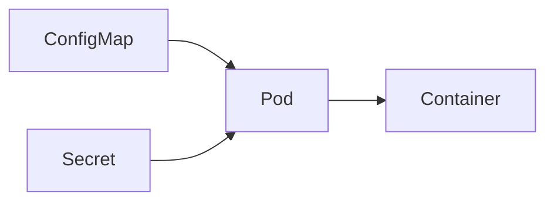

# Configuration Management

## Overview

Configuration Management in Kubernetes is the process of storing and managing **application configuration** separately from the application code and container image.

Instead of rebuilding container images whenever a configuration changes, Kubernetes allows configurations to be injected into Pods at runtime using:

- ConfigMaps
- Secrets
- Environment Variables
- Mounted Configuration Files

This separation follows the **12-Factor App** principle and simplifies deployments across multiple environments.

> **Interview Tip**
>
> **ConfigMaps** store **non-sensitive** configuration.
>
> **Secrets** store **sensitive** configuration such as passwords, API keys, and certificates.

---

## Why It Is Used

Configuration Management is used to:

- Separate configuration from application code
- Avoid rebuilding container images
- Simplify environment-specific deployments
- Secure sensitive information
- Centralize configuration management
- Support CI/CD deployments
- Enable dynamic configuration updates

---

## Architecture / Working



Configuration Flow


---

## Key Components

| Component | Purpose |
|-----------|---------|
| ConfigMap | Stores non-sensitive configuration |
| Secret | Stores sensitive configuration |
| Environment Variables | Inject configuration into containers |
| Volume Mount | Mount configuration as files |
| Pod | Consumes configuration |

---

## Types (if applicable)

Configuration Sources

- ConfigMaps
- Secrets
- Environment Variables
- Mounted Volumes

---

## Lifecycle / Workflow


---

## Configuration / Syntax (if applicable)

Using ConfigMap as Environment Variables

```yaml
envFrom:
- configMapRef:
    name: app-config
```

Using Secret as Environment Variables

```yaml
envFrom:
- secretRef:
    name: app-secret
```

Mount ConfigMap as Files

```yaml
volumes:
- name: config-volume
  configMap:
    name: app-config
```

---

## Important Commands (if applicable)

Create ConfigMap

```bash
kubectl create configmap app-config --from-literal=APP_ENV=production
```

Create Secret

```bash
kubectl create secret generic app-secret \
--from-literal=password=MyPassword123
```

View ConfigMaps

```bash
kubectl get configmaps
```

View Secrets

```bash
kubectl get secrets
```

Describe ConfigMap

```bash
kubectl describe configmap app-config
```

Describe Secret

```bash
kubectl describe secret app-secret
```

Delete ConfigMap

```bash
kubectl delete configmap app-config
```

Delete Secret

```bash
kubectl delete secret app-secret
```

---

## Important Files (if applicable)

| File | Purpose |
|------|---------|
| configmap.yaml | ConfigMap definition |
| secret.yaml | Secret definition |
| deployment.yaml | References ConfigMaps and Secrets |

---

## Real-World Use Cases

- Database configuration
- Application configuration
- API endpoints
- Feature flags
- Database passwords
- TLS certificates
- API tokens
- Cloud credentials

---

## Advantages

- Separates configuration from code
- Easier deployments
- Improves security
- Supports environment-specific configurations
- Simplifies CI/CD
- Enables reusable container images

---

## Limitations

- ConfigMap data is not encrypted
- Secrets are Base64 encoded by default (not encrypted)
- Pod restart may be required for environment variable updates
- Large configurations become difficult to manage

---

## Common Interview Questions (Concept Only)

- What is Configuration Management in Kubernetes?
- Why should configuration be separated from application code?
- Difference between ConfigMap and Secret?
- How do Pods consume ConfigMaps?
- How do Secrets improve security?
- Can ConfigMaps be updated without rebuilding the image?
- Can Secrets be mounted as files?
- How are ConfigMaps injected into Pods?

---

## Common Mistakes

- Storing passwords inside ConfigMaps
- Hardcoding configuration inside container images
- Forgetting to restart Pods after configuration changes
- Storing certificates in ConfigMaps
- Exposing Secrets in application logs

---

## Troubleshooting

| Problem | Cause | Solution |
|----------|--------|----------|
| Configuration not available | ConfigMap missing | Verify ConfigMap exists |
| Secret not found | Wrong Secret name | Verify Secret reference |
| Environment variable missing | Incorrect YAML | Check `env` or `envFrom` |
| Mounted files missing | Incorrect volume mount | Verify volume configuration |
| Pod startup failure | Missing ConfigMap/Secret | Check Pod events |

Useful Commands

```bash
kubectl get configmaps

kubectl get secrets

kubectl describe configmap app-config

kubectl describe secret app-secret

kubectl describe pod <pod-name>
```

---

## Summary

Configuration Management in Kubernetes separates application configuration from container images using ConfigMaps, Secrets, Environment Variables, and mounted volumes. This approach improves security, simplifies deployments, and supports environment-specific configurations while following cloud-native best practices.

---

# ConfigMaps

## Overview

A **ConfigMap** is a Kubernetes object used to store **non-sensitive configuration data** as key-value pairs.

Applications retrieve ConfigMap values during runtime instead of embedding configuration inside container images.

Examples include:

- Application settings
- Database hostnames
- Feature flags
- URLs
- Logging levels

> **Interview Tip**
>
> Never store passwords or API keys in ConfigMaps.

---

## Why It Is Used

ConfigMaps are used to:

- Store application configuration
- Separate configuration from code
- Share configuration across Pods
- Simplify environment management
- Enable reusable container images

---

## Architecture / Working


---

## Key Components

| Component | Purpose |
|-----------|---------|
| Key | Configuration name |
| Value | Configuration value |
| ConfigMap | Stores configuration |

---

## Types (if applicable)

ConfigMap can be created from:

- YAML file
- Literal values
- Files
- Directories

---

## Lifecycle / Workflow


---

## Configuration / Syntax (if applicable)

```yaml
apiVersion: v1
kind: ConfigMap

metadata:
  name: app-config

data:
  APP_ENV: production
  LOG_LEVEL: INFO
```

Use as Environment Variables

```yaml
envFrom:
- configMapRef:
    name: app-config
```

---

## Important Commands (if applicable)

Create

```bash
kubectl create configmap app-config \
--from-literal=APP_ENV=production
```

View

```bash
kubectl get configmaps
```

Describe

```bash
kubectl describe configmap app-config
```

Delete

```bash
kubectl delete configmap app-config
```

---

## Important Files (if applicable)

| File | Purpose |
|------|---------|
| configmap.yaml | ConfigMap definition |

---

## Real-World Use Cases

- Database hostnames
- API endpoints
- Logging configuration
- Feature flags

---

## Advantages

- Easy configuration management
- Reusable
- Separate from application code

---

## Limitations

- Not encrypted
- Not suitable for secrets

---

## Common Interview Questions (Concept Only)

- What is ConfigMap?
- How do ConfigMaps work?
- Can ConfigMaps store passwords?
- How are ConfigMaps mounted?

---

## Common Mistakes

- Storing secrets
- Hardcoding values

---

## Troubleshooting

```bash
kubectl get configmaps

kubectl describe configmap app-config
```

---

## Summary

ConfigMaps store non-sensitive configuration data and allow applications to load configuration dynamically without rebuilding container images.

---

# Secrets

## Overview

A **Secret** stores **sensitive information** required by applications.

Examples:

- Passwords
- API Keys
- Database credentials
- SSH Keys
- TLS Certificates

Secrets can be injected into Pods as:

- Environment Variables
- Mounted files

> **Interview Tip**
>
> Kubernetes Secrets are **Base64 encoded**, not encrypted by default. Enable **Encryption at Rest** for production environments.

---

## Why It Is Used

Secrets provide:

- Secure credential management
- Centralized secret storage
- Better application security
- Easier secret rotation

---

## Architecture / Working


---

## Key Components

| Component | Purpose |
|-----------|---------|
| Secret | Stores sensitive data |
| Key | Secret name |
| Value | Secret value |

---

## Types (if applicable)

Common Secret Types

- Opaque
- TLS
- Docker Registry
- Service Account Token

---

## Lifecycle / Workflow


---

## Configuration / Syntax (if applicable)

```yaml
apiVersion: v1
kind: Secret

metadata:
  name: app-secret

type: Opaque

data:
  password: TXlQYXNzd29yZA==
```

---

## Important Commands (if applicable)

Create

```bash
kubectl create secret generic app-secret \
--from-literal=password=MyPassword123
```

View

```bash
kubectl get secrets
```

Describe

```bash
kubectl describe secret app-secret
```

Delete

```bash
kubectl delete secret app-secret
```

---

## Important Files (if applicable)

| File | Purpose |
|------|---------|
| secret.yaml | Secret definition |

---

## Real-World Use Cases

- Database credentials
- API Keys
- TLS certificates
- Docker Registry credentials

---

## Advantages

- Better security
- Centralized secret management
- Supports multiple secret types

---

## Limitations

- Base64 encoding is not encryption
- Requires RBAC protection

---

## Common Interview Questions (Concept Only)

- What is a Secret?
- ConfigMap vs Secret?
- Are Secrets encrypted?
- How are Secrets mounted?

---

## Common Mistakes

- Assuming Base64 is encryption
- Logging secret values
- Storing secrets in Git

---

## Troubleshooting

```bash
kubectl get secrets

kubectl describe secret app-secret
```

---

## Summary

Secrets securely store sensitive application data and should always be used instead of ConfigMaps for passwords, certificates, and credentials.

---

# Environment Variables

## Overview

Environment Variables allow ConfigMaps and Secrets to be injected directly into containers as operating system environment variables.

Applications can read these variables without changing application code.

---

## Why It Is Used

Environment Variables are used to:

- Configure applications
- Inject runtime values
- Pass secrets securely
- Support environment-specific deployments

---

## Architecture / Working


---

## Key Components

| Component | Purpose |
|-----------|---------|
| env | Individual variables |
| envFrom | Import all values |
| valueFrom | Reference ConfigMaps or Secrets |

---

## Types (if applicable)

Environment Variable Sources

- Direct values
- ConfigMaps
- Secrets
- Downward API

---

## Lifecycle / Workflow


---

## Configuration / Syntax (if applicable)

Single Variable

```yaml
env:
- name: APP_ENV
  value: production
```

From ConfigMap

```yaml
envFrom:
- configMapRef:
    name: app-config
```

From Secret

```yaml
envFrom:
- secretRef:
    name: app-secret
```

---

## Important Commands (if applicable)

View Pod

```bash
kubectl describe pod <pod-name>
```

View Environment Variables

```bash
kubectl exec -it <pod-name> -- env
```

---

## Important Files (if applicable)

| File | Purpose |
|------|---------|
| deployment.yaml | Environment variable configuration |

---

## Real-World Use Cases

- Database URLs
- Logging configuration
- Cloud credentials
- Feature flags
- API endpoints

---

## Advantages

- Easy configuration
- Runtime injection
- No application rebuild

---

## Limitations

- Updates may require Pod restart
- Not suitable for very large configurations

---

## Common Interview Questions (Concept Only)

- How are ConfigMaps injected into Pods?
- How are Secrets exposed as environment variables?
- What is `envFrom`?
- Difference between `env` and `envFrom`?

---

## Common Mistakes

- Hardcoding values
- Exposing secrets through logs
- Forgetting to restart Pods after configuration changes

---

## Troubleshooting

```bash
kubectl exec -it <pod-name> -- env

kubectl describe pod <pod-name>
```

---

## Summary

Environment Variables provide a simple and widely used method for passing configuration and secrets into containers at runtime. They integrate seamlessly with ConfigMaps and Secrets, making application configuration flexible, reusable, and production-ready.
