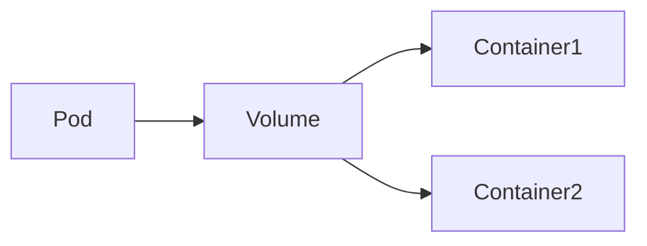
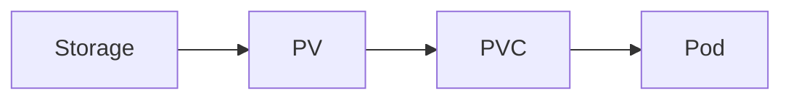
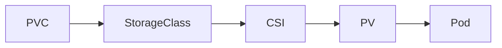

# Storage

## Overview

Kubernetes Storage provides a mechanism for storing and persisting application data beyond the lifecycle of a Pod.

By default, containers have **ephemeral storage**, meaning data is lost when the Pod is deleted or recreated. Kubernetes solves this problem using:

- Volumes
- Persistent Volumes (PV)
- Persistent Volume Claims (PVC)
- Storage Classes

These components allow applications such as databases, web servers, and logging systems to retain data even after Pods restart.

> **Interview Tip**
>
> Pods are temporary, but application data often must persist. Kubernetes Storage decouples storage from the Pod lifecycle.

---

## Why It Is Used

Kubernetes Storage is used to:

- Persist application data
- Share data between containers
- Support databases
- Store logs
- Manage backups
- Enable dynamic storage provisioning
- Separate storage from application lifecycle

---

## Architecture / Working


Dynamic Provisioning Flow


---

## Key Components

| Component | Purpose |
|-----------|---------|
| Volume | Temporary or persistent storage for Pods |
| Persistent Volume (PV) | Cluster storage resource |
| Persistent Volume Claim (PVC) | Storage request from a Pod |
| StorageClass | Defines storage provisioning method |
| CSI Driver | Connects Kubernetes to storage providers |

---

## Types (if applicable)

Storage Types

- Ephemeral Volumes
- Persistent Volumes

Persistent Storage Options

- Azure Disk
- Azure Files
- AWS EBS
- AWS EFS
- NFS
- Local Storage
- CSI Drivers

---

## Lifecycle / Workflow


---

## Configuration / Syntax (if applicable)

PVC Example

```yaml
apiVersion: v1
kind: PersistentVolumeClaim

metadata:
  name: app-pvc

spec:
  accessModes:
    - ReadWriteOnce

  resources:
    requests:
      storage: 5Gi
```

Mount PVC

```yaml
volumes:
- name: app-storage
  persistentVolumeClaim:
    claimName: app-pvc
```

---

## Important Commands (if applicable)

View Volumes

```bash
kubectl get pv
```

View PVCs

```bash
kubectl get pvc
```

View Storage Classes

```bash
kubectl get storageclass
```

Describe PV

```bash
kubectl describe pv <pv-name>
```

Describe PVC

```bash
kubectl describe pvc <pvc-name>
```

Delete PVC

```bash
kubectl delete pvc <pvc-name>
```

---

## Important Files (if applicable)

| File | Purpose |
|------|---------|
| pv.yaml | Persistent Volume |
| pvc.yaml | Persistent Volume Claim |
| storageclass.yaml | Storage Class |
| deployment.yaml | Mount PVC into Pod |

---

## Real-World Use Cases

- MySQL databases
- PostgreSQL
- MongoDB
- Jenkins Home directory
- Elasticsearch
- Prometheus
- Shared file storage
- Application uploads

---

## Advantages

- Persistent application data
- Supports dynamic provisioning
- Decouples storage from Pods
- Cloud-native storage integration
- Supports multiple storage backends

---

## Limitations

- Requires storage provider
- Access modes depend on storage backend
- Storage resizing depends on provider
- Performance varies by storage type

---

## Common Interview Questions (Concept Only)

- Why is Kubernetes Storage required?
- Difference between Volume and Persistent Volume?
- What is PVC?
- What is StorageClass?
- Explain dynamic provisioning.
- What happens when a Pod is deleted?
- How are PV and PVC connected?
- What is CSI?

---

## Common Mistakes

- Using emptyDir for databases
- Deleting PVC without backup
- Wrong access mode selection
- Forgetting StorageClass
- Assuming Pods permanently own storage

---

## Troubleshooting

| Problem | Cause | Solution |
|----------|--------|----------|
| PVC Pending | No matching PV | Check StorageClass |
| Pod Pending | PVC not bound | Verify PV availability |
| Mount failed | Storage issue | Check CSI driver |
| Read-only errors | Wrong Access Mode | Verify access mode |
| Storage not created | Missing StorageClass | Verify provisioner |

Useful Commands

```bash
kubectl get pv

kubectl get pvc

kubectl get storageclass

kubectl describe pvc <pvc-name>

kubectl describe pv <pv-name>
```

---

## Summary

Kubernetes Storage enables applications to persist data independently of Pod lifecycles. It consists of Volumes, Persistent Volumes, Persistent Volume Claims, and Storage Classes, providing scalable and production-ready storage management.

---

# Volumes

## Overview

A **Volume** is a storage directory mounted inside a Pod.

Unlike the container filesystem, a Volume survives **container restarts** within the same Pod.

However, most volumes are deleted when the Pod itself is deleted.

> **Interview Tip**
>
> A Volume's lifecycle is tied to the **Pod**, not the individual container.

---

## Why It Is Used

Volumes are used to:

- Share data between containers
- Store temporary data
- Mount configuration
- Persist data through container restarts

---

## Architecture / Working



---

## Key Components

| Component | Purpose |
|-----------|---------|
| Volume | Storage attached to Pod |
| Mount Path | Location inside container |
| Volume Source | Storage backend |

---

## Types (if applicable)

Common Volume Types

- emptyDir
- hostPath
- ConfigMap
- Secret
- PersistentVolumeClaim

---

## Lifecycle / Workflow


---

## Configuration / Syntax (if applicable)

```yaml
volumes:
- name: app-storage
  emptyDir: {}
```

---

## Important Commands (if applicable)

```bash
kubectl describe pod <pod-name>
```

---

## Important Files (if applicable)

| File | Purpose |
|------|---------|
| pod.yaml | Volume configuration |

---

## Real-World Use Cases

- Shared files
- Temporary cache
- Application logs

---

## Advantages

- Simple
- Easy sharing
- Supports multiple backends

---

## Limitations

- Most volume types are Pod-scoped
- Some are not persistent

---

## Common Interview Questions (Concept Only)

- What is a Kubernetes Volume?
- Why are Volumes required?
- Does a Volume survive Pod deletion?

---

## Common Mistakes

- Using emptyDir for databases
- Confusing Volume with PV

---

## Troubleshooting

```bash
kubectl describe pod <pod-name>
```

---

## Summary

Volumes provide storage for Pods and allow containers within the same Pod to share data.

---

# Persistent Volumes (PV)

## Overview

A **Persistent Volume (PV)** is a storage resource within the Kubernetes cluster.

It exists independently of Pods and is managed by the cluster administrator or dynamically created by a StorageClass.

> **Interview Tip**
>
> **PV represents actual storage**, while **PVC is a request for storage**.

---

## Why It Is Used

PVs provide:

- Persistent storage
- Storage abstraction
- Independent storage lifecycle

---

## Architecture / Working



---

## Key Components

| Component | Purpose |
|-----------|---------|
| PV | Storage resource |
| Capacity | Storage size |
| Access Mode | Read/write permissions |

---

## Types (if applicable)

Provisioning

- Static
- Dynamic

---

## Lifecycle / Workflow


---

## Configuration / Syntax (if applicable)

```yaml
kind: PersistentVolume
```

---

## Important Commands (if applicable)

```bash
kubectl get pv

kubectl describe pv <pv-name>
```

---

## Important Files (if applicable)

pv.yaml

---

## Real-World Use Cases

- Databases
- Shared storage

---

## Advantages

- Persistent
- Independent lifecycle

---

## Limitations

- Static provisioning requires manual management

---

## Common Interview Questions (Concept Only)

- What is PV?
- Static vs Dynamic provisioning?

---

## Common Mistakes

- Creating PVs without matching PVCs

---

## Troubleshooting

```bash
kubectl describe pv
```

---

## Summary

Persistent Volumes represent physical or cloud storage available to Kubernetes clusters.

---

# Persistent Volume Claims (PVC)

## Overview

A **Persistent Volume Claim (PVC)** is a request for storage made by a user or application.

The PVC requests:

- Storage size
- Access mode
- StorageClass

Kubernetes automatically binds a matching PV.

---

## Why It Is Used

PVCs allow developers to request storage without knowing implementation details.

---

## Architecture / Working


---

## Key Components

| Component | Purpose |
|-----------|---------|
| PVC | Storage request |
| Access Mode | Read/write mode |
| Storage Request | Requested capacity |

---

## Types (if applicable)

Binding States

- Pending
- Bound
- Lost

---

## Lifecycle / Workflow


---

## Configuration / Syntax (if applicable)

```yaml
kind: PersistentVolumeClaim
```

---

## Important Commands (if applicable)

```bash
kubectl get pvc

kubectl describe pvc <pvc-name>
```

---

## Important Files (if applicable)

pvc.yaml

---

## Real-World Use Cases

- Database storage
- Shared application data

---

## Advantages

- Abstracts storage
- Simplifies deployments

---

## Limitations

- Depends on available storage

---

## Common Interview Questions (Concept Only)

- What is PVC?
- How is PVC bound?

---

## Common Mistakes

- Wrong StorageClass
- Wrong access mode

---

## Troubleshooting

```bash
kubectl describe pvc <pvc-name>
```

---

## Summary

PVCs request storage resources from Kubernetes and automatically bind to suitable Persistent Volumes.

---

# Storage Classes

## Overview

A **StorageClass** defines **how Kubernetes dynamically provisions storage**.

Instead of manually creating PVs, a StorageClass automatically provisions storage when a PVC is created.

StorageClasses simplify cloud-native storage management.

> **Interview Tip**
>
> **PVC + StorageClass = Dynamic PV creation**

---

## Why It Is Used

StorageClasses provide:

- Dynamic provisioning
- Cloud integration
- Simplified storage management
- Automatic volume creation

---

## Architecture / Working


---

## Key Components

| Component | Purpose |
|-----------|---------|
| StorageClass | Storage template |
| Provisioner | Creates storage |
| CSI Driver | Storage integration |

---

## Types (if applicable)

Common Storage Classes

- Azure Disk
- Azure Files
- AWS EBS
- AWS EFS
- NFS
- Local Storage

---

## Lifecycle / Workflow



---

## Configuration / Syntax (if applicable)

```yaml
kind: StorageClass
```

---

## Important Commands (if applicable)

```bash
kubectl get storageclass

kubectl describe storageclass
```

---

## Important Files (if applicable)

storageclass.yaml

---

## Real-World Use Cases

- AKS
- EKS
- GKE
- Database storage
- Jenkins
- Stateful applications

---

## Advantages

- Automatic provisioning
- Cloud-native
- Easy management

---

## Limitations

- Requires supported CSI driver
- Cloud-provider dependent

---

## Common Interview Questions (Concept Only)

- What is StorageClass?
- Why is StorageClass required?
- Dynamic vs Static provisioning?
- What is CSI?

---

## Common Mistakes

- Missing StorageClass
- Wrong provisioner

---

## Troubleshooting

```bash
kubectl get storageclass

kubectl describe storageclass
```

---

## Summary

StorageClasses automate storage provisioning by dynamically creating Persistent Volumes whenever a matching PVC is created. They are the preferred approach for managing storage in modern Kubernetes environments.
