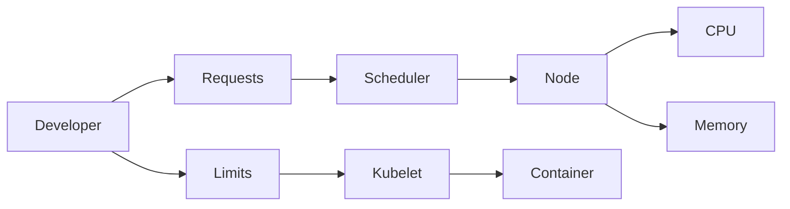
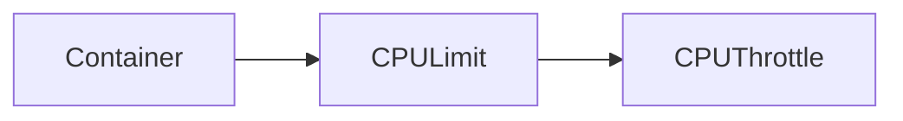
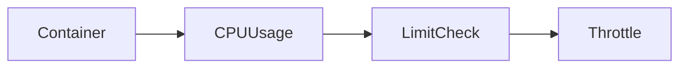

# Resource Management

## Overview

**Resource Management** in Kubernetes is the process of controlling how much **CPU** and **Memory** a container can request and consume.

Every container can define:

- **Requests** → Minimum resources guaranteed by Kubernetes.
- **Limits** → Maximum resources a container can use.

Resource Management helps Kubernetes:

- Schedule Pods efficiently
- Prevent resource starvation
- Improve cluster stability
- Ensure fair resource sharing

> **Interview Tip**
>
> **Request = Guaranteed minimum**
>
> **Limit = Maximum allowed**
>
> The Kubernetes Scheduler uses **Requests**, **not Limits**, to decide where a Pod should run.

---

## Why It Is Used

Resource Management is used to:

- Prevent one application from consuming all cluster resources
- Improve Pod scheduling
- Ensure predictable application performance
- Prevent Out Of Memory (OOM) issues
- Enable fair resource allocation
- Support multi-tenant clusters
- Reduce infrastructure costs

---

## Architecture / Working



Scheduling Flow


---

## Key Components

| Component | Purpose |
|-----------|---------|
| CPU Request | Minimum guaranteed CPU |
| Memory Request | Minimum guaranteed Memory |
| CPU Limit | Maximum CPU usage |
| Memory Limit | Maximum Memory usage |
| Scheduler | Places Pods based on Requests |
| Kubelet | Enforces Limits |

---

## Types (if applicable)

Resource Types

- CPU
- Memory

Resource Settings

- Requests
- Limits

---

## Lifecycle / Workflow


---

## Configuration / Syntax (if applicable)

Example

```yaml
resources:
  requests:
    cpu: "250m"
    memory: "256Mi"

  limits:
    cpu: "500m"
    memory: "512Mi"
```

---

## Important Commands (if applicable)

View Resource Usage

```bash
kubectl top pod
```

View Node Usage

```bash
kubectl top nodes
```

Describe Pod

```bash
kubectl describe pod <pod-name>
```

View Pod YAML

```bash
kubectl get pod <pod-name> -o yaml
```

---

## Important Files (if applicable)

| File | Purpose |
|------|---------|
| deployment.yaml | Requests & Limits |
| pod.yaml | Resource configuration |
| limitrange.yaml | Default limits |
| resourcequota.yaml | Namespace quotas |

---

## Real-World Use Cases

- Production applications
- Database workloads
- Multi-tenant Kubernetes clusters
- CI/CD workloads
- Web applications
- Microservices
- Resource optimization

---

## Advantages

- Prevents noisy neighbor problems
- Improves cluster utilization
- Better scheduling decisions
- Predictable application performance
- Prevents resource exhaustion
- Supports fair resource allocation

---

## Limitations

- Incorrect sizing causes performance issues
- Requires workload monitoring
- Resource tuning may need adjustments over time
- CPU limits can introduce throttling

---

## Common Interview Questions (Concept Only)

- What is Resource Management?
- What is the difference between Requests and Limits?
- Does the Scheduler use Requests or Limits?
- What happens if Memory Limit is exceeded?
- What happens if CPU Limit is exceeded?
- Why should production Pods always define Requests and Limits?
- What is OOMKilled?
- What is CPU throttling?

---

## Common Mistakes

- Not defining Requests
- Setting Requests equal to node capacity
- Very high Memory Limits
- Very low CPU Requests
- Using unlimited resources in production
- Assuming Limits affect scheduling

---

## Troubleshooting

| Problem | Cause | Solution |
|----------|--------|----------|
| Pod Pending | Insufficient requested resources | Reduce Requests or add cluster capacity |
| OOMKilled | Memory Limit exceeded | Increase Memory Limit or optimize application |
| Slow application | CPU throttling | Increase CPU Limit |
| Node resource exhaustion | Requests too low | Properly size Requests |
| Frequent restarts | Resource limits too restrictive | Review resource allocation |

Useful Commands

```bash
kubectl top pods

kubectl top nodes

kubectl describe pod <pod-name>

kubectl describe node <node-name>
```

---

## Summary

Resource Management ensures Kubernetes workloads receive appropriate CPU and Memory while preventing applications from consuming excessive resources. Requests determine scheduling, while Limits control runtime resource usage.

---

# CPU Requests

## Overview

A **CPU Request** specifies the **minimum amount of CPU guaranteed** to a container.

The Kubernetes Scheduler uses this value when deciding which node can run the Pod.

CPU is measured in:

- CPU cores
- Millicores (m)

Examples:

- `1000m = 1 CPU`
- `500m = 0.5 CPU`
- `250m = 0.25 CPU`

> **Interview Tip**
>
> CPU Requests are **guaranteed**, but containers may use more CPU if additional CPU is available and they haven't reached their CPU Limit.

---

## Why It Is Used

CPU Requests help:

- Schedule Pods correctly
- Guarantee CPU availability
- Prevent node overcommitment
- Improve workload stability

---

## Architecture / Working


---

## Key Components

| Component | Purpose |
|-----------|---------|
| Request | Guaranteed CPU |
| Scheduler | Uses Request |
| Node | Allocates CPU |

---

## Types (if applicable)

CPU Units

- CPU Core
- Millicore (m)

---

## Lifecycle / Workflow


---

## Configuration / Syntax (if applicable)

```yaml
resources:
  requests:
    cpu: "250m"
```

---

## Important Commands (if applicable)

```bash
kubectl describe pod <pod-name>

kubectl top pod
```

---

## Important Files (if applicable)

deployment.yaml

---

## Real-World Use Cases

- Web servers
- APIs
- Microservices
- Batch jobs

---

## Advantages

- Better scheduling
- Predictable CPU allocation

---

## Limitations

- Incorrect sizing affects scheduling

---

## Common Interview Questions (Concept Only)

- What is CPU Request?
- Who uses CPU Request?

---

## Common Mistakes

- Very low CPU Requests
- No CPU Request defined

---

## Troubleshooting

```bash
kubectl describe pod
```

---

## Summary

CPU Requests define the minimum CPU guaranteed to a container and are used by the Scheduler to place Pods on appropriate nodes.

---

# Memory Requests

## Overview

A **Memory Request** specifies the **minimum amount of memory guaranteed** to a container.

Unlike CPU, memory cannot be compressed or throttled, making accurate Memory Requests especially important.

> **Interview Tip**
>
> The Scheduler uses Memory Requests to ensure enough memory is available before scheduling a Pod.

---

## Why It Is Used

Memory Requests provide:

- Guaranteed memory
- Better scheduling
- Stable application performance

---

## Architecture / Working


---

## Key Components

| Component | Purpose |
|-----------|---------|
| Memory Request | Guaranteed memory |
| Scheduler | Scheduling decision |

---

## Types (if applicable)

Memory Units

- Mi
- Gi

---

## Lifecycle / Workflow


---

## Configuration / Syntax (if applicable)

```yaml
resources:
  requests:
    memory: "256Mi"
```

---

## Important Commands (if applicable)

```bash
kubectl top pod
```

---

## Important Files (if applicable)

deployment.yaml

---

## Real-World Use Cases

- Java applications
- Databases
- Monitoring systems

---

## Advantages

- Stable scheduling
- Prevents memory starvation

---

## Limitations

- Requires proper sizing

---

## Common Interview Questions (Concept Only)

- What is Memory Request?
- Why is it important?

---

## Common Mistakes

- Underestimating memory requirements

---

## Troubleshooting

```bash
kubectl describe pod
```

---

## Summary

Memory Requests guarantee the minimum memory available to a container and are critical for proper Pod scheduling.

---

# CPU Limits

## Overview

A **CPU Limit** defines the **maximum CPU** a container can consume.

If the container attempts to exceed its CPU Limit, Kubernetes throttles CPU usage instead of terminating the container.

> **Interview Tip**
>
> Exceeding a CPU Limit causes **CPU throttling**, not Pod termination.

---

## Why It Is Used

CPU Limits:

- Prevent excessive CPU usage
- Protect other workloads
- Improve fairness

---

## Architecture / Working



---

## Key Components

| Component | Purpose |
|-----------|---------|
| CPU Limit | Maximum CPU |
| Kubelet | Enforces limit |

---

## Types (if applicable)

CPU Units

- Core
- Millicore

---

## Lifecycle / Workflow



---

## Configuration / Syntax (if applicable)

```yaml
resources:
  limits:
    cpu: "500m"
```

---

## Important Commands (if applicable)

```bash
kubectl top pod
```

---

## Important Files (if applicable)

deployment.yaml

---

## Real-World Use Cases

- Shared clusters
- Production environments

---

## Advantages

- Prevents CPU abuse
- Protects cluster

---

## Limitations

- Excessive throttling may reduce performance

---

## Common Interview Questions (Concept Only)

- What happens when CPU Limit is exceeded?
- What is CPU throttling?

---

## Common Mistakes

- Very low CPU Limits

---

## Troubleshooting

```bash
kubectl top pod
```

---

## Summary

CPU Limits define the maximum CPU a container can consume. Exceeding the limit results in CPU throttling rather than container termination.

---

# Memory Limits

## Overview

A **Memory Limit** defines the **maximum memory** a container is allowed to use.

Unlike CPU, memory cannot be throttled. If a container exceeds its Memory Limit, Kubernetes terminates the container.

The Pod status usually shows:

- **OOMKilled (Out Of Memory Killed)**

> **Interview Tip**
>
> **Memory Limit exceeded → Container terminated**
>
> **CPU Limit exceeded → CPU throttled**

---

## Why It Is Used

Memory Limits:

- Prevent memory exhaustion
- Protect node stability
- Prevent applications from consuming excessive memory

---

## Architecture / Working


---

## Key Components

| Component | Purpose |
|-----------|---------|
| Memory Limit | Maximum memory |
| Linux OOM Killer | Terminates container |

---

## Types (if applicable)

Memory Units

- Mi
- Gi

---

## Lifecycle / Workflow


---

## Configuration / Syntax (if applicable)

```yaml
resources:
  limits:
    memory: "512Mi"
```

---

## Important Commands (if applicable)

View Pod Status

```bash
kubectl get pod
```

Describe Pod

```bash
kubectl describe pod <pod-name>
```

View Logs

```bash
kubectl logs <pod-name>
```

---

## Important Files (if applicable)

deployment.yaml

---

## Real-World Use Cases

- Databases
- Java applications
- Web servers
- APIs

---

## Advantages

- Protects node memory
- Prevents memory leaks from affecting the cluster

---

## Limitations

- Incorrect limits cause OOMKilled events
- Requires performance testing to size correctly

---

## Common Interview Questions (Concept Only)

- What happens if Memory Limit is exceeded?
- What is OOMKilled?
- CPU Limit vs Memory Limit?
- Why is Memory not throttled?

---

## Common Mistakes

- Setting Memory Limits too low
- Ignoring application memory requirements
- Assuming Memory behaves like CPU

---

## Troubleshooting

```bash
kubectl describe pod <pod-name>

kubectl logs <pod-name>

kubectl top pod
```

---

## Summary

Memory Limits restrict the maximum memory a container can use. Exceeding the limit causes the Linux OOM Killer to terminate the container, resulting in an **OOMKilled** status. Proper Memory Limits are essential for stable production workloads.
