# kubectl Commands

## Overview

`kubectl` is the official **Kubernetes Command Line Interface (CLI)** used to communicate with the Kubernetes API Server.

It allows administrators and developers to:

- Deploy applications
- Manage cluster resources
- Monitor workloads
- Debug applications
- Scale applications
- Perform rolling updates
- View logs and events

Every `kubectl` command communicates with the **API Server**, which then updates the cluster's desired state.

> **Interview Tip**
>
> `kubectl` never talks directly to Pods or Nodes. It always communicates with the **API Server**.

---

## Why It Is Used

`kubectl` is used to:

- Create Kubernetes resources
- Deploy applications
- Monitor workloads
- Scale applications
- Debug Pods
- Perform rolling updates
- Manage namespaces
- View cluster status

---

## Architecture / Working

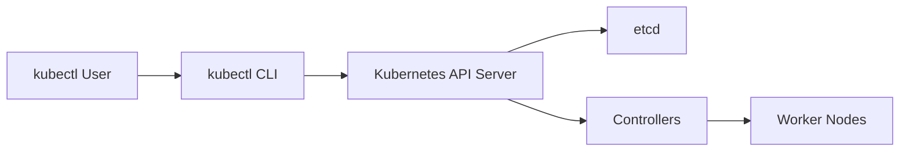

Request Flow

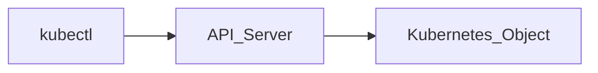

---

## Key Components

| Component | Purpose |
|-----------|---------|
| kubectl | Kubernetes CLI |
| kubeconfig | Cluster configuration |
| API Server | Receives kubectl requests |
| etcd | Stores cluster state |
| Controllers | Apply desired state |

---

## Types (if applicable)

Common Command Categories

- Resource Management
- Deployment Management
- Debugging
- Monitoring
- Scaling
- Configuration
- Rollout Management

---

## Lifecycle / Workflow

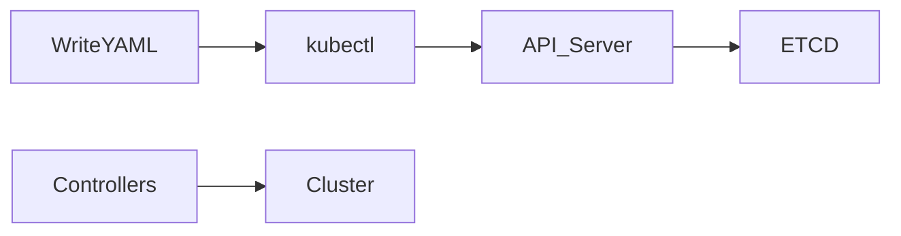

---

## Configuration / Syntax (if applicable)

General Syntax

```bash
kubectl <command> <resource> <name> [options]
```

Examples

```bash
kubectl get pods

kubectl describe pod nginx

kubectl apply -f deployment.yaml
```

---

## Important Commands (if applicable)

View Cluster

```bash
kubectl cluster-info
```

View Nodes

```bash
kubectl get nodes
```

View Namespaces

```bash
kubectl get namespaces
```

View Current Context

```bash
kubectl config current-context
```

View Config

```bash
kubectl config view
```

---

## Important Files (if applicable)

| File | Purpose |
|------|---------|
| ~/.kube/config | kubeconfig file |
| deployment.yaml | Deployment definition |
| service.yaml | Service definition |
| namespace.yaml | Namespace configuration |

---

## Real-World Use Cases

- Deploy applications
- Troubleshoot Pods
- Scale applications
- Perform rolling updates
- Monitor cluster resources
- Manage namespaces
- Debug production workloads

---

## Advantages

- Official Kubernetes CLI
- Easy automation
- Works with all Kubernetes resources
- Supports declarative deployments
- Powerful debugging capabilities

---

## Limitations

- Large number of commands to learn
- Requires kubeconfig access
- RBAC permissions may restrict operations

---

## Common Interview Questions (Concept Only)

- What is kubectl?
- How does kubectl communicate with Kubernetes?
- What is kubeconfig?
- Which component receives kubectl requests?
- Difference between create and apply?
- Difference between get and describe?

---

## Common Mistakes

- Running commands in the wrong namespace
- Forgetting `-f` with YAML files
- Deleting production resources accidentally
- Editing live resources without backups
- Using `create` instead of `apply` for updates

---

## Troubleshooting

| Problem | Cause | Solution |
|----------|--------|----------|
| Connection refused | API Server unavailable | Verify cluster status |
| Unauthorized | RBAC restriction | Check permissions |
| Resource not found | Wrong namespace | Specify namespace |
| YAML errors | Invalid manifest | Validate YAML |
| Context issue | Wrong kubeconfig | Check current context |

Useful Commands

```bash
kubectl cluster-info

kubectl config current-context

kubectl config view

kubectl get nodes

kubectl get events
```

---

## Summary

`kubectl` is the primary command-line tool for managing Kubernetes clusters. It communicates with the API Server to create, update, monitor, and troubleshoot Kubernetes resources.

---

# kubectl get

## Overview

`kubectl get` displays Kubernetes resources.

It is the most frequently used command for checking the current state of a cluster.

> **Interview Tip**
>
> `kubectl get` provides a summary view, while `kubectl describe` provides detailed information.

---

## Why It Is Used

- View resources
- Check application status
- Monitor cluster objects
- Verify deployments

---

## Architecture / Working

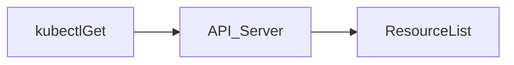

---

## Key Components

| Resource | Example |
|-----------|----------|
| Pods | Running applications |
| Services | Networking |
| Deployments | Workloads |
| Nodes | Cluster machines |

---

## Types (if applicable)

Common Resources

- pods
- deployments
- services
- nodes
- namespaces
- pvc
- pv
- ingress

---

## Lifecycle / Workflow

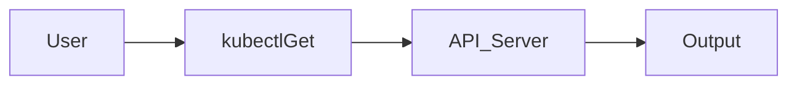

---

## Configuration / Syntax (if applicable)

```bash
kubectl get pods

kubectl get deployments

kubectl get svc

kubectl get nodes

kubectl get all
```

---

## Important Commands (if applicable)

Wide Output

```bash
kubectl get pods -o wide
```

YAML Output

```bash
kubectl get pod nginx -o yaml
```

JSON Output

```bash
kubectl get pod nginx -o json
```

---

## Important Files (if applicable)

Not applicable

---

## Real-World Use Cases

- Check Pod status
- Verify deployment
- View services

---

## Advantages

- Fast
- Simple
- Essential monitoring command

---

## Limitations

- Limited details

---

## Common Interview Questions (Concept Only)

- What does kubectl get do?
- Difference between get and describe?

---

## Common Mistakes

- Forgetting namespace

---

## Troubleshooting

```bash
kubectl get all

kubectl get pods -A
```

---

## Summary

`kubectl get` retrieves Kubernetes resources and provides a concise overview of their current state.

---

# kubectl describe

## Overview

`kubectl describe` provides detailed information about a Kubernetes resource.

It displays:

- Events
- Configuration
- Status
- Conditions
- Resource details

---

## Why It Is Used

- Troubleshooting
- Viewing events
- Debugging failures

---

## Architecture / Working

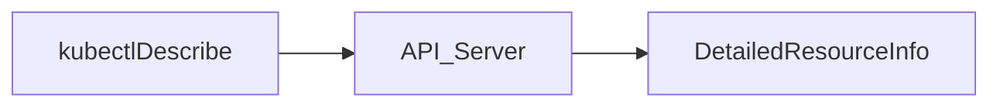

---

## Key Components

- Events
- Conditions
- Metadata
- Resource configuration

---

## Types (if applicable)

Supported Resources

- Pods
- Nodes
- Deployments
- Services
- PVCs

---

## Lifecycle / Workflow

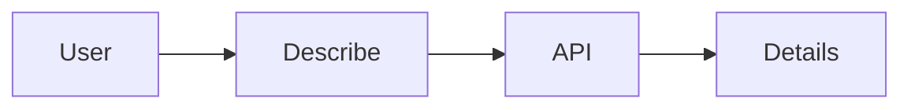

---

## Configuration / Syntax (if applicable)

```bash
kubectl describe pod nginx
```

---

## Important Commands (if applicable)

```bash
kubectl describe node node1

kubectl describe deployment nginx
```

---

## Important Files (if applicable)

Not applicable

---

## Real-World Use Cases

- Debug Pod failures
- View events
- Diagnose scheduling issues

---

## Advantages

- Detailed information
- Includes recent events

---

## Limitations

- Verbose output

---

## Common Interview Questions (Concept Only)

- Why use describe instead of get?

---

## Common Mistakes

- Using get when detailed events are required

---

## Troubleshooting

```bash
kubectl describe pod <pod-name>
```

---

## Summary

`kubectl describe` provides detailed resource information and is one of the most important troubleshooting commands.

---

# kubectl apply

## Overview

`kubectl apply` creates or updates Kubernetes resources using YAML manifests.

It compares the desired state defined in the manifest with the current cluster state and applies only the necessary changes.

> **Interview Tip**
>
> `kubectl apply` is the preferred command for declarative deployments and CI/CD pipelines.

---

## Why It Is Used

- Declarative deployments
- Resource updates
- Infrastructure as Code

---

## Architecture / Working

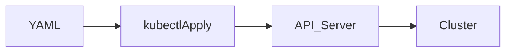

---

## Key Components

- YAML manifest
- Desired state
- API Server

---

## Types (if applicable)

- Create
- Update

---

## Lifecycle / Workflow

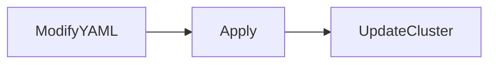

---

## Configuration / Syntax (if applicable)

```bash
kubectl apply -f deployment.yaml
```

Apply Directory

```bash
kubectl apply -f manifests/
```

---

## Important Commands (if applicable)

Dry Run

```bash
kubectl apply --dry-run=client -f deployment.yaml
```

---

## Important Files (if applicable)

deployment.yaml

---

## Real-World Use Cases

- CI/CD
- Production deployments

---

## Advantages

- Idempotent
- Declarative
- Safe updates

---

## Limitations

- Requires YAML files

---

## Common Interview Questions (Concept Only)

- Difference between apply and create?
- Why is apply preferred in CI/CD?

---

## Common Mistakes

- Editing live resources instead of manifests

---

## Troubleshooting

```bash
kubectl apply --dry-run=client -f deployment.yaml
```

---

## Summary

`kubectl apply` creates or updates Kubernetes resources declaratively using YAML manifests.

---

# kubectl create

## Overview

`kubectl create` creates new Kubernetes resources.

Unlike `apply`, it expects the resource not to already exist.

---

## Why It Is Used

- Initial resource creation
- Quick object creation

---

## Architecture / Working

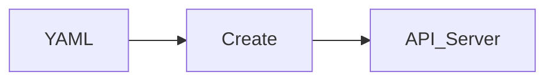

---

## Key Components

- Resource
- Manifest

---

## Types (if applicable)

- create -f
- create deployment
- create namespace

---

## Lifecycle / Workflow


---

## Configuration / Syntax (if applicable)

```bash
kubectl create -f deployment.yaml

kubectl create namespace dev
```

---

## Important Commands (if applicable)

```bash
kubectl create deployment nginx --image=nginx
```

---

## Important Files (if applicable)

deployment.yaml

---

## Real-World Use Cases

- Initial deployment

---

## Advantages

- Simple

---

## Limitations

- Fails if resource already exists

---

## Common Interview Questions (Concept Only)

- Difference between create and apply?

---

## Common Mistakes

- Using create for existing resources

---

## Troubleshooting

```bash
kubectl get deployment
```

---

## Summary

`kubectl create` creates new Kubernetes resources and is typically used for initial deployments.

---

# kubectl delete

## Overview

`kubectl delete` removes Kubernetes resources from the cluster.

---

## Why It Is Used

- Remove applications
- Clean up resources

---

## Architecture / Working

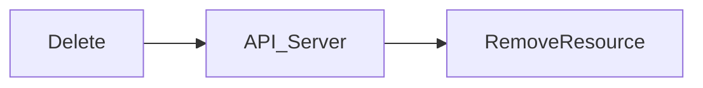

---

## Key Components

- Resource
- API Server

---

## Types (if applicable)

- Pod
- Deployment
- Service
- Namespace

---

## Lifecycle / Workflow


---

## Configuration / Syntax (if applicable)

```bash
kubectl delete pod nginx

kubectl delete -f deployment.yaml
```

---

## Important Commands (if applicable)

```bash
kubectl delete deployment nginx
```

---

## Important Files (if applicable)

deployment.yaml

---

## Real-World Use Cases

- Remove applications
- Cleanup

---

## Advantages

- Simple cleanup

---

## Limitations

- Permanent removal

---

## Common Interview Questions (Concept Only)

- What happens after deleting a Deployment?

---

## Common Mistakes

- Deleting wrong namespace resources

---

## Troubleshooting

```bash
kubectl get all
```

---

## Summary

`kubectl delete` removes Kubernetes resources from the cluster.

---

# kubectl edit

## Overview

`kubectl edit` opens a live Kubernetes resource in your default text editor, allowing direct modifications.

Changes are sent to the API Server immediately after saving.

> **Interview Tip**
>
> `kubectl edit` is useful for troubleshooting and quick fixes, but production changes should generally be made in YAML files and applied with `kubectl apply`.

---

## Why It Is Used

- Quick modifications
- Temporary fixes
- Debugging

---

## Architecture / Working

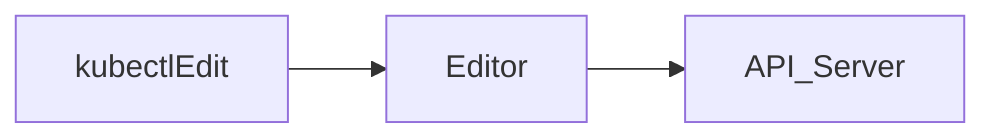

---

## Key Components

- Editor
- API Server

---

## Types (if applicable)

- Pods
- Deployments
- Services

---

## Lifecycle / Workflow

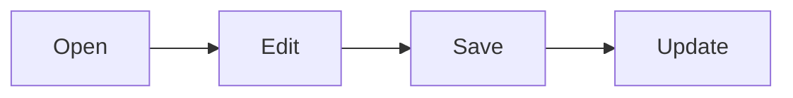

---

## Configuration / Syntax (if applicable)

```bash
kubectl edit deployment nginx
```

---

## Important Commands (if applicable)

```bash
kubectl edit service nginx
```

---

## Important Files (if applicable)

Not applicable

---

## Real-World Use Cases

- Emergency fixes
- Testing

---

## Advantages

- Fast
- Interactive

---

## Limitations

- Not version controlled
- Changes can drift from source manifests

---

## Common Interview Questions (Concept Only)

- When should you use kubectl edit?

---

## Common Mistakes

- Editing production resources directly without updating source YAML

---

## Troubleshooting

```bash
kubectl describe deployment nginx
```

---

## Summary

`kubectl edit` allows direct editing of live Kubernetes resources and is best suited for quick troubleshooting or temporary changes.

---

# kubectl logs

## Overview

`kubectl logs` displays the stdout and stderr output generated by containers running in Pods.

It is one of the most frequently used commands for debugging Kubernetes applications.

---

## Why It Is Used

- Debug application failures
- View runtime logs
- Investigate crashes

---

## Architecture / Working

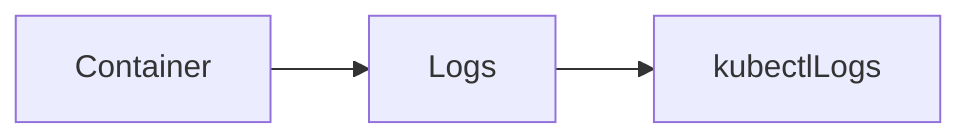

---

## Key Components

- Pod
- Container
- Log stream

---

## Types (if applicable)

- Current logs
- Previous logs
- Streaming logs

---

## Lifecycle / Workflow

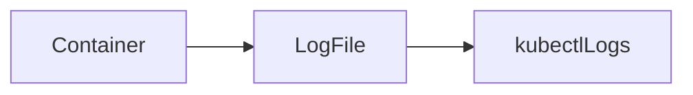

---

## Configuration / Syntax (if applicable)

```bash
kubectl logs <pod-name>

kubectl logs -f <pod-name>

kubectl logs --previous <pod-name>
```

---

## Important Commands (if applicable)

Logs from a specific container

```bash
kubectl logs <pod-name> -c <container-name>
```

---

## Important Files (if applicable)

Not applicable

---

## Real-World Use Cases

- Debug crashes
- Monitor applications
- Investigate errors

---

## Advantages

- Fast debugging
- Easy monitoring

---

## Limitations

- Only container stdout/stderr
- Previous logs available only for restarted containers

---

## Common Interview Questions (Concept Only)

- How do you view container logs?
- What does `--previous` do?

---

## Common Mistakes

- Forgetting the container name in multi-container Pods

---

## Troubleshooting

```bash
kubectl logs --previous <pod-name>

kubectl describe pod <pod-name>
```

---

## Summary

`kubectl logs` retrieves container logs and is essential for application troubleshooting.

---

# kubectl exec

## Overview

`kubectl exec` executes commands inside a running container.

It is commonly used for troubleshooting, inspecting files, or running administrative commands.

---

## Why It Is Used

- Debug applications
- Check files
- Test connectivity

---

## Architecture / Working

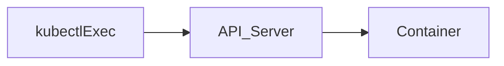

---

## Key Components

- Container
- Shell
- Command

---

## Types (if applicable)

- Single command
- Interactive shell

---

## Lifecycle / Workflow

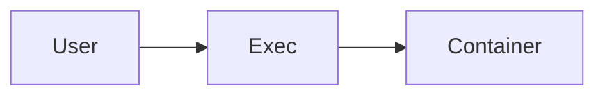

---

## Configuration / Syntax (if applicable)

Interactive shell

```bash
kubectl exec -it <pod-name> -- /bin/bash
```

Run a command

```bash
kubectl exec <pod-name> -- ls /app
```

---

## Important Commands (if applicable)

```bash
kubectl exec -it <pod-name> -- /bin/sh
```

---

## Important Files (if applicable)

Not applicable

---

## Real-World Use Cases

- Debug applications
- Inspect filesystem
- Check configuration

---

## Advantages

- Direct container access
- Powerful troubleshooting

---

## Limitations

- Requires a running container
- RBAC permissions may restrict access

---

## Common Interview Questions (Concept Only)

- Difference between exec and logs?
- Why use kubectl exec?

---

## Common Mistakes

- Using `/bin/bash` when only `/bin/sh` exists

---

## Troubleshooting

```bash
kubectl exec -it <pod-name> -- /bin/sh
```

---

## Summary

`kubectl exec` runs commands inside containers and is a key troubleshooting tool.

---

# kubectl scale

## Overview

`kubectl scale` changes the number of Pod replicas managed by a Deployment, ReplicaSet, StatefulSet, or ReplicationController.

---

## Why It Is Used

- Increase capacity
- Handle traffic spikes
- Reduce resource usage

---

## Architecture / Working

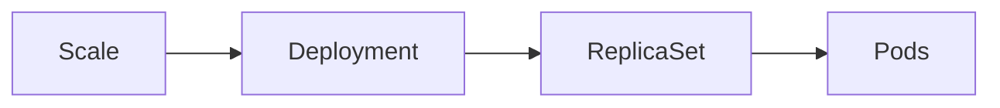

---

## Key Components

- Deployment
- ReplicaSet
- Pods

---

## Types (if applicable)

- Scale up
- Scale down

---

## Lifecycle / Workflow

```mermaid
flowchart LR
    Scale --> ReplicaSet --> NewPods
```

---

## Configuration / Syntax (if applicable)

```bash
kubectl scale deployment nginx --replicas=5
```

---

## Important Commands (if applicable)

```bash
kubectl get deployment
```

---

## Important Files (if applicable)

deployment.yaml

---

## Real-World Use Cases

- High traffic
- Maintenance
- Performance tuning

---

## Advantages

- Quick scaling
- No redeployment required

---

## Limitations

- Manual unless HPA is configured

---

## Common Interview Questions (Concept Only)

- How do you scale a Deployment?
- What resource is updated?

---

## Common Mistakes

- Scaling without sufficient node resources

---

## Troubleshooting

```bash
kubectl describe deployment
```

---

## Summary

`kubectl scale` adjusts the number of application replicas managed by Kubernetes.

---

# kubectl rollout

## Overview

`kubectl rollout` manages Deployment rollouts, monitors progress, and performs rollbacks.

It is essential for production deployments.

---

## Why It Is Used

- Monitor deployments
- Rollback releases
- View deployment history

---

## Architecture / Working

```mermaid
flowchart LR
    Rollout --> Deployment --> ReplicaSets
```

---

## Key Components

| Component | Purpose |
|-----------|---------|
| Deployment | Controls rollout |
| ReplicaSet | Stores revisions |
| Rollout | Deployment management |

---

## Types (if applicable)

- Status
- History
- Undo
- Pause
- Resume

---

## Lifecycle / Workflow

```mermaid
flowchart LR
    Deploy --> Rollout --> Complete
    Rollout --> Rollback
```

---

## Configuration / Syntax (if applicable)

Check rollout status

```bash
kubectl rollout status deployment/nginx
```

View rollout history

```bash
kubectl rollout history deployment/nginx
```

Rollback deployment

```bash
kubectl rollout undo deployment/nginx
```

Pause rollout

```bash
kubectl rollout pause deployment/nginx
```

Resume rollout

```bash
kubectl rollout resume deployment/nginx
```

---

## Important Commands (if applicable)

Rollback to a specific revision

```bash
kubectl rollout undo deployment/nginx --to-revision=2
```

---

## Important Files (if applicable)

deployment.yaml

---

## Real-World Use Cases

- Production deployments
- Rollbacks
- CI/CD pipelines

---

## Advantages

- Safe deployments
- Easy rollback
- Deployment history

---

## Limitations

- Primarily used with workload resources that support rollouts (such as Deployments)

---

## Common Interview Questions (Concept Only)

- What does kubectl rollout do?
- How do you rollback a Deployment?
- How do you check rollout status?
- How do you view deployment history?

---

## Common Mistakes

- Not monitoring rollout status
- Rolling back without reviewing revision history

---

## Troubleshooting

```bash
kubectl rollout status deployment/nginx

kubectl rollout history deployment/nginx

kubectl describe deployment nginx
```

---

## Summary

`kubectl rollout` manages application deployments, monitors rollout progress, maintains deployment history, and enables safe rollbacks, making it an essential command for production Kubernetes environments.
