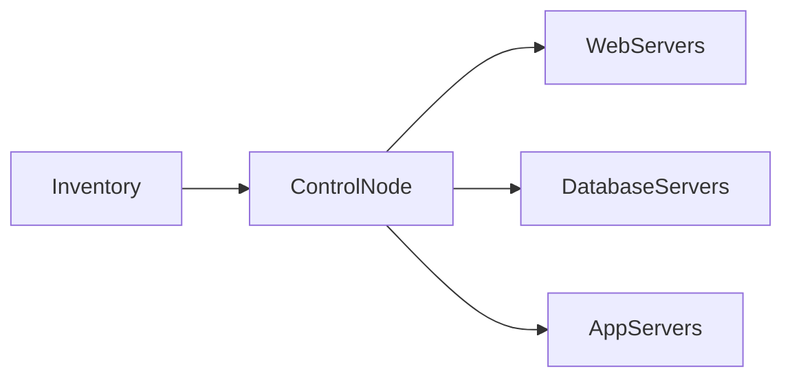
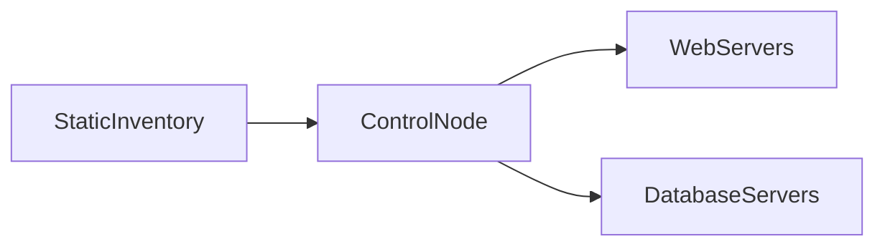

# Installation & Configuration

## Overview

Installing and configuring Ansible is the first step toward automating infrastructure management. Ansible is installed only on the **Control Node**, while the target systems (**Managed Nodes**) do not require Ansible to be installed.

The basic setup involves:

1. Install Ansible on the Control Node.
2. Configure Ansible using the `ansible.cfg` file (optional but recommended).
3. Create an Inventory file containing the target hosts.
4. Verify connectivity using Ansible commands.

> **Interview Tip**
>
> Only the **Control Node** requires Ansible installation.
>
> Managed Nodes only require:
>
> - SSH (Linux)
> - WinRM (Windows)
> - Python (for most Linux modules)

---

# Install Ansible

## Overview

Ansible can be installed on most Linux distributions using the operating system's package manager or Python's package manager (`pip`).

After installation, the Control Node is ready to execute playbooks and manage remote systems.

---

## Why It Is Used

Installing Ansible enables you to:

- Execute Playbooks
- Manage remote servers
- Automate deployments
- Perform configuration management
- Provision infrastructure

---

## Architecture / Working


---

## Key Components

| Component | Purpose |
|-----------|---------|
| Ansible Package | Automation engine |
| Python | Required runtime |
| SSH | Linux communication |
| WinRM | Windows communication |

---

## Types (if applicable)

Installation Methods

- Operating System Package Manager
- Python pip
- Container Image (Docker)

---

## Lifecycle / Workflow


---

## Configuration / Syntax (if applicable)

### Ubuntu/Debian

```bash
sudo apt update

sudo apt install ansible -y
```

### RHEL/CentOS/Rocky Linux

```bash
sudo dnf install ansible -y
```

### Install using pip

```bash
pip install ansible
```

---

## Important Commands (if applicable)

Check Version

```bash
ansible --version
```

Locate Installation

```bash
which ansible
```

View Installed Package

```bash
ansible --version
```

---

## Important Files (if applicable)

| File | Purpose |
|------|---------|
| /usr/bin/ansible | Ansible executable |
| /usr/bin/ansible-playbook | Playbook execution command |

---

## Real-World Use Cases

- Automation server setup
- Jenkins integration
- CI/CD pipelines
- Infrastructure automation

---

## Advantages

- Easy installation
- Cross-platform support
- Lightweight
- Agentless architecture

---

## Limitations

- Linux Control Node is recommended for full functionality
- Python is required on most Linux managed hosts

---

## Common Interview Questions (Concept Only)

- Where is Ansible installed?
- Does every server require Ansible installation?
- Which package manager installs Ansible?
- How do you verify Ansible installation?

---

## Common Mistakes

- Installing Ansible on every managed server
- Forgetting to verify installation
- Using an outdated Ansible version

---

## Troubleshooting

| Problem | Cause | Solution |
|----------|--------|----------|
| ansible: command not found | Installation failed | Verify package installation |
| Wrong version | Multiple installations | Check PATH and installed packages |
| Python error | Missing Python dependency | Install Python |

Useful Commands

```bash
ansible --version

which ansible

python3 --version
```

---

## Summary

Ansible is installed only on the Control Node. Once installed and verified, it can communicate with managed systems using SSH or WinRM to automate infrastructure management.

---

# ansible.cfg

## Overview

`ansible.cfg` is the main configuration file used to customize Ansible's behavior.

It allows administrators to configure:

- Default inventory location
- SSH settings
- Remote user
- Logging
- Privilege escalation
- Host key checking
- Timeout values

If no configuration file is specified, Ansible uses its default settings.

> **Interview Tip**
>
> Configuration file search order:
>
> 1. `ANSIBLE_CONFIG` environment variable
> 2. `ansible.cfg` in the current directory
> 3. `~/.ansible.cfg`
> 4. `/etc/ansible/ansible.cfg`

---

## Why It Is Used

`ansible.cfg` helps:

- Standardize automation
- Reduce repetitive command options
- Simplify administration
- Configure global defaults

---

## Architecture / Working


---

## Key Components

| Parameter | Purpose |
|-----------|---------|
| inventory | Default inventory file |
| remote_user | Default SSH user |
| host_key_checking | SSH key verification |
| timeout | SSH timeout |
| forks | Parallel execution count |
| log_path | Log file location |

---

## Types (if applicable)

Configuration Locations

- Project-specific
- User-specific
- System-wide

---

## Lifecycle / Workflow


---

## Configuration / Syntax (if applicable)

Example

```ini
[defaults]
inventory = ./inventory
remote_user = ubuntu
host_key_checking = False
forks = 10
timeout = 30
```

---

## Important Commands (if applicable)

Display Current Configuration

```bash
ansible-config dump
```

List Configuration Options

```bash
ansible-config list
```

View Configuration File

```bash
ansible-config view
```

---

## Important Files (if applicable)

| File | Purpose |
|------|---------|
| /etc/ansible/ansible.cfg | Global configuration |
| ~/.ansible.cfg | User configuration |
| ./ansible.cfg | Project configuration |

---

## Real-World Use Cases

- Standardize automation settings
- Configure SSH defaults
- Increase parallel execution
- Disable host key checking in lab environments

---

## Advantages

- Centralized configuration
- Simplifies automation
- Reduces command-line options
- Supports project-specific settings

---

## Limitations

- Incorrect settings affect all playbook executions
- Disabling security features (e.g., host key checking) is not recommended in production

---

## Common Interview Questions (Concept Only)

- What is `ansible.cfg`?
- What is the search order for `ansible.cfg`?
- Where is the global configuration file located?
- Which configuration file takes precedence?

---

## Common Mistakes

- Editing the wrong configuration file
- Disabling host key checking in production
- Hardcoding configuration values unnecessarily

---

## Troubleshooting

| Problem | Cause | Solution |
|----------|--------|----------|
| Configuration ignored | Wrong file location | Verify search order |
| Inventory not found | Incorrect path | Check inventory parameter |
| SSH failure | Incorrect remote user | Verify remote_user |

Useful Commands

```bash
ansible-config dump

ansible-config view
```

---

## Summary

`ansible.cfg` defines Ansible's global or project-specific behavior. It controls inventory, SSH settings, privilege escalation, logging, and execution parameters, making automation consistent and easier to manage.

---

# Inventory File

## Overview

An Inventory file tells Ansible **which hosts to manage**.

It contains:

- Hostnames
- IP addresses
- Host groups
- Connection variables
- Authentication details

Without an Inventory, Ansible has no information about the systems it should manage.

---

## Why It Is Used

Inventory provides:

- Centralized host management
- Host grouping
- Environment separation
- Simplified automation

---

## Architecture / Working



---

## Key Components

| Component | Purpose |
|-----------|---------|
| Host | Managed system |
| Group | Collection of hosts |
| Variables | Host-specific settings |
| Inventory File | Defines infrastructure |

---

## Types (if applicable)

Inventory Types

- Static Inventory
- Dynamic Inventory

---

## Lifecycle / Workflow


---

## Configuration / Syntax (if applicable)

Example

```ini
[web]
web1 ansible_host=192.168.1.10
web2 ansible_host=192.168.1.11

[database]
db1 ansible_host=192.168.1.20
```

---

## Important Commands (if applicable)

Display Inventory

```bash
ansible-inventory --list
```

Display Inventory Graph

```bash
ansible-inventory --graph
```

Ping All Hosts

```bash
ansible all -m ping
```

---

## Important Files (if applicable)

| File | Purpose |
|------|---------|
| inventory | Host definitions |

---

## Real-World Use Cases

- Production server management
- Environment grouping
- Cloud infrastructure automation

---

## Advantages

- Centralized host management
- Easy grouping
- Supports variables
- Simple syntax

---

## Limitations

- Static inventory requires manual updates
- Incorrect inventory entries prevent successful automation

---

## Common Interview Questions (Concept Only)

- What is an Inventory file?
- Why is Inventory required?
- Difference between static and dynamic inventory?

---

## Common Mistakes

- Incorrect IP addresses
- Wrong host grouping
- Duplicate host entries

---

## Troubleshooting

| Problem | Cause | Solution |
|----------|--------|----------|
| Host unreachable | Incorrect IP | Verify inventory |
| Authentication failed | Wrong credentials | Verify SSH configuration |

Useful Commands

```bash
ansible-inventory --list

ansible all -m ping
```

---

## Summary

The Inventory file defines the infrastructure managed by Ansible. It organizes hosts into logical groups and enables the Control Node to execute automation tasks on the correct systems.

---

# Static Inventory

## Overview

A Static Inventory is a manually maintained Inventory file containing a fixed list of hosts and groups.

It is suitable for:

- Small environments
- Development labs
- On-premises servers
- Stable infrastructures

> **Interview Tip**
>
> Static Inventory is manually updated whenever infrastructure changes. In cloud environments with frequently changing resources, Dynamic Inventory is generally preferred.

---

## Why It Is Used

Static Inventory provides:

- Simplicity
- Easy management
- Predictable infrastructure
- Logical grouping of servers

---

## Architecture / Working



---

## Key Components

| Component | Purpose |
|-----------|---------|
| Inventory File | Stores host definitions |
| Groups | Organize hosts |
| Variables | Host configuration |

---

## Types (if applicable)

Common Groups

- Web Servers
- Database Servers
- Application Servers
- Development
- Production

---

## Lifecycle / Workflow


---

## Configuration / Syntax (if applicable)

Example

```ini
[web]
web1 ansible_host=192.168.1.10
web2 ansible_host=192.168.1.11

[db]
db1 ansible_host=192.168.1.20

[all:vars]
ansible_user=ubuntu
```

---

## Important Commands (if applicable)

Ping Web Group

```bash
ansible web -m ping
```

View Inventory

```bash
ansible-inventory --graph
```

---

## Important Files (if applicable)

| File | Purpose |
|------|---------|
| inventory | Static host definitions |

---

## Real-World Use Cases

- Small production environments
- Test environments
- On-premises infrastructure
- Learning Ansible

---

## Advantages

- Easy to create
- Easy to understand
- No additional plugins required
- Ideal for stable environments

---

## Limitations

- Manual updates required
- Does not automatically discover new hosts
- Not suitable for rapidly changing cloud environments

---

## Common Interview Questions (Concept Only)

- What is Static Inventory?
- When should Static Inventory be used?
- Difference between Static and Dynamic Inventory?
- How are hosts grouped in Static Inventory?

---

## Common Mistakes

- Forgetting to update the inventory after adding or removing servers
- Mixing production and development hosts in the same group
- Incorrect group names or host variables

---

## Troubleshooting

| Problem | Cause | Solution |
|----------|--------|----------|
| Host not found | Missing inventory entry | Add the host to the inventory |
| SSH failure | Incorrect user or key | Verify authentication settings |
| Playbook skips host | Wrong group name | Check group definitions |

Useful Commands

```bash
ansible-inventory --graph

ansible web -m ping

ansible all -m ping
```

---

## Summary

A Static Inventory is a manually maintained list of managed hosts and groups. It is simple, reliable, and ideal for small or stable environments, but requires manual updates whenever the infrastructure changes.
