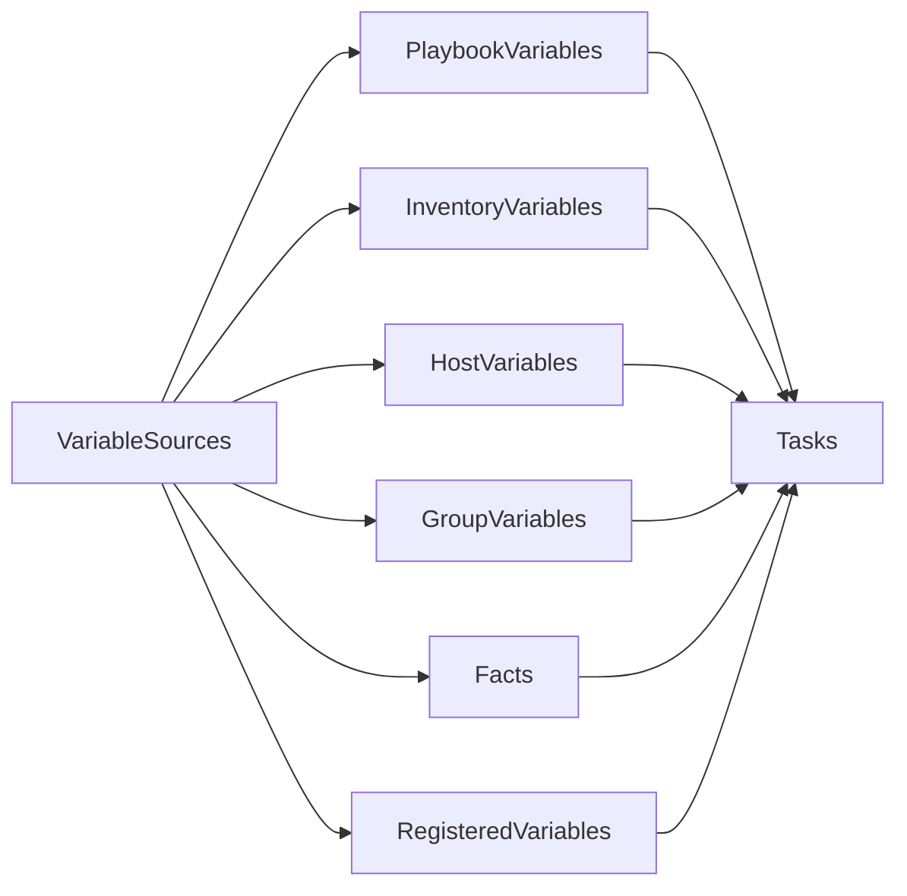
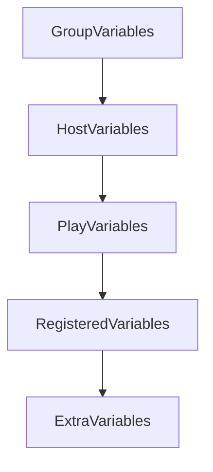

# Variables

## Overview

Variables in Ansible are named values used to store data that can be referenced throughout playbooks, roles, templates, and inventories.

Variables make playbooks:

- Reusable
- Flexible
- Environment-independent
- Easier to maintain

Instead of hardcoding values such as package names, usernames, ports, or IP addresses, variables allow the same playbook to work across Development, Testing, and Production environments.

> **Interview Tip**
>
> Variables are one of the most frequently asked Ansible interview topics. Be familiar with **variable types**, **variable precedence**, **registered variables**, and **facts**.

---

# Variable Types

## Overview

Ansible supports variables from multiple sources. Each source serves a different purpose and has a different precedence.

Variables can be defined:

- Inside Playbooks
- Inventory
- Host Variables
- Group Variables
- Variable Files
- Facts
- Registered Variables
- Extra Variables

---

## Why It Is Used

Variable Types help:

- Separate configuration from automation logic
- Reduce duplication
- Support multiple environments
- Improve reusability

---

## Architecture / Working



---

## Key Components

| Variable Type | Description |
|---------------|-------------|
| Play Variables | Defined inside a playbook |
| Host Variables | Specific to one host |
| Group Variables | Shared by a host group |
| Facts | Automatically gathered system information |
| Registered Variables | Store task output |
| Extra Variables | Passed from CLI |

---

## Types (if applicable)

### 1. Play Variables

Defined directly inside a play.

```yaml
vars:
  package_name: nginx
```

---

### 2. Host Variables

Defined for a specific host.

Example

```ini
web1 ansible_host=192.168.1.10 ansible_user=ubuntu
```

---

### 3. Group Variables

Shared across an entire host group.

```ini
[web:vars]
http_port=80
```

---

### 4. Variable Files

Store reusable variables separately.

```yaml
vars_files:
  - vars/common.yml
```

---

### 5. Extra Variables

Provided while running a playbook.

```bash
ansible-playbook site.yml --extra-vars "env=production"
```

---

### 6. Facts

Collected automatically from managed hosts.

Example

```yaml
ansible_hostname
ansible_distribution
ansible_default_ipv4.address
```

---

### 7. Registered Variables

Store output from previous tasks.

```yaml
register: command_output
```

---

## Lifecycle / Workflow


---

## Configuration / Syntax (if applicable)

```yaml
vars:
  package_name: nginx

tasks:

- name: Install Package
  package:
    name: "{{ package_name }}"
    state: present
```

---

## Important Commands (if applicable)

Pass Variable

```bash
ansible-playbook playbook.yml --extra-vars "package=git"
```

View Facts

```bash
ansible all -m setup
```

---

## Important Files (if applicable)

| File | Purpose |
|------|---------|
| playbook.yml | Play variables |
| inventory | Inventory variables |
| host_vars/ | Host variables |
| group_vars/ | Group variables |

---

## Real-World Use Cases

- Different package versions
- Environment-specific configurations
- Application deployment
- Database credentials

---

## Advantages

- Reusable automation
- Environment flexibility
- Easy maintenance
- Reduced duplication

---

## Limitations

- Variable precedence may become confusing
- Poor naming conventions reduce readability

---

## Common Interview Questions (Concept Only)

- What are the different variable types?
- Where can variables be defined?
- What are Extra Variables?
- What are Facts?

---

## Common Mistakes

- Hardcoding values
- Duplicate variable names
- Ignoring variable precedence

---

## Troubleshooting

| Problem | Cause | Solution |
|----------|--------|----------|
| Undefined variable | Variable not defined | Verify declaration |
| Wrong value used | Higher precedence variable | Check precedence |

Useful Commands

```bash
ansible all -m setup

ansible-playbook playbook.yml --extra-vars "env=dev"
```

---

## Summary

Ansible supports multiple variable types to provide flexibility and reusability. Choosing the correct variable source makes playbooks cleaner, easier to maintain, and adaptable across different environments.

---

# Variable Precedence

## Overview

Variable Precedence determines **which variable value Ansible uses when the same variable is defined in multiple places**.

If multiple sources define a variable with the same name, Ansible selects the value from the **highest-precedence source**.

> **Interview Tip**
>
> Variable precedence is one of the most commonly asked Ansible interview topics.

---

## Why It Is Used

Variable precedence ensures:

- Predictable automation
- Conflict resolution
- Flexible configuration overrides

---

## Architecture / Working



---

## Key Components

| Variable Source | Priority |
|-----------------|----------|
| Group Variables | Low |
| Host Variables | Higher |
| Play Variables | Higher |
| Registered Variables | Higher |
| Extra Variables | Highest |

---

## Types (if applicable)

Common Precedence Order (Lowest → Highest)

1. Group Variables
2. Host Variables
3. Play Variables
4. Registered Variables
5. Extra Variables

> **Note:** This is a simplified order covering the most common interview and production scenarios. Ansible has additional precedence levels, but these are the ones most frequently encountered.

---

## Lifecycle / Workflow


---

## Configuration / Syntax (if applicable)

Play Variable

```yaml
vars:
  package_name: nginx
```

Extra Variable

```bash
ansible-playbook playbook.yml --extra-vars "package_name=httpd"
```

The Extra Variable overrides the Play Variable.

---

## Important Commands (if applicable)

```bash
ansible-playbook playbook.yml --extra-vars "env=production"
```

---

## Important Files (if applicable)

| File | Purpose |
|------|---------|
| inventory | Inventory variables |
| group_vars/ | Group variables |
| host_vars/ | Host variables |

---

## Real-World Use Cases

- Environment overrides
- Temporary deployment configuration
- Emergency configuration changes

---

## Advantages

- Flexible configuration
- Environment customization
- Predictable overrides

---

## Limitations

- Difficult to troubleshoot if precedence is not understood
- Duplicate variable names can create confusion

---

## Common Interview Questions (Concept Only)

- What is Variable Precedence?
- Which variable has higher priority: Host Variable or Group Variable?
- Which variable source has the highest precedence?

---

## Common Mistakes

- Defining the same variable in multiple locations
- Forgetting Extra Variables override other sources

---

## Troubleshooting

```bash
ansible-playbook playbook.yml --extra-vars "env=test"
```

Check all variable definitions.

---

## Summary

Variable Precedence determines which value Ansible uses when duplicate variable names exist. Understanding precedence is essential for debugging and writing predictable playbooks.

---

# Registered Variables

## Overview

Registered Variables store the output of a task so it can be used later in the Playbook.

They are temporary variables that exist only during the current Playbook execution.

Typical information stored includes:

- Command output
- Exit code
- Standard output
- Standard error
- Changed status

---

## Why It Is Used

Registered Variables enable:

- Conditional execution
- Dynamic automation
- Decision-making
- Reuse of command output

---

## Architecture / Working


---

## Key Components

| Component | Purpose |
|-----------|---------|
| register | Stores task output |
| stdout | Standard output |
| stderr | Error output |
| rc | Return code |

---

## Types (if applicable)

Stored Data

- stdout
- stderr
- rc
- changed

---

## Lifecycle / Workflow


---

## Configuration / Syntax (if applicable)

```yaml
tasks:

- name: Get Hostname
  command: hostname
  register: hostname_output

- name: Display Hostname
  debug:
    var: hostname_output.stdout
```

---

## Important Commands (if applicable)

Run Playbook

```bash
ansible-playbook playbook.yml
```

---

## Important Files (if applicable)

Playbook

---

## Real-World Use Cases

- Check service status
- Verify installations
- Conditional deployments
- Health checks

---

## Advantages

- Dynamic automation
- Supports conditional logic
- Reuses command output

---

## Limitations

- Exists only during Playbook execution
- Cannot be reused in future Playbook runs

---

## Common Interview Questions (Concept Only)

- What is a Registered Variable?
- What does `register` do?
- What information is stored?

---

## Common Mistakes

- Using an undefined registered variable
- Forgetting `.stdout`
- Registering unnecessary tasks

---

## Troubleshooting

```yaml
- debug:
    var: hostname_output
```

---

## Summary

Registered Variables capture task output during Playbook execution, allowing later tasks to make decisions based on command results.

---

# Facts

## Overview

Facts are system information automatically collected from Managed Nodes before a Play begins.

They describe the current state of the host, including:

- Hostname
- Operating System
- Distribution
- Memory
- CPU
- IP Address
- Disk Information
- Network Interfaces

Facts eliminate the need to manually define system-specific variables.

> **Interview Tip**
>
> Facts are gathered by the **setup module** before a play starts unless `gather_facts: false` is specified.

---

## Why It Is Used

Facts provide:

- Automatic system discovery
- Dynamic Playbooks
- Conditional execution
- Environment awareness

---

## Architecture / Working


---

## Key Components

| Component | Purpose |
|-----------|---------|
| setup module | Collects system facts |
| Facts | System information |
| gather_facts | Enables/disables fact collection |

---

## Types (if applicable)

Common Facts

- ansible_hostname
- ansible_distribution
- ansible_os_family
- ansible_architecture
- ansible_processor_vcpus
- ansible_memtotal_mb
- ansible_default_ipv4.address

---

## Lifecycle / Workflow


---

## Configuration / Syntax (if applicable)

Use Facts

```yaml
tasks:

- debug:
    var: ansible_hostname
```

Disable Fact Gathering

```yaml
gather_facts: false
```

---

## Important Commands (if applicable)

Gather Facts

```bash
ansible all -m setup
```

View a Specific Fact

```bash
ansible all -m setup -a "filter=ansible_hostname"
```

---

## Important Files (if applicable)

Playbook

---

## Real-World Use Cases

- Install OS-specific packages
- Configure servers dynamically
- Generate inventory reports
- Conditional automation

---

## Advantages

- Automatic discovery
- Dynamic configuration
- Eliminates manual configuration
- Supports intelligent automation

---

## Limitations

- Fact gathering increases execution time
- May be unnecessary for simple Playbooks

---

## Common Interview Questions (Concept Only)

- What are Ansible Facts?
- Which module gathers Facts?
- How do you disable fact gathering?
- Give examples of commonly used Facts.

---

## Common Mistakes

- Using Facts when `gather_facts: false`
- Misspelling fact names
- Gathering Facts unnecessarily in every Play

---

## Troubleshooting

| Problem | Cause | Solution |
|----------|--------|----------|
| Fact not found | Fact gathering disabled | Enable `gather_facts` |
| Incorrect fact name | Typographical error | Verify with `setup` module |
| Slow Playbook startup | Large fact collection | Disable fact gathering if not needed |

Useful Commands

```bash
ansible all -m setup

ansible all -m setup -a "filter=ansible_hostname"

ansible all -m setup -a "filter=ansible_distribution"
```

---

## Summary

Facts are automatically collected system information that enables Ansible to make intelligent, environment-aware decisions. They are gathered using the `setup` module and are commonly used for conditional execution, dynamic configuration, and OS-specific automation.
