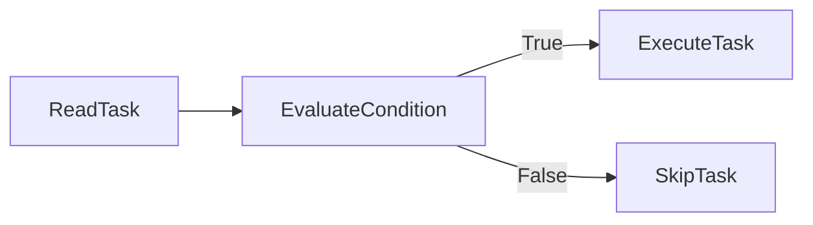
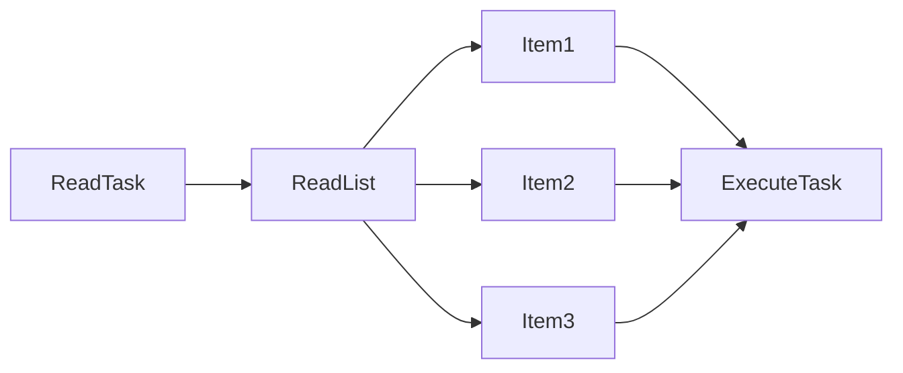
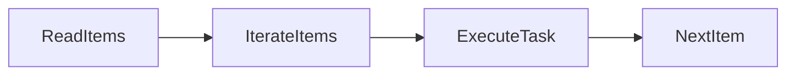
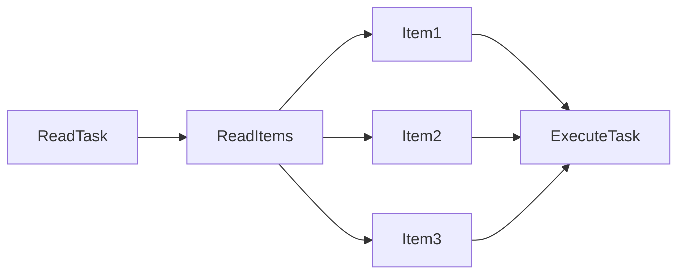

# Conditionals & Loops

## Overview

Conditionals and Loops are powerful Ansible features that allow Playbooks to make decisions and execute repetitive tasks efficiently.

- **Conditionals** determine whether a task should run.
- **Loops** execute the same task multiple times using different values.

Together, they make Playbooks dynamic, reusable, and easier to maintain.

> **Interview Tip**
>
> - Use **`when`** for conditional execution.
> - Use **`loop`** for repeating tasks.
> - **`with_items`** is the older looping syntax. Prefer **`loop`** in modern Ansible Playbooks.

---

# when

## Overview

The `when` statement is used to execute a task **only if a specified condition evaluates to true**.

It works similarly to an **if statement** in programming languages.

Conditions can be based on:

- Variables
- Facts
- Registered Variables
- Command Output
- Logical Expressions

---

## Why It Is Used

The `when` statement helps to:

- Skip unnecessary tasks
- Execute OS-specific tasks
- Perform environment-based automation
- Reduce duplicate Playbooks

---

## Architecture / Working



---

## Key Components

| Component | Purpose |
|-----------|---------|
| when | Conditional execution |
| Facts | OS and system information |
| Variables | Runtime values |
| Registered Variables | Previous task output |

---

## Types (if applicable)

Common Conditions

- Variable comparison
- Fact comparison
- Registered variable checks
- Boolean conditions
- Multiple conditions

---

## Lifecycle / Workflow


---

## Configuration / Syntax (if applicable)

Using a Variable

```yaml
- name: Install Nginx
  package:
    name: nginx
    state: present
  when: install_nginx
```

Using Facts

```yaml
- name: Install Apache on Ubuntu
  apt:
    name: apache2
    state: present
  when: ansible_os_family == "Debian"
```

Using Registered Variables

```yaml
- name: Display Output
  debug:
    msg: "Command Successful"
  when: command_result.rc == 0
```

Multiple Conditions

```yaml
when:
  - ansible_os_family == "Debian"
  - ansible_memtotal_mb > 1024
```

---

## Important Commands (if applicable)

Run Playbook

```bash
ansible-playbook site.yml
```

Dry Run

```bash
ansible-playbook site.yml --check
```

---

## Important Files (if applicable)

| File | Purpose |
|------|---------|
| playbook.yml | Contains conditional logic |
| group_vars/ | Variable definitions |
| host_vars/ | Host-specific variables |

---

## Real-World Use Cases

- Install different packages for Ubuntu and RHEL
- Configure services based on environment
- Restart services only if configuration changes
- Deploy applications only to production servers
- Execute tasks based on available memory or CPU

---

## Advantages

- Dynamic automation
- Reduces duplicate Playbooks
- Improves flexibility
- Supports environment-aware automation

---

## Limitations

- Complex conditions reduce readability
- Incorrect variable references may skip required tasks

---

## Common Interview Questions (Concept Only)

- What is the purpose of the `when` statement?
- Can `when` use Facts?
- Can `when` use Registered Variables?
- How do you specify multiple conditions?

---

## Common Mistakes

- Using undefined variables
- Incorrect comparison operators
- Typographical errors in fact names
- Forgetting quotation marks for string comparisons

---

## Troubleshooting

| Problem | Cause | Solution |
|----------|--------|----------|
| Task skipped unexpectedly | Condition evaluated to false | Verify variable values |
| Undefined variable | Variable missing | Define variable before use |
| Incorrect OS detection | Wrong fact name | Verify facts using the `setup` module |

Useful Commands

```bash
ansible all -m setup

ansible-playbook site.yml -v

ansible-playbook site.yml --check
```

---

## Summary

The `when` statement enables conditional execution of tasks based on variables, facts, and task results, making Playbooks flexible and environment-aware.

---

# loop

## Overview

The `loop` keyword repeats the same task for multiple values.

Instead of writing multiple similar tasks, a single task can iterate through a list of items.

`loop` is the recommended looping mechanism in modern Ansible.

> **Interview Tip**
>
> `loop` replaced most `with_*` loops and is the preferred syntax in current Ansible versions.

---

## Why It Is Used

Loops help to:

- Reduce repetitive code
- Improve Playbook readability
- Simplify bulk operations
- Increase maintainability

---

## Architecture / Working



---

## Key Components

| Component | Purpose |
|-----------|---------|
| loop | Repeats task |
| item | Current list item |
| List | Collection of values |

---

## Types (if applicable)

Common Loop Types

- List of strings
- List of numbers
- List of dictionaries

---

## Lifecycle / Workflow



---

## Configuration / Syntax (if applicable)

Loop Through Packages

```yaml
- name: Install Packages
  package:
    name: "{{ item }}"
    state: present
  loop:
    - git
    - nginx
    - docker
```

Loop Through Users

```yaml
- name: Create Users
  user:
    name: "{{ item }}"
    state: present
  loop:
    - alice
    - bob
    - john
```

Loop Through Dictionaries

```yaml
- name: Create Users
  user:
    name: "{{ item.name }}"
    uid: "{{ item.uid }}"
  loop:
    - { name: alice, uid: 1001 }
    - { name: bob, uid: 1002 }
```

---

## Important Commands (if applicable)

Run Playbook

```bash
ansible-playbook site.yml
```

---

## Important Files (if applicable)

Playbook

---

## Real-World Use Cases

- Install multiple packages
- Create multiple users
- Copy multiple files
- Configure multiple services
- Deploy multiple applications

---

## Advantages

- Eliminates duplicate tasks
- Improves readability
- Easier maintenance
- Supports complex data structures

---

## Limitations

- Large loops may increase execution time
- Nested loops can become difficult to read

---

## Common Interview Questions (Concept Only)

- What is the purpose of `loop`?
- What variable represents the current item?
- Can `loop` iterate through dictionaries?
- Why is `loop` preferred over `with_items`?

---

## Common Mistakes

- Forgetting `{{ item }}`
- Incorrect indentation
- Invalid list structure
- Referencing undefined values

---

## Troubleshooting

| Problem | Cause | Solution |
|----------|--------|----------|
| Undefined item | Missing `{{ item }}` | Reference current item correctly |
| Loop not executing | Invalid list | Verify loop syntax |
| Incorrect output | Wrong dictionary key | Check item structure |

Useful Commands

```bash
ansible-playbook site.yml

ansible-playbook site.yml -v
```

---

## Summary

The `loop` keyword executes a task repeatedly for each item in a list, making Playbooks shorter, cleaner, and easier to maintain.

---

# with_items

## Overview

`with_items` is the older looping mechanism used in Ansible before the introduction of `loop`.

It performs the same function as `loop` by iterating through a list of items.

Although still supported for backward compatibility, **new Playbooks should use `loop`**.

> **Interview Tip**
>
> Modern Playbooks should use **`loop`**, but interviewers often ask about **`with_items`** because many existing production Playbooks still use it.

---

## Why It Is Used

`with_items` was historically used to:

- Install multiple packages
- Create multiple users
- Copy multiple files
- Execute repetitive tasks

---

## Architecture / Working



---

## Key Components

| Component | Purpose |
|-----------|---------|
| with_items | Legacy loop syntax |
| item | Current value |

---

## Types (if applicable)

- List iteration
- Dictionary iteration

---

## Lifecycle / Workflow


---

## Configuration / Syntax (if applicable)

Legacy Example

```yaml
- name: Install Packages
  package:
    name: "{{ item }}"
    state: present
  with_items:
    - git
    - nginx
    - docker
```

Equivalent Modern Syntax

```yaml
- name: Install Packages
  package:
    name: "{{ item }}"
    state: present
  loop:
    - git
    - nginx
    - docker
```

---

## Important Commands (if applicable)

Run Playbook

```bash
ansible-playbook site.yml
```

---

## Important Files (if applicable)

Playbook

---

## Real-World Use Cases

- Supporting older Playbooks
- Maintaining legacy automation
- Updating existing automation to `loop`

---

## Advantages

- Widely used in older projects
- Easy to understand
- Still supported

---

## Limitations

- Considered legacy syntax
- New Playbooks should use `loop`
- Less consistent than modern looping syntax

---

## Common Interview Questions (Concept Only)

- What is `with_items`?
- Is `with_items` deprecated?
- What should replace `with_items` in modern Playbooks?
- Can legacy Playbooks still use `with_items`?

---

## Common Mistakes

- Mixing `loop` and `with_items` in the same task
- Using legacy syntax for new automation
- Incorrect indentation

---

## Troubleshooting

| Problem | Cause | Solution |
|----------|--------|----------|
| Legacy syntax confusion | Mixing loop types | Standardize on `loop` |
| Incorrect item reference | Wrong variable usage | Use `{{ item }}` |

Useful Commands

```bash
ansible-playbook site.yml
```

---

## Summary

`with_items` is the legacy looping syntax used in older Ansible Playbooks. While it remains supported for backward compatibility, `loop` is the recommended and preferred looping mechanism for modern Ansible automation.
