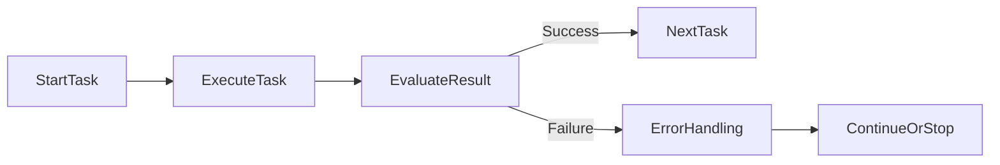
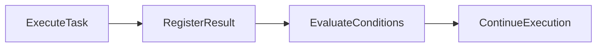
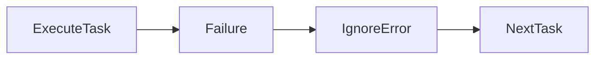
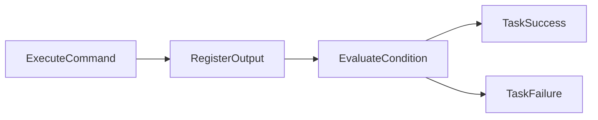
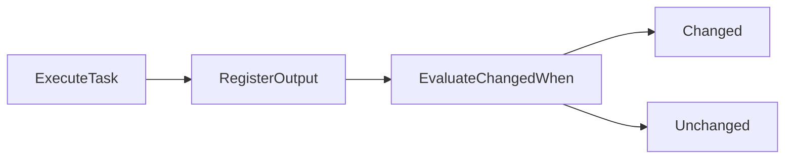
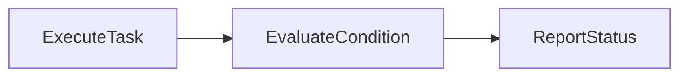

# Error Handling

## Overview

Error Handling in Ansible controls how Playbooks respond when tasks fail. By default, if a task fails on a host, Ansible stops executing the remaining tasks for that host.

Ansible provides built-in mechanisms to:

- Ignore non-critical failures
- Define custom failure conditions
- Control when a task is considered "changed"
- Improve Playbook reliability
- Reduce false failures

The three most commonly used error-handling keywords are:

- `ignore_errors`
- `failed_when`
- `changed_when`

> **Interview Tip**
>
> `ignore_errors`, `failed_when`, and `changed_when` are among the most frequently asked Ansible interview topics because they are widely used in production automation.

---

## Why It Is Used

Error handling helps to:

- Prevent unnecessary Playbook failures
- Continue execution after non-critical errors
- Customize failure detection
- Improve reporting accuracy
- Handle application-specific exit codes

---

## Architecture / Working



---

## Key Components

| Component | Purpose |
|-----------|---------|
| ignore_errors | Continue execution after failure |
| failed_when | Define custom failure conditions |
| changed_when | Control changed status |
| register | Store task results for evaluation |

---

## Types (if applicable)

Common Error Handling Techniques

- Ignore failures
- Custom failure detection
- Custom change detection

---

## Lifecycle / Workflow



---

## Configuration / Syntax (if applicable)

Basic Error Handling

```yaml
- name: Execute Command
  command: ls /tmp
```

With Registered Output

```yaml
- name: Check Service
  command: systemctl status nginx
  register: service_status
```

---

## Important Commands (if applicable)

Run Playbook

```bash
ansible-playbook site.yml
```

Verbose Output

```bash
ansible-playbook site.yml -v
```

---

## Important Files (if applicable)

| File | Purpose |
|------|---------|
| playbook.yml | Contains error-handling logic |

---

## Real-World Use Cases

- Ignore optional package installation failures
- Validate command output
- Continue deployment after non-critical errors
- Improve CI/CD pipeline reliability
- Prevent unnecessary task changes

---

## Advantages

- More reliable automation
- Better error control
- Flexible execution
- Accurate reporting
- Supports custom business logic

---

## Limitations

- Incorrect configuration can hide genuine failures
- Overusing error handling may reduce Playbook reliability

---

## Common Interview Questions (Concept Only)

- What happens when an Ansible task fails?
- What is `ignore_errors`?
- Why is `failed_when` used?
- What is the purpose of `changed_when`?
- Which keyword customizes task failure conditions?

---

## Common Mistakes

- Ignoring critical failures
- Incorrect custom conditions
- Forgetting to register command output
- Marking every task as changed

---

## Troubleshooting

| Problem | Cause | Solution |
|----------|--------|----------|
| Task unexpectedly fails | Incorrect condition | Review `failed_when` |
| Playbook continues unexpectedly | `ignore_errors` enabled | Verify if failure should stop execution |
| Incorrect change reporting | Wrong `changed_when` condition | Validate command output |

Useful Commands

```bash
ansible-playbook site.yml

ansible-playbook site.yml -v
```

---

## Summary

Ansible Error Handling allows Playbooks to continue safely, detect failures intelligently, and accurately report task status. Proper use improves automation reliability and production deployments.

---

# ignore_errors

## Overview

`ignore_errors` instructs Ansible to continue executing the Playbook even if the current task fails.

Normally, Ansible stops executing tasks for a host after a failure. Setting `ignore_errors: true` overrides this behavior.

> **Interview Tip**
>
> Use `ignore_errors` only for non-critical tasks. Avoid using it to hide genuine infrastructure or deployment failures.

---

## Why It Is Used

`ignore_errors` is useful when:

- A failure is expected
- The task is optional
- Subsequent tasks should still execute
- Temporary issues should not stop deployment

---

## Architecture / Working


---

## Key Components

| Component | Purpose |
|-----------|---------|
| ignore_errors | Continues Playbook after failure |
| Task | May fail without stopping execution |

---

## Types (if applicable)

Values

- `true`
- `false`

---

## Lifecycle / Workflow



---

## Configuration / Syntax (if applicable)

Ignore Failure

```yaml
- name: Stop Apache
  service:
    name: apache2
    state: stopped
  ignore_errors: true
```

---

## Important Commands (if applicable)

```bash
ansible-playbook site.yml
```

---

## Important Files (if applicable)

Playbook

---

## Real-World Use Cases

- Stop a service that may not exist
- Remove optional packages
- Delete missing files
- Cleanup operations
- Non-critical maintenance tasks

---

## Advantages

- Prevents unnecessary Playbook termination
- Improves deployment flexibility
- Useful for cleanup operations

---

## Limitations

- Can hide real problems
- Makes troubleshooting more difficult if overused

---

## Common Interview Questions (Concept Only)

- What does `ignore_errors` do?
- When should `ignore_errors` be used?
- Can `ignore_errors` hide critical failures?

---

## Common Mistakes

- Using `ignore_errors` for critical tasks
- Ignoring important deployment failures
- Assuming ignored failures are fixed automatically

---

## Troubleshooting

| Problem | Cause | Solution |
|----------|--------|----------|
| Hidden failure | `ignore_errors` enabled | Review Playbook output carefully |
| Deployment incomplete | Important task ignored | Remove unnecessary `ignore_errors` |

Useful Commands

```bash
ansible-playbook site.yml -v
```

---

## Summary

`ignore_errors` allows Playbook execution to continue after non-critical failures. It should be used carefully to avoid masking important deployment issues.

---

# failed_when

## Overview

`failed_when` defines custom conditions that determine whether a task should be considered failed.

Instead of relying only on a command's exit code, Ansible evaluates the specified condition.

> **Interview Tip**
>
> `failed_when` is commonly used when applications return non-standard exit codes or when failure depends on command output rather than the return code.

---

## Why It Is Used

`failed_when` helps to:

- Customize failure detection
- Handle application-specific exit codes
- Validate command output
- Improve deployment accuracy

---

## Architecture / Working



---

## Key Components

| Component | Purpose |
|-----------|---------|
| failed_when | Custom failure condition |
| register | Stores command output |
| rc | Return code |
| stdout | Standard output |
| stderr | Error output |

---

## Types (if applicable)

Conditions Based On

- Return code
- Standard output
- Standard error
- Logical expressions

---

## Lifecycle / Workflow


---

## Configuration / Syntax (if applicable)

Fail if Return Code is Non-Zero

```yaml
- name: Check Service
  command: systemctl status nginx
  register: result

  failed_when: result.rc != 0
```

Fail if Output Contains Text

```yaml
- name: Verify Application
  command: ./healthcheck.sh
  register: result

  failed_when: "'FAILED' in result.stdout"
```

Multiple Conditions

```yaml
failed_when:
  - result.rc != 0
  - "'ERROR' in result.stderr"
```

---

## Important Commands (if applicable)

```bash
ansible-playbook site.yml
```

---

## Important Files (if applicable)

Playbook

---

## Real-World Use Cases

- Health check validation
- API response validation
- Database verification
- Deployment validation
- Custom application checks

---

## Advantages

- Flexible failure detection
- Better deployment validation
- Supports business-specific logic

---

## Limitations

- Incorrect conditions may produce false failures
- Complex expressions reduce readability

---

## Common Interview Questions (Concept Only)

- What is `failed_when`?
- Why use `failed_when` instead of return codes?
- Can `failed_when` evaluate command output?

---

## Common Mistakes

- Forgetting to register task output
- Incorrect logical expressions
- Checking the wrong output field

---

## Troubleshooting

| Problem | Cause | Solution |
|----------|--------|----------|
| Unexpected failure | Incorrect condition | Review expression |
| Undefined variable | Missing `register` | Register task output first |

Useful Commands

```bash
ansible-playbook site.yml -v
```

---

## Summary

`failed_when` allows complete control over task failure conditions by evaluating return codes, output, or custom expressions instead of relying solely on default behavior.

---

# changed_when

## Overview

`changed_when` defines whether a task should be reported as "changed."

Normally, Ansible modules automatically determine whether they modified the system. However, command and shell tasks often cannot determine this accurately.

`changed_when` allows manual control over the task's changed status.

> **Interview Tip**
>
> `changed_when` is frequently used with the `command` and `shell` modules to prevent false "changed" results in reports and CI/CD pipelines.

---

## Why It Is Used

`changed_when` helps to:

- Improve reporting accuracy
- Prevent false changes
- Maintain idempotency reporting
- Reduce unnecessary handler execution

---

## Architecture / Working



---

## Key Components

| Component | Purpose |
|-----------|---------|
| changed_when | Controls changed status |
| register | Stores command output |
| rc | Return code |
| stdout | Command output |

---

## Types (if applicable)

Common Conditions

- Always changed
- Never changed
- Output-based change detection

---

## Lifecycle / Workflow



---

## Configuration / Syntax (if applicable)

Never Report Changed

```yaml
- name: Check Nginx Status
  command: systemctl status nginx

  changed_when: false
```

Always Report Changed

```yaml
changed_when: true
```

Conditional Change

```yaml
- name: Verify Update
  command: ./update.sh
  register: result

  changed_when: "'Updated' in result.stdout"
```

---

## Important Commands (if applicable)

```bash
ansible-playbook site.yml
```

---

## Important Files (if applicable)

Playbook

---

## Real-World Use Cases

- Health checks
- Version verification
- Configuration validation
- Inventory reporting
- CI/CD reporting

---

## Advantages

- Accurate reporting
- Prevents unnecessary handler execution
- Supports idempotent automation
- Improves Playbook output

---

## Limitations

- Incorrect conditions produce misleading reports
- Requires understanding of command output

---

## Common Interview Questions (Concept Only)

- What is `changed_when`?
- Why is `changed_when` commonly used with the `command` module?
- Can `changed_when` prevent handlers from running?

---

## Common Mistakes

- Always setting `changed_when: true`
- Incorrect change conditions
- Ignoring actual task modifications

---

## Troubleshooting

| Problem | Cause | Solution |
|----------|--------|----------|
| Task always reports changed | `changed_when: true` | Review condition |
| Handler not triggered | Task marked unchanged | Verify `changed_when` logic |
| Incorrect reporting | Wrong output check | Validate registered variables |

Useful Commands

```bash
ansible-playbook site.yml

ansible-playbook site.yml -v
```

---

## Summary

`changed_when` gives precise control over whether a task is reported as changed. It is especially valuable for `command` and `shell` tasks, helping maintain accurate reporting, idempotency, and predictable handler execution.
