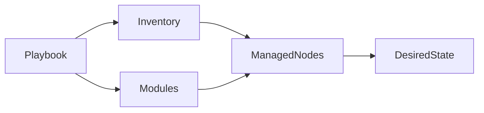
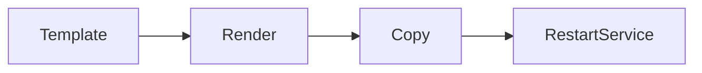
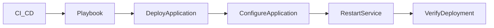
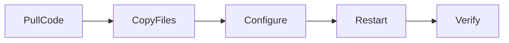

# Common Automation Tasks

## Overview

Ansible is primarily used to automate repetitive infrastructure and application management tasks across multiple servers. These automation tasks are performed using Ansible modules within Playbooks, ensuring consistency, scalability, and idempotency.

The most common automation tasks include:

- Package Installation
- User Management
- File Management
- Service Management
- Configuration Deployment
- Application Deployment

> **Interview Tip**
>
> In real-world DevOps environments, these are the most frequently automated tasks using Ansible. Interviewers often ask you to explain how Ansible automates these operations and which modules are commonly used.

---

## Why It Is Used

Automation tasks help to:

- Eliminate manual configuration
- Ensure consistent server configuration
- Reduce deployment time
- Improve infrastructure reliability
- Minimize human errors
- Support Infrastructure as Code (IaC)

---

## Architecture / Working



---

## Key Components

| Component | Purpose |
|-----------|---------|
| Inventory | Defines target hosts |
| Playbook | Defines automation tasks |
| Modules | Perform specific operations |
| SSH | Secure communication |
| Managed Nodes | Target systems |

---

## Types (if applicable)

Common Automation Categories

- Package Management
- User Administration
- File Operations
- Service Management
- Configuration Management
- Application Deployment

---

## Lifecycle / Workflow


---

## Configuration / Syntax (if applicable)

Basic Playbook

```yaml
- hosts: web

  become: yes

  tasks:

    - name: Execute Automation
      module_name:
```

---

## Important Commands (if applicable)

Run Playbook

```bash
ansible-playbook site.yml
```

Dry Run

```bash
ansible-playbook site.yml --check
```

Verbose Output

```bash
ansible-playbook site.yml -v
```

---

## Important Files (if applicable)

| File | Purpose |
|------|---------|
| inventory | Managed hosts |
| playbook.yml | Automation tasks |
| ansible.cfg | Ansible configuration |

---

## Real-World Use Cases

- Provision Linux servers
- Configure web servers
- Deploy applications
- Manage users
- Configure firewalls
- Install software
- Update servers
- Restart services

---

## Advantages

- Repeatable automation
- Idempotent execution
- Faster deployments
- Centralized management
- Easy scalability

---

## Limitations

- Requires SSH connectivity
- Large inventories require careful organization
- Poor Playbook design reduces maintainability

---

## Common Interview Questions (Concept Only)

- What are common automation tasks in Ansible?
- Which modules are most frequently used?
- How does Ansible maintain idempotency?
- Why is automation preferred over manual administration?

---

## Common Mistakes

- Using shell commands instead of dedicated modules
- Hardcoding values
- Ignoring idempotency
- Running tasks without privilege escalation when required

---

## Troubleshooting

| Problem | Cause | Solution |
|----------|--------|----------|
| Task fails | Incorrect module parameters | Verify module documentation |
| Permission denied | Missing `become` | Enable privilege escalation |
| Host unreachable | SSH issue | Verify connectivity and inventory |

Useful Commands

```bash
ansible-playbook site.yml

ansible all -m ping
```

---

## Summary

Common automation tasks form the foundation of Ansible usage. They enable administrators and DevOps engineers to manage infrastructure efficiently, consistently, and at scale.

---

# Package Installation

## Overview

Package Installation automates the installation, upgrade, and removal of software packages across managed hosts.

Instead of manually logging into each server, Ansible installs packages simultaneously on multiple systems.

> **Interview Tip**
>
> Always prefer package-specific modules (`apt`, `yum`, `dnf`, `package`) instead of using shell commands.

---

## Why It Is Used

Package automation helps to:

- Install required software
- Upgrade applications
- Remove unused packages
- Maintain consistent environments

---

## Architecture / Working


---

## Key Components

| Component | Purpose |
|-----------|---------|
| apt | Debian/Ubuntu package manager |
| yum | RHEL/CentOS package manager |
| dnf | Fedora/RHEL package manager |
| package | Generic package module |

---

## Types (if applicable)

Package States

- present
- latest
- absent

---

## Lifecycle / Workflow


---

## Configuration / Syntax (if applicable)

Ubuntu

```yaml
- name: Install Nginx
  apt:
    name: nginx
    state: present
```

Generic Module

```yaml
- name: Install Git
  package:
    name: git
    state: present
```

---

## Important Commands (if applicable)

```bash
ansible-playbook install.yml
```

---

## Important Files (if applicable)

Playbook

---

## Real-World Use Cases

- Install Apache
- Install Docker
- Install Git
- Upgrade packages
- Remove unused software

---

## Advantages

- Consistent installations
- Supports multiple operating systems
- Idempotent execution

---

## Limitations

- Different modules for different package managers
- Internet or repository access required

---

## Common Interview Questions (Concept Only)

- Which module installs packages?
- Difference between `package` and `apt`?
- What does `state: latest` do?

---

## Common Mistakes

- Using `shell` instead of package modules
- Installing packages without updating repositories
- Using the wrong package module

---

## Troubleshooting

```bash
ansible-playbook install.yml -v
```

---

## Summary

Package Installation automates software management across servers using idempotent package modules.

---

# User Management

## Overview

User Management automates the creation, modification, and removal of user accounts and groups across multiple systems.

---

## Why It Is Used

- Create users
- Delete users
- Manage groups
- Configure SSH access
- Standardize user accounts

---

## Architecture / Working


---

## Key Components

| Component | Purpose |
|-----------|---------|
| user | Manage users |
| group | Manage groups |
| authorized_key | Manage SSH keys |

---

## Types (if applicable)

User Operations

- Create
- Modify
- Delete

---

## Lifecycle / Workflow


---

## Configuration / Syntax (if applicable)

```yaml
- name: Create User
  user:
    name: developer
    state: present
```

---

## Important Commands (if applicable)

```bash
ansible-playbook users.yml
```

---

## Important Files (if applicable)

Playbook

---

## Real-World Use Cases

- Employee onboarding
- User provisioning
- SSH key deployment
- User removal

---

## Advantages

- Centralized user management
- Consistent configuration
- Secure administration

---

## Limitations

- Requires administrative privileges

---

## Common Interview Questions (Concept Only)

- Which module manages users?
- How do you remove a user?
- How do you deploy SSH keys?

---

## Common Mistakes

- Forgetting `become`
- Not managing user groups
- Incorrect usernames

---

## Troubleshooting

```bash
ansible-playbook users.yml -v
```

---

## Summary

User Management automates account administration and ensures consistent access across infrastructure.

---

# File Management

## Overview

File Management automates the creation, modification, copying, and deletion of files and directories.

---

## Why It Is Used

- Create directories
- Copy files
- Remove files
- Manage permissions
- Deploy templates

---

## Architecture / Working


---

## Key Components

| Component | Purpose |
|-----------|---------|
| copy | Copy files |
| file | Manage permissions |
| template | Deploy templates |

---

## Types (if applicable)

Operations

- Copy
- Delete
- Create
- Modify

---

## Lifecycle / Workflow


---

## Configuration / Syntax (if applicable)

```yaml
- name: Copy Config
  copy:
    src: nginx.conf
    dest: /etc/nginx/nginx.conf
```

---

## Important Commands (if applicable)

```bash
ansible-playbook files.yml
```

---

## Important Files (if applicable)

Playbook

---

## Real-World Use Cases

- Deploy configuration files
- Backup files
- Update permissions
- Create directories

---

## Advantages

- Consistent file management
- Supports templates
- Idempotent

---

## Limitations

- Large file transfers can take time

---

## Common Interview Questions (Concept Only)

- Difference between `copy` and `template`?
- Which module changes file permissions?

---

## Common Mistakes

- Wrong destination path
- Incorrect permissions
- Forgetting file ownership

---

## Troubleshooting

```bash
ansible-playbook files.yml
```

---

## Summary

File Management automates filesystem operations and ensures consistent configuration across servers.

---

# Service Management

## Overview

Service Management automates starting, stopping, restarting, enabling, and disabling system services.

---

## Why It Is Used

- Manage application services
- Restart services after configuration changes
- Enable services on boot
- Perform maintenance

---

## Architecture / Working


---

## Key Components

| Component | Purpose |
|-----------|---------|
| service | Generic service management |
| systemd | Manage systemd services |

---

## Types (if applicable)

Service States

- started
- stopped
- restarted
- reloaded

---

## Lifecycle / Workflow


---

## Configuration / Syntax (if applicable)

```yaml
- name: Restart Nginx
  service:
    name: nginx
    state: restarted
```

---

## Important Commands (if applicable)

```bash
ansible-playbook services.yml
```

---

## Important Files (if applicable)

Playbook

---

## Real-World Use Cases

- Restart Apache
- Enable Docker
- Stop MySQL
- Reload Nginx

---

## Advantages

- Consistent service management
- Idempotent execution
- Supports handlers

---

## Limitations

- Service names vary across operating systems

---

## Common Interview Questions (Concept Only)

- Which module manages services?
- Difference between restart and reload?
- What is the purpose of handlers?

---

## Common Mistakes

- Wrong service name
- Missing privilege escalation

---

## Troubleshooting

```bash
ansible-playbook services.yml
```

---

## Summary

Service Management automates service lifecycle operations and is commonly used with handlers after configuration changes.

---

# Configuration Deployment

## Overview

Configuration Deployment distributes configuration files to managed hosts while ensuring consistency and supporting dynamic values through templates.

---

## Why It Is Used

- Standardize configurations
- Automate updates
- Support multiple environments
- Eliminate manual editing

---

## Architecture / Working


---

## Key Components

| Component | Purpose |
|-----------|---------|
| template | Deploy dynamic files |
| copy | Deploy static files |
| variables | Customize configuration |

---

## Types (if applicable)

Deployment Methods

- Static configuration
- Dynamic templates

---

## Lifecycle / Workflow



---

## Configuration / Syntax (if applicable)

```yaml
- name: Deploy Configuration
  template:
    src: nginx.conf.j2
    dest: /etc/nginx/nginx.conf
```

---

## Important Commands (if applicable)

```bash
ansible-playbook config.yml
```

---

## Important Files (if applicable)

| File | Purpose |
|------|---------|
| templates/ | Jinja2 templates |
| playbook.yml | Deployment logic |

---

## Real-World Use Cases

- Nginx configuration
- Apache configuration
- Database configuration
- Application settings

---

## Advantages

- Dynamic configuration
- Environment-specific deployment
- Version controlled

---

## Limitations

- Requires template management
- Incorrect variables can break configurations

---

## Common Interview Questions (Concept Only)

- Why use templates?
- Difference between `copy` and `template`?
- When should handlers be used?

---

## Common Mistakes

- Hardcoding values
- Missing variables
- Forgetting service restart

---

## Troubleshooting

```bash
ansible-playbook config.yml
```

---

## Summary

Configuration Deployment ensures consistent, version-controlled, and environment-specific configuration across infrastructure.

---

# Application Deployment

## Overview

Application Deployment automates the process of deploying applications, updating versions, configuring services, and verifying successful deployment.

Ansible enables repeatable, reliable, and idempotent application releases across multiple environments.

> **Interview Tip**
>
> Application deployment is one of the most common production use cases of Ansible and is frequently integrated into CI/CD pipelines.

---

## Why It Is Used

- Deploy new releases
- Update applications
- Roll out configuration changes
- Restart services
- Minimize deployment errors

---

## Architecture / Working



---

## Key Components

| Component | Purpose |
|-----------|---------|
| git | Download application source |
| copy/template | Deploy files |
| service | Restart application |
| handlers | Restart only when required |

---

## Types (if applicable)

Deployment Types

- Fresh deployment
- Upgrade deployment
- Rolling deployment

---

## Lifecycle / Workflow



---

## Configuration / Syntax (if applicable)

```yaml
- name: Clone Repository
  git:
    repo: https://github.com/example/app.git
    dest: /opt/app
```

---

## Important Commands (if applicable)

```bash
ansible-playbook deploy.yml
```

---

## Important Files (if applicable)

| File | Purpose |
|------|---------|
| deploy.yml | Deployment Playbook |
| templates/ | Configuration templates |

---

## Real-World Use Cases

- Deploy web applications
- Deploy Java services
- Deploy Node.js applications
- Deploy Python applications
- CI/CD pipeline automation

---

## Advantages

- Repeatable deployments
- Faster releases
- Reduced downtime
- Easy rollback preparation
- Environment consistency

---

## Limitations

- Requires proper Playbook design
- Application-specific deployment logic may vary

---

## Common Interview Questions (Concept Only)

- How does Ansible automate application deployment?
- Which modules are commonly used during deployment?
- Why are handlers useful in deployments?
- How is Ansible integrated into CI/CD pipelines?

---

## Common Mistakes

- Deploying without backups
- Restarting services unnecessarily
- Hardcoding application paths
- Not validating deployment success

---

## Troubleshooting

| Problem | Cause | Solution |
|----------|--------|----------|
| Application not updated | Incorrect repository or path | Verify Git repository and destination |
| Service fails after deployment | Invalid configuration | Validate configuration before restart |
| Deployment incomplete | Task failure | Run Playbook with verbose output and inspect logs |

Useful Commands

```bash
ansible-playbook deploy.yml

ansible-playbook deploy.yml -v
```

---

## Summary

Application Deployment automates software releases by combining package installation, configuration management, file deployment, and service management. It provides consistent, repeatable, and production-ready deployments while integrating seamlessly with modern CI/CD pipelines.
