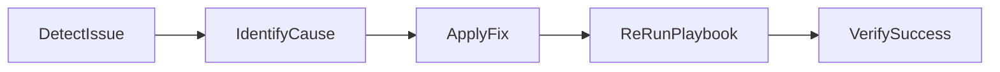
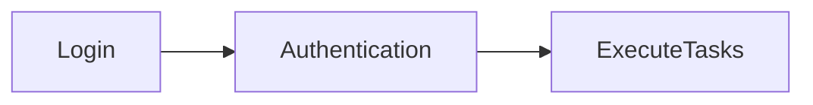
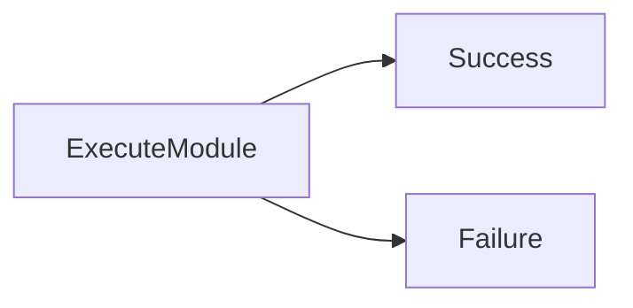
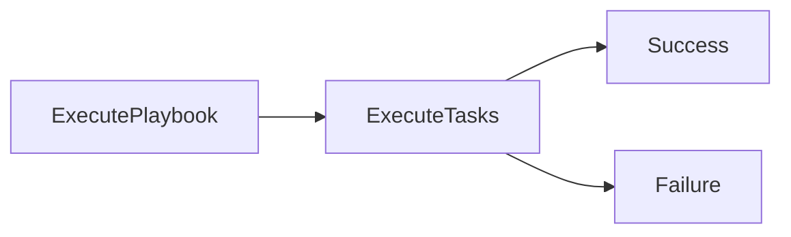

# Troubleshooting

## Overview

Troubleshooting in Ansible involves identifying, diagnosing, and resolving issues that occur during inventory parsing, host connectivity, authentication, Playbook execution, module execution, and YAML processing.

Most Ansible failures fall into one of these categories:

- Inventory Issues
- SSH Connection Failures
- Authentication Errors
- YAML Syntax Errors
- Module Failures
- Playbook Execution Errors

Understanding how to troubleshoot these problems is essential for both production environments and technical interviews.

> **Interview Tip**
>
> A structured troubleshooting approach is:
>
> 1. Validate the inventory.
> 2. Test SSH connectivity.
> 3. Verify authentication.
> 4. Check Playbook syntax.
> 5. Run with verbose mode (`-v`, `-vv`, `-vvv`).
> 6. Review the task that failed.

---

## Why It Is Used

Troubleshooting helps to:

- Identify deployment failures
- Verify host connectivity
- Resolve authentication issues
- Detect configuration mistakes
- Improve automation reliability
- Reduce downtime

---

## Architecture / Working


---

## Key Components

| Component | Purpose |
|-----------|---------|
| Inventory | Defines managed hosts |
| SSH | Connects to managed nodes |
| Authentication | Verifies user access |
| Playbook | Defines automation |
| Modules | Execute automation tasks |
| Verbose Mode | Displays detailed logs |

---

## Types (if applicable)

Common Troubleshooting Areas

- Inventory
- SSH
- Authentication
- YAML
- Modules
- Playbook Execution

---

## Lifecycle / Workflow



---

## Configuration / Syntax (if applicable)

Validate Playbook

```bash
ansible-playbook site.yml --syntax-check
```

Run Verbosely

```bash
ansible-playbook site.yml -vvv
```

Test Connectivity

```bash
ansible all -m ping
```

---

## Important Commands (if applicable)

```bash
ansible --version

ansible all -m ping

ansible-playbook site.yml

ansible-playbook site.yml --syntax-check

ansible-playbook site.yml -vvv

ansible-inventory --graph
```

---

## Important Files (if applicable)

| File | Purpose |
|------|---------|
| inventory | Managed hosts |
| ansible.cfg | Configuration |
| playbook.yml | Automation |
| hosts | Inventory file |

---

## Real-World Use Cases

- Failed deployments
- Server connectivity problems
- Cloud authentication failures
- Invalid inventories
- Broken Playbooks
- CI/CD deployment failures

---

## Advantages

- Faster issue resolution
- Reduced downtime
- Eases root cause analysis
- Improves Playbook quality

---

## Limitations

- Requires understanding of Ansible internals
- Verbose logs can be extensive in large environments

---

## Common Interview Questions (Concept Only)

- How do you troubleshoot a failed Playbook?
- How do you verify SSH connectivity?
- Which command validates a Playbook?
- Which verbose option provides detailed debugging?
- How do you verify an inventory?

---

## Common Mistakes

- Running Playbooks without syntax validation
- Ignoring verbose output
- Using incorrect inventory files
- Forgetting privilege escalation
- Ignoring module documentation

---

## Troubleshooting

| Issue | Solution |
|---------|----------|
| Inventory problems | Validate inventory |
| SSH failures | Verify connectivity |
| Authentication errors | Check credentials |
| YAML errors | Validate syntax |
| Module failures | Verify module parameters |
| Playbook errors | Use verbose logging |

Useful Commands

```bash
ansible all -m ping

ansible-playbook site.yml --syntax-check

ansible-playbook site.yml -vvv

ansible-inventory --graph
```

---

## Summary

Successful Ansible troubleshooting follows a systematic approach: verify the inventory, confirm connectivity, validate authentication, check Playbook syntax, and analyze verbose logs to identify and resolve issues quickly.

---

# Inventory Issues

## Overview

Inventory issues occur when Ansible cannot locate hosts, parse the inventory file, or identify host groups correctly.

Since every Ansible operation begins with the inventory, inventory problems prevent automation from starting.

---

## Why It Is Used

Inventory validation ensures:

- Hosts are reachable
- Groups are correctly defined
- Variables are loaded properly
- Playbooks target the correct systems

---

## Architecture / Working


---

## Key Components

| Component | Purpose |
|-----------|---------|
| Inventory | Host definitions |
| Groups | Organize hosts |
| Variables | Host configuration |

---

## Types (if applicable)

Inventory Types

- Static Inventory
- Dynamic Inventory

---

## Lifecycle / Workflow


---

## Configuration / Syntax (if applicable)

Static Inventory

```ini
[web]
web01
web02
```

---

## Important Commands (if applicable)

List Inventory

```bash
ansible-inventory --list
```

Display Groups

```bash
ansible-inventory --graph
```

---

## Important Files (if applicable)

| File | Purpose |
|------|---------|
| inventory | Host definitions |
| hosts | Static inventory |

---

## Real-World Use Cases

- Validate inventories
- Debug host groups
- Verify dynamic inventories

---

## Advantages

- Easy validation
- Simplifies troubleshooting
- Detects inventory errors early

---

## Limitations

- Invalid inventory prevents execution

---

## Common Interview Questions (Concept Only)

- How do you verify an inventory?
- Difference between static and dynamic inventory?
- Which command displays inventory groups?

---

## Common Mistakes

- Typographical errors in hostnames
- Incorrect group names
- Duplicate host definitions
- Invalid inventory syntax

---

## Troubleshooting

| Problem | Cause | Solution |
|----------|--------|----------|
| No hosts matched | Wrong host pattern | Verify inventory groups |
| Inventory parsing failed | Invalid syntax | Validate inventory |
| Missing hosts | Incorrect inventory path | Specify correct inventory |

Useful Commands

```bash
ansible-inventory --list

ansible-inventory --graph
```

---

## Summary

Inventory issues are among the most common Ansible problems. Always verify the inventory before troubleshooting Playbooks.

---

# SSH Connection Failures

## Overview

SSH connection failures occur when the Ansible Control Node cannot establish an SSH connection to a managed host.

Without SSH connectivity, Ansible cannot execute modules or Playbooks.

> **Interview Tip**
>
> Before debugging a Playbook, verify that the Control Node can connect to the target host using SSH.

---

## Why It Is Used

Troubleshooting SSH ensures:

- Connectivity
- Authentication
- Remote execution
- Module execution

---

## Architecture / Working


---

## Key Components

| Component | Purpose |
|-----------|---------|
| SSH | Secure connection |
| SSH Keys | Authentication |
| Inventory | Host information |

---

## Types (if applicable)

Authentication Methods

- SSH Keys
- Password Authentication

---

## Lifecycle / Workflow


---

## Configuration / Syntax (if applicable)

Test Connectivity

```bash
ansible all -m ping
```

---

## Important Commands (if applicable)

```bash
ssh user@server

ansible all -m ping
```

---

## Important Files (if applicable)

| File | Purpose |
|------|---------|
| ~/.ssh/id_rsa | SSH private key |
| authorized_keys | Authorized public keys |

---

## Real-World Use Cases

- Server management
- Deployment automation
- Configuration management

---

## Advantages

- Secure communication
- Passwordless automation

---

## Limitations

- SSH must be configured properly

---

## Common Interview Questions (Concept Only)

- Why does SSH fail?
- How do you test SSH connectivity?
- Does Ansible require SSH?

---

## Common Mistakes

- Wrong SSH key
- Incorrect username
- Firewall blocking port 22
- Incorrect inventory host

---

## Troubleshooting

| Problem | Cause | Solution |
|----------|--------|----------|
| Host unreachable | Network issue | Verify connectivity |
| Permission denied | Invalid SSH key | Check authorized keys |
| Timeout | Firewall or SSH service | Verify port 22 access |

Useful Commands

```bash
ssh user@host

ansible all -m ping
```

---

## Summary

SSH connectivity is the foundation of Ansible automation. Verify SSH before investigating Playbook-related issues.

---

# Authentication Errors

## Overview

Authentication errors occur when Ansible cannot successfully authenticate with the managed host.

---

## Why It Is Used

Authentication verification ensures secure access to target systems.

---

## Architecture / Working


---

## Key Components

| Component | Purpose |
|-----------|---------|
| SSH Keys | Authentication |
| Password | Login |
| Become | Privilege escalation |

---

## Types (if applicable)

Authentication Methods

- SSH Key
- Password
- Become

---

## Lifecycle / Workflow



---

## Configuration / Syntax (if applicable)

Become

```yaml
become: yes
```

---

## Important Commands (if applicable)

```bash
ansible all -m ping
```

---

## Important Files (if applicable)

SSH Keys

---

## Real-World Use Cases

- Cloud authentication
- Linux administration
- CI/CD deployment

---

## Advantages

- Secure automation

---

## Limitations

- Incorrect credentials prevent execution

---

## Common Interview Questions (Concept Only)

- How does Ansible authenticate?
- What is Become?
- Why use SSH keys?

---

## Common Mistakes

- Wrong credentials
- Missing SSH keys
- Missing sudo permissions

---

## Troubleshooting

| Problem | Cause | Solution |
|----------|--------|----------|
| Permission denied | Invalid credentials | Verify authentication |
| Become failed | Incorrect sudo rights | Verify privilege escalation |

Useful Commands

```bash
ansible all -m ping
```

---

## Summary

Authentication errors usually involve incorrect credentials, SSH keys, or insufficient privileges.

---

# YAML Syntax Errors

## Overview

YAML syntax errors occur when Playbooks contain invalid formatting or indentation.

YAML is whitespace-sensitive, making indentation one of the most common sources of Playbook failures.

> **Interview Tip**
>
> Most YAML errors are caused by incorrect indentation. Always use spaces instead of tabs.

---

## Why It Is Used

Syntax validation helps detect formatting errors before execution.

---

## Architecture / Working


---

## Key Components

| Component | Purpose |
|-----------|---------|
| YAML | Playbook format |
| Parser | Validates syntax |

---

## Types (if applicable)

Common Errors

- Indentation
- Missing colon
- Invalid spacing
- Tabs instead of spaces

---

## Lifecycle / Workflow


---

## Configuration / Syntax (if applicable)

Validate Playbook

```bash
ansible-playbook site.yml --syntax-check
```

---

## Important Commands (if applicable)

```bash
ansible-playbook site.yml --syntax-check
```

---

## Important Files (if applicable)

Playbook

---

## Real-World Use Cases

- Validate CI/CD deployments
- Debug Playbooks

---

## Advantages

- Prevents execution failures

---

## Limitations

- Syntax validation does not detect logical errors

---

## Common Interview Questions (Concept Only)

- How do you validate a Playbook?
- What causes YAML syntax errors?

---

## Common Mistakes

- Using tabs
- Incorrect indentation
- Missing colons

---

## Troubleshooting

| Problem | Cause | Solution |
|----------|--------|----------|
| YAML parser error | Invalid formatting | Fix indentation |
| Unexpected token | Missing colon | Review syntax |

Useful Commands

```bash
ansible-playbook site.yml --syntax-check
```

---

## Summary

YAML syntax validation should always be performed before executing Playbooks.

---

# Module Failures

## Overview

Module failures occur when Ansible modules receive invalid parameters, encounter missing dependencies, or fail to execute successfully on managed hosts.

---

## Why It Is Used

Troubleshooting modules ensures reliable automation.

---

## Architecture / Working


---

## Key Components

| Component | Purpose |
|-----------|---------|
| Module | Performs automation |
| Parameters | Configure module behavior |

---

## Types (if applicable)

Common Module Problems

- Invalid parameters
- Missing dependencies
- Unsupported operating system

---

## Lifecycle / Workflow



---

## Configuration / Syntax (if applicable)

View Documentation

```bash
ansible-doc copy
```

---

## Important Commands (if applicable)

```bash
ansible-doc <module>

ansible-playbook site.yml -vvv
```

---

## Important Files (if applicable)

Playbook

---

## Real-World Use Cases

- Package installation
- Service management
- File deployment

---

## Advantages

- Module documentation simplifies troubleshooting

---

## Limitations

- Modules vary by operating system

---

## Common Interview Questions (Concept Only)

- Why do modules fail?
- How do you troubleshoot module failures?

---

## Common Mistakes

- Invalid parameters
- Unsupported module options
- Missing collections

---

## Troubleshooting

| Problem | Cause | Solution |
|----------|--------|----------|
| Module not found | Collection missing | Install required collection |
| Invalid parameter | Unsupported option | Check `ansible-doc` |

Useful Commands

```bash
ansible-doc copy

ansible-playbook site.yml -vvv
```

---

## Summary

Module failures are commonly caused by invalid parameters, missing collections, or unsupported module options.

---

# Playbook Execution Errors

## Overview

Playbook execution errors occur while Ansible processes tasks, roles, variables, handlers, or modules.

These errors typically stop execution unless explicit error-handling mechanisms are used.

---

## Why It Is Used

Troubleshooting execution errors ensures successful deployments and consistent automation.

---

## Architecture / Working



---

## Key Components

| Component | Purpose |
|-----------|---------|
| Playbook | Automation definition |
| Tasks | Individual operations |
| Handlers | Triggered actions |
| Variables | Runtime values |

---

## Types (if applicable)

Execution Problems

- Undefined variables
- Failed tasks
- Handler failures
- Dependency failures

---

## Lifecycle / Workflow


---

## Configuration / Syntax (if applicable)

Verbose Execution

```bash
ansible-playbook site.yml -vvv
```

---

## Important Commands (if applicable)

```bash
ansible-playbook site.yml

ansible-playbook site.yml -vvv

ansible-playbook site.yml --check
```

---

## Important Files (if applicable)

| File | Purpose |
|------|---------|
| playbook.yml | Automation logic |
| roles/ | Role definitions |

---

## Real-World Use Cases

- CI/CD deployment debugging
- Production deployments
- Infrastructure automation
- Cloud provisioning

---

## Advantages

- Verbose logs simplify diagnosis
- Supports dry-run validation

---

## Limitations

- Complex Playbooks can produce extensive logs

---

## Common Interview Questions (Concept Only)

- How do you troubleshoot Playbook execution errors?
- Which command increases logging verbosity?
- What is the purpose of `--check` mode?

---

## Common Mistakes

- Skipping syntax validation
- Ignoring verbose output
- Using undefined variables
- Incorrect role dependencies

---

## Troubleshooting

| Problem | Cause | Solution |
|----------|--------|----------|
| Undefined variable | Missing variable definition | Verify variable files and inventory |
| Handler not executed | Task did not report changes | Review task and handler logic |
| Task failure | Invalid module or parameters | Validate module usage and inputs |

Useful Commands

```bash
ansible-playbook site.yml --syntax-check

ansible-playbook site.yml --check

ansible-playbook site.yml -vvv
```

---

## Summary

Playbook execution errors are typically related to variables, tasks, handlers, or module usage. A disciplined workflow—syntax validation, inventory verification, verbose logging, and careful review of failed tasks—helps identify and resolve issues efficiently in production environments.
