# Monitoring Fundamentals

## Overview

Monitoring is the continuous process of collecting, storing, analyzing, and visualizing system and application data to ensure infrastructure remains healthy, available, and performant.

Prometheus is an open-source monitoring and alerting toolkit that collects metrics from applications, servers, containers, Kubernetes clusters, and cloud infrastructure.

Unlike traditional monitoring systems, Prometheus stores **time-series data** and uses a **pull-based model** to collect metrics.

> **Interview Tip**
>
> Prometheus is a **monitoring and alerting** tool—not a logging tool.
>
> - **Prometheus → Metrics**
> - **Grafana → Visualization**
> - **Loki / ELK → Logs**
> - **Jaeger / Zipkin → Traces**

---

## Why It Is Used

Monitoring helps organizations to:

- Detect system failures quickly
- Monitor application health
- Track infrastructure performance
- Generate alerts automatically
- Troubleshoot production issues
- Measure resource utilization
- Improve system reliability
- Support SRE and DevOps practices

---

## Architecture / Working

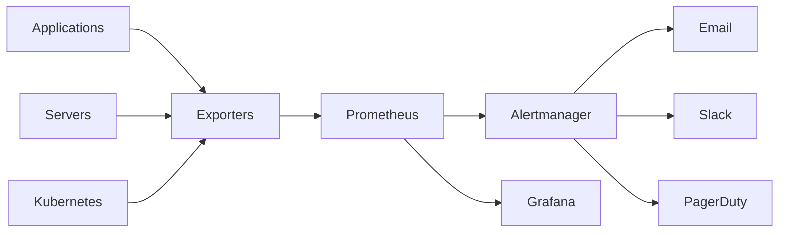

### Working Process

1. Applications expose metrics through an endpoint.
2. Prometheus periodically scrapes metrics.
3. Metrics are stored as time-series data.
4. PromQL is used to query metrics.
5. Grafana visualizes the data.
6. Alertmanager sends notifications when alert rules are triggered.

---

## Key Components

| Component | Purpose |
|------------|----------|
| Prometheus Server | Collects and stores metrics |
| Exporters | Expose metrics from systems |
| Targets | Endpoints monitored by Prometheus |
| Time-Series Database (TSDB) | Stores metrics |
| PromQL | Query language |
| Alertmanager | Sends alerts |
| Grafana | Dashboards and visualization |

---

## Types (if applicable)

### Infrastructure Monitoring

- CPU Usage
- Memory Usage
- Disk Usage
- Network Traffic

### Application Monitoring

- HTTP Requests
- Response Time
- Error Rate
- Active Users

### Container Monitoring

- Docker Containers
- Kubernetes Pods
- Nodes
- Namespaces

### Database Monitoring

- MySQL
- PostgreSQL
- MongoDB
- Redis

---

## Lifecycle / Workflow

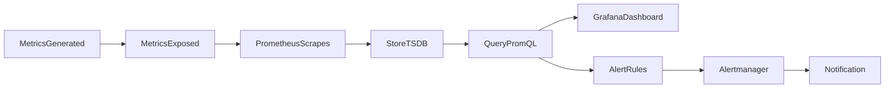

---

## Configuration / Syntax (if applicable)

Example Metrics Endpoint

```
http://server:9100/metrics
```

Example Prometheus Scrape Configuration

```yaml
scrape_configs:
  - job_name: "node-exporter"

    static_configs:
      - targets:
          - localhost:9100
```

---

## Important Commands (if applicable)

Start Prometheus

```bash
prometheus
```

Check Configuration

```bash
promtool check config prometheus.yml
```

Reload Configuration

```bash
curl -X POST http://localhost:9090/-/reload
```

Open Prometheus UI

```
http://localhost:9090
```

---

## Important Files (if applicable)

| File | Purpose |
|------|----------|
| prometheus.yml | Main configuration |
| rules.yml | Alerting rules |
| alertmanager.yml | Alertmanager configuration |
| prometheus.db | Time-series database |

---

## Real-World Use Cases

- Monitor Linux servers
- Kubernetes cluster monitoring
- Azure Virtual Machine monitoring
- AWS EC2 monitoring
- API performance monitoring
- Database monitoring
- Application health monitoring
- CI/CD pipeline monitoring

---

## Advantages

- Open source
- Highly scalable
- Powerful query language
- Native Kubernetes support
- Multi-dimensional metrics
- Easy integration
- Excellent Grafana support
- Flexible alerting

---

## Limitations

- Stores metrics only (not logs)
- Local storage by default
- High-cardinality metrics increase storage usage
- Not ideal for long-term storage without remote storage solutions

---

## Common Interview Questions (Concept Only)

- What is Prometheus?
- Why is Prometheus popular?
- What is monitoring?
- Difference between monitoring and logging?
- What are metrics?
- What is time-series data?
- Why does Prometheus use a pull model?
- What is an exporter?
- What is a target?
- What is PromQL?

---

## Common Mistakes

- Confusing logs with metrics
- Monitoring too many unnecessary metrics
- Ignoring alert thresholds
- High-cardinality labels causing storage issues
- Assuming Prometheus stores logs
- Exposing metrics without security
- Forgetting to configure scrape intervals

---

## Troubleshooting

| Problem | Cause | Solution |
|----------|--------|----------|
| Target Down | Exporter not running | Verify exporter service |
| No Metrics | Wrong endpoint | Check `/metrics` endpoint |
| Scrape Failed | Network issue | Verify connectivity |
| High Storage Usage | High-cardinality metrics | Reduce unnecessary labels |
| Missing Data | Wrong scrape configuration | Verify `prometheus.yml` |
| Configuration Error | YAML syntax issue | Validate with `promtool` |

Useful Commands

```bash
systemctl status prometheus

curl http://localhost:9100/metrics

promtool check config prometheus.yml
```

---

## Summary

Monitoring is a core DevOps and SRE practice that enables teams to observe the health and performance of systems in real time. Prometheus collects metrics using a pull-based model, stores them as time-series data, and integrates with Grafana for visualization and Alertmanager for notifications. A solid understanding of monitoring fundamentals is essential for production operations and is frequently tested in DevOps interviews.

---

# Monitoring Concepts

## Overview

Monitoring concepts define the fundamental principles used to observe, measure, and analyze the health and performance of systems, applications, and infrastructure.

Prometheus focuses on collecting **quantitative metrics** over time to help identify failures, performance bottlenecks, and abnormal behavior.

> **Interview Tip**
>
> Monitoring answers three key questions:
>
> - Is the system healthy?
> - Is the system performing well?
> - Will the system fail soon?

---

## Why It Is Used

Monitoring concepts help teams to:

- Detect failures early
- Improve availability
- Reduce downtime
- Track performance trends
- Support capacity planning
- Enable proactive alerting

---

## Architecture / Working

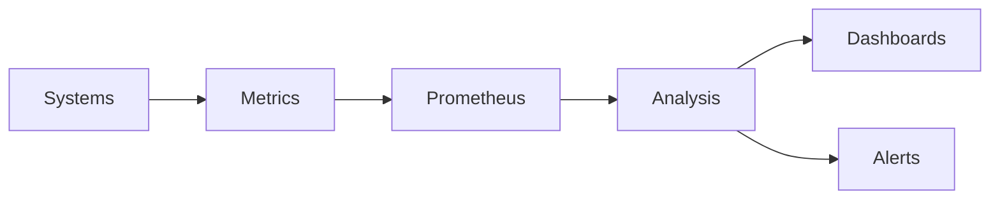

---

## Key Components

| Component | Purpose |
|-----------|---------|
| Monitoring | Observes system behavior |
| Metrics | Quantitative measurements |
| Alerts | Notify on issues |
| Dashboards | Visualize metrics |
| Targets | Systems being monitored |

---

## Types (if applicable)

Common Monitoring Types

- Infrastructure Monitoring
- Application Monitoring
- Network Monitoring
- Database Monitoring
- Kubernetes Monitoring

---

## Lifecycle / Workflow


---

## Configuration / Syntax (if applicable)

Not applicable.

---

## Important Commands (if applicable)

```bash
curl http://localhost:9090

curl http://localhost:9100/metrics
```

---

## Important Files (if applicable)

- prometheus.yml

---

## Real-World Use Cases

- Monitor production servers
- Detect application slowdowns
- Track API performance
- Monitor cloud infrastructure

---

## Advantages

- Early failure detection
- Better visibility
- Improved reliability

---

## Limitations

- Requires proper alert tuning
- Excessive metrics increase storage

---

## Common Interview Questions (Concept Only)

- What is monitoring?
- Why is monitoring important?
- What is observability?
- Difference between monitoring and logging?

---

## Common Mistakes

- Collecting unnecessary metrics
- Ignoring alerts
- Poor dashboard design

---

## Troubleshooting

- Verify metrics endpoint
- Check scrape targets
- Review alert rules

---

## Summary

Monitoring provides continuous visibility into systems, enabling proactive detection of issues, performance analysis, and improved operational reliability.

---

# Metrics

## Overview

A metric is a **numeric measurement collected over time** that represents the state or performance of a system.

Each metric consists of:

- Metric Name
- Timestamp
- Value
- Labels

Example

```
node_cpu_seconds_total{cpu="0",mode="idle"} 45000
```

---

## Why It Is Used

Metrics help monitor:

- CPU usage
- Memory utilization
- Disk usage
- Network traffic
- HTTP requests
- Application performance

---

## Architecture / Working

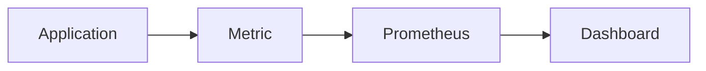

---

## Key Components

| Component | Purpose |
|-----------|---------|
| Metric Name | Identifies metric |
| Labels | Metadata |
| Value | Numeric measurement |
| Timestamp | Time recorded |

---

## Types (if applicable)

Prometheus Metric Types

| Type | Purpose |
|------|----------|
| Counter | Increasing value |
| Gauge | Current value |
| Histogram | Distribution |
| Summary | Percentiles |

---

## Lifecycle / Workflow

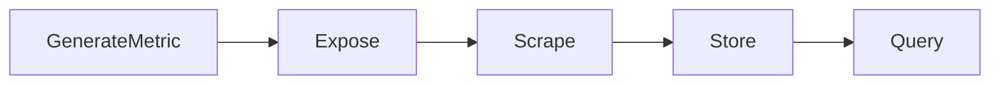

---

## Configuration / Syntax (if applicable)

Example Metric

```
http_requests_total{method="GET"} 450
```

---

## Important Commands (if applicable)

Query Metrics

```
http_requests_total
```

---

## Important Files (if applicable)

Not applicable.

---

## Real-World Use Cases

- CPU utilization
- Memory usage
- API requests
- Kubernetes pod count

---

## Advantages

- Lightweight
- Easy to aggregate
- Efficient storage

---

## Limitations

- Cannot replace logs
- No request-level details

---

## Common Interview Questions (Concept Only)

- What is a metric?
- What are Prometheus metric types?
- Difference between Counter and Gauge?

---

## Common Mistakes

- Creating high-cardinality labels
- Using incorrect metric types

---

## Troubleshooting

- Verify exporter
- Verify metric endpoint

---

## Summary

Metrics are numerical measurements that form the foundation of Prometheus monitoring and enable performance analysis over time.

---

# Time-Series Data

## Overview

Time-series data is data stored as **values associated with timestamps**.

Prometheus stores every metric as a time series.

---

## Why It Is Used

Time-series data enables:

- Trend analysis
- Historical comparison
- Alert generation
- Capacity planning

---

## Architecture / Working

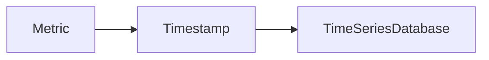

---

## Key Components

| Component | Purpose |
|-----------|---------|
| Metric | Measurement |
| Timestamp | Time collected |
| Labels | Metadata |
| Value | Recorded measurement |

---

## Types (if applicable)

Time-series components

- Metric
- Timestamp
- Labels
- Value

---

## Lifecycle / Workflow

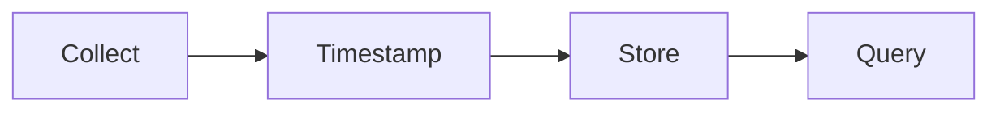

---

## Configuration / Syntax (if applicable)

Example

```
cpu_usage 65
Timestamp: 2026-07-09T10:00:00Z
```

---

## Important Commands (if applicable)

Use PromQL to query time-series data.

---

## Important Files (if applicable)

Prometheus TSDB

---

## Real-World Use Cases

- CPU trends
- Memory trends
- Request rate analysis

---

## Advantages

- Efficient historical analysis
- Fast querying
- Supports alerting

---

## Limitations

- Large storage for long retention
- High-cardinality increases storage requirements

---

## Common Interview Questions (Concept Only)

- What is time-series data?
- Why does Prometheus use TSDB?

---

## Common Mistakes

- Excessive retention
- Too many labels

---

## Troubleshooting

- Review retention settings
- Optimize labels

---

## Summary

Time-series data enables Prometheus to store historical metrics efficiently, making trend analysis and alerting possible.

---

# Pull vs Push Model

## Overview

Prometheus primarily uses a **pull model**, where it periodically requests metrics from monitored targets.

Some monitoring systems use a **push model**, where monitored systems send metrics to the monitoring server.

> **Interview Tip**
>
> Prometheus uses the **pull model by default** because it simplifies service discovery, health checking, and centralized metric collection.

---

## Why It Is Used

The pull model provides:

- Centralized metric collection
- Automatic target health checks
- Easier service discovery
- Better scalability

---

## Architecture / Working

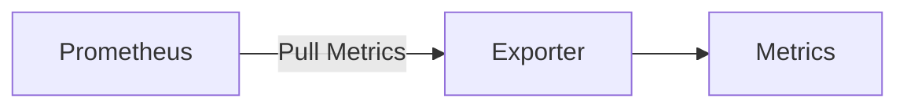

Push Model

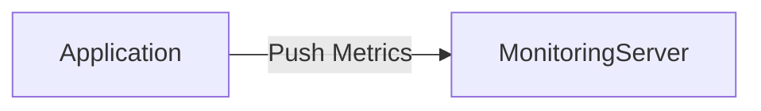

---

## Key Components

| Component | Pull | Push |
|-----------|------|------|
| Collector | Prometheus | Agent/Application |
| Direction | Server requests metrics | Client sends metrics |
| Health Check | Built-in | External |

---

## Types (if applicable)

- Pull Model
- Push Model

---

## Lifecycle / Workflow

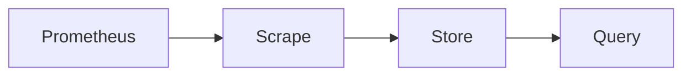

---

## Configuration / Syntax (if applicable)

```yaml
scrape_interval: 15s
```

---

## Important Commands (if applicable)

Not applicable.

---

## Important Files (if applicable)

prometheus.yml

---

## Real-World Use Cases

- Kubernetes monitoring
- Linux server monitoring
- Cloud monitoring

Push Gateway Use Cases

- Batch jobs
- Short-lived jobs

---

## Advantages

### Pull Model

- Easy discovery
- Health checking
- Simpler architecture

### Push Model

- Suitable for short-lived jobs

---

## Limitations

### Pull

- Target must be reachable

### Push

- Harder to detect stale metrics

---

## Common Interview Questions (Concept Only)

- What is the pull model?
- Why does Prometheus use pull?
- What is Pushgateway?

---

## Common Mistakes

- Using Pushgateway for long-running services
- Confusing pull with push architectures

---

## Troubleshooting

- Verify scrape targets
- Check network connectivity
- Validate scrape configuration

---

## Summary

Prometheus primarily uses a pull model, where it periodically scrapes metrics from targets. Push-based collection is supported only for specific scenarios, such as short-lived batch jobs.

---

# Monitoring Architecture

## Overview

Prometheus monitoring architecture consists of exporters exposing metrics, a Prometheus server scraping and storing those metrics, Grafana visualizing them, and Alertmanager sending notifications based on alert rules.

---

## Why It Is Used

The architecture provides:

- Centralized monitoring
- Efficient metric storage
- Flexible querying
- Scalable alerting

---

## Architecture / Working

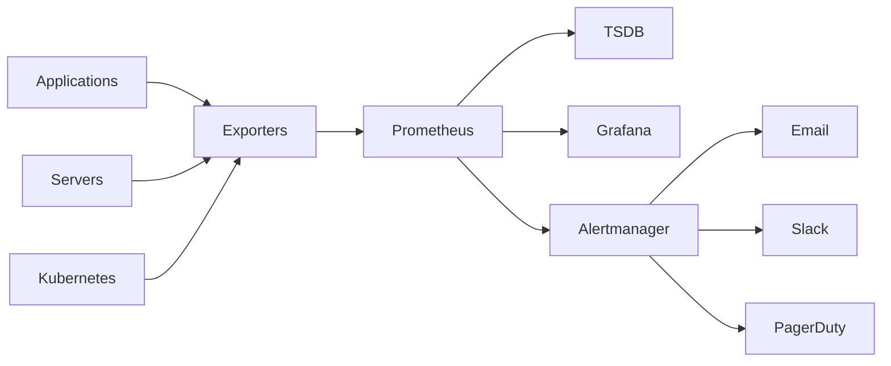

---

## Key Components

| Component | Purpose |
|-----------|---------|
| Exporters | Expose metrics |
| Prometheus | Scrapes and stores metrics |
| TSDB | Time-series database |
| PromQL | Query language |
| Grafana | Dashboards |
| Alertmanager | Notifications |

---

## Types (if applicable)

Deployment Models

- Single Prometheus Server
- High Availability
- Federation
- Remote Storage

---

## Lifecycle / Workflow

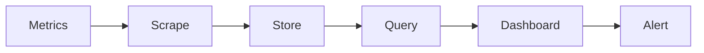

---

## Configuration / Syntax (if applicable)

```yaml
scrape_configs:
  - job_name: node
```

---

## Important Commands (if applicable)

```bash
prometheus

promtool check config prometheus.yml
```

---

## Important Files (if applicable)

| File | Purpose |
|------|---------|
| prometheus.yml | Main configuration |
| alert.rules.yml | Alert rules |
| alertmanager.yml | Alertmanager configuration |

---

## Real-World Use Cases

- Kubernetes monitoring
- Azure infrastructure monitoring
- AWS EC2 monitoring
- Docker monitoring
- Microservices monitoring

---

## Advantages

- Modular architecture
- Highly scalable
- Excellent Kubernetes integration
- Flexible visualization
- Powerful alerting

---

## Limitations

- Local storage by default
- Requires external tools for logs and traces
- Long-term storage requires additional solutions

---

## Common Interview Questions (Concept Only)

- Explain Prometheus architecture.
- What are exporters?
- What is the role of Grafana?
- What is Alertmanager?
- What is TSDB?

---

## Common Mistakes

- Assuming Grafana stores metrics
- Confusing exporters with Prometheus server
- Misconfiguring scrape targets

---

## Troubleshooting

| Problem | Cause | Solution |
|----------|--------|----------|
| No targets | Invalid scrape configuration | Check `prometheus.yml` |
| No dashboards | Grafana datasource issue | Verify Prometheus datasource |
| Alerts not firing | Incorrect alert rules | Validate rule files |

Useful Commands

```bash
promtool check config prometheus.yml

curl http://localhost:9090/api/v1/targets
```

---

## Summary

Prometheus monitoring architecture is built around exporters, the Prometheus server, TSDB, PromQL, Grafana, and Alertmanager. Together, these components provide scalable monitoring, visualization, and alerting for modern infrastructure and applications.
