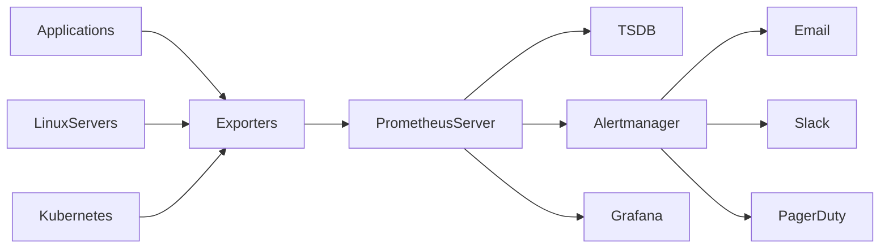
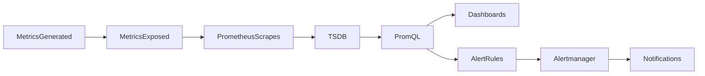
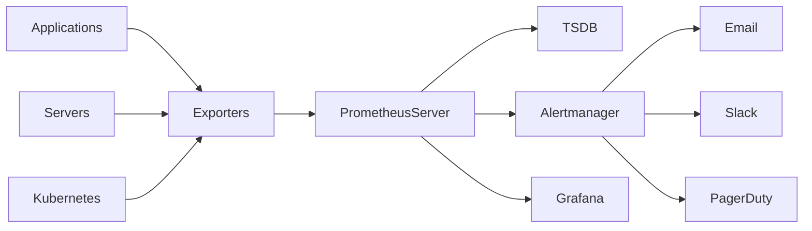
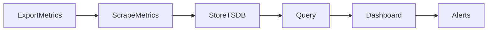
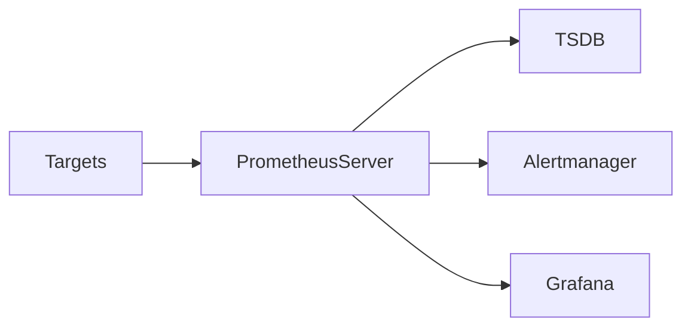
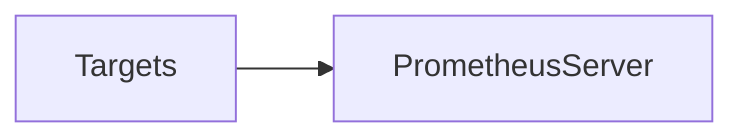
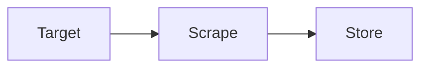
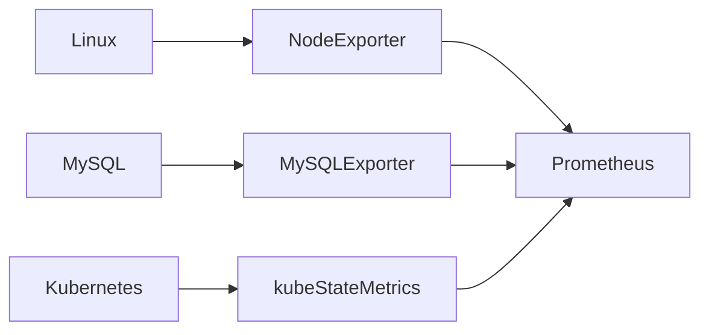
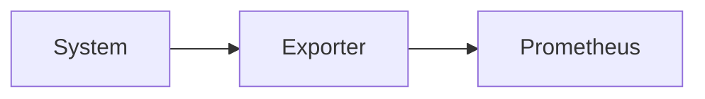
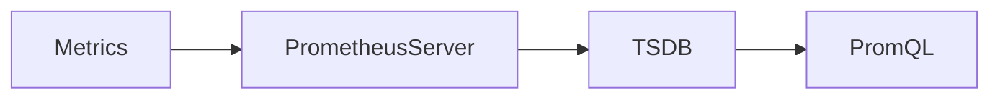

# Prometheus Fundamentals

## Overview

Prometheus is an **open-source monitoring and alerting toolkit** designed for collecting, storing, querying, and alerting on metrics from applications, servers, containers, Kubernetes clusters, cloud services, and other infrastructure.

It was originally developed at **SoundCloud** and is now a graduated project under the **Cloud Native Computing Foundation (CNCF)**.

Prometheus collects **time-series metrics** from monitored systems using a **pull-based model**, stores them in its built-in **Time-Series Database (TSDB)**, and allows querying through **PromQL**.

> **Interview Tip**
>
> Prometheus is used for **monitoring and alerting**, not for log management.
>
> - **Prometheus → Metrics**
> - **Grafana → Dashboards**
> - **Alertmanager → Notifications**
> - **Loki / ELK → Logs**
> - **Jaeger / Zipkin → Tracing**

---

## Why It Is Used

Prometheus is used to:

- Monitor infrastructure health
- Monitor application performance
- Collect system metrics
- Detect failures automatically
- Generate alerts
- Support Kubernetes monitoring
- Analyze historical performance
- Improve system reliability

---

## Architecture / Working



### Working Process

1. Applications expose metrics through exporters.
2. Prometheus periodically scrapes metrics.
3. Metrics are stored in the TSDB.
4. PromQL queries retrieve metric data.
5. Grafana visualizes metrics.
6. Alert rules trigger Alertmanager.
7. Alertmanager sends notifications.

---

## Key Components

| Component | Purpose |
|------------|----------|
| Prometheus Server | Collects and stores metrics |
| Targets | Systems being monitored |
| Exporters | Expose metrics |
| TSDB | Stores time-series data |
| PromQL | Query language |
| Alertmanager | Sends alerts |
| Grafana | Visualization |

---

## Types (if applicable)

Prometheus can monitor:

### Infrastructure

- Linux
- Windows
- Virtual Machines
- Cloud Instances

### Applications

- Java
- Python
- Go
- .NET
- Node.js

### Containers

- Docker
- Kubernetes

### Databases

- MySQL
- PostgreSQL
- MongoDB
- Redis

---

## Lifecycle / Workflow



---

## Configuration / Syntax (if applicable)

Example scrape configuration

```yaml
scrape_configs:
  - job_name: "node"

    static_configs:
      - targets:
          - localhost:9100
```

---

## Important Commands (if applicable)

Start Prometheus

```bash
prometheus
```

Validate configuration

```bash
promtool check config prometheus.yml
```

Reload configuration

```bash
curl -X POST http://localhost:9090/-/reload
```

---

## Important Files (if applicable)

| File | Purpose |
|------|----------|
| prometheus.yml | Main configuration |
| alert.rules.yml | Alert rules |
| alertmanager.yml | Alertmanager configuration |
| prometheus.db | Time-series database |

---

## Real-World Use Cases

- Kubernetes monitoring
- Azure VM monitoring
- AWS EC2 monitoring
- API monitoring
- Database monitoring
- Container monitoring
- Infrastructure health monitoring

---

## Advantages

- Open source
- Pull-based architecture
- Powerful query language
- Native Kubernetes integration
- Fast querying
- Multi-dimensional metrics
- Easy Grafana integration

---

## Limitations

- Stores metrics only
- Local storage by default
- High-cardinality metrics increase storage usage
- Requires external long-term storage for very large deployments

---

## Common Interview Questions (Concept Only)

- What is Prometheus?
- Why is Prometheus popular?
- How does Prometheus collect metrics?
- What is PromQL?
- What are exporters?
- What are targets?
- What is TSDB?

---

## Common Mistakes

- Confusing logs with metrics
- Exposing unnecessary metrics
- Using excessive labels
- Assuming Prometheus pushes metrics
- Ignoring alert configuration

---

## Troubleshooting

| Problem | Cause | Solution |
|----------|--------|----------|
| Prometheus not scraping | Incorrect target | Verify scrape configuration |
| No metrics | Exporter down | Start exporter |
| Configuration error | Invalid YAML | Validate using promtool |
| Missing alerts | Rule not loaded | Verify alert rules |

Useful Commands

```bash
promtool check config prometheus.yml

curl http://localhost:9090/api/v1/targets
```

---

## Summary

Prometheus is an open-source monitoring and alerting system that collects metrics using a pull-based model, stores them in a time-series database, and integrates with Grafana and Alertmanager to provide complete monitoring for cloud-native infrastructure.

---

# Prometheus Architecture

## Overview

Prometheus architecture consists of multiple components working together to collect, store, query, visualize, and alert on monitoring data.

The architecture is designed to be simple, scalable, and cloud-native.

---

## Why It Is Used

The architecture enables:

- Centralized monitoring
- Efficient metric collection
- Historical analysis
- Alert generation
- Dashboard visualization

---

## Architecture / Working



---

## Key Components

| Component | Purpose |
|-----------|---------|
| Prometheus Server | Scrapes metrics |
| Exporters | Expose metrics |
| Targets | Endpoints monitored |
| TSDB | Stores metrics |
| PromQL | Query language |
| Grafana | Dashboards |
| Alertmanager | Notifications |

---

## Types (if applicable)

Deployment Models

- Single Server
- High Availability
- Federation
- Remote Storage

---

## Lifecycle / Workflow



---

## Configuration / Syntax (if applicable)

```yaml
global:
  scrape_interval: 15s
```

---

## Important Commands (if applicable)

```bash
prometheus

promtool check config prometheus.yml
```

---

## Important Files (if applicable)

- prometheus.yml
- alert.rules.yml

---

## Real-World Use Cases

- Kubernetes clusters
- Cloud monitoring
- Microservices monitoring

---

## Advantages

- Modular architecture
- Scalable
- Easy integration

---

## Limitations

- Requires exporters
- Local storage by default

---

## Common Interview Questions (Concept Only)

- Explain Prometheus architecture.
- What are the major components?
- How does Prometheus collect metrics?

---

## Common Mistakes

- Forgetting exporters
- Wrong scrape intervals
- Missing alert rules

---

## Troubleshooting

- Verify exporters
- Verify targets
- Validate configuration

---

## Summary

Prometheus architecture is composed of exporters, Prometheus Server, TSDB, Alertmanager, and Grafana working together to provide end-to-end monitoring.

---

# Prometheus Server

## Overview

The Prometheus Server is the **core component** responsible for scraping metrics, storing them in TSDB, executing PromQL queries, evaluating alert rules, and exposing APIs.

Everything in Prometheus revolves around the server.

> **Interview Tip**
>
> The Prometheus Server does **not** collect metrics automatically. It periodically **scrapes configured targets**.

---

## Why It Is Used

The Prometheus Server:

- Collects metrics
- Stores metrics
- Executes PromQL
- Evaluates alert rules
- Provides APIs
- Serves the web UI

---

## Architecture / Working



---

## Key Components

| Component | Purpose |
|-----------|---------|
| Scraper | Collects metrics |
| TSDB | Stores metrics |
| PromQL Engine | Queries metrics |
| Alert Engine | Evaluates rules |
| HTTP API | Serves data |

---

## Types (if applicable)

Server Responsibilities

- Scraping
- Storage
- Querying
- Alerting

---

## Lifecycle / Workflow


---

## Configuration / Syntax (if applicable)

```yaml
global:
  scrape_interval: 15s
```

---

## Important Commands (if applicable)

```bash
prometheus

curl http://localhost:9090
```

---

## Important Files (if applicable)

- prometheus.yml

---

## Real-World Use Cases

- Monitor Kubernetes
- Monitor cloud VMs
- Infrastructure monitoring

---

## Advantages

- Fast
- Reliable
- Efficient

---

## Limitations

- Requires exporters
- Local storage limitations

---

## Common Interview Questions (Concept Only)

- What is the Prometheus Server?
- What are its responsibilities?
- Does Prometheus push or pull metrics?

---

## Common Mistakes

- Confusing the server with exporters
- Forgetting scrape configuration

---

## Troubleshooting

- Check Prometheus logs
- Validate configuration
- Verify targets

---

## Summary

The Prometheus Server is the central monitoring engine responsible for collecting, storing, querying, and alerting on metrics.

---

# Targets

## Overview

Targets are the systems or applications that Prometheus monitors by scraping their metrics endpoints.

Every monitored endpoint is considered a target.

Examples:

- Linux servers
- Kubernetes Pods
- Applications
- Exporters

---

## Why It Is Used

Targets provide metrics for Prometheus to collect.

---

## Architecture / Working



---

## Key Components

| Component | Purpose |
|-----------|---------|
| Target | Metrics source |
| Endpoint | `/metrics` URL |

---

## Types (if applicable)

Common Targets

- Node Exporter
- cAdvisor
- Applications
- Kubernetes

---

## Lifecycle / Workflow



---

## Configuration / Syntax (if applicable)

```yaml
targets:
  - localhost:9100
```

---

## Important Commands (if applicable)

```
http://localhost:9090/targets
```

---

## Important Files (if applicable)

prometheus.yml

---

## Real-World Use Cases

- Monitor Linux
- Monitor APIs
- Monitor Kubernetes

---

## Advantages

- Flexible
- Easy discovery

---

## Limitations

- Must expose metrics endpoint

---

## Common Interview Questions (Concept Only)

- What is a target?
- How does Prometheus discover targets?

---

## Common Mistakes

- Wrong IP
- Wrong port
- Missing exporter

---

## Troubleshooting

- Verify endpoint
- Check targets page

---

## Summary

Targets are monitored endpoints that expose metrics for Prometheus to scrape.

---

# Exporters

## Overview

Exporters are lightweight applications that collect metrics from systems or applications and expose them in the Prometheus format.

Prometheus scrapes exporters rather than directly querying most operating systems or services.

> **Interview Tip**
>
> Prometheus usually **does not collect metrics directly** from Linux, MySQL, or Kubernetes. It collects them through exporters.

---

## Why It Is Used

Exporters:

- Collect system metrics
- Convert metrics to Prometheus format
- Expose `/metrics`

---

## Architecture / Working



---

## Key Components

| Exporter | Monitors |
|-----------|----------|
| Node Exporter | Linux |
| Windows Exporter | Windows |
| MySQL Exporter | MySQL |
| Blackbox Exporter | HTTP/DNS/TCP |
| cAdvisor | Containers |
| kube-state-metrics | Kubernetes |

---

## Types (if applicable)

- Infrastructure Exporters
- Database Exporters
- Application Exporters
- Cloud Exporters

---

## Lifecycle / Workflow



---

## Configuration / Syntax (if applicable)

Metrics Endpoint

```
http://localhost:9100/metrics
```

---

## Important Commands (if applicable)

```bash
curl http://localhost:9100/metrics
```

---

## Important Files (if applicable)

Exporter configuration files

---

## Real-World Use Cases

- Linux monitoring
- Kubernetes monitoring
- Database monitoring

---

## Advantages

- Lightweight
- Easy deployment
- Standard metric format

---

## Limitations

- Separate exporter needed for each technology

---

## Common Interview Questions (Concept Only)

- What is an exporter?
- Why are exporters required?
- Name common exporters.

---

## Common Mistakes

- Wrong exporter version
- Wrong metrics endpoint
- Exporter not running

---

## Troubleshooting

- Check exporter service
- Verify `/metrics`

---

## Summary

Exporters expose metrics in the Prometheus format, allowing Prometheus to monitor a wide variety of infrastructure and applications.

---

# Time-Series Database (TSDB)

## Overview

The Time-Series Database (TSDB) is Prometheus's built-in storage engine that stores metrics as **time-series data**.

Each data point contains:

- Metric name
- Timestamp
- Value
- Labels

---

## Why It Is Used

TSDB enables:

- Historical analysis
- Trend monitoring
- Alert evaluation
- Fast querying

---

## Architecture / Working



---

## Key Components

| Component | Purpose |
|-----------|---------|
| Metric | Measurement |
| Timestamp | Collection time |
| Labels | Metadata |
| Value | Numeric value |

---

## Types (if applicable)

Storage Components

- WAL
- Blocks
- Chunks
- Index

---

## Lifecycle / Workflow


---

## Configuration / Syntax (if applicable)

Retention Example

```bash
--storage.tsdb.retention.time=15d
```

---

## Important Commands (if applicable)

View storage statistics

```
http://localhost:9090/status
```

---

## Important Files (if applicable)

| File | Purpose |
|------|----------|
| data/ | TSDB storage |
| wal/ | Write Ahead Log |

---

## Real-World Use Cases

- Historical CPU trends
- Capacity planning
- Performance analysis
- Alert evaluation

---

## Advantages

- Optimized for metrics
- Fast querying
- Efficient compression

---

## Limitations

- Not suitable for logs
- Long retention requires additional storage planning

---

## Common Interview Questions (Concept Only)

- What is TSDB?
- What does TSDB store?
- Why is TSDB optimized for monitoring?

---

## Common Mistakes

- Excessive retention
- High-cardinality labels
- Confusing TSDB with relational databases

---

## Troubleshooting

| Problem | Cause | Solution |
|----------|--------|----------|
| High disk usage | Long retention | Reduce retention period |
| Slow queries | High-cardinality metrics | Optimize labels |
| Missing data | Storage corruption | Verify TSDB health |

Useful Commands

```bash
promtool tsdb analyze data/
```

---

## Summary

The Time-Series Database (TSDB) is Prometheus's built-in storage engine that efficiently stores timestamped metrics, enabling fast queries, historical analysis, and alert evaluation while optimizing storage through compression.
