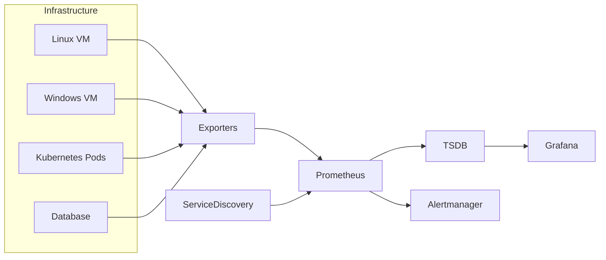
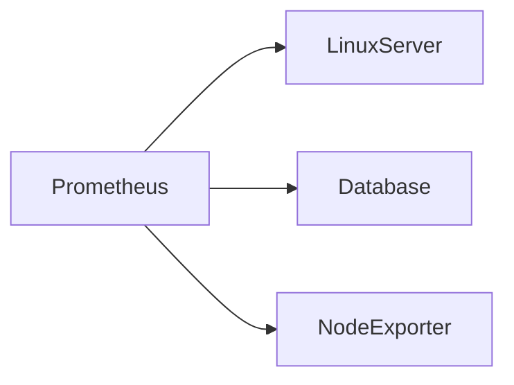
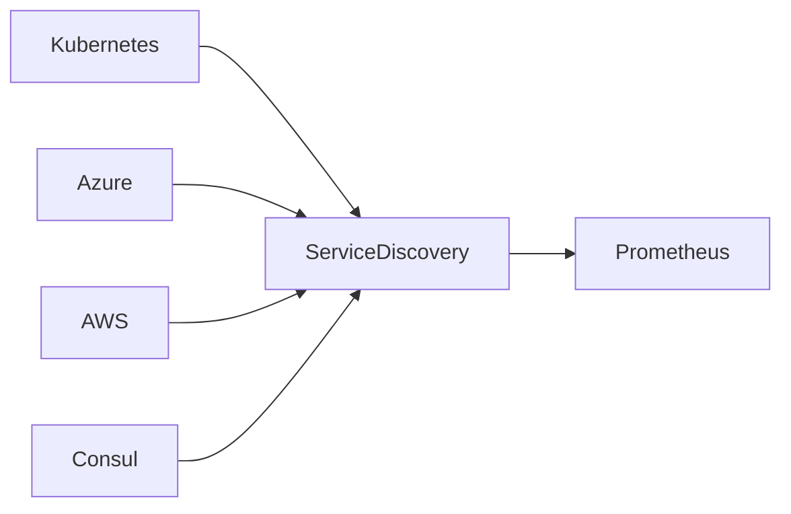
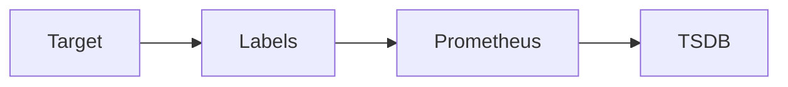
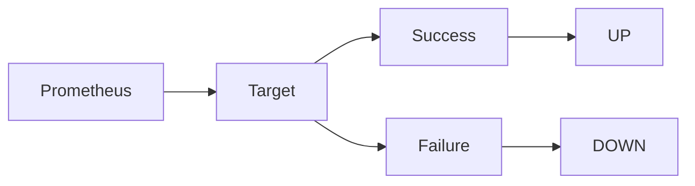

# Targets & Service Discovery

## Overview

Prometheus collects metrics by **scraping targets**. A **target** is any application, server, container, or exporter that exposes metrics over an HTTP endpoint (typically `/metrics`).

As infrastructure grows, manually maintaining target lists becomes difficult. **Service Discovery (SD)** enables Prometheus to automatically discover targets from cloud providers, Kubernetes, Consul, and other environments.

> **Interview Tip**
>
> Prometheus supports two methods of discovering targets:
>
> - **Static Targets** → Manual configuration (common in small environments)
> - **Service Discovery** → Automatic discovery (used in production)

---

## Why It Is Used

Targets and Service Discovery help to:

- Automatically monitor infrastructure
- Eliminate manual target management
- Detect newly created servers or containers
- Remove unavailable targets automatically
- Scale monitoring in dynamic environments

---

## Architecture / Working



### Working Process

1. Systems expose metrics.
2. Prometheus discovers targets.
3. Prometheus scrapes `/metrics`.
4. Metrics are stored in TSDB.
5. Grafana visualizes metrics.
6. Alert rules evaluate collected data.

---

## Key Components

| Component | Purpose |
|-----------|---------|
| Target | System being monitored |
| Metrics Endpoint | URL exposing metrics |
| Scrape Job | Defines how targets are scraped |
| Service Discovery | Automatically finds targets |
| Labels | Identify and categorize targets |
| Target Status | Health of monitored endpoint |

---

## Types (if applicable)

### Target Discovery Methods

| Type | Description | Used In |
|------|-------------|----------|
| Static Targets | Manually defined IPs/Hostnames | Small environments |
| Kubernetes SD | Discovers Pods, Nodes, Services | Kubernetes |
| Azure SD | Discovers Azure resources | Azure |
| AWS EC2 SD | Discovers EC2 instances | AWS |
| Consul SD | Discovers services | Service Mesh |
| File SD | Reads targets from files | Dynamic environments |

---

## Lifecycle / Workflow


---

## Configuration / Syntax (if applicable)

Static Target Example

```yaml
scrape_configs:
  - job_name: "node-exporter"

    static_configs:
      - targets:
          - 192.168.1.10:9100
          - 192.168.1.11:9100
```

---

## Important Commands (if applicable)

View Targets

```
http://localhost:9090/targets
```

Check Target Metadata

```
http://localhost:9090/service-discovery
```

Validate Configuration

```bash
promtool check config prometheus.yml
```

Reload Configuration

```bash
curl -X POST http://localhost:9090/-/reload
```

---

## Important Files (if applicable)

| File | Purpose |
|------|----------|
| prometheus.yml | Defines scrape jobs and targets |
| targets.json | File-based service discovery (optional) |

---

## Real-World Use Cases

- Monitor Linux servers
- Monitor Kubernetes clusters
- Monitor Azure Virtual Machines
- Monitor AWS EC2 instances
- Monitor databases
- Monitor microservices
- Auto-discover cloud resources

---

## Advantages

- Supports dynamic infrastructure
- Automatic target discovery
- Easy integration with cloud platforms
- Reduces manual configuration
- Scales efficiently

---

## Limitations

- Service discovery configuration can be complex
- Incorrect labels may create duplicate metrics
- Dynamic environments require proper relabeling
- Large numbers of targets increase scrape load

---

## Common Interview Questions (Concept Only)

- What is a target in Prometheus?
- What is Service Discovery?
- Why is Service Discovery important?
- What is the difference between static targets and service discovery?
- How does Prometheus discover Kubernetes Pods?
- How does Prometheus know whether a target is healthy?

---

## Common Mistakes

- Using static targets in highly dynamic environments
- Incorrect target IP addresses or ports
- Forgetting to expose the `/metrics` endpoint
- Duplicate target definitions
- Incorrect label configuration
- Forgetting to reload Prometheus after configuration changes

---

## Troubleshooting

| Problem | Cause | Solution |
|----------|--------|----------|
| Target Down | Exporter not running | Verify exporter service |
| Scrape Failed | Wrong IP or port | Check target endpoint |
| Missing Metrics | Incorrect metrics path | Verify `/metrics` URL |
| Duplicate Metrics | Duplicate target configuration | Remove duplicate targets |
| Target Not Discovered | Service discovery misconfigured | Verify discovery configuration |

Useful Commands

```bash
promtool check config prometheus.yml

curl http://localhost:9090/api/v1/targets

curl -X POST http://localhost:9090/-/reload
```

---

## Summary

Targets are the systems monitored by Prometheus. Service Discovery automatically finds these systems, making monitoring scalable and production-ready. Static targets are suitable for small environments, while dynamic service discovery is preferred for Kubernetes and cloud-native deployments.

---

# Static Targets

## Overview

Static Targets are manually defined monitoring endpoints specified directly in the `prometheus.yml` configuration file.

Prometheus periodically scrapes these endpoints to collect metrics.

> **Interview Tip**
>
> Static targets are the easiest way to configure Prometheus and are commonly used in interview demonstrations and lab environments.

---

## Why It Is Used

Static targets are used when:

- Infrastructure rarely changes
- Small environments are monitored
- Learning Prometheus
- Testing exporters

---

## Architecture / Working



---

## Key Components

| Component | Purpose |
|-----------|---------|
| Job Name | Logical monitoring group |
| Target | IP or hostname |
| Port | Exporter port |
| Metrics Path | Usually `/metrics` |

---

## Types (if applicable)

Static Configuration

- Single Target
- Multiple Targets
- Multiple Jobs

---

## Lifecycle / Workflow


---

## Configuration / Syntax (if applicable)

```yaml
scrape_configs:
  - job_name: "linux"

    static_configs:
      - targets:
          - server1:9100
          - server2:9100
```

---

## Important Commands (if applicable)

View Targets

```
http://localhost:9090/targets
```

---

## Important Files (if applicable)

- prometheus.yml

---

## Real-World Use Cases

- Small Linux environments
- Lab environments
- Static infrastructure
- Development servers

---

## Advantages

- Very simple
- Easy to configure
- Easy to understand

---

## Limitations

- Manual maintenance
- Not suitable for auto-scaling environments
- Poor scalability

---

## Common Interview Questions (Concept Only)

- What are static targets?
- When should static targets be used?
- How are multiple static targets configured?

---

## Common Mistakes

- Wrong hostname
- Wrong exporter port
- Forgetting configuration reload

---

## Troubleshooting

- Verify target IP
- Check exporter
- Validate configuration

---

## Summary

Static targets are manually configured endpoints that Prometheus scrapes. They are simple to use but are best suited for small, stable environments.

---

# Service Discovery Concepts

## Overview

Service Discovery enables Prometheus to automatically discover monitoring targets instead of manually defining them.

This is essential in cloud-native environments where servers, containers, and Pods are frequently created and destroyed.

> **Interview Tip**
>
> In Kubernetes and cloud environments, **Service Discovery** is preferred over static targets because infrastructure changes dynamically.

---

## Why It Is Used

Service Discovery helps to:

- Automatically discover resources
- Eliminate manual updates
- Support auto-scaling
- Monitor ephemeral workloads

---

## Architecture / Working



---

## Key Components

| Component | Purpose |
|-----------|---------|
| Discovery Mechanism | Finds targets |
| Labels | Metadata |
| Relabeling | Modify discovered labels |
| Scrape Job | Uses discovered targets |

---

## Types (if applicable)

Supported Discovery Methods

- Kubernetes
- Azure
- AWS EC2
- Consul
- DNS
- File-based

---

## Lifecycle / Workflow


---

## Configuration / Syntax (if applicable)

Example (Kubernetes SD)

```yaml
kubernetes_sd_configs:
  - role: pod
```

---

## Important Commands (if applicable)

View Service Discovery

```
http://localhost:9090/service-discovery
```

---

## Important Files (if applicable)

- prometheus.yml

---

## Real-World Use Cases

- Kubernetes monitoring
- Azure VM monitoring
- AWS EC2 monitoring
- Container monitoring

---

## Advantages

- Automatic discovery
- Production ready
- Cloud native

---

## Limitations

- More complex than static targets
- Requires provider configuration

---

## Common Interview Questions (Concept Only)

- What is Service Discovery?
- Why is Service Discovery preferred?
- Name common discovery mechanisms.

---

## Common Mistakes

- Incorrect discovery configuration
- Missing permissions
- Wrong relabeling

---

## Troubleshooting

- Verify discovery page
- Verify permissions
- Check Prometheus logs

---

## Summary

Service Discovery automatically identifies monitoring targets, making Prometheus scalable and suitable for modern cloud environments.

---

# Target Labels

## Overview

Labels are **key-value pairs** attached to metrics and targets that provide metadata for filtering, grouping, and querying.

Examples:

- `job`
- `instance`
- `environment`
- `region`
- `cluster`

> **Interview Tip**
>
> Labels are one of the most important concepts in Prometheus because they uniquely identify time-series data and enable powerful PromQL queries.

---

## Why It Is Used

Labels help to:

- Identify targets
- Filter metrics
- Group metrics
- Compare environments
- Support dashboards

---

## Architecture / Working



---

## Key Components

| Label | Example |
|--------|----------|
| job | node-exporter |
| instance | server1:9100 |
| environment | production |
| region | eastus |

---

## Types (if applicable)

Label Categories

- Built-in Labels
- Custom Labels
- Discovery Labels

---

## Lifecycle / Workflow


---

## Configuration / Syntax (if applicable)

```yaml
labels:
  environment: production
  team: devops
```

---

## Important Commands (if applicable)

Query Labels

```
up{job="node-exporter"}
```

---

## Important Files (if applicable)

prometheus.yml

---

## Real-World Use Cases

- Environment filtering
- Multi-region monitoring
- Team ownership
- Cluster identification

---

## Advantages

- Flexible filtering
- Better organization
- Powerful querying

---

## Limitations

- High-cardinality labels increase storage usage
- Poor label design affects performance

---

## Common Interview Questions (Concept Only)

- What are labels?
- Why are labels important?
- What is label cardinality?

---

## Common Mistakes

- Using unique IDs as labels
- Excessive label values
- Inconsistent naming

---

## Troubleshooting

- Review labels in Prometheus UI
- Reduce unnecessary labels
- Standardize label naming

---

## Summary

Labels enrich metrics with metadata, enabling efficient filtering, grouping, and querying while serving as the foundation of Prometheus's multidimensional data model.

---

# Target Health

## Overview

Target Health indicates whether Prometheus is successfully scraping metrics from a configured target.

Each target is assigned a health status based on the outcome of the latest scrape.

> **Interview Tip**
>
> A target marked **DOWN** does not always mean the monitored application is down. It often indicates that Prometheus cannot reach the metrics endpoint due to network, configuration, or exporter issues.

---

## Why It Is Used

Target Health helps administrators:

- Verify monitoring status
- Detect scrape failures
- Troubleshoot connectivity
- Identify exporter problems

---

## Architecture / Working



---

## Key Components

| Component | Purpose |
|-----------|---------|
| Target | Monitored endpoint |
| Health Status | UP or DOWN |
| Last Scrape | Most recent scrape time |
| Last Error | Latest scrape error |

---

## Types (if applicable)

Health States

| Status | Meaning |
|--------|----------|
| UP | Metrics successfully collected |
| DOWN | Scrape failed |

---

## Lifecycle / Workflow


---

## Configuration / Syntax (if applicable)

Health can be viewed in the Prometheus web UI:

```
http://localhost:9090/targets
```

---

## Important Commands (if applicable)

Check Targets

```
http://localhost:9090/targets
```

Query Health

```promql
up
```

Check Failed Targets

```promql
up == 0
```

---

## Important Files (if applicable)

- prometheus.yml

---

## Real-World Use Cases

- Monitor exporter availability
- Detect monitoring failures
- Validate infrastructure health
- Trigger alerts for unreachable targets

---

## Advantages

- Quick visibility into monitoring status
- Simplifies troubleshooting
- Supports alerting based on target availability

---

## Limitations

- Indicates scrape status only
- Does not always reflect application health

---

## Common Interview Questions (Concept Only)

- What does a target status of **DOWN** mean?
- How do you check target health?
- Which PromQL query displays target availability?
- What causes scrape failures?

---

## Common Mistakes

- Assuming **DOWN** means the application has failed
- Ignoring exporter availability
- Using incorrect ports or metrics paths
- Forgetting firewall or network rules

---

## Troubleshooting

| Problem | Cause | Solution |
|----------|--------|----------|
| Target DOWN | Exporter stopped | Restart exporter |
| Connection Refused | Wrong port | Verify listening port |
| Timeout | Network issue | Check firewall and routing |
| 404 Error | Incorrect metrics path | Verify `/metrics` endpoint |
| Authentication Failure | Invalid credentials | Update authentication settings |

Useful Commands

```promql
up

up == 0
```

```bash
curl http://localhost:9090/api/v1/targets
```

---

## Summary

Target Health shows whether Prometheus can successfully scrape a monitored endpoint. Monitoring the `UP` metric and the Targets page helps quickly identify connectivity, exporter, or configuration issues before they affect observability.
