# Prometheus Metrics

## Overview

Metrics are **numeric measurements** that describe the current or historical state of an application, server, container, or service.

Prometheus stores metrics as **time-series data**, where each metric consists of:

- Metric name
- Value
- Timestamp
- Labels

Every time Prometheus scrapes a target, it stores a new sample in its Time-Series Database (TSDB).

> **Interview Tip**
>
> Every Prometheus metric is identified by:
>
> **Metric Name + Labels + Timestamp + Value**
>
> Understanding the four Prometheus metric types (**Counter, Gauge, Histogram, Summary**) is one of the most common interview topics.

---

## Why It Is Used

Metrics help to:

- Monitor application performance
- Monitor infrastructure health
- Detect failures
- Trigger alerts
- Create dashboards
- Perform capacity planning
- Analyze trends over time

---

## Architecture / Working

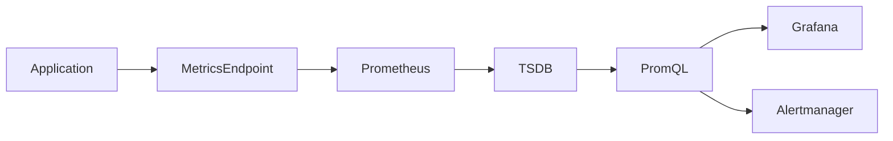

### Working Process

1. Applications generate metrics.
2. Metrics are exposed through `/metrics`.
3. Prometheus scrapes metrics.
4. Metrics are stored in TSDB.
5. PromQL queries retrieve metric data.
6. Grafana visualizes metrics.
7. Alertmanager generates alerts.

---

## Key Components

| Component | Purpose |
|-----------|---------|
| Metric Name | Identifies the metric |
| Labels | Additional metadata |
| Timestamp | Collection time |
| Value | Numeric measurement |
| PromQL | Query language |
| TSDB | Stores time-series data |

---

## Types (if applicable)

Prometheus supports four metric types:

| Metric Type | Purpose |
|-------------|----------|
| Counter | Increasing value |
| Gauge | Current value |
| Histogram | Distribution of values |
| Summary | Quantile calculations |

---

## Lifecycle / Workflow

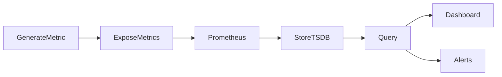

---

## Configuration / Syntax (if applicable)

Example Metrics

```text
http_requests_total 1523

memory_usage_bytes 73400320

cpu_usage_percent 45
```

---

## Important Commands (if applicable)

Query All Metrics

```
http://localhost:9090/graph
```

View Raw Metrics

```bash
curl http://localhost:9100/metrics
```

---

## Important Files (if applicable)

| File | Purpose |
|------|----------|
| prometheus.yml | Metric collection configuration |

---

## Real-World Use Cases

- CPU monitoring
- Memory monitoring
- API monitoring
- Database monitoring
- Kubernetes monitoring
- Business KPI monitoring

---

## Advantages

- Lightweight
- Time-series optimized
- Supports powerful querying
- Excellent visualization support

---

## Limitations

- Numeric values only
- Not suitable for logs
- High-cardinality metrics consume storage

---

## Common Interview Questions (Concept Only)

- What is a Prometheus metric?
- What is time-series data?
- What information does a metric contain?
- Name the four metric types.
- How are metrics stored?

---

## Common Mistakes

- Using the wrong metric type
- Excessive labels
- High-cardinality metrics
- Confusing metrics with logs

---

## Troubleshooting

| Problem | Cause | Solution |
|----------|--------|----------|
| No metrics | Exporter unavailable | Verify exporter |
| Missing metric | Wrong metric name | Check `/metrics` endpoint |
| High storage usage | High-cardinality labels | Reduce label combinations |
| Query returns nothing | Incorrect metric name | Verify PromQL query |

Useful Commands

```bash
curl http://localhost:9100/metrics

curl http://localhost:9090/api/v1/query?query=up
```

---

## Summary

Prometheus metrics are timestamped numeric measurements used to monitor infrastructure and applications. They form the foundation of Prometheus monitoring and are stored as time-series data for querying, visualization, and alerting.

---

# Metric Types

## Overview

Prometheus defines **four metric types**, each designed for a specific monitoring scenario.

Choosing the correct metric type is essential for accurate monitoring and querying.

| Metric Type | Use Case |
|-------------|----------|
| Counter | Values that only increase |
| Gauge | Current values that increase or decrease |
| Histogram | Distribution of observations |
| Summary | Quantiles and latency measurements |

> **Interview Tip**
>
> One of the most frequently asked Prometheus interview questions is:
>
> **"When should you use Counter vs Gauge vs Histogram vs Summary?"**

---

## Why It Is Used

Metric types help model different kinds of measurements correctly.

---

## Architecture / Working

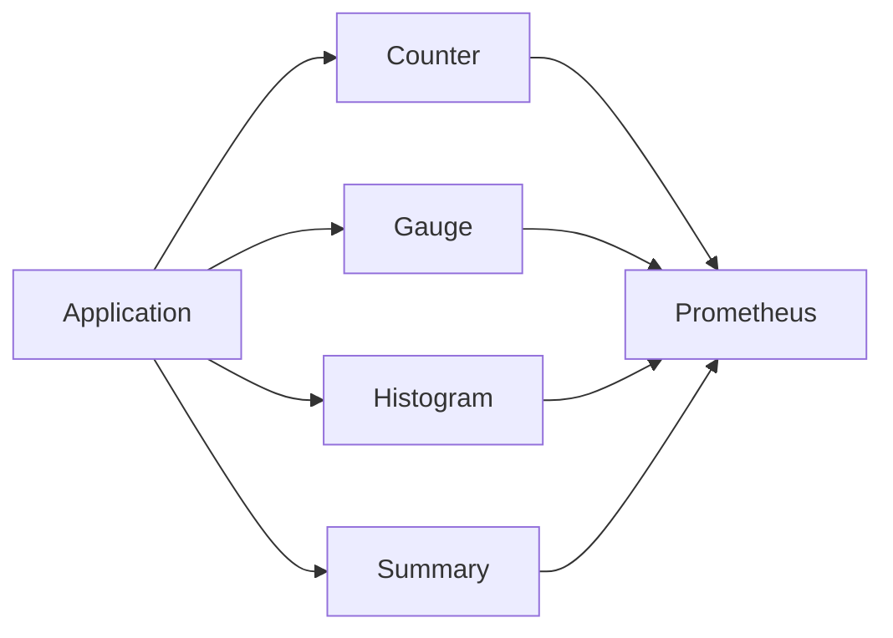

---

## Key Components

| Metric | Characteristics |
|----------|----------------|
| Counter | Monotonically increasing |
| Gauge | Can increase or decrease |
| Histogram | Buckets observations |
| Summary | Calculates quantiles |

---

## Types (if applicable)

- Counter
- Gauge
- Histogram
- Summary

---

## Lifecycle / Workflow

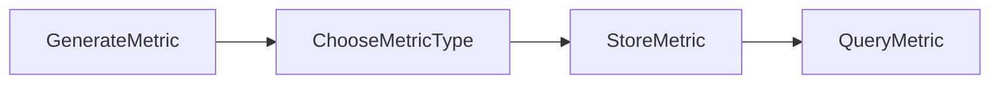

---

## Configuration / Syntax (if applicable)

Example Metric Names

```text
http_requests_total

memory_usage_bytes

http_request_duration_seconds_bucket

http_request_duration_seconds
```

---

## Important Commands (if applicable)

View Metrics

```bash
curl http://localhost:9100/metrics
```

---

## Important Files (if applicable)

No additional files.

---

## Real-World Use Cases

- Request counting
- CPU usage
- Response time monitoring
- Database latency

---

## Advantages

- Specialized metric behavior
- Accurate monitoring
- Efficient querying

---

## Limitations

- Wrong metric type leads to inaccurate monitoring

---

## Common Interview Questions (Concept Only)

- Name the four Prometheus metric types.
- Which metric type is used for CPU usage?
- Which metric type is used for request count?
- Difference between Histogram and Summary?

---

## Common Mistakes

- Using Counter for CPU usage
- Using Gauge for request count
- Confusing Histogram and Summary

---

## Troubleshooting

- Verify metric type
- Review Prometheus documentation
- Check exporter implementation

---

## Summary

Prometheus provides four metric types to model different monitoring scenarios accurately. Selecting the correct type improves dashboard accuracy, alerting, and query performance.

---

# Counter

## Overview

A **Counter** is a metric that **only increases** over time.

It can only:

- Increase
- Reset to zero when the application restarts

Counters never decrease during normal operation.

> **Interview Tip**
>
> If a value represents **how many times something happened**, it is almost always a **Counter**.

---

## Why It Is Used

Counters measure cumulative events.

Examples:

- HTTP requests
- Login attempts
- Errors
- Transactions
- Packets sent

---

## Architecture / Working

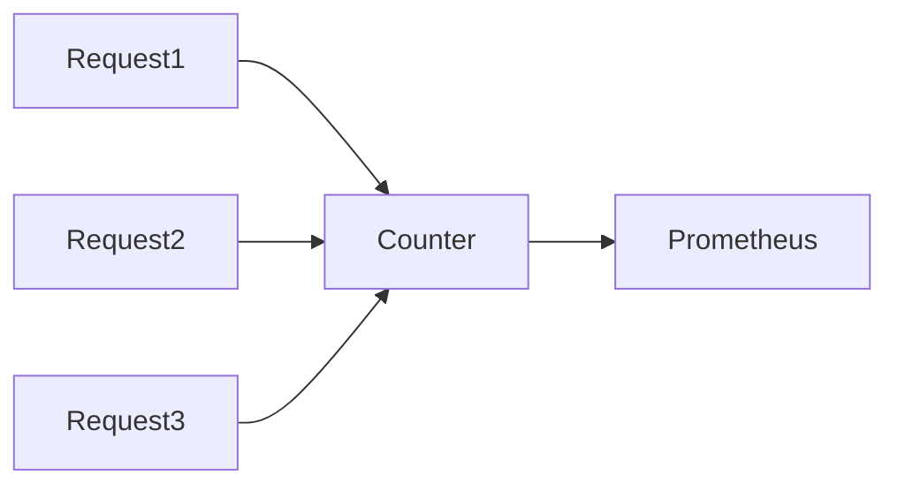

---

## Key Components

| Property | Value |
|----------|-------|
| Direction | Increasing only |
| Reset | Application restart |
| Query | Usually uses `rate()` |

---

## Types (if applicable)

Common Counters

- HTTP Requests
- Error Count
- Login Count
- API Calls

---

## Lifecycle / Workflow

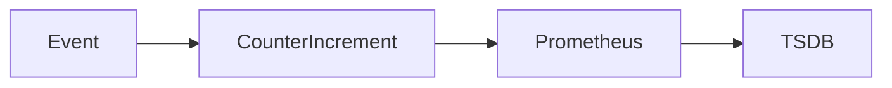

---

## Configuration / Syntax (if applicable)

Example

```text
http_requests_total 1523
```

---

## Important Commands (if applicable)

PromQL

```promql
http_requests_total

rate(http_requests_total[5m])

increase(http_requests_total[1h])
```

---

## Important Files (if applicable)

No additional files.

---

## Real-World Use Cases

- API requests
- Failed logins
- Orders processed
- Database queries

---

## Advantages

- Simple
- Efficient
- Ideal for rates

---

## Limitations

- Cannot decrease
- Requires `rate()` for trend analysis

---

## Common Interview Questions (Concept Only)

- What is a Counter?
- Can Counter decrease?
- Why does Counter reset?
- Which PromQL functions are commonly used with Counter?

---

## Common Mistakes

- Using Counter for CPU usage
- Forgetting counters reset after restart

---

## Troubleshooting

- Verify exporter implementation
- Use `rate()` instead of raw values
- Check for application restarts

---

## Summary

Counters track cumulative events that only increase, making them ideal for monitoring requests, errors, transactions, and other event counts.

---

# Gauge

## Overview

A **Gauge** is a metric whose value can **increase or decrease** at any time.

It represents the current state of a resource.

> **Interview Tip**
>
> If the value can go **up and down**, use a **Gauge**.

---

## Why It Is Used

Typical Gauge metrics include:

- CPU utilization
- Memory usage
- Active sessions
- Queue length
- Disk usage

---

## Architecture / Working

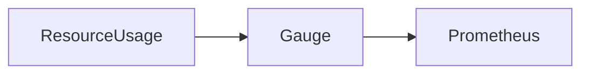

---

## Key Components

| Property | Value |
|----------|-------|
| Direction | Increase or decrease |
| Reset | Not applicable |
| Represents | Current state |

---

## Types (if applicable)

Common Gauges

- CPU Usage
- Memory Usage
- Temperature
- Queue Length

---

## Lifecycle / Workflow

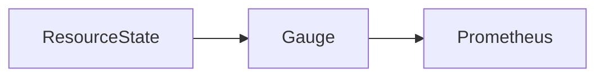

---

## Configuration / Syntax (if applicable)

```text
memory_usage_bytes 73400320
```

---

## Important Commands (if applicable)

PromQL

```promql
memory_usage_bytes

cpu_usage_percent
```

---

## Important Files (if applicable)

None

---

## Real-World Use Cases

- RAM usage
- CPU utilization
- Active users
- Disk utilization

---

## Advantages

- Represents current values
- Easy to understand

---

## Limitations

- Cannot calculate rates like Counters

---

## Common Interview Questions (Concept Only)

- What is a Gauge?
- Difference between Counter and Gauge?
- Which metrics should use Gauge?

---

## Common Mistakes

- Using Gauge for request count
- Using Gauge where cumulative events are required

---

## Troubleshooting

- Verify exporter
- Ensure value updates correctly

---

## Summary

Gauges represent current measurements that may increase or decrease, making them ideal for monitoring resource utilization and system state.

---

# Histogram

## Overview

A **Histogram** measures the **distribution** of observed values by grouping them into configurable **buckets**.

Histograms are commonly used to measure:

- Response time
- Request duration
- File sizes
- Query execution time

Unlike Counters and Gauges, Histograms store multiple related metrics.

> **Interview Tip**
>
> Histograms generate three metric families:
>
> - `_bucket`
> - `_sum`
> - `_count`

---

## Why It Is Used

Histograms help analyze:

- Latency distribution
- Performance trends
- Percentile calculations (using PromQL)
- Service Level Objectives (SLOs)

---

## Architecture / Working

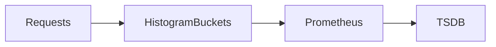

---

## Key Components

| Component | Purpose |
|-----------|---------|
| Buckets | Value ranges |
| Count | Total observations |
| Sum | Sum of observations |

---

## Types (if applicable)

Generated Metrics

- `_bucket`
- `_sum`
- `_count`

---

## Lifecycle / Workflow

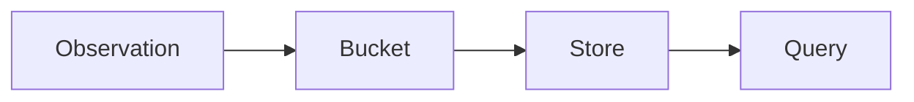

---

## Configuration / Syntax (if applicable)

Example Metrics

```text
http_request_duration_seconds_bucket

http_request_duration_seconds_sum

http_request_duration_seconds_count
```

---

## Important Commands (if applicable)

PromQL

```promql
histogram_quantile(
  0.95,
  rate(http_request_duration_seconds_bucket[5m])
)
```

---

## Important Files (if applicable)

None

---

## Real-World Use Cases

- API latency
- Database query time
- File upload duration
- Network latency

---

## Advantages

- Bucket-based distribution
- Aggregatable across instances
- Ideal for latency monitoring
- Suitable for SLO calculations

---

## Limitations

- Requires bucket planning
- More storage than Counter or Gauge

---

## Common Interview Questions (Concept Only)

- What is Histogram?
- What are Histogram buckets?
- What metrics does Histogram generate?
- Why are Histograms preferred for latency?

---

## Common Mistakes

- Poor bucket selection
- Confusing Histogram with Summary
- Ignoring bucket boundaries

---

## Troubleshooting

- Verify bucket configuration
- Review latency distribution
- Optimize bucket ranges

---

## Summary

Histograms measure value distributions by grouping observations into buckets, making them ideal for latency analysis, SLO monitoring, and performance measurements.

---

# Summary

## Overview

A **Summary** measures the distribution of observations and **calculates quantiles directly on the client side**.

Unlike Histograms, Summaries do not rely on buckets.

They are commonly used for:

- Response time
- Request latency
- Database query duration

> **Interview Tip**
>
> The key difference is:
>
> - **Histogram → Buckets, server-side quantile calculation**
> - **Summary → Client-side quantile calculation**

---

## Why It Is Used

Summaries calculate:

- Median
- 90th percentile
- 95th percentile
- 99th percentile

without bucket configuration.

---

## Architecture / Working

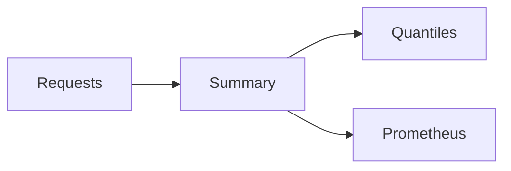

---

## Key Components

| Component | Purpose |
|-----------|---------|
| Quantiles | Percentiles |
| Count | Total observations |
| Sum | Total duration |

---

## Types (if applicable)

Generated Metrics

- Quantiles
- `_sum`
- `_count`

---

## Lifecycle / Workflow

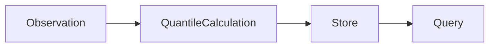

---

## Configuration / Syntax (if applicable)

Example Metrics

```text
http_request_duration_seconds

http_request_duration_seconds_sum

http_request_duration_seconds_count
```

---

## Important Commands (if applicable)

PromQL

```promql
http_request_duration_seconds
```

---

## Important Files (if applicable)

None

---

## Real-World Use Cases

- API latency
- Request duration
- Database response time

---

## Advantages

- Automatic quantiles
- No bucket configuration
- Easy implementation

---

## Limitations

- Cannot aggregate quantiles across multiple instances
- Higher client-side computation
- Less suitable for large distributed systems

---

## Common Interview Questions (Concept Only)

- What is Summary?
- Difference between Histogram and Summary?
- When should Summary be used?
- Why are Histograms preferred in distributed systems?

---

## Common Mistakes

- Using Summary for aggregated cluster metrics
- Confusing Summary with Histogram

---

## Troubleshooting

- Verify client library implementation
- Confirm quantile configuration
- Review application instrumentation

---

## Summary

Summaries calculate latency quantiles directly within the application and expose them to Prometheus. They are simple to implement but cannot aggregate quantiles across multiple instances, making Histograms the preferred choice for large-scale distributed environments.
