# Alerting

## Overview

Alerting is the process of automatically detecting abnormal conditions in monitored systems and notifying the appropriate teams before users are affected.

Prometheus performs alerting using:

- **Alert Rules** – Define alert conditions using PromQL.
- **Alertmanager** – Receives alerts, groups them, suppresses duplicates, routes them, and sends notifications.

> **Interview Tip**
>
> Prometheus **does not send notifications directly**. It evaluates alert rules and forwards firing alerts to **Alertmanager**, which is responsible for notification delivery.

---

## Why It Is Used

Alerting helps to:

- Detect system failures automatically
- Monitor infrastructure health
- Reduce downtime
- Notify on-call engineers
- Support SRE practices
- Automate incident response
- Meet Service Level Objectives (SLOs)

---

## Architecture / Working

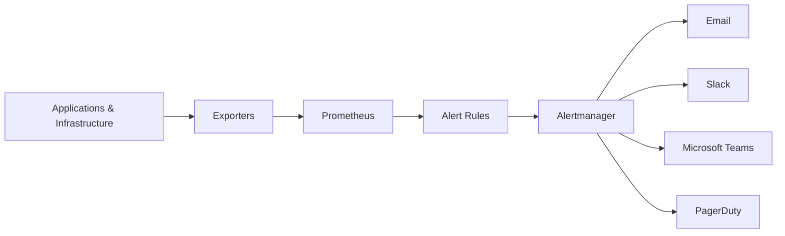

### Working Process

1. Exporters expose metrics.
2. Prometheus scrapes metrics.
3. Prometheus evaluates alert rules.
4. If a rule condition is met, the alert becomes **Pending**.
5. After the configured duration (`for`), it becomes **Firing**.
6. Prometheus sends firing alerts to Alertmanager.
7. Alertmanager groups, routes, and sends notifications.

---

## Key Components

| Component | Purpose |
|-----------|---------|
| Alert Rule | Defines when an alert should trigger |
| PromQL | Evaluates alert conditions |
| Alertmanager | Routes and sends alerts |
| Receiver | Notification destination |
| Route | Determines where alerts are sent |
| Grouping | Combines similar alerts |
| Silencing | Temporarily suppresses alerts |
| Inhibition | Prevents duplicate alerts |

---

## Types (if applicable)

Common alert categories:

| Type | Example |
|------|----------|
| Infrastructure | High CPU usage |
| Application | HTTP 500 errors |
| Database | Database unavailable |
| Kubernetes | Pod CrashLoopBackOff |
| Network | High packet loss |
| Storage | Low disk space |

---

## Lifecycle / Workflow

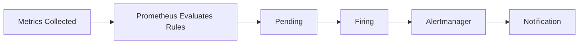

---

## Configuration / Syntax (if applicable)

Example Alert Rule

```yaml
groups:
  - name: infrastructure
    rules:

      - alert: HighCPUUsage

        expr: cpu_usage_percent > 80

        for: 5m

        labels:
          severity: warning

        annotations:
          summary: High CPU Usage
          description: CPU usage has exceeded 80%.
```

Example Prometheus Configuration

```yaml
rule_files:
  - alert.rules.yml

alerting:
  alertmanagers:
    - static_configs:
        - targets:
            - localhost:9093
```

---

## Important Commands (if applicable)

Reload Prometheus Configuration

```bash
curl -X POST http://localhost:9090/-/reload
```

Reload Alertmanager

```bash
curl -X POST http://localhost:9093/-/reload
```

Check Active Alerts

```
http://localhost:9090/alerts
```

Check Rules

```
http://localhost:9090/rules
```

---

## Important Files (if applicable)

| File | Purpose |
|------|----------|
| prometheus.yml | Prometheus configuration |
| alert.rules.yml | Alert rule definitions |
| alertmanager.yml | Alertmanager configuration |

---

## Real-World Use Cases

- High CPU usage
- High memory utilization
- Disk almost full
- Kubernetes Pod failures
- Node down
- Website unavailable
- SSL certificate expiration
- High API response time
- Database connection failures

---

## Advantages

- Automatic incident detection
- Flexible alert conditions
- Rich PromQL support
- Multiple notification channels
- Supports grouping and deduplication
- Easy integration with Grafana and Alertmanager

---

## Limitations

- Poorly designed alerts cause alert fatigue
- High-cardinality metrics can slow evaluation
- Incorrect thresholds lead to false positives
- Requires Alertmanager for notifications

---

## Common Interview Questions (Concept Only)

- How does Prometheus alerting work?
- Does Prometheus send emails directly?
- What is Alertmanager?
- What is the purpose of the `for` keyword?
- How are alerts evaluated?
- What happens when an alert fires?
- Difference between Prometheus and Alertmanager?
- What files are used for alerting?

---

## Common Mistakes

- Forgetting to configure Alertmanager
- Using incorrect PromQL expressions
- Setting thresholds too low
- Not using the `for` duration
- Forgetting to reload configuration
- Missing severity labels
- Generating duplicate alerts

---

## Troubleshooting

| Problem | Cause | Solution |
|----------|--------|----------|
| Alert never fires | Incorrect PromQL | Verify query in Prometheus Graph |
| Alert stuck in Pending | `for` duration not completed | Wait or reduce `for` value |
| No notifications | Alertmanager unreachable | Verify Alertmanager configuration |
| Duplicate alerts | Missing grouping | Configure alert grouping |
| Configuration errors | YAML syntax issue | Validate YAML before reloading |

Useful Commands

```bash
curl http://localhost:9090/api/v1/rules

curl http://localhost:9093/api/v2/status
```

---

## Summary

Prometheus Alerting continuously evaluates alert rules using PromQL. When a rule condition is satisfied for the configured duration, Prometheus forwards the alert to Alertmanager, which handles grouping, routing, suppression, and notification delivery.

---

# Alert Rules

## Overview

Alert Rules define **when Prometheus should generate an alert**.

Each rule consists of:

- Alert name
- PromQL expression
- Duration (`for`)
- Labels
- Annotations

> **Interview Tip**
>
> Alert Rules are evaluated **periodically** based on the Prometheus evaluation interval.

---

## Why It Is Used

Alert Rules:

- Detect abnormal conditions
- Automate monitoring
- Reduce manual checks
- Trigger notifications

---

## Architecture / Working

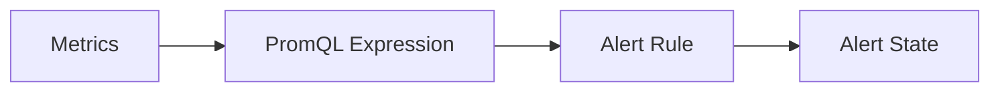

---

## Key Components

| Component | Purpose |
|-----------|---------|
| alert | Alert name |
| expr | PromQL condition |
| for | Required duration |
| labels | Metadata |
| annotations | Human-readable message |

---

## Types (if applicable)

Common Alert Rules

- High CPU
- High Memory
- Disk Full
- Node Down
- Pod Restarting
- HTTP Errors

---

## Lifecycle / Workflow

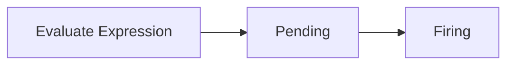

---

## Configuration / Syntax (if applicable)

```yaml
- alert: HighMemory

  expr: memory_usage_percent > 90

  for: 10m

  labels:
    severity: critical

  annotations:
    summary: Memory usage is high
```

---

## Important Commands (if applicable)

View Rules

```
http://localhost:9090/rules
```

---

## Important Files (if applicable)

| File | Purpose |
|------|----------|
| alert.rules.yml | Alert definitions |

---

## Real-World Use Cases

- Node down
- CPU > 90%
- Memory > 95%
- Kubernetes Pod failures

---

## Advantages

- Flexible
- PromQL-based
- Easy to customize

---

## Limitations

- Poor queries create noisy alerts

---

## Common Interview Questions (Concept Only)

- What is an Alert Rule?
- What is the `expr` field?
- Why is the `for` field used?

---

## Common Mistakes

- Missing labels
- Incorrect PromQL
- Not testing rules

---

## Troubleshooting

- Validate PromQL
- Check rule loading
- Review Prometheus logs

---

## Summary

Alert Rules define the conditions under which Prometheus generates alerts using PromQL expressions.

---

# Alert States

## Overview

Every alert transitions through a series of states before notifications are sent.

The three alert states are:

- Inactive
- Pending
- Firing

> **Interview Tip**
>
> An alert becomes **Pending** when the condition first evaluates to true and becomes **Firing** only after the configured `for` duration has elapsed.

---

## Why It Is Used

Alert states help prevent false alarms caused by temporary spikes or short-lived issues.

---

## Architecture / Working

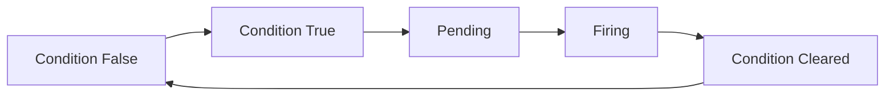

---

## Key Components

| State | Meaning |
|--------|---------|
| Inactive | Condition is false |
| Pending | Condition is true but waiting |
| Firing | Condition remained true long enough |

---

## Types (if applicable)

| State | Notification Sent |
|--------|-------------------|
| Inactive | No |
| Pending | No |
| Firing | Yes |

---

## Lifecycle / Workflow

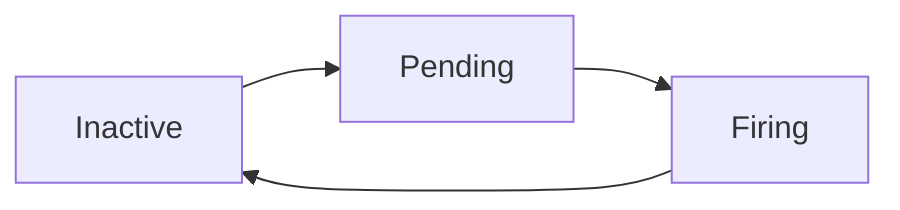

---

## Configuration / Syntax (if applicable)

```yaml
for: 5m
```

---

## Important Commands (if applicable)

View Alert Status

```
http://localhost:9090/alerts
```

---

## Important Files (if applicable)

Alert rule files

---

## Real-World Use Cases

- Ignore short CPU spikes
- Ignore temporary Pod restarts

---

## Advantages

- Reduces false positives
- Improves alert quality

---

## Limitations

- Long `for` duration delays alerts

---

## Common Interview Questions (Concept Only)

- What are alert states?
- Difference between Pending and Firing?
- What triggers the Firing state?

---

## Common Mistakes

- Using `for: 0s`
- Long waiting periods

---

## Troubleshooting

- Verify alert status page
- Review evaluation interval

---

## Summary

Alert states ensure alerts are generated only for sustained issues, reducing unnecessary notifications.

---

# Alertmanager Integration

## Overview

Alertmanager receives alerts from Prometheus and manages notification delivery.

It provides:

- Routing
- Grouping
- Deduplication
- Silencing
- Inhibition

---

## Why It Is Used

Without Alertmanager:

- No emails
- No Slack messages
- No PagerDuty alerts

---

## Architecture / Working

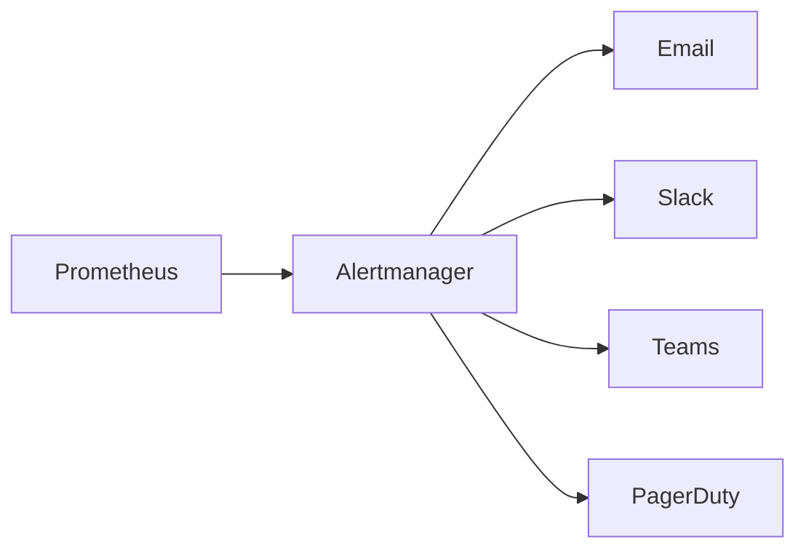

---

## Key Components

| Component | Purpose |
|-----------|---------|
| Receiver | Notification destination |
| Route | Alert routing |
| Group | Merge alerts |
| Silence | Suppress alerts |
| Inhibition | Block dependent alerts |

---

## Types (if applicable)

Supported Receivers

- Email
- Slack
- Microsoft Teams
- PagerDuty
- Webhook

---

## Lifecycle / Workflow

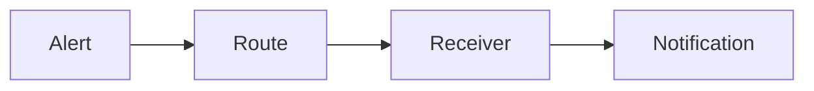

---

## Configuration / Syntax (if applicable)

```yaml
receivers:
  - name: email
```

---

## Important Commands (if applicable)

```bash
curl http://localhost:9093/api/v2/status
```

---

## Important Files (if applicable)

| File | Purpose |
|------|----------|
| alertmanager.yml | Alertmanager configuration |

---

## Real-World Use Cases

- Email notifications
- Slack alerts
- On-call paging

---

## Advantages

- Centralized alert management
- Multiple integrations
- Alert deduplication

---

## Limitations

- Requires separate deployment

---

## Common Interview Questions (Concept Only)

- What is Alertmanager?
- Why is Alertmanager needed?
- Can Prometheus send email directly?

---

## Common Mistakes

- Wrong receiver configuration
- Missing routes

---

## Troubleshooting

- Verify Alertmanager status
- Check receiver configuration

---

## Summary

Alertmanager receives alerts from Prometheus and is responsible for routing, grouping, suppressing, and delivering notifications.

---

# Alert Routing

## Overview

Alert Routing determines **where alerts should be sent** based on labels such as severity, environment, or team.

---

## Why It Is Used

Routing ensures:

- Critical alerts reach on-call engineers
- Warning alerts go to Slack
- Database alerts go to the DBA team

---

## Architecture / Working

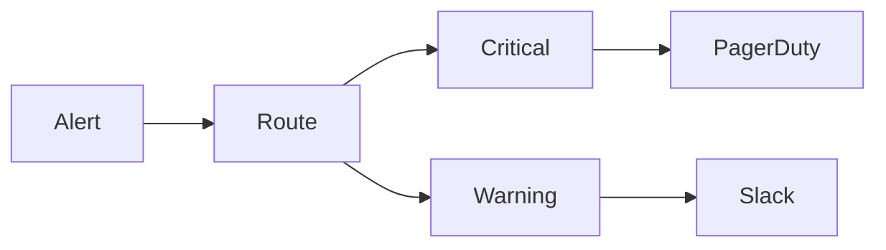

---

## Key Components

| Component | Purpose |
|-----------|---------|
| Route | Match alerts |
| Receiver | Notification destination |
| Labels | Routing criteria |

---

## Types (if applicable)

Routing Examples

- Severity
- Team
- Environment
- Application

---

## Lifecycle / Workflow

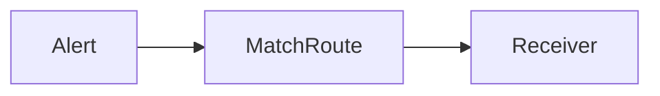

---

## Configuration / Syntax (if applicable)

```yaml
route:
  receiver: slack
```

---

## Important Commands (if applicable)

None

---

## Important Files (if applicable)

| File | Purpose |
|------|----------|
| alertmanager.yml | Routing configuration |

---

## Real-World Use Cases

- DevOps team alerts
- Security alerts
- Database alerts

---

## Advantages

- Organized notifications
- Team-specific alerts

---

## Limitations

- Incorrect routes lose alerts

---

## Common Interview Questions (Concept Only)

- What is alert routing?
- How are alerts routed?

---

## Common Mistakes

- Incorrect label matching
- Missing default receiver

---

## Troubleshooting

- Verify routing tree
- Check receiver configuration

---

## Summary

Alert Routing determines which receiver handles an alert based on routing rules and labels.

---

# Alert Notifications

## Overview

Alert Notifications are the final step in the alerting pipeline.

Alertmanager sends notifications after processing routing, grouping, silencing, and inhibition rules.

---

## Why It Is Used

Notifications ensure engineers are informed about important incidents quickly.

---

## Architecture / Working

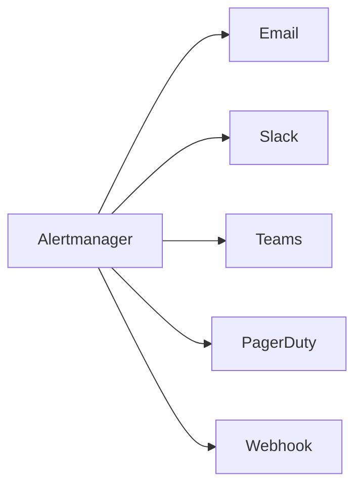

---

## Key Components

| Notification | Purpose |
|-------------|---------|
| Email | General alerts |
| Slack | Team collaboration |
| Teams | Enterprise messaging |
| PagerDuty | On-call management |
| Webhook | Custom integrations |

---

## Types (if applicable)

Common Notification Channels

- Email
- Slack
- Microsoft Teams
- PagerDuty
- Opsgenie
- Webhooks

---

## Lifecycle / Workflow


---

## Configuration / Syntax (if applicable)

Example Receiver

```yaml
receivers:
  - name: email
```

---

## Important Commands (if applicable)

```bash
curl http://localhost:9093/api/v2/status
```

---

## Important Files (if applicable)

| File | Purpose |
|------|----------|
| alertmanager.yml | Notification configuration |

---

## Real-World Use Cases

- High CPU alerts
- Production outage notifications
- SSL expiration reminders
- Kubernetes node failures

---

## Advantages

- Immediate incident awareness
- Multiple delivery channels
- Supports escalation workflows

---

## Limitations

- Misconfigured receivers can prevent notifications
- Excessive alerts can cause alert fatigue

---

## Common Interview Questions (Concept Only)

- Which notification channels does Alertmanager support?
- How are notifications delivered?
- What is alert grouping?
- What is alert deduplication?

---

## Common Mistakes

- Notification spam
- No grouping
- Incorrect email configuration

---

## Troubleshooting

| Problem | Cause | Solution |
|----------|--------|----------|
| No email received | Receiver misconfigured | Verify SMTP settings |
| Slack notification missing | Incorrect webhook | Validate webhook URL |
| Duplicate notifications | Grouping not configured | Configure `group_by` and timing settings |

---

## Summary

Alert Notifications deliver processed alerts to engineers through channels such as Email, Slack, Microsoft Teams, PagerDuty, or Webhooks, ensuring rapid response to production issues.
