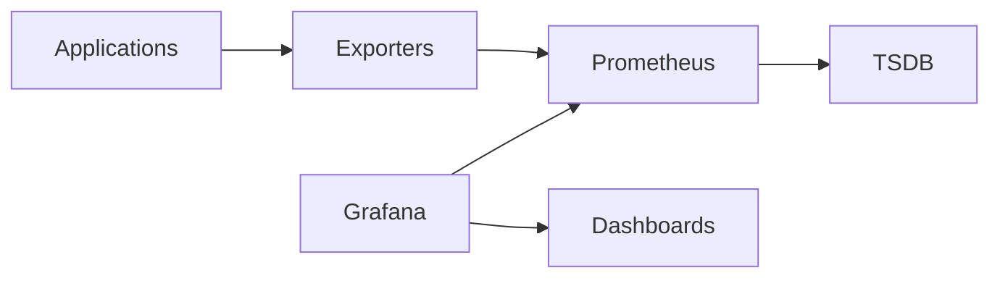
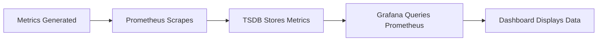
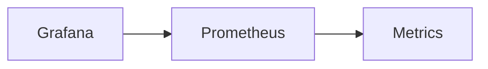
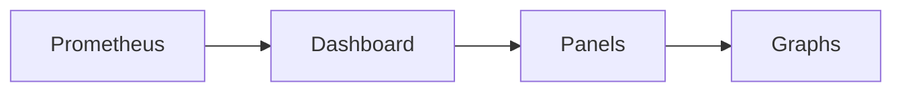
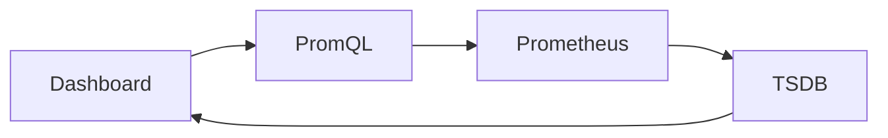
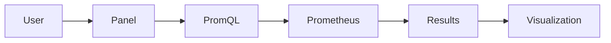

# Visualization

## Overview

Visualization is the process of displaying Prometheus metrics as graphs, charts, gauges, tables, and dashboards to monitor the health and performance of applications and infrastructure.

Although Prometheus provides a basic web UI for querying metrics, **Grafana** is the industry-standard visualization tool used with Prometheus.

A typical monitoring stack consists of:

- Prometheus → Collects and stores metrics
- Grafana → Visualizes metrics
- Alertmanager → Sends notifications

> **Interview Tip**
>
> **Prometheus stores metrics, Grafana visualizes them.**
>
> Grafana does **not** store metrics; it queries Prometheus whenever a dashboard is loaded or refreshed.

---

## Why It Is Used

Visualization helps to:

- Monitor system health
- Identify trends and anomalies
- Analyze historical performance
- Create operational dashboards
- Troubleshoot production issues
- Support capacity planning
- Display business and infrastructure KPIs

---

## Architecture / Working



### Working Process

1. Applications expose metrics.
2. Exporters collect infrastructure or application metrics.
3. Prometheus scrapes and stores metrics in the TSDB.
4. Grafana queries Prometheus using PromQL.
5. Dashboards display the returned metrics.

---

## Key Components

| Component | Purpose |
|-----------|---------|
| Prometheus | Stores metrics |
| Grafana | Visualization platform |
| Dashboard | Collection of panels |
| Panel | Individual graph or chart |
| Data Source | Connection to Prometheus |
| PromQL | Query language used by Grafana |

---

## Types (if applicable)

Common Grafana Visualizations

| Visualization | Use Case |
|--------------|----------|
| Time Series | CPU, Memory, Network |
| Stat | Current value |
| Gauge | CPU utilization |
| Bar Chart | Comparisons |
| Table | Detailed metrics |
| Pie Chart | Resource distribution |
| Heatmap | Latency analysis |

---

## Lifecycle / Workflow



---

## Configuration / Syntax (if applicable)

Example PromQL Queries

CPU Usage

```promql
rate(node_cpu_seconds_total[5m])
```

Memory Available

```promql
node_memory_MemAvailable_bytes
```

Server Status

```promql
up
```

---

## Important Commands (if applicable)

Access Prometheus

```
http://localhost:9090
```

Access Grafana

```
http://localhost:3000
```

---

## Important Files (if applicable)

| File | Purpose |
|------|----------|
| prometheus.yml | Prometheus configuration |
| grafana.ini | Grafana configuration (optional) |

---

## Real-World Use Cases

- Infrastructure monitoring
- Kubernetes dashboards
- Application monitoring
- Database monitoring
- Network monitoring
- Business metrics visualization

---

## Advantages

- Rich visualizations
- Interactive dashboards
- Real-time monitoring
- Historical trend analysis
- Supports multiple data sources
- Easy sharing of dashboards

---

## Limitations

- Depends on Prometheus availability
- Poor dashboard design can hide important issues
- Complex queries may impact performance

---

## Common Interview Questions (Concept Only)

- Why is Grafana used with Prometheus?
- Does Grafana store metrics?
- Can Prometheus create dashboards?
- What is a Grafana panel?
- What is a data source?

---

## Common Mistakes

- Creating dashboards with inefficient PromQL queries
- Refresh intervals that are too short
- Using high-cardinality metrics in dashboards
- Confusing Grafana with Prometheus

---

## Troubleshooting

| Problem | Cause | Solution |
|----------|--------|----------|
| Empty dashboard | Data source unavailable | Verify Prometheus connection |
| No graphs | Incorrect PromQL | Test query in Prometheus |
| Slow dashboard | Expensive queries | Optimize PromQL |
| Missing metrics | Exporter unavailable | Verify scrape targets |

Useful Commands

```bash
curl http://localhost:9090/api/v1/query?query=up
```

---

## Summary

Visualization transforms Prometheus metrics into meaningful dashboards that help engineers monitor infrastructure, analyze trends, troubleshoot issues, and make operational decisions. Grafana is the most commonly used visualization platform for Prometheus.

---

# Grafana Integration

## Overview

Grafana integrates with Prometheus by connecting to it as a **data source**.

Grafana sends PromQL queries to Prometheus whenever dashboard panels are loaded or refreshed.

> **Interview Tip**
>
> Prometheus is a **data source** for Grafana.
>
> Grafana queries Prometheus in real time and does not store monitoring data.

---

## Why It Is Used

Grafana provides:

- Interactive dashboards
- Advanced graphing
- Multiple visualization types
- Dashboard sharing
- Alert visualization
- Multi-data-source support

---

## Architecture / Working


---

## Key Components

| Component | Purpose |
|-----------|---------|
| Prometheus | Data source |
| Grafana | Dashboard platform |
| Dashboard | Visualization |
| Panel | Individual graph |
| PromQL | Query language |

---

## Types (if applicable)

Grafana supports many data sources:

- Prometheus
- Loki
- Elasticsearch
- MySQL
- PostgreSQL
- InfluxDB

---

## Lifecycle / Workflow


---

## Configuration / Syntax (if applicable)

Typical Prometheus URL

```
http://localhost:9090
```

---

## Important Commands (if applicable)

Grafana Web UI

```
http://localhost:3000
```

---

## Important Files (if applicable)

| File | Purpose |
|------|----------|
| grafana.ini | Grafana configuration |

---

## Real-World Use Cases

- Kubernetes dashboards
- Server monitoring
- Application monitoring
- Business metrics

---

## Advantages

- Rich UI
- Interactive dashboards
- Easy sharing
- Powerful visualization

---

## Limitations

- Requires a working Prometheus server
- Dashboard quality depends on PromQL queries

---

## Common Interview Questions (Concept Only)

- How does Grafana integrate with Prometheus?
- Does Grafana query Prometheus directly?
- What is a Grafana data source?

---

## Common Mistakes

- Incorrect Prometheus URL
- Firewall blocking Grafana
- Using wrong PromQL

---

## Troubleshooting

- Verify Prometheus is running
- Test data source connection
- Review Grafana logs

---

## Summary

Grafana integrates with Prometheus through a data source configuration and retrieves metrics using PromQL for visualization.

---

# Add Prometheus Data Source

## Overview

A **Data Source** is the connection between Grafana and Prometheus.

Without adding Prometheus as a data source, Grafana cannot retrieve or display metrics.

---

## Why It Is Used

The data source enables Grafana to:

- Execute PromQL queries
- Display dashboards
- Build graphs
- Create alerts

---

## Architecture / Working



---

## Key Components

| Component | Purpose |
|-----------|---------|
| Data Source | Connection |
| URL | Prometheus endpoint |
| Access Mode | Server or Browser |

---

## Types (if applicable)

Common Data Sources

- Prometheus
- Loki
- Elasticsearch
- MySQL

---

## Lifecycle / Workflow


---

## Configuration / Syntax (if applicable)

Prometheus URL

```
http://localhost:9090
```

---

## Important Commands (if applicable)

Test Connection

Available in Grafana UI

---

## Important Files (if applicable)

None

---

## Real-World Use Cases

- Local Prometheus
- Kubernetes Prometheus
- Production monitoring

---

## Advantages

- Simple configuration
- Secure connection
- Supports authentication

---

## Limitations

- Prometheus must be reachable

---

## Common Interview Questions (Concept Only)

- How do you add Prometheus to Grafana?
- What URL is required?

---

## Common Mistakes

- Wrong URL
- Network connectivity issues

---

## Troubleshooting

- Verify Prometheus status
- Test network connectivity
- Confirm firewall settings

---

## Summary

Adding Prometheus as a Grafana data source establishes the connection required for dashboard queries and visualizations.

---

# Build Dashboards

## Overview

A Grafana Dashboard is a collection of panels that visualize infrastructure and application metrics.

Dashboards provide a centralized view of system health.

---

## Why It Is Used

Dashboards allow engineers to:

- Monitor servers
- Track applications
- Analyze trends
- Identify bottlenecks
- Detect failures

---

## Architecture / Working



---

## Key Components

| Component | Purpose |
|-----------|---------|
| Dashboard | Collection of panels |
| Panel | Single visualization |
| Variable | Dynamic filtering |
| Query | Retrieves metrics |

---

## Types (if applicable)

Common Panels

- Time Series
- Gauge
- Stat
- Table
- Heatmap

---

## Lifecycle /Workflow


---

## Configuration / Syntax (if applicable)

Example Panel Query

```promql
rate(http_requests_total[5m])
```

---

## Important Commands (if applicable)

Grafana UI

---

## Important Files (if applicable)

Dashboard JSON (optional export)

---

## Real-World Use Cases

- Kubernetes Dashboard
- Node Exporter Dashboard
- Database Dashboard
- Application Dashboard

---

## Advantages

- Centralized monitoring
- Easy customization
- Interactive exploration

---

## Limitations

- Dashboard maintenance required

---

## Common Interview Questions (Concept Only)

- What is a Grafana dashboard?
- What is a panel?
- What types of panels are available?

---

## Common Mistakes

- Too many panels
- Poor dashboard layout
- Inefficient PromQL

---

## Troubleshooting

- Test PromQL
- Verify data source
- Refresh dashboard

---

## Summary

Grafana dashboards organize multiple visualizations into a single interface for monitoring infrastructure and applications.

---

# Use PromQL in Dashboards

## Overview

Every Grafana panel retrieves data by executing a PromQL query against Prometheus.

PromQL determines:

- Which metrics to retrieve
- How to aggregate them
- Which labels to filter
- How to calculate rates or averages

> **Interview Tip**
>
> Grafana does not calculate metrics itself. It sends PromQL queries to Prometheus and renders the returned results.

---

## Why It Is Used

PromQL enables dashboards to:

- Display live metrics
- Analyze trends
- Filter by labels
- Calculate rates
- Aggregate multiple time series

---

## Architecture / Working



---

## Key Components

| Component | Purpose |
|-----------|---------|
| Metric | Data source |
| Label Selector | Filter metrics |
| Function | Calculate values |
| Aggregation | Summarize metrics |

---

## Types (if applicable)

Common Query Categories

- Instant Queries
- Range Queries
- Aggregation Queries
- Rate Queries
- Filtered Queries

---

## Lifecycle / Workflow



---

## Configuration / Syntax (if applicable)

Current CPU

```promql
rate(node_cpu_seconds_total[5m])
```

Memory Usage

```promql
node_memory_MemAvailable_bytes
```

Server Status

```promql
up
```

Total Requests

```promql
sum(rate(http_requests_total[5m]))
```

Production Servers

```promql
up{environment="production"}
```

---

## Important Commands (if applicable)

Prometheus Query Browser

```
http://localhost:9090/graph
```

---

## Important Files (if applicable)

No additional files

---

## Real-World Use Cases

- CPU utilization graphs
- Request rate monitoring
- Error dashboards
- Kubernetes cluster monitoring
- Application latency visualization

---

## Advantages

- Powerful querying
- Flexible filtering
- Supports aggregation
- Dynamic dashboards

---

## Limitations

- Complex queries may reduce dashboard performance
- High-cardinality metrics increase query time

---

## Common Interview Questions (Concept Only)

- How does Grafana use PromQL?
- Can Grafana display metrics without PromQL?
- Which PromQL functions are commonly used in dashboards?
- Why are label selectors important?

---

## Common Mistakes

- Using expensive PromQL queries
- Not filtering unnecessary labels
- Refreshing dashboards too frequently
- Using raw Counter metrics instead of `rate()`

---

## Troubleshooting

| Problem | Cause | Solution |
|----------|--------|----------|
| Empty graph | Incorrect PromQL | Validate query in Prometheus |
| Slow dashboard | High-cardinality query | Optimize labels and functions |
| Incorrect values | Wrong metric type | Use appropriate PromQL functions |
| Missing data | Exporter or target unavailable | Verify Prometheus targets |

Useful Commands

```promql
up

rate(node_cpu_seconds_total[5m])

sum(rate(http_requests_total[5m]))

node_memory_MemAvailable_bytes
```

---

## Summary

PromQL is the foundation of Grafana dashboards. Every panel executes PromQL queries against Prometheus to retrieve, filter, aggregate, and visualize metrics, enabling real-time monitoring and historical analysis of applications and infrastructure.
