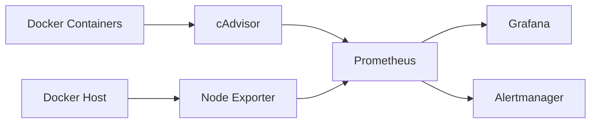
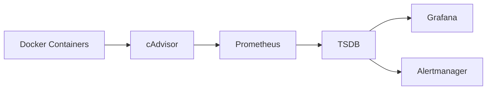
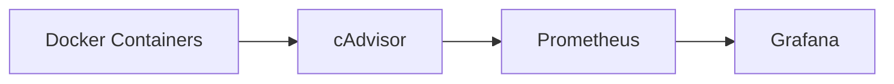
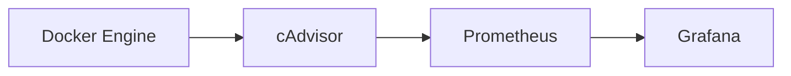
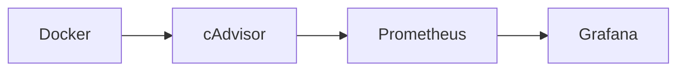

# Docker Monitoring

## Overview

Docker Monitoring is the process of collecting, storing, visualizing, and alerting on metrics from Docker hosts and containers.

Prometheus does **not** monitor Docker containers directly. Instead, it collects metrics from exporters such as **cAdvisor**, **Node Exporter**, and application-specific exporters.

A typical Docker monitoring stack consists of:

- Docker Engine
- cAdvisor
- Node Exporter
- Prometheus
- Grafana
- Alertmanager

> **Interview Tip**
>
> Prometheus **cannot scrape Docker directly**.
>
> It requires an exporter (most commonly **cAdvisor**) to expose Docker container metrics.

---

## Why It Is Used

Docker monitoring helps to:

- Monitor container CPU usage
- Monitor memory utilization
- Monitor disk usage
- Monitor network traffic
- Detect unhealthy containers
- Track container restarts
- Identify resource bottlenecks
- Generate alerts

---

## Architecture / Working



### Working Process

1. Docker containers generate runtime metrics.
2. cAdvisor collects container metrics.
3. Node Exporter collects host OS metrics.
4. Prometheus scrapes both exporters.
5. Metrics are stored in TSDB.
6. Grafana visualizes the metrics.
7. Alertmanager sends notifications.

---

## Key Components

| Component | Purpose |
|-----------|---------|
| Docker Engine | Runs containers |
| cAdvisor | Container metrics |
| Node Exporter | Host metrics |
| Prometheus | Stores metrics |
| Grafana | Visualization |
| Alertmanager | Alerting |

---

## Types (if applicable)

Common Docker Metrics

| Category | Examples |
|-----------|-----------|
| CPU | CPU usage |
| Memory | Memory consumption |
| Network | RX/TX traffic |
| Disk | Filesystem usage |
| Container Status | Running/Stopped |
| Resource Limits | CPU & Memory limits |

---

## Lifecycle / Workflow



---

## Configuration / Syntax (if applicable)

Container CPU Usage

```promql
rate(container_cpu_usage_seconds_total[5m])
```

Container Memory Usage

```promql
container_memory_usage_bytes
```

Container Network Receive

```promql
rate(container_network_receive_bytes_total[5m])
```

Container Network Transmit

```promql
rate(container_network_transmit_bytes_total[5m])
```

Running Containers

```promql
container_last_seen
```

---

## Important Commands (if applicable)

View Running Containers

```bash
docker ps
```

View Container Statistics

```bash
docker stats
```

Check cAdvisor

```
http://localhost:8080
```

Prometheus Targets

```
http://localhost:9090/targets
```

---

## Important Files (if applicable)

| File | Purpose |
|------|----------|
| prometheus.yml | Prometheus configuration |
| docker-compose.yml | Deploy monitoring stack |
| alert.rules.yml | Alert rules |

---

## Real-World Use Cases

- Monitor Docker hosts
- Detect container crashes
- Capacity planning
- Resource optimization
- Production monitoring
- Alert on high CPU or memory usage

---

## Advantages

- Real-time monitoring
- Lightweight exporters
- Rich PromQL queries
- Excellent Grafana integration
- Container-level visibility

---

## Limitations

- Requires exporters
- High-cardinality metrics increase storage
- Short-lived containers may disappear before scraping

---

## Common Interview Questions (Concept Only)

- How does Prometheus monitor Docker containers?
- Why is cAdvisor required?
- Can Prometheus monitor Docker without exporters?
- Which metrics are commonly collected from containers?
- What is the difference between Node Exporter and cAdvisor?

---

## Common Mistakes

- Assuming Prometheus can monitor Docker directly
- Installing only Node Exporter and expecting container metrics
- Ignoring container resource limits
- Collecting unnecessary high-cardinality metrics

---

## Troubleshooting

| Problem | Cause | Solution |
|----------|--------|----------|
| No container metrics | cAdvisor not running | Verify cAdvisor container |
| Container missing | Container stopped | Restart container |
| High Prometheus load | Too many metrics | Reduce scrape targets |
| Empty dashboard | Incorrect PromQL | Test query in Prometheus |

Useful Commands

```bash
docker ps

docker stats

docker logs cadvisor

curl http://localhost:8080/metrics
```

---

## Summary

Docker monitoring provides visibility into container performance and health. Prometheus relies on exporters like cAdvisor to collect container metrics, while Grafana visualizes them and Alertmanager sends notifications when issues occur.

---

# Monitor Docker Containers

## Overview

Monitoring Docker containers involves collecting runtime metrics such as CPU, memory, filesystem, network usage, and container status.

These metrics help ensure containers are running efficiently and detect issues before they impact applications.

> **Interview Tip**
>
> Prometheus primarily collects Docker container metrics through **cAdvisor**.

---

## Why It Is Used

Container monitoring helps to:

- Detect container failures
- Monitor CPU utilization
- Monitor memory usage
- Identify resource leaks
- Detect frequent restarts
- Improve application reliability

---

## Architecture / Working



---

## Key Components

| Component | Purpose |
|-----------|---------|
| Docker Container | Runs application |
| cAdvisor | Exposes container metrics |
| Prometheus | Scrapes metrics |
| Grafana | Displays dashboards |

---

## Types (if applicable)

Container Metrics

- CPU usage
- Memory usage
- Disk I/O
- Network traffic
- Restart count
- Container uptime

---

## Lifecycle / Workflow


---

## Configuration / Syntax (if applicable)

CPU Usage

```promql
rate(container_cpu_usage_seconds_total[5m])
```

Memory Usage

```promql
container_memory_usage_bytes
```

Container Filesystem Usage

```promql
container_fs_usage_bytes
```

---

## Important Commands (if applicable)

```bash
docker ps

docker stats

docker inspect <container-id>
```

---

## Important Files (if applicable)

None

---

## Real-World Use Cases

- Production container monitoring
- Resource optimization
- Capacity planning
- Performance troubleshooting

---

## Advantages

- Per-container visibility
- Real-time metrics
- Supports alerting

---

## Limitations

- Requires cAdvisor
- Large environments generate many metrics

---

## Common Interview Questions (Concept Only)

- Which exporter monitors Docker containers?
- Which metrics are important for containers?
- How do you identify high CPU containers?

---

## Common Mistakes

- Monitoring only the Docker host
- Ignoring container restarts
- Not monitoring resource limits

---

## Troubleshooting

| Problem | Cause | Solution |
|----------|--------|----------|
| Missing container metrics | cAdvisor unavailable | Verify exporter |
| High memory usage | Application leak | Inspect container |
| Container disappeared | Container exited | Check Docker logs |

Useful Commands

```bash
docker ps

docker logs <container-id>

docker stats
```

---

## Summary

Container monitoring focuses on runtime performance and health, enabling engineers to identify performance issues, resource bottlenecks, and failures.

---

# cAdvisor Metrics

## Overview

**cAdvisor (Container Advisor)** is an open-source monitoring tool developed by Google that collects resource usage and performance metrics from running containers.

It is the primary exporter used by Prometheus for Docker and Kubernetes container metrics.

> **Interview Tip**
>
> **Node Exporter monitors the host operating system.**
>
> **cAdvisor monitors containers.**

---

## Why It Is Used

cAdvisor provides:

- CPU usage
- Memory usage
- Filesystem usage
- Network usage
- Container lifecycle information

without requiring any application changes.

---

## Architecture / Working



### Working Process

1. Docker Engine manages containers.
2. cAdvisor reads container runtime statistics.
3. Metrics are exposed at `/metrics`.
4. Prometheus scrapes the metrics.
5. Grafana visualizes the data.

---

## Key Components

| Component | Purpose |
|-----------|---------|
| Docker Engine | Runs containers |
| cAdvisor | Collects container metrics |
| Prometheus | Stores metrics |
| Grafana | Displays dashboards |

---

## Types (if applicable)

Common cAdvisor Metrics

| Metric | Description |
|--------|-------------|
| `container_cpu_usage_seconds_total` | CPU usage |
| `container_memory_usage_bytes` | Memory usage |
| `container_network_receive_bytes_total` | Incoming network traffic |
| `container_network_transmit_bytes_total` | Outgoing network traffic |
| `container_fs_usage_bytes` | Filesystem usage |
| `container_start_time_seconds` | Container start time |

---

## Lifecycle / Workflow



---

## Configuration / Syntax (if applicable)

CPU Usage

```promql
rate(container_cpu_usage_seconds_total[5m])
```

Memory Usage

```promql
container_memory_usage_bytes
```

Filesystem Usage

```promql
container_fs_usage_bytes
```

Network Receive

```promql
rate(container_network_receive_bytes_total[5m])
```

Network Transmit

```promql
rate(container_network_transmit_bytes_total[5m])
```

---

## Important Commands (if applicable)

Run cAdvisor

```bash
docker run \
--volume=/:/rootfs:ro \
--volume=/var/run:/var/run:ro \
--volume=/sys:/sys:ro \
--volume=/var/lib/docker/:/var/lib/docker:ro \
--publish=8080:8080 \
gcr.io/cadvisor/cadvisor:latest
```

Check Metrics

```bash
curl http://localhost:8080/metrics
```

---

## Important Files (if applicable)

| File | Purpose |
|------|----------|
| prometheus.yml | Scrape configuration |

---

## Real-World Use Cases

- Docker monitoring
- Kubernetes container monitoring
- Capacity planning
- Performance optimization
- Resource utilization analysis

---

## Advantages

- Automatic container discovery
- Rich container metrics
- Native Prometheus integration
- Lightweight deployment

---

## Limitations

- Does not monitor application-specific metrics
- Requires additional exporters for host metrics
- High-cardinality environments increase storage requirements

---

## Common Interview Questions (Concept Only)

- What is cAdvisor?
- Which metrics does cAdvisor expose?
- How is cAdvisor different from Node Exporter?
- Does cAdvisor monitor the host operating system?
- How does Prometheus collect container metrics?

---

## Common Mistakes

- Confusing cAdvisor with Node Exporter
- Assuming cAdvisor monitors application metrics
- Forgetting to configure Prometheus scrape jobs
- Ignoring filesystem metrics

---

## Troubleshooting

| Problem | Cause | Solution |
|----------|--------|----------|
| cAdvisor unavailable | Container stopped | Restart cAdvisor |
| No metrics | Wrong scrape configuration | Verify `prometheus.yml` |
| Missing containers | Docker permissions | Verify Docker access |
| Dashboard empty | Incorrect PromQL | Validate query in Prometheus |

Useful Commands

```bash
docker ps

docker logs cadvisor

curl http://localhost:8080/metrics

docker stats
```

---

## Summary

cAdvisor is the standard exporter for Docker and Kubernetes container monitoring. It exposes detailed CPU, memory, filesystem, and network metrics that Prometheus scrapes to provide comprehensive visibility into container performance and health.
