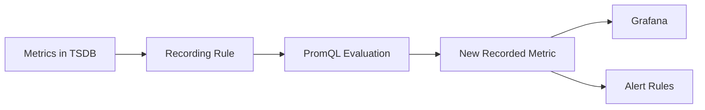
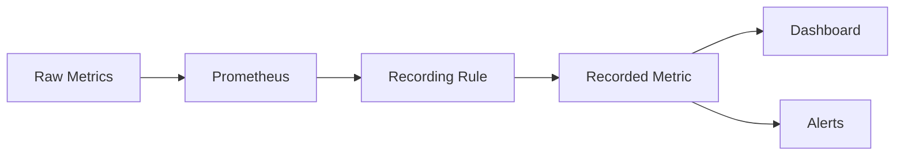
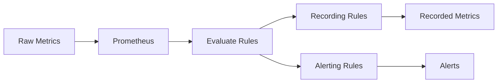

# Recording Rules

## Overview

Recording Rules are precomputed PromQL expressions that Prometheus evaluates at regular intervals and stores as new time-series metrics.

Instead of executing complex PromQL queries repeatedly in dashboards and alerts, Prometheus calculates the result once and saves it as a new metric.

This significantly improves dashboard performance and reduces query execution time.

> **Interview Tip**
>
> **Recording Rules improve performance.**
>
> **Alerting Rules generate alerts.**
>
> Recording Rules create **new metrics**, whereas Alerting Rules create **alerts**.

---

## Why It Is Used

Recording Rules help to:

- Improve dashboard performance
- Reduce PromQL execution time
- Simplify complex queries
- Reuse commonly used calculations
- Reduce CPU load on Prometheus
- Support efficient alerting

---

## Architecture / Working



### Working Process

1. Prometheus scrapes raw metrics.
2. Recording Rules execute PromQL expressions at configured intervals.
3. The computed result is stored as a new metric in the TSDB.
4. Dashboards and Alerting Rules use the new metric instead of recalculating the query.

---

## Key Components

| Component | Purpose |
|-----------|---------|
| Rule File | Stores recording rules |
| Rule Group | Collection of rules |
| Record | Name of the new metric |
| Expr | PromQL expression |
| Evaluation Interval | Frequency of execution |

---

## Types (if applicable)

Common Recording Rules

| Purpose | Example |
|----------|----------|
| CPU Usage | Average CPU utilization |
| Memory Usage | Memory percentage |
| HTTP Request Rate | Requests per second |
| Error Rate | HTTP 5xx rate |
| Network Throughput | Bytes/sec |

---

## Lifecycle / Workflow



---

## Configuration / Syntax (if applicable)

Example Rule File

```yaml
groups:
  - name: application_rules

    rules:

      - record: job:http_requests:rate5m

        expr: rate(http_requests_total[5m])
```

Example

Original Query

```promql
rate(http_requests_total[5m])
```

Recorded Metric

```promql
job:http_requests:rate5m
```

---

## Important Commands (if applicable)

Validate Rule File

```bash
promtool check rules rules.yml
```

Reload Prometheus

```bash
curl -X POST http://localhost:9090/-/reload
```

View Rules

```
http://localhost:9090/rules
```

---

## Important Files (if applicable)

| File | Purpose |
|------|----------|
| rules.yml | Recording rules |
| prometheus.yml | Loads rule files |

Example

```yaml
rule_files:

  - rules.yml
```

---

## Real-World Use Cases

- CPU utilization dashboards
- Memory utilization dashboards
- Kubernetes cluster monitoring
- HTTP request rate calculations
- Error rate monitoring
- Large-scale production monitoring

---

## Advantages

- Faster dashboard loading
- Lower Prometheus CPU usage
- Reusable metrics
- Simplified PromQL
- Better scalability

---

## Limitations

- Additional storage usage
- Incorrect rules create incorrect metrics
- Rule evaluation consumes resources

---

## Common Interview Questions (Concept Only)

- What are Recording Rules?
- Why are Recording Rules used?
- How are Recording Rules different from Alerting Rules?
- Where are Recording Rules stored?
- What is the benefit of precomputing queries?

---

## Common Mistakes

- Recording unnecessary metrics
- Creating duplicate recorded metrics
- Using complex rules unnecessarily
- Forgetting to reload Prometheus after rule changes
- Using Recording Rules when a simple PromQL query is sufficient

---

## Troubleshooting

| Problem | Cause | Solution |
|----------|--------|----------|
| Rule not visible | Rule file not loaded | Verify `prometheus.yml` |
| Rule evaluation failed | Invalid PromQL | Validate with `promtool` |
| New metric missing | Prometheus not reloaded | Reload configuration |
| Dashboard shows no data | Incorrect recorded metric name | Verify `record` field |

Useful Commands

```bash
promtool check rules rules.yml

curl -X POST http://localhost:9090/-/reload
```

---

## Summary

Recording Rules precompute PromQL expressions and store the results as new metrics. They improve dashboard performance, reduce query execution time, and simplify monitoring in production environments.

---

# Rule Evaluation

## Overview

Rule Evaluation is the process where Prometheus periodically executes Recording Rules and Alerting Rules.

At every evaluation interval, Prometheus reads the configured rules, executes the associated PromQL expressions, and performs the configured action.

- Recording Rules → Generate new metrics.
- Alerting Rules → Generate or update alerts.

> **Interview Tip**
>
> Prometheus evaluates rules automatically based on the configured **evaluation interval** (default is typically 1 minute unless overridden).

---

## Why It Is Used

Rule evaluation helps to:

- Keep recorded metrics up to date
- Continuously evaluate alert conditions
- Automate monitoring
- Ensure dashboards display current values
- Reduce manual query execution

---

## Architecture / Working



### Working Process

1. Prometheus scrapes metrics.
2. At each evaluation interval, Prometheus executes all configured rules.
3. Recording Rules create or update recorded metrics.
4. Alerting Rules evaluate alert conditions.
5. Alerts are sent to Alertmanager if conditions are met.

---

## Key Components

| Component | Purpose |
|-----------|---------|
| Rule Group | Collection of rules evaluated together |
| Evaluation Interval | How often rules run |
| Recording Rule | Creates new metrics |
| Alerting Rule | Generates alerts |
| PromQL | Query language used for evaluation |

---

## Types (if applicable)

Rule Types

| Rule | Result |
|------|--------|
| Recording Rule | New metric |
| Alerting Rule | Alert |

---

## Lifecycle / Workflow

```mermaid
flowchart LR

    Scrape Metrics --> Store in TSDB --> Evaluate Rules --> Update Metrics or Alerts --> Repeat
```

---

## Configuration / Syntax (if applicable)

Global Evaluation Interval

```yaml
global:

  evaluation_interval: 1m
```

Rule Group

```yaml
groups:

  - name: application_rules

    interval: 30s

    rules:

      - record: job:http_requests:rate5m

        expr: rate(http_requests_total[5m])
```

Group-specific intervals override the global evaluation interval for that rule group.

---

## Important Commands (if applicable)

Validate Rules

```bash
promtool check rules rules.yml
```

Reload Configuration

```bash
curl -X POST http://localhost:9090/-/reload
```

View Rules

```
http://localhost:9090/rules
```

View Alerts

```
http://localhost:9090/alerts
```

---

## Important Files (if applicable)

| File | Purpose |
|------|----------|
| prometheus.yml | Global configuration |
| rules.yml | Rule definitions |

---

## Real-World Use Cases

- Precompute CPU utilization
- Generate request-rate metrics
- Evaluate high CPU alerts
- Detect application failures
- Monitor Kubernetes clusters

---

## Advantages

- Automated monitoring
- Faster dashboards
- Efficient alert evaluation
- Reusable metrics
- Reduced query overhead

---

## Limitations

- Frequent evaluations increase CPU usage
- Poorly written rules impact Prometheus performance
- Incorrect intervals may delay alert generation

---

## Common Interview Questions (Concept Only)

- What is Rule Evaluation?
- How often does Prometheus evaluate rules?
- What is the evaluation interval?
- Can rule groups have different evaluation intervals?
- What happens during each evaluation cycle?

---

## Common Mistakes

- Setting evaluation intervals too short
- Using expensive PromQL expressions
- Creating large numbers of Recording Rules unnecessarily
- Forgetting to validate rules with `promtool`
- Confusing scrape interval with evaluation interval

---

## Troubleshooting

| Problem | Cause | Solution |
|----------|--------|----------|
| Rules not executing | Rule file not loaded | Verify `prometheus.yml` |
| Evaluation errors | Invalid PromQL | Validate rules with `promtool` |
| Recorded metrics missing | Rule not evaluated yet | Check evaluation interval |
| Alerts delayed | Evaluation interval too long | Adjust interval if appropriate |

Useful Commands

```bash
promtool check rules rules.yml

curl -X POST http://localhost:9090/-/reload

curl http://localhost:9090/api/v1/rules
```

---

## Summary

Rule Evaluation is the automatic execution process for Recording Rules and Alerting Rules. Prometheus evaluates rules at configured intervals, generates new metrics, updates alert states, and keeps dashboards and monitoring data current with minimal manual intervention.
