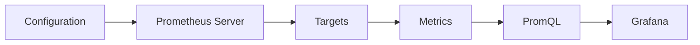
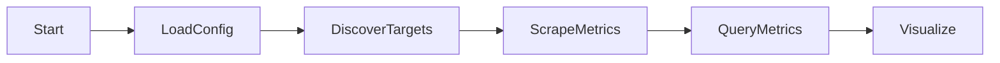
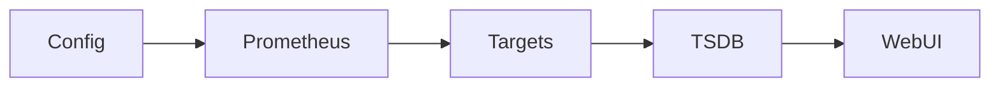
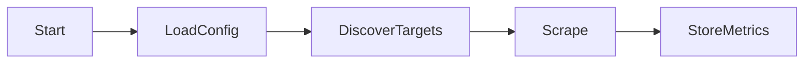
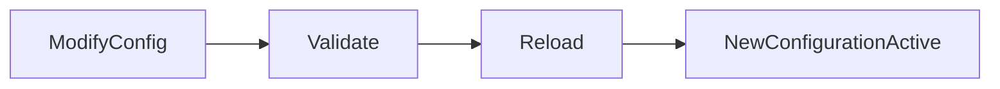
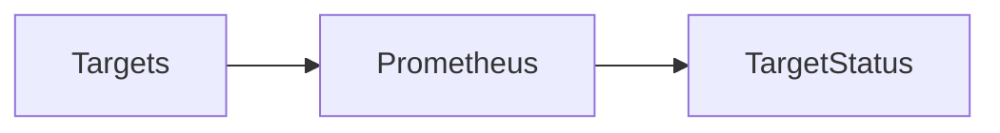
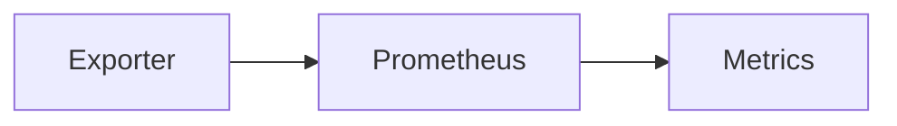
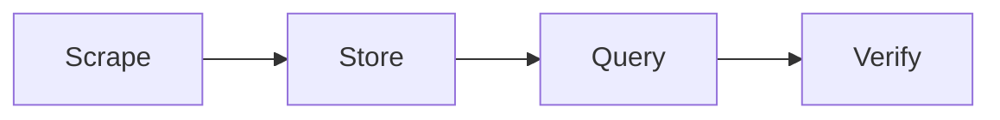
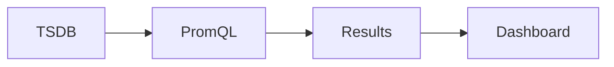
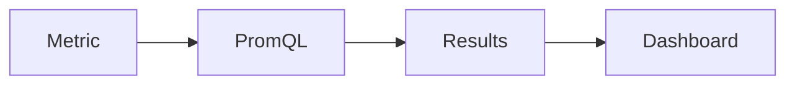

# Essential Prometheus Commands

## Overview

Prometheus provides a combination of **command-line options**, **HTTP endpoints**, and **web UI pages** for starting the server, reloading configurations, verifying targets, querying metrics, and troubleshooting monitoring issues.

These are the commands and operations that every DevOps Engineer, SRE, Cloud Engineer, and Platform Engineer should know for day-to-day production work.

> **Interview Tip**
>
> The five most frequently used Prometheus operations are:
>
> - Start Prometheus
> - Reload Configuration
> - Check Targets
> - Verify Metrics
> - Query Metrics

---

## Why It Is Used

These commands help engineers to:

- Start Prometheus
- Verify monitoring status
- Troubleshoot exporters
- Test PromQL queries
- Reload configuration changes
- Validate monitoring setup

---

## Architecture / Working



---

## Key Components

| Component | Purpose |
|-----------|---------|
| Prometheus Server | Collects metrics |
| PromQL | Query language |
| Targets | Scrape endpoints |
| TSDB | Stores metrics |
| Web UI | Query and troubleshooting |
| Configuration | Defines scrape jobs and rules |

---

## Types (if applicable)

Common Administrative Tasks

| Task | Purpose |
|------|----------|
| Start Server | Launch Prometheus |
| Reload Config | Apply configuration changes |
| Check Targets | Verify exporters |
| Query Metrics | Validate data |
| Verify Rules | Check alerts and recording rules |

---

## Lifecycle / Workflow



---

## Configuration / Syntax (if applicable)

Basic Startup

```bash
./prometheus \
--config.file=prometheus.yml
```

Custom Data Directory

```bash
./prometheus \
--config.file=prometheus.yml \
--storage.tsdb.path=/data/prometheus
```

Custom Web Port

```bash
./prometheus \
--web.listen-address=:9090
```

---

## Important Commands (if applicable)

| Command | Purpose |
|----------|---------|
| `./prometheus` | Start Prometheus |
| `promtool check config prometheus.yml` | Validate configuration |
| `promtool check rules rules.yml` | Validate rule files |
| `curl -X POST http://localhost:9090/-/reload` | Reload configuration |
| `curl http://localhost:9090/api/v1/targets` | View scrape targets |
| `curl http://localhost:9090/api/v1/query?query=up` | Execute PromQL query |

---

## Important Files (if applicable)

| File | Purpose |
|------|----------|
| prometheus.yml | Main configuration |
| rules.yml | Recording & alert rules |
| alertmanager.yml | Alertmanager configuration |

---

## Real-World Use Cases

- Start monitoring server
- Verify exporters
- Validate PromQL
- Troubleshoot targets
- Reload configuration after updates

---

## Advantages

- Simple administration
- Powerful HTTP API
- Easy troubleshooting
- Native validation tools

---

## Limitations

- Configuration reload requires reload endpoint or restart
- Incorrect configuration prevents monitoring

---

## Common Interview Questions (Concept Only)

- How do you start Prometheus?
- How do you reload configuration?
- How do you verify scrape targets?
- How do you test a PromQL query?
- Which tool validates Prometheus configuration?

---

## Common Mistakes

- Forgetting to validate configuration before reload
- Restarting Prometheus unnecessarily
- Ignoring failed scrape targets
- Not checking rule syntax

---

## Troubleshooting

| Problem | Cause | Solution |
|----------|--------|----------|
| Prometheus fails to start | Invalid configuration | Run `promtool check config` |
| No metrics | Exporter unavailable | Verify targets |
| Rules not loaded | Invalid rule file | Run `promtool check rules` |
| Configuration changes ignored | Configuration not reloaded | Reload Prometheus |

---

## Summary

Prometheus administration revolves around starting the server, validating configuration, monitoring targets, querying metrics, and reloading changes. Mastering these commands is essential for production monitoring and troubleshooting.

---

# Start Prometheus

## Overview

Starting Prometheus launches the monitoring server, loads the configuration file, initializes the Time-Series Database (TSDB), and begins scraping configured targets.

By default, Prometheus listens on **port 9090**.

> **Interview Tip**
>
> Default Web UI:
>
> ```
> http://localhost:9090
> ```

---

## Why It Is Used

Starting Prometheus allows it to:

- Load configuration
- Discover targets
- Scrape metrics
- Store time-series data
- Serve the web UI
- Expose the HTTP API

---

## Architecture / Working



---

## Key Components

| Component | Purpose |
|-----------|---------|
| Prometheus Binary | Monitoring server |
| Configuration File | Defines scrape jobs |
| TSDB | Stores metrics |
| HTTP Server | Web UI and API |

---

## Types (if applicable)

Startup Methods

- Direct binary execution
- systemd service
- Docker container
- Kubernetes Deployment

---

## Lifecycle / Workflow



---

## Configuration / Syntax (if applicable)

Start Server

```bash
./prometheus \
--config.file=prometheus.yml
```

Specify Data Directory

```bash
./prometheus \
--config.file=prometheus.yml \
--storage.tsdb.path=/data/prometheus
```

---

## Important Commands (if applicable)

Start Prometheus

```bash
./prometheus
```

Check Version

```bash
./prometheus --version
```

---

## Important Files (if applicable)

| File | Purpose |
|------|----------|
| prometheus.yml | Main configuration |

---

## Real-World Use Cases

- Production monitoring
- Development environments
- Local testing

---

## Advantages

- Simple startup
- Lightweight
- Easy configuration

---

## Limitations

- Startup fails with invalid configuration

---

## Common Interview Questions (Concept Only)

- Which port does Prometheus use?
- Which file is loaded during startup?

---

## Common Mistakes

- Incorrect configuration path
- Invalid YAML syntax

---

## Troubleshooting

```bash
promtool check config prometheus.yml
```

---

## Summary

Starting Prometheus initializes the monitoring server and begins collecting metrics from configured targets.

---

# Reload Configuration

## Overview

Reloading configuration allows Prometheus to apply changes without restarting the server.

Common changes include:

- Adding scrape jobs
- Updating exporters
- Adding rule files
- Modifying scrape intervals

> **Interview Tip**
>
> Reloading configuration avoids downtime and preserves in-memory state.

---

## Why It Is Used

Configuration reload is used to:

- Apply configuration updates
- Add monitoring targets
- Update rules
- Modify scrape settings

---

## Architecture / Working

```mermaid
flowchart LR

    Config --> Reload --> Prometheus --> Updated Configuration
```

---

## Key Components

| Component | Purpose |
|-----------|---------|
| prometheus.yml | Configuration |
| HTTP Reload Endpoint | Reloads configuration |
| Rule Files | Alerting & recording rules |

---

## Types (if applicable)

Reload Methods

- HTTP API
- SIGHUP signal

---

## Lifecycle / Workflow



---

## Configuration / Syntax (if applicable)

Reload via HTTP

```bash
curl -X POST http://localhost:9090/-/reload
```

Reload using Linux Signal

```bash
kill -HUP <prometheus_pid>
```

---

## Important Commands (if applicable)

Validate Configuration

```bash
promtool check config prometheus.yml
```

Reload

```bash
curl -X POST http://localhost:9090/-/reload
```

---

## Important Files (if applicable)

| File | Purpose |
|------|----------|
| prometheus.yml | Main configuration |

---

## Real-World Use Cases

- Add exporters
- Modify scrape jobs
- Update alert rules

---

## Advantages

- No downtime
- Fast updates

---

## Limitations

- Invalid configuration prevents reload

---

## Common Interview Questions (Concept Only)

- How do you reload Prometheus?
- Is restart required after every configuration change?

---

## Common Mistakes

- Forgetting validation
- Reloading invalid configuration

---

## Troubleshooting

```bash
promtool check config prometheus.yml
```

---

## Summary

Configuration reload applies monitoring changes without restarting Prometheus.

---

# Check Targets

## Overview

Targets are the endpoints Prometheus scrapes for metrics.

Checking targets verifies whether exporters and applications are being monitored successfully.

> **Interview Tip**
>
> The **Targets** page is the first place to check when metrics are missing.

---

## Why It Is Used

Checking targets helps identify:

- Exporter failures
- Network issues
- Incorrect scrape configuration
- Service discovery problems

---

## Architecture / Working



---

## Key Components

| Component | Purpose |
|-----------|---------|
| Job | Scrape group |
| Target | Exporter endpoint |
| Status | UP or DOWN |
| Last Scrape | Latest scrape time |

---

## Types (if applicable)

Target States

- UP
- DOWN

---

## Lifecycle / Workflow


---

## Configuration / Syntax (if applicable)

View Targets

```
http://localhost:9090/targets
```

API

```bash
curl http://localhost:9090/api/v1/targets
```

---

## Important Commands (if applicable)

```bash
curl http://localhost:9090/api/v1/targets
```

---

## Important Files (if applicable)

prometheus.yml

---

## Real-World Use Cases

- Verify exporters
- Debug monitoring
- Check Kubernetes targets

---

## Advantages

- Easy troubleshooting
- Immediate visibility

---

## Limitations

- Only indicates scrape status

---

## Common Interview Questions (Concept Only)

- How do you verify Prometheus targets?
- What does DOWN indicate?

---

## Common Mistakes

- Ignoring scrape errors
- Incorrect target addresses

---

## Troubleshooting

- Check exporter
- Verify network connectivity
- Review scrape configuration

---

## Summary

Checking targets confirms whether Prometheus can successfully scrape configured exporters and applications.

---

# Verify Metrics

## Overview

Verifying metrics confirms that Prometheus is successfully collecting and storing metrics from monitored targets.

It is commonly performed after:

- Adding exporters
- Configuring applications
- Updating scrape jobs

---

## Why It Is Used

Metric verification ensures:

- Successful scraping
- Correct instrumentation
- Valid PromQL queries

---

## Architecture / Working



---

## Key Components

| Component | Purpose |
|-----------|---------|
| Metric | Collected value |
| Label | Metadata |
| Time Series | Stored metric |

---

## Types (if applicable)

Verification Methods

- Web UI
- HTTP API
- PromQL

---

## Lifecycle / Workflow



---

## Configuration / Syntax (if applicable)

Query

```promql
up
```

Node Exporter

```promql
node_cpu_seconds_total
```

---

## Important Commands (if applicable)

```bash
curl http://localhost:9090/api/v1/query?query=up
```

---

## Important Files (if applicable)

None

---

## Real-World Use Cases

- Verify exporters
- Validate instrumentation
- Test monitoring setup

---

## Advantages

- Immediate validation
- Simple troubleshooting

---

## Limitations

- Requires successful scraping

---

## Common Interview Questions (Concept Only)

- How do you verify metrics?
- Which query is commonly used first?

---

## Common Mistakes

- Querying nonexistent metrics

---

## Troubleshooting

- Check Targets page
- Verify exporter

---

## Summary

Verifying metrics confirms that Prometheus is successfully collecting and storing monitoring data.

---

# Query Metrics

## Overview

Querying metrics involves retrieving and analyzing time-series data using **PromQL (Prometheus Query Language)**.

PromQL is used in:

- Prometheus Web UI
- Grafana dashboards
- Recording Rules
- Alerting Rules
- HTTP API

> **Interview Tip**
>
> Almost every Prometheus dashboard and alert depends on PromQL queries.

---

## Why It Is Used

Querying metrics helps to:

- Analyze performance
- Troubleshoot issues
- Build dashboards
- Create alerts
- Monitor trends

---

## Architecture / Working



---

## Key Components

| Component | Purpose |
|-----------|---------|
| PromQL | Query language |
| Metric | Time series |
| Labels | Filtering |
| Functions | Calculations |

---

## Types (if applicable)

Common Queries

- Instant Query
- Range Query
- Aggregation
- Rate Calculation
- Filtering

---

## Lifecycle / Workflow



---

## Configuration / Syntax (if applicable)

Instant Query

```promql
up
```

CPU Usage

```promql
rate(node_cpu_seconds_total[5m])
```

Memory Usage

```promql
node_memory_MemAvailable_bytes
```

HTTP Request Rate

```promql
rate(http_requests_total[5m])
```

---

## Important Commands (if applicable)

Query API

```bash
curl "http://localhost:9090/api/v1/query?query=up"
```

Prometheus Query Browser

```
http://localhost:9090/graph
```

---

## Important Files (if applicable)

None

---

## Real-World Use Cases

- Dashboard creation
- Alert generation
- Performance analysis
- Capacity planning
- Troubleshooting production issues

---

## Advantages

- Powerful querying
- Flexible filtering
- Rich aggregation capabilities

---

## Limitations

- Complex queries can impact performance
- High-cardinality metrics increase query execution time

---

## Common Interview Questions (Concept Only)

- What is PromQL?
- Where is PromQL used?
- What is the difference between Instant and Range queries?
- Which query verifies that Prometheus is scraping targets?

---

## Common Mistakes

- Using expensive PromQL expressions unnecessarily
- Forgetting label filters
- Confusing metric names
- Ignoring query performance

---

## Troubleshooting

| Problem | Cause | Solution |
|----------|--------|----------|
| No query results | Metric not collected | Verify targets and metric names |
| Slow query | High-cardinality data | Optimize labels and aggregation |
| Incorrect values | Wrong function | Use the appropriate PromQL function |
| Empty dashboard | Query error | Test the query in the Prometheus UI |

Useful Commands

```bash
curl "http://localhost:9090/api/v1/query?query=up"

curl "http://localhost:9090/api/v1/query?query=node_cpu_seconds_total"
```

---

## Summary

Querying metrics with PromQL is the core mechanism for retrieving, filtering, aggregating, and analyzing Prometheus time-series data. It powers dashboards, alerts, troubleshooting, and day-to-day monitoring operations.
