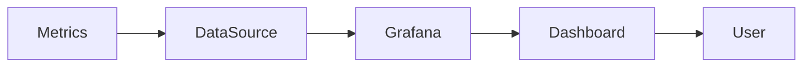
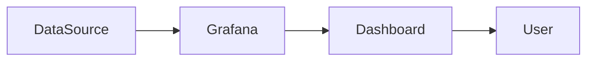
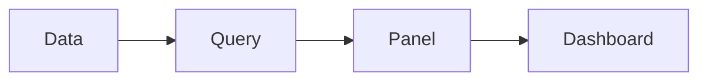
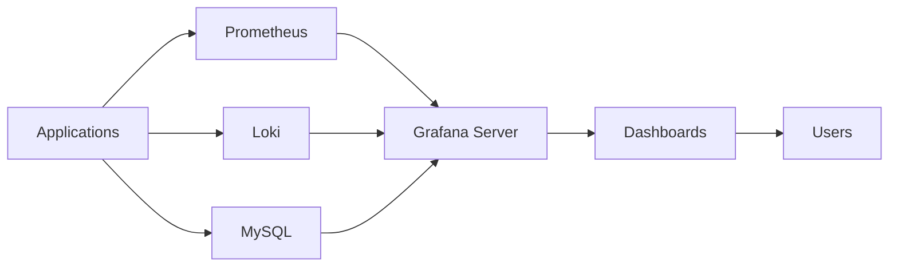
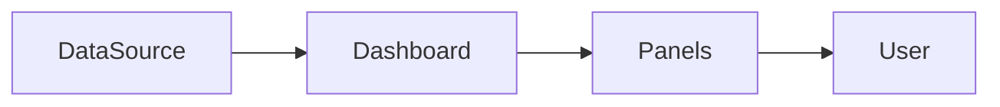
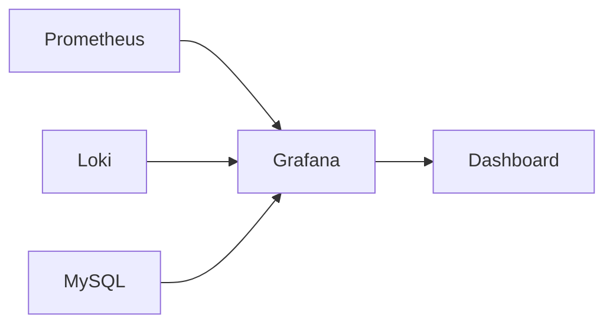
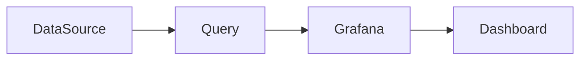

# Grafana Fundamentals

## Overview

Grafana is an open-source visualization and analytics platform used to monitor infrastructure, applications, containers, Kubernetes clusters, databases, and cloud services.

Unlike Prometheus, Grafana **does not collect or store metrics**. It connects to external data sources (such as Prometheus) to query, visualize, and analyze data through dashboards.

> **Interview Tip**
>
> - **Prometheus = Stores metrics**
> - **Grafana = Visualizes metrics**
>
> Grafana depends on one or more data sources for data.

---

## Why It Is Used

Grafana is used to:

- Visualize monitoring data
- Build real-time dashboards
- Monitor infrastructure health
- Analyze application performance
- Create alerts
- Troubleshoot production issues
- Display business metrics

---

## Architecture / Working


### Working Process

1. Applications expose metrics.
2. Prometheus collects and stores metrics.
3. Grafana connects to Prometheus.
4. Users create dashboards using PromQL queries.
5. Dashboards display real-time monitoring data.

---

## Key Components

| Component | Purpose |
|-----------|---------|
| Grafana Server | Visualization platform |
| Data Source | Provides monitoring data |
| Dashboard | Collection of panels |
| Panel | Individual visualization |
| Query | Retrieves data from data source |
| Alert | Generates notifications |
| User | Views dashboards |

---

## Types (if applicable)

Common Grafana Data Sources

| Data Source | Usage |
|-------------|-------|
| Prometheus | Infrastructure monitoring |
| Loki | Log monitoring |
| Elasticsearch | Log analytics |
| MySQL | Database metrics |
| PostgreSQL | Database visualization |
| Azure Monitor | Azure monitoring |
| CloudWatch | AWS monitoring |
| InfluxDB | Time-series database |

---

## Lifecycle / Workflow



---

## Configuration / Syntax (if applicable)

Access Grafana

```
http://localhost:3000
```

Default Login

```
Username: admin

Password: admin
```

---

## Important Commands (if applicable)

Start Grafana (Linux)

```bash
sudo systemctl start grafana-server
```

Enable Service

```bash
sudo systemctl enable grafana-server
```

Check Status

```bash
sudo systemctl status grafana-server
```

Restart Grafana

```bash
sudo systemctl restart grafana-server
```

---

## Important Files (if applicable)

| File | Purpose |
|------|----------|
| grafana.ini | Main configuration |
| provisioning/ | Automated configuration |
| dashboards/ | Dashboard provisioning |

---

## Real-World Use Cases

- Kubernetes monitoring
- Docker monitoring
- Azure infrastructure dashboards
- AWS infrastructure dashboards
- CI/CD monitoring
- Application performance monitoring
- Server health monitoring

---

## Advantages

- Easy dashboard creation
- Multiple data source support
- Interactive visualizations
- Alerting support
- Highly customizable
- Open source

---

## Limitations

- Does not collect metrics
- Depends on external data sources
- Complex dashboards may affect browser performance

---

## Common Interview Questions (Concept Only)

- What is Grafana?
- How is Grafana different from Prometheus?
- Does Grafana store metrics?
- Which port does Grafana use?
- Which data sources does Grafana support?

---

## Common Mistakes

- Assuming Grafana stores metrics
- Forgetting to configure data sources
- Building overly complex dashboards
- Using incorrect PromQL queries

---

## Troubleshooting

| Problem | Cause | Solution |
|----------|--------|----------|
| Empty dashboard | Data source unavailable | Verify data source |
| Login failure | Incorrect credentials | Reset admin password |
| No graphs | Query error | Test query |
| Dashboard slow | Complex queries | Optimize PromQL |

Useful Commands

```bash
systemctl status grafana-server

journalctl -u grafana-server
```

---

## Summary

Grafana is a visualization platform that connects to monitoring systems like Prometheus to create interactive dashboards, alerts, and analytics for infrastructure and applications.

---

# What is Grafana

## Overview

Grafana is an open-source analytics and visualization platform used to display monitoring data from various data sources in the form of dashboards.

It provides a centralized interface for observing infrastructure, cloud resources, applications, and Kubernetes clusters.

---

## Why It Is Used

Grafana helps to:

- Visualize metrics
- Build monitoring dashboards
- Monitor application health
- Analyze trends
- Troubleshoot production systems

---

## Architecture / Working



---

## Key Components

| Component | Purpose |
|-----------|---------|
| Data Source | Provides data |
| Dashboard | Displays data |
| Panel | Visualization |
| User | Views dashboards |

---

## Types (if applicable)

Supported Visualization Types

- Time Series
- Gauge
- Stat
- Table
- Heatmap
- Bar Chart
- Pie Chart

---

## Lifecycle / Workflow



---

## Configuration / Syntax (if applicable)

Default URL

```
http://localhost:3000
```

---

## Important Commands (if applicable)

```bash
systemctl start grafana-server
```

---

## Important Files (if applicable)

grafana.ini

---

## Real-World Use Cases

- Cloud monitoring
- DevOps dashboards
- Business analytics

---

## Advantages

- Simple UI
- Rich visualizations
- Multiple integrations

---

## Limitations

- Requires external data source

---

## Common Interview Questions (Concept Only)

- What is Grafana?
- What is Grafana used for?

---

## Common Mistakes

- Confusing Grafana with Prometheus

---

## Troubleshooting

- Verify data source connectivity
- Check dashboard queries

---

## Summary

Grafana is a visualization platform that displays monitoring data from external systems using customizable dashboards.

---

# Grafana Architecture

## Overview

Grafana architecture consists of a visualization server connected to one or more data sources.

It queries data sources, processes the returned data, and renders dashboards for users.

---

## Why It Is Used

The architecture separates:

- Data collection
- Data storage
- Visualization

This allows Grafana to work with multiple monitoring platforms simultaneously.

---

## Architecture / Working



---

## Key Components

| Component | Purpose |
|-----------|---------|
| Grafana Server | Visualization engine |
| Data Sources | Provide monitoring data |
| Dashboards | Display information |
| Users | Access dashboards |

---

## Types (if applicable)

Deployment Models

- Standalone
- Docker
- Kubernetes
- Cloud-hosted

---

## Lifecycle / Workflow


---

## Configuration / Syntax (if applicable)

Data sources are configured through the Grafana UI or provisioning files.

---

## Important Commands (if applicable)

```bash
systemctl restart grafana-server
```

---

## Important Files (if applicable)

| File | Purpose |
|------|----------|
| grafana.ini | Server configuration |
| provisioning/datasources | Data source provisioning |

---

## Real-World Use Cases

- Kubernetes monitoring
- Multi-cloud dashboards
- Centralized observability

---

## Advantages

- Supports multiple data sources
- Modular architecture
- Highly scalable

---

## Limitations

- Depends on external systems

---

## Common Interview Questions (Concept Only)

- Explain Grafana architecture.
- Can Grafana connect to multiple data sources?

---

## Common Mistakes

- Configuring incorrect data source URLs

---

## Troubleshooting

- Verify data source connectivity
- Check server logs

---

## Summary

Grafana acts as the visualization layer between users and monitoring data sources.

---

# Dashboards

## Overview

A Dashboard is a collection of panels that display related monitoring information on a single screen.

Dashboards provide a centralized view of infrastructure, applications, and cloud resources.

---

## Why It Is Used

Dashboards help engineers:

- Monitor system health
- Analyze trends
- Detect incidents
- Troubleshoot issues

---

## Architecture / Working



---

## Key Components

| Component | Purpose |
|-----------|---------|
| Dashboard | Collection of panels |
| Variables | Dynamic filtering |
| Time Range | Controls displayed data |

---

## Types (if applicable)

Common Dashboards

- Infrastructure
- Kubernetes
- Docker
- Application
- Database
- Cloud

---

## Lifecycle / Workflow


---

## Configuration / Syntax (if applicable)

Dashboards are created using the Grafana web interface.

---

## Important Commands (if applicable)

Not applicable.

---

## Important Files (if applicable)

Dashboard JSON export files.

---

## Real-World Use Cases

- Kubernetes cluster monitoring
- Azure VM dashboards
- AWS dashboards
- CI/CD dashboards

---

## Advantages

- Centralized monitoring
- Easy sharing
- Interactive filtering

---

## Limitations

- Dashboard quality depends on underlying queries

---

## Common Interview Questions (Concept Only)

- What is a Grafana dashboard?
- What does a dashboard contain?

---

## Common Mistakes

- Too many panels
- Poor dashboard organization

---

## Troubleshooting

- Verify data source
- Test queries

---

## Summary

Dashboards organize monitoring information into a single, easy-to-understand view.

---

# Panels

## Overview

A Panel is the smallest visualization component in Grafana.

Each panel displays the result of one or more queries.

---

## Why It Is Used

Panels visualize:

- CPU usage
- Memory utilization
- Network traffic
- Request rate
- Error rate
- Application latency

---

## Architecture / Working


---

## Key Components

| Component | Purpose |
|-----------|---------|
| Query | Retrieves data |
| Visualization | Displays results |
| Legend | Explains values |

---

## Types (if applicable)

Common Panel Types

| Panel | Purpose |
|--------|----------|
| Time Series | Trends |
| Gauge | Current value |
| Stat | Single metric |
| Table | Tabular data |
| Heatmap | Distribution |
| Bar Chart | Comparison |
| Pie Chart | Percentage |

---

## Lifecycle / Workflow


---

## Configuration / Syntax (if applicable)

Panels are configured using the Grafana UI.

---

## Important Commands (if applicable)

Not applicable.

---

## Important Files (if applicable)

Dashboard JSON

---

## Real-World Use Cases

- CPU graphs
- Memory gauges
- Request rate charts
- Error tables

---

## Advantages

- Flexible visualization
- Highly customizable

---

## Limitations

- Complex queries may slow rendering

---

## Common Interview Questions (Concept Only)

- What is a Grafana panel?
- Which panel types are commonly used?

---

## Common Mistakes

- Using the wrong visualization type

---

## Troubleshooting

- Verify query
- Verify panel settings

---

## Summary

Panels are the individual visualization components that make up a Grafana dashboard.

---

# Data Sources

## Overview

A Data Source is the backend system from which Grafana retrieves monitoring or analytics data.

Grafana supports numerous data sources, enabling centralized visualization across different platforms.

> **Interview Tip**
>
> Grafana queries the data source directly; it does **not** store the data itself.

---

## Why It Is Used

Data sources allow Grafana to:

- Retrieve metrics
- Query logs
- Display traces
- Visualize database data
- Build dashboards from multiple platforms

---

## Architecture / Working



---

## Key Components

| Component | Purpose |
|-----------|---------|
| Data Source | Supplies data |
| Query Engine | Executes queries |
| Authentication | Secure access |

---

## Types (if applicable)

Popular Data Sources

| Data Source | Purpose |
|-------------|---------|
| Prometheus | Metrics |
| Loki | Logs |
| Elasticsearch | Log analytics |
| MySQL | Relational data |
| PostgreSQL | Relational data |
| Azure Monitor | Azure services |
| CloudWatch | AWS monitoring |
| InfluxDB | Time-series metrics |

---

## Lifecycle / Workflow



---

## Configuration / Syntax (if applicable)

Typical Prometheus URL

```
http://localhost:9090
```

---

## Important Commands (if applicable)

Not applicable.

---

## Important Files (if applicable)

| File | Purpose |
|------|----------|
| provisioning/datasources | Automatic data source configuration |

---

## Real-World Use Cases

- Prometheus metrics
- Loki logs
- Azure monitoring
- AWS CloudWatch
- Kubernetes monitoring

---

## Advantages

- Supports many platforms
- Easy integration
- Centralized visualization

---

## Limitations

- Requires properly configured backend systems

---

## Common Interview Questions (Concept Only)

- What is a Grafana data source?
- Which data sources are commonly used?
- Can Grafana connect to multiple data sources simultaneously?
- Does Grafana store monitoring data?

---

## Common Mistakes

- Incorrect data source URL
- Missing authentication
- Wrong query language

---

## Troubleshooting

| Problem | Cause | Solution |
|----------|--------|----------|
| Connection failed | Incorrect URL | Verify endpoint |
| No data | Authentication issue | Verify credentials |
| Query error | Wrong query language | Use the correct syntax for the data source |

---

## Summary

Data sources are external systems that provide metrics, logs, traces, or database information to Grafana. Grafana queries these systems directly to build dashboards and visualizations without storing the underlying data.
