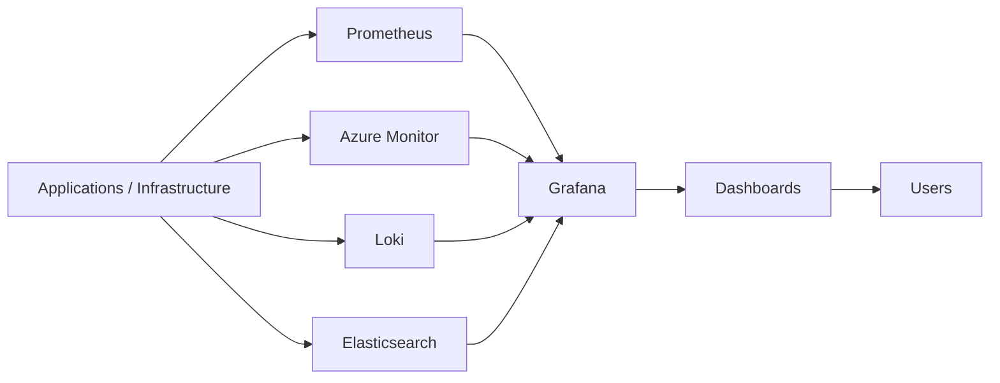
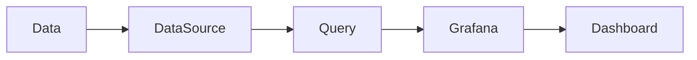
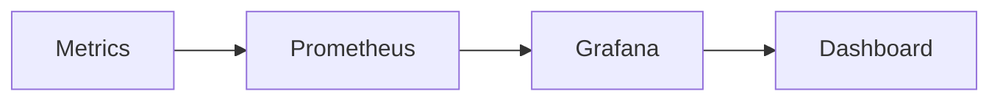
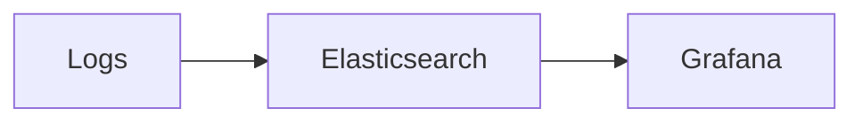
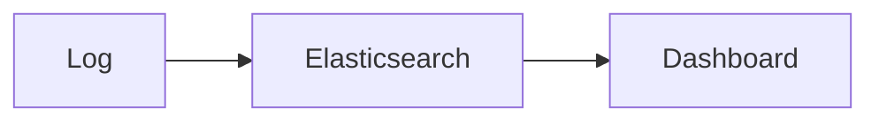
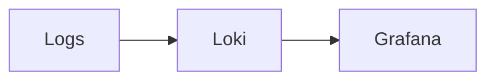
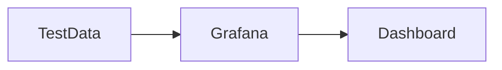
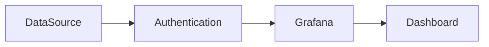
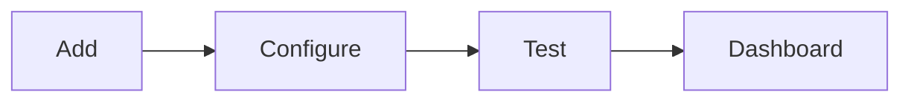

# Data Sources

## Overview

A **Data Source** is an external system that Grafana connects to for retrieving metrics, logs, traces, or other monitoring data.

Grafana **does not store monitoring data**. Instead, it queries configured data sources and visualizes the returned data using dashboards and panels.

> **Interview Tip**
>
> Grafana is a **visualization platform**, while the data source is responsible for storing or exposing the actual data.

---

## Why It Is Used

Data sources allow Grafana to:

- Retrieve monitoring data
- Visualize infrastructure metrics
- Display application logs
- Monitor cloud resources
- Create dashboards
- Build alerts

---

## Architecture / Working



### Working Process

1. Applications generate monitoring data.
2. Data is stored or exposed by external systems.
3. Grafana connects to the configured data source.
4. Users create queries.
5. Grafana renders the results in dashboards.

---

## Key Components

| Component | Purpose |
|-----------|---------|
| Data Source | Provides monitoring data |
| Query Engine | Executes queries |
| Authentication | Secure access |
| Dashboard | Displays queried data |
| Panel | Individual visualization |

---

## Types (if applicable)

Common Grafana Data Sources

| Data Source | Primary Purpose |
|-------------|-----------------|
| Prometheus | Metrics |
| Azure Monitor | Azure resource monitoring |
| Loki | Log aggregation |
| Elasticsearch | Log analytics |
| MySQL | Relational database |
| PostgreSQL | Relational database |
| CloudWatch | AWS monitoring |
| InfluxDB | Time-series metrics |

---

## Lifecycle / Workflow



---

## Configuration / Syntax (if applicable)

Typical Data Source Configuration

- Name
- URL
- Authentication
- Query Language
- Save & Test

---

## Important Commands (if applicable)

Not applicable.

---

## Important Files (if applicable)

| File | Purpose |
|------|----------|
| grafana.ini | Grafana configuration |
| provisioning/datasources/*.yaml | Automated data source provisioning |

---

## Real-World Use Cases

- Infrastructure monitoring
- Kubernetes monitoring
- Azure monitoring
- Centralized log visualization
- DevOps dashboards

---

## Advantages

- Supports multiple backends
- Centralized visualization
- Flexible querying
- Easy integration

---

## Limitations

- Requires properly configured backend systems
- Dashboard performance depends on query efficiency

---

## Common Interview Questions (Concept Only)

- What is a Grafana data source?
- Does Grafana store monitoring data?
- Can Grafana connect to multiple data sources?
- Which data source is commonly used with Prometheus?
- How do you verify a data source connection?

---

## Common Mistakes

- Incorrect endpoint URL
- Invalid authentication
- Wrong query language
- Forgetting to test the connection

---

## Troubleshooting

| Problem | Cause | Solution |
|----------|--------|----------|
| Connection failed | Wrong URL | Verify endpoint |
| Authentication error | Invalid credentials | Update credentials |
| No data | Backend unavailable | Verify backend health |
| Query error | Wrong query syntax | Use correct query language |

---

## Summary

Data sources provide Grafana with metrics, logs, and other monitoring data. Grafana queries these systems directly and visualizes the results through dashboards without storing the underlying data.

---

# Prometheus

## Overview

Prometheus is the most widely used Grafana data source for infrastructure, Kubernetes, container, and application monitoring.

Grafana uses **PromQL** to retrieve metrics from Prometheus.

> **Interview Tip**
>
> Prometheus stores metrics, while Grafana visualizes them using PromQL queries.

---

## Why It Is Used

Prometheus is used to monitor:

- Servers
- Kubernetes clusters
- Docker containers
- Applications
- Network devices

---

## Architecture / Working



---

## Key Components

| Component | Purpose |
|-----------|---------|
| Prometheus Server | Stores metrics |
| PromQL | Query language |
| Grafana | Visualization |

---

## Types (if applicable)

Supported Queries

- Instant Query
- Range Query

---

## Lifecycle / Workflow


---

## Configuration / Syntax (if applicable)

Typical URL

```
http://localhost:9090
```

Query Example

```promql
up
```

---

## Important Commands (if applicable)

Verify Prometheus

```bash
curl http://localhost:9090/-/healthy
```

---

## Important Files (if applicable)

prometheus.yml

---

## Real-World Use Cases

- Kubernetes monitoring
- Node monitoring
- Application metrics
- CI/CD monitoring

---

## Advantages

- Native Grafana integration
- Powerful querying
- High performance

---

## Limitations

- Metrics only (logs require another data source)

---

## Common Interview Questions (Concept Only)

- Why is Prometheus commonly used with Grafana?
- Which query language does Grafana use with Prometheus?

---

## Common Mistakes

- Incorrect Prometheus URL
- Wrong PromQL syntax

---

## Troubleshooting

- Verify Prometheus status
- Test PromQL
- Check network connectivity

---

## Summary

Prometheus is Grafana's most popular data source for metrics and integrates seamlessly using PromQL.

---

# Azure Monitor

## Overview

Azure Monitor is Microsoft's cloud-native monitoring service that collects metrics, logs, and diagnostic information from Azure resources.

Grafana connects to Azure Monitor to visualize Azure infrastructure.

---

## Why It Is Used

Azure Monitor enables visualization of:

- Azure Virtual Machines
- App Services
- AKS
- Storage Accounts
- SQL Databases

---

## Architecture / Working

```mermaid
flowchart LR

    Azure Resources --> Azure Monitor --> Grafana
```

---

## Key Components

| Component | Purpose |
|-----------|---------|
| Azure Monitor | Collects Azure metrics |
| Azure AD | Authentication |
| Grafana | Visualization |

---

## Types (if applicable)

Azure Services

- Metrics
- Logs
- Application Insights

---

## Lifecycle / Workflow

```mermaid
flowchart LR

    Azure --> Azure Monitor --> Grafana --> Dashboard
```

---

## Configuration / Syntax (if applicable)

Requires:

- Tenant ID
- Client ID
- Client Secret
- Subscription ID

---

## Important Commands (if applicable)

Not applicable.

---

## Important Files (if applicable)

Provisioning configuration (optional)

---

## Real-World Use Cases

- Azure VM monitoring
- AKS monitoring
- Azure SQL monitoring

---

## Advantages

- Native Azure integration
- Secure authentication
- Cloud monitoring

---

## Limitations

- Azure subscription required

---

## Common Interview Questions (Concept Only)

- What is Azure Monitor?
- Which Azure services can Grafana monitor?

---

## Common Mistakes

- Incorrect Azure credentials

---

## Troubleshooting

- Verify Azure authentication
- Check permissions

---

## Summary

Azure Monitor enables Grafana to visualize metrics and logs from Azure resources.

---

# Elasticsearch

## Overview

Elasticsearch is commonly used as a Grafana data source for log analysis and search.

It stores structured log data that Grafana can visualize using tables, charts, and dashboards.

---

## Why It Is Used

Used for:

- Log analytics
- Error analysis
- Security monitoring

---

## Architecture / Working



---

## Key Components

| Component | Purpose |
|-----------|---------|
| Elasticsearch | Stores logs |
| Grafana | Visualization |

---

## Types (if applicable)

Common Data

- Application logs
- Security logs
- System logs

---

## Lifecycle / Workflow



---

## Configuration / Syntax (if applicable)

Typical URL

```
http://localhost:9200
```

---

## Important Commands (if applicable)

Check Cluster

```bash
curl http://localhost:9200
```

---

## Important Files (if applicable)

elasticsearch.yml

---

## Real-World Use Cases

- Log dashboards
- Error monitoring

---

## Advantages

- Powerful search
- Fast indexing

---

## Limitations

- Requires storage management

---

## Common Interview Questions (Concept Only)

- Why use Elasticsearch with Grafana?

---

## Common Mistakes

- Wrong index pattern

---

## Troubleshooting

- Verify cluster health
- Check index availability

---

## Summary

Elasticsearch enables Grafana to visualize and analyze structured log data.

---

# Loki

## Overview

Loki is Grafana Labs' log aggregation system designed specifically for cloud-native environments.

Unlike Elasticsearch, Loki indexes **labels** instead of full log contents, reducing storage requirements.

> **Interview Tip**
>
> - **Prometheus = Metrics**
> - **Loki = Logs**
> - **Grafana = Visualization**

---

## Why It Is Used

Loki is used for:

- Centralized log collection
- Kubernetes logs
- Docker logs
- Application logs

---

## Architecture / Working



---

## Key Components

| Component | Purpose |
|-----------|---------|
| Loki | Log storage |
| Promtail | Log collector |
| Grafana | Visualization |

---

## Types (if applicable)

Common Log Sources

- Kubernetes
- Docker
- Linux
- Applications

---

## Lifecycle / Workflow


---

## Configuration / Syntax (if applicable)

Typical URL

```
http://localhost:3100
```

---

## Important Commands (if applicable)

Check Loki

```bash
curl http://localhost:3100/ready
```

---

## Important Files (if applicable)

loki-config.yaml

---

## Real-World Use Cases

- Kubernetes log monitoring
- Container troubleshooting

---

## Advantages

- Lightweight
- Kubernetes friendly
- Low storage overhead

---

## Limitations

- Designed for logs only

---

## Common Interview Questions (Concept Only)

- What is Loki?
- How is Loki different from Elasticsearch?

---

## Common Mistakes

- Forgetting to configure Promtail

---

## Troubleshooting

- Verify Loki status
- Verify Promtail

---

## Summary

Loki is a lightweight log aggregation system optimized for Grafana and Kubernetes environments.

---

# Test Data Source

## Overview

The **Test Data Source** is a built-in Grafana data source used to generate sample data for learning, dashboard development, and testing visualizations.

It does not require any external backend.

---

## Why It Is Used

It helps to:

- Learn Grafana
- Build dashboards
- Test panel types
- Validate dashboard layouts

---

## Architecture / Working



---

## Key Components

| Component | Purpose |
|-----------|---------|
| Test Data | Sample metrics |
| Dashboard | Visualization |

---

## Types (if applicable)

Sample Data

- Time Series
- Random Walk
- CSV
- Tables

---

## Lifecycle / Workflow


---

## Configuration / Syntax (if applicable)

Select **TestData DB** as the data source in Grafana.

---

## Important Commands (if applicable)

Not applicable.

---

## Important Files (if applicable)

None

---

## Real-World Use Cases

- Dashboard testing
- Training
- UI validation

---

## Advantages

- No backend required
- Easy learning

---

## Limitations

- Not suitable for production monitoring

---

## Common Interview Questions (Concept Only)

- What is the Test Data Source used for?

---

## Common Mistakes

- Using Test Data for production dashboards

---

## Troubleshooting

- Ensure the TestData data source is selected

---

## Summary

The Test Data Source provides synthetic data for learning and dashboard design without requiring a real monitoring backend.

---

# Configure Data Sources

## Overview

Configuring a data source establishes the connection between Grafana and an external monitoring or logging system.

A correctly configured data source is required before dashboards and panels can retrieve data.

---

## Why It Is Used

Configuration enables Grafana to:

- Access monitoring data
- Authenticate with backend systems
- Execute queries
- Build dashboards

---

## Architecture / Working



---

## Key Components

| Component | Purpose |
|-----------|---------|
| URL | Backend endpoint |
| Authentication | Secure access |
| Query Language | Retrieves data |
| Save & Test | Verifies connectivity |

---

## Types (if applicable)

Configuration Steps

1. Add Data Source
2. Enter URL
3. Configure authentication
4. Save & Test
5. Use in dashboards

---

## Lifecycle / Workflow



---

## Configuration / Syntax (if applicable)

Typical Prometheus Configuration

```
URL:
http://localhost:9090
```

---

## Important Commands (if applicable)

Not applicable.

---

## Important Files (if applicable)

| File | Purpose |
|------|----------|
| provisioning/datasources/*.yaml | Automated provisioning |

---

## Real-World Use Cases

- Connect Prometheus
- Configure Azure Monitor
- Add Loki
- Connect Elasticsearch

---

## Advantages

- Simple setup
- Multiple simultaneous data sources
- Centralized monitoring

---

## Limitations

- Requires correct credentials and endpoint configuration

---

## Common Interview Questions (Concept Only)

- How do you configure a Grafana data source?
- What does **Save & Test** do?
- Which information is typically required to configure a data source?

---

## Common Mistakes

- Incorrect backend URL
- Missing authentication credentials
- Selecting the wrong query language
- Forgetting to verify the connection with **Save & Test**

---

## Troubleshooting

| Problem | Cause | Solution |
|----------|--------|----------|
| Connection failed | Wrong URL | Verify endpoint |
| Authentication failed | Invalid credentials | Update authentication settings |
| No data returned | Backend unavailable | Verify data source health |
| Query error | Incorrect query language | Use the appropriate query syntax |

---

## Summary

Configuring data sources is the first step in building Grafana dashboards. A properly configured connection ensures Grafana can retrieve data securely and reliably from monitoring backends such as Prometheus, Azure Monitor, Loki, and Elasticsearch.
