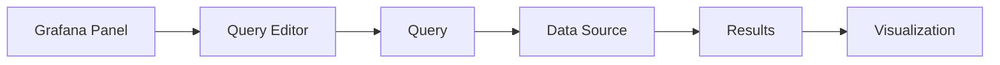
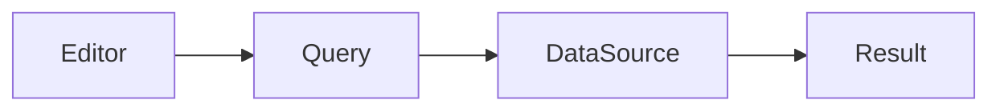
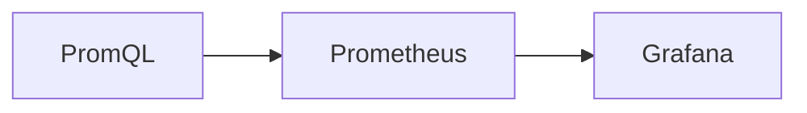
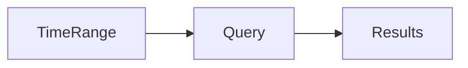
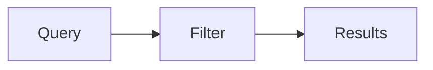
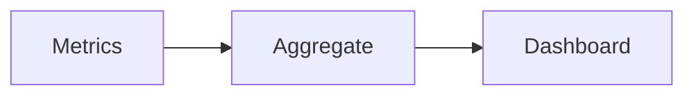

# Queries

## Overview

A **Query** is a request sent from Grafana to a data source to retrieve monitoring data for visualization.

Every Grafana panel contains one or more queries. The query language depends on the configured data source (e.g., **PromQL** for Prometheus, **LogQL** for Loki, **KQL** for Azure Monitor).

> **Interview Tip**
>
> Grafana does **not** process or store metrics. It sends queries to the configured data source and displays the returned results.

---

## Why It Is Used

Queries help to:

- Retrieve metrics
- Display logs
- Filter monitoring data
- Build dashboards
- Create alerts
- Analyze system performance
- Monitor infrastructure

---

## Architecture / Working



### Working Process

1. Select a data source.
2. Write a query.
3. Grafana sends the query to the data source.
4. The data source returns results.
5. Grafana renders the visualization.

---

## Key Components

| Component | Purpose |
|-----------|---------|
| Query Editor | Create and edit queries |
| Query | Retrieves monitoring data |
| Data Source | Executes the query |
| Visualization | Displays results |
| Time Range | Controls queried time period |

---

## Types (if applicable)

Common Query Languages

| Data Source | Query Language |
|-------------|----------------|
| Prometheus | PromQL |
| Loki | LogQL |
| Azure Monitor | KQL |
| Elasticsearch | Lucene / Query DSL |
| SQL Databases | SQL |

---

## Lifecycle / Workflow


---

## Configuration / Syntax (if applicable)

Typical Workflow

```
Data Source

↓

Query

↓

Execute

↓

Visualization
```

---

## Important Commands (if applicable)

Not applicable.

---

## Important Files (if applicable)

Dashboard JSON stores panel queries.

---

## Real-World Use Cases

- CPU monitoring
- Kubernetes monitoring
- Azure monitoring
- Docker monitoring
- Error monitoring
- Infrastructure dashboards

---

## Advantages

- Real-time visualization
- Flexible querying
- Supports multiple backends
- Dynamic dashboards

---

## Limitations

- Complex queries can affect performance
- Query language depends on the data source

---

## Common Interview Questions (Concept Only)

- What is a Grafana query?
- Does Grafana execute queries itself?
- Can multiple queries exist in one panel?
- Which query language is used with Prometheus?
- How does Grafana retrieve monitoring data?

---

## Common Mistakes

- Selecting the wrong data source
- Writing incorrect query syntax
- Using overly complex queries
- Ignoring the selected time range

---

## Troubleshooting

| Problem | Cause | Solution |
|----------|--------|----------|
| No data returned | Wrong query | Verify syntax |
| Query timeout | Large dataset | Optimize query |
| Empty graph | Incorrect time range | Adjust time range |
| Slow dashboard | Heavy aggregation | Simplify query |

---

## Summary

Queries are the core mechanism Grafana uses to retrieve monitoring data from external data sources and display it within dashboards.

---

# Query Editor

## Overview

The **Query Editor** is the interface used to create, modify, test, and execute queries against a selected data source.

The available editor depends on the configured data source.

---

## Why It Is Used

The Query Editor allows users to:

- Write queries
- Test results
- Modify filters
- Select metrics
- Preview output

---

## Architecture / Working



---

## Key Components

| Component | Purpose |
|-----------|---------|
| Data Source Selector | Select backend |
| Query Field | Write queries |
| Run Query | Execute query |
| Result Preview | Verify output |

---

## Types (if applicable)

Editor Modes

- Builder Mode
- Code Mode

> **Interview Tip**
>
> Beginners often use **Builder Mode**, while experienced engineers typically prefer **Code Mode** for greater flexibility.

---

## Lifecycle / Workflow


---

## Configuration / Syntax (if applicable)

Typical Steps

1. Select Data Source
2. Open Query Editor
3. Write Query
4. Run Query
5. Save Panel

---

## Important Commands (if applicable)

Not applicable.

---

## Important Files (if applicable)

Dashboard JSON

---

## Real-World Use Cases

- Building dashboards
- Testing PromQL
- Monitoring applications

---

## Advantages

- Easy query creation
- Query preview
- Supports multiple languages

---

## Limitations

- Depends on selected data source

---

## Common Interview Questions (Concept Only)

- What is the Query Editor?
- What is the difference between Builder Mode and Code Mode?

---

## Common Mistakes

- Forgetting to execute the query
- Using the wrong query language

---

## Troubleshooting

- Verify selected data source
- Check query syntax

---

## Summary

The Query Editor provides an interface for creating, testing, and executing queries against Grafana data sources.

---

# PromQL Basics

## Overview

**PromQL (Prometheus Query Language)** is the query language used to retrieve metrics from Prometheus.

It is one of the most frequently asked interview topics in Prometheus and Grafana.

> **Interview Tip**
>
> Grafana sends PromQL queries directly to Prometheus.

---

## Why It Is Used

PromQL is used to:

- Retrieve metrics
- Calculate rates
- Aggregate values
- Filter labels
- Monitor infrastructure

---

## Architecture / Working



---

## Key Components

| Component | Purpose |
|-----------|---------|
| Metric | Data series |
| Labels | Filtering |
| Functions | Calculations |
| Operators | Comparisons |

---

## Types (if applicable)

Common Query Types

- Instant Query
- Range Query

---

## Lifecycle / Workflow


---

## Configuration / Syntax (if applicable)

Basic Metric

```promql
up
```

Label Filter

```promql
up{job="node"}
```

Rate Function

```promql
rate(node_cpu_seconds_total[5m])
```

Aggregation

```promql
sum(rate(node_cpu_seconds_total[5m]))
```

---

## Important Commands (if applicable)

None

---

## Important Files (if applicable)

prometheus.yml

---

## Real-World Use Cases

- CPU monitoring
- Request rate
- Error rate
- Kubernetes monitoring

---

## Advantages

- Powerful
- Flexible
- Supports aggregation

---

## Limitations

- Learning curve
- Prometheus only

---

## Common Interview Questions (Concept Only)

- What is PromQL?
- What is the difference between an instant query and a range query?
- What is the purpose of the `rate()` function?
- Why are labels important in PromQL?

---

## Common Mistakes

- Incorrect label filtering
- Wrong aggregation
- Using `rate()` on gauges

---

## Troubleshooting

- Verify metric names
- Test simple queries first

---

## Summary

PromQL is the primary language for querying Prometheus metrics and is essential for building Grafana dashboards.

---

# Time Range Selection

## Overview

The **Time Range** controls the period over which Grafana retrieves data from the data source.

It determines the dataset returned for every panel query.

---

## Why It Is Used

Time ranges allow users to:

- View historical data
- Analyze trends
- Troubleshoot incidents
- Compare performance

---

## Architecture / Working



---

## Key Components

| Component | Purpose |
|-----------|---------|
| Start Time | Beginning of query |
| End Time | End of query |
| Refresh Interval | Automatic updates |

---

## Types (if applicable)

Common Time Ranges

- Last 5 minutes
- Last 15 minutes
- Last 1 hour
- Last 24 hours
- Last 7 days
- Custom Range

---

## Lifecycle / Workflow


---

## Configuration / Syntax (if applicable)

Examples

```
Last 5 minutes

Last 1 hour

Last 24 hours
```

---

## Important Commands (if applicable)

Not applicable.

---

## Important Files (if applicable)

Stored in dashboard configuration.

---

## Real-World Use Cases

- Incident analysis
- Capacity planning
- Performance comparison

---

## Advantages

- Flexible analysis
- Historical monitoring

---

## Limitations

- Very large ranges may slow queries

---

## Common Interview Questions (Concept Only)

- How does the selected time range affect queries?
- Why might dashboards return no data for certain time ranges?

---

## Common Mistakes

- Choosing an incorrect time range
- Forgetting auto-refresh

---

## Troubleshooting

- Expand time range
- Verify metric timestamps

---

## Summary

Time range selection controls the period of data retrieved and directly impacts dashboard results.

---

# Filters

## Overview

Filters restrict query results by selecting only the required metrics or labels.

Filtering improves dashboard readability and query performance.

---

## Why It Is Used

Filters help to:

- Reduce returned data
- Monitor specific resources
- Improve performance
- Build reusable dashboards

---

## Architecture / Working



---

## Key Components

| Component | Purpose |
|-----------|---------|
| Labels | Identify metrics |
| Operators | Apply filtering |
| Variables | Dynamic filtering |

---

## Types (if applicable)

Common PromQL Filters

| Operator | Purpose |
|----------|---------|
| = | Exact match |
| != | Not equal |
| =~ | Regex match |
| !~ | Regex exclusion |

---

## Lifecycle / Workflow


---

## Configuration / Syntax (if applicable)

Exact Match

```promql
up{job="node"}
```

Regex

```promql
up{instance=~".*prod.*"}
```

---

## Important Commands (if applicable)

None

---

## Important Files (if applicable)

None

---

## Real-World Use Cases

- Filter production servers
- Select Kubernetes namespaces
- View specific applications

---

## Advantages

- Faster queries
- Smaller datasets
- Cleaner dashboards

---

## Limitations

- Incorrect filters may hide data

---

## Common Interview Questions (Concept Only)

- How are labels used for filtering?
- What is the difference between `=` and `=~` in PromQL?

---

## Common Mistakes

- Typographical errors in label names
- Incorrect regular expressions

---

## Troubleshooting

- Verify available labels
- Test filters incrementally

---

## Summary

Filters narrow query results using labels and operators, enabling efficient and focused monitoring.

---

# Aggregations

## Overview

Aggregation combines multiple metric values into a single result or grouped results.

Aggregations are widely used to summarize infrastructure and application metrics.

> **Interview Tip**
>
> Aggregation functions are among the most frequently asked PromQL interview topics.

---

## Why It Is Used

Aggregation is used to:

- Calculate totals
- Compute averages
- Identify maximum values
- Compare groups
- Build summary dashboards

---

## Architecture / Working



---

## Key Components

| Component | Purpose |
|-----------|---------|
| Aggregation Function | Calculates summary values |
| Labels | Group metrics |
| Output | Aggregated result |

---

## Types (if applicable)

Common Aggregation Functions

| Function | Purpose |
|----------|---------|
| sum() | Total value |
| avg() | Average |
| max() | Maximum |
| min() | Minimum |
| count() | Count metrics |
| topk() | Highest values |
| bottomk() | Lowest values |

---

## Lifecycle / Workflow


---

## Configuration / Syntax (if applicable)

Total CPU

```promql
sum(rate(node_cpu_seconds_total[5m]))
```

Average CPU

```promql
avg(rate(node_cpu_seconds_total[5m]))
```

Maximum Memory

```promql
max(node_memory_MemAvailable_bytes)
```

Grouped Aggregation

```promql
sum by(instance)(rate(node_cpu_seconds_total[5m]))
```

---

## Important Commands (if applicable)

Not applicable.

---

## Important Files (if applicable)

None

---

## Real-World Use Cases

- Total cluster CPU
- Average memory usage
- Top CPU-consuming servers
- Resource utilization summaries

---

## Advantages

- Simplifies large datasets
- Enables meaningful comparisons
- Supports dashboard KPIs

---

## Limitations

- Incorrect aggregation can produce misleading results
- May hide individual resource behavior

---

## Common Interview Questions (Concept Only)

- What is aggregation in PromQL?
- What is the difference between `sum()` and `avg()`?
- Why is `sum by(instance)` used?
- Which aggregation function finds the highest value?

---

## Common Mistakes

- Aggregating without proper grouping
- Using incorrect aggregation functions
- Ignoring label dimensions

---

## Troubleshooting

| Problem | Cause | Solution |
|----------|--------|----------|
| Incorrect totals | Missing grouping labels | Use `by()` appropriately |
| Duplicate values | Label mismatch | Review labels |
| Empty results | Invalid metric | Verify metric name |
| Unexpected averages | Wrong aggregation | Select the appropriate function |

---

## Summary

Aggregation functions summarize monitoring data, making dashboards easier to understand and enabling meaningful analysis of infrastructure and application performance.
