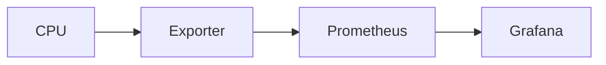
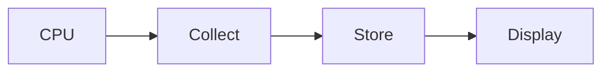
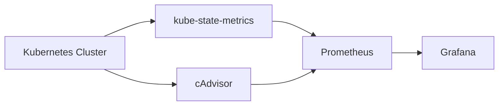

# Visualization

## Overview

Visualization is the core feature of Grafana that transforms monitoring data into meaningful graphs, charts, gauges, and tables. It helps engineers quickly understand the health and performance of infrastructure, applications, and cloud resources.

Grafana supports visualization of metrics from various data sources such as Prometheus, Azure Monitor, Loki, Elasticsearch, and more.

> **Interview Tip**
>
> Grafana **does not collect metrics**. It visualizes data retrieved from external data sources.

---

## Why It Is Used

Visualization helps to:

- Monitor infrastructure health
- Detect performance bottlenecks
- Analyze historical trends
- Troubleshoot production issues
- Build operational dashboards
- Track SLAs and KPIs
- Support capacity planning

---

## Architecture / Working


### Working Process

1. Infrastructure generates metrics.
2. Metrics are collected by a monitoring system.
3. Grafana queries the data source.
4. Retrieved metrics are visualized using panels.
5. Dashboards refresh automatically.

---

## Key Components

| Component | Purpose |
|-----------|---------|
| Data Source | Provides monitoring data |
| Query | Retrieves metrics |
| Panel | Displays visualization |
| Dashboard | Collection of panels |
| Time Range | Controls displayed period |
| Variables | Dynamic filtering |

---

## Types (if applicable)

Common Visualization Types

| Visualization | Best Used For |
|--------------|---------------|
| Time Series | Trends over time |
| Stat | Single value |
| Gauge | Utilization percentage |
| Table | Detailed information |
| Bar Chart | Category comparison |
| Pie Chart | Distribution |

---

## Lifecycle / Workflow


---

## Configuration / Syntax (if applicable)

Typical Workflow

```
Data Source

↓

Query

↓

Visualization

↓

Dashboard
```

---

## Important Commands (if applicable)

Not applicable.

---

## Important Files (if applicable)

| File | Purpose |
|------|----------|
| Dashboard JSON | Stores dashboard configuration |

---

## Real-World Use Cases

- Infrastructure monitoring
- Kubernetes dashboards
- Azure monitoring
- AWS monitoring
- Docker monitoring
- Application monitoring
- Database monitoring

---

## Advantages

- Easy visualization
- Real-time monitoring
- Interactive dashboards
- Supports multiple data sources
- Highly customizable

---

## Limitations

- Depends on external monitoring systems
- Poor queries may slow dashboards

---

## Common Interview Questions (Concept Only)

- What is visualization in Grafana?
- Does Grafana collect monitoring data?
- Which visualization is best for trends?
- What is the difference between a panel and a dashboard?

---

## Common Mistakes

- Choosing the wrong visualization type
- Using inefficient queries
- Ignoring dashboard refresh intervals
- Displaying too much data in a single panel

---

## Troubleshooting

| Problem | Cause | Solution |
|----------|--------|----------|
| Empty graph | Query issue | Verify query |
| Slow dashboard | Heavy query | Optimize query |
| Wrong visualization | Incorrect panel type | Select appropriate visualization |
| No data | Data source unavailable | Verify connectivity |

---

## Summary

Visualization is Grafana's primary capability, enabling engineers to convert raw monitoring metrics into meaningful dashboards for real-time monitoring, troubleshooting, and performance analysis.

---

# CPU Metrics

## Overview

CPU metrics measure processor utilization and workload. They help identify CPU bottlenecks, overloaded systems, and application performance issues.

> **Interview Tip**
>
> CPU metrics are among the most frequently monitored infrastructure metrics.

---

## Why It Is Used

CPU metrics help to:

- Monitor utilization
- Detect CPU bottlenecks
- Identify overloaded servers
- Support capacity planning

---

## Architecture / Working



---

## Key Components

| Component | Purpose |
|-----------|---------|
| CPU Usage | Processor utilization |
| Idle Time | Unused CPU |
| User Time | User process execution |
| System Time | Kernel execution |

---

## Types (if applicable)

Common CPU Metrics

- CPU Usage %
- Idle %
- System %
- User %
- Load Average

---

## Lifecycle / Workflow



---

## Configuration / Syntax (if applicable)

Example PromQL

```promql
100 - (avg(rate(node_cpu_seconds_total{mode="idle"}[5m])) * 100)
```

---

## Important Commands (if applicable)

Not applicable.

---

## Important Files (if applicable)

None

---

## Real-World Use Cases

- Monitor production servers
- Kubernetes nodes
- Azure Virtual Machines
- AWS EC2 instances

---

## Advantages

- Early bottleneck detection
- Performance monitoring

---

## Limitations

- High CPU alone doesn't always indicate a problem

---

## Common Interview Questions (Concept Only)

- Which metric measures CPU utilization?
- Why monitor CPU usage?

---

## Common Mistakes

- Monitoring only average CPU
- Ignoring CPU spikes

---

## Troubleshooting

- Verify exporter
- Check scrape status
- Validate PromQL query

---

## Summary

CPU metrics help monitor processor utilization and detect infrastructure performance issues.

---

# Memory Metrics

## Overview

Memory metrics measure RAM usage and availability. They help detect memory leaks, insufficient resources, and application performance problems.

---

## Why It Is Used

Memory metrics help to:

- Monitor RAM usage
- Detect memory leaks
- Prevent Out Of Memory (OOM) errors
- Support resource planning

---

## Architecture / Working


---

## Key Components

| Component | Purpose |
|-----------|---------|
| Used Memory | Consumed RAM |
| Free Memory | Available RAM |
| Cached Memory | OS cache |
| Buffers | Temporary storage |

---

## Types (if applicable)

Common Metrics

- Memory Used
- Memory Free
- Available Memory
- Swap Usage

---

## Lifecycle / Workflow


---

## Configuration / Syntax (if applicable)

Example

```promql
100 - ((node_memory_MemAvailable_bytes / node_memory_MemTotal_bytes) * 100)
```

---

## Important Commands (if applicable)

None

---

## Important Files (if applicable)

None

---

## Real-World Use Cases

- Detect memory leaks
- Kubernetes monitoring
- Cloud VM monitoring

---

## Advantages

- Prevents application crashes
- Improves resource planning

---

## Limitations

- Cached memory can be misleading

---

## Common Interview Questions (Concept Only)

- Which metric measures memory utilization?
- Why monitor available memory?

---

## Common Mistakes

- Treating cache as used memory

---

## Troubleshooting

- Check exporter
- Verify PromQL query

---

## Summary

Memory metrics monitor RAM utilization and help prevent performance degradation caused by insufficient memory.

---

# Disk Metrics

## Overview

Disk metrics monitor storage capacity, disk utilization, I/O activity, and filesystem health.

---

## Why It Is Used

They help detect:

- Low disk space
- High disk utilization
- Slow storage
- Capacity issues

---

## Architecture / Working


---

## Key Components

| Component | Purpose |
|-----------|---------|
| Disk Usage | Used storage |
| Free Space | Available storage |
| Read IOPS | Read operations |
| Write IOPS | Write operations |

---

## Types (if applicable)

Common Metrics

- Disk Usage %
- Read Throughput
- Write Throughput
- Disk Latency

---

## Lifecycle / Workflow


---

## Configuration / Syntax (if applicable)

Example

```promql
100 - ((node_filesystem_avail_bytes / node_filesystem_size_bytes) * 100)
```

---

## Important Commands (if applicable)

None

---

## Important Files (if applicable)

None

---

## Real-World Use Cases

- Monitor server disks
- Cloud VM storage
- Kubernetes nodes

---

## Advantages

- Prevents storage failures
- Supports capacity planning

---

## Limitations

- Temporary spikes may not indicate issues

---

## Common Interview Questions (Concept Only)

- Why monitor disk usage?
- Which metrics indicate storage capacity?

---

## Common Mistakes

- Ignoring inode usage
- Monitoring only disk capacity

---

## Troubleshooting

- Verify filesystem metrics
- Check exporter status

---

## Summary

Disk metrics monitor storage utilization and performance to prevent outages caused by insufficient disk space.

---

# Network Metrics

## Overview

Network metrics measure network traffic and communication between systems.

---

## Why It Is Used

They help monitor:

- Network bandwidth
- Packet loss
- Errors
- Throughput

---

## Architecture / Working


---

## Key Components

| Component | Purpose |
|-----------|---------|
| Bytes Sent | Outbound traffic |
| Bytes Received | Inbound traffic |
| Errors | Transmission failures |
| Packet Loss | Dropped packets |

---

## Types (if applicable)

Common Metrics

- Bandwidth
- Throughput
- Errors
- Packet Drops

---

## Lifecycle / Workflow


---

## Configuration / Syntax (if applicable)

Example

```promql
rate(node_network_receive_bytes_total[5m])
```

---

## Important Commands (if applicable)

None

---

## Important Files (if applicable)

None

---

## Real-World Use Cases

- Cloud networking
- Kubernetes clusters
- Data centers

---

## Advantages

- Detects network issues
- Improves troubleshooting

---

## Limitations

- Temporary traffic spikes can occur

---

## Common Interview Questions (Concept Only)

- Which metrics monitor network bandwidth?
- Why monitor packet loss?

---

## Common Mistakes

- Ignoring interface-specific metrics

---

## Troubleshooting

- Verify exporter
- Check interface labels

---

## Summary

Network metrics provide visibility into bandwidth, throughput, and communication health.

---

# Application Metrics

## Overview

Application metrics measure the health and performance of software applications.

---

## Why It Is Used

Application metrics help monitor:

- Requests
- Errors
- Latency
- Availability

---

## Architecture / Working


---

## Key Components

| Component | Purpose |
|-----------|---------|
| Request Rate | Traffic |
| Error Rate | Failures |
| Response Time | Latency |
| Availability | Uptime |

---

## Types (if applicable)

Common Metrics

- HTTP Requests
- Error Count
- Response Time
- Active Sessions

---

## Lifecycle / Workflow


---

## Configuration / Syntax (if applicable)

Example

```promql
rate(http_requests_total[5m])
```

---

## Important Commands (if applicable)

None

---

## Important Files (if applicable)

None

---

## Real-World Use Cases

- Web applications
- APIs
- Microservices

---

## Advantages

- Detects application issues quickly
- Supports SLA monitoring

---

## Limitations

- Requires application instrumentation

---

## Common Interview Questions (Concept Only)

- Which application metrics are commonly monitored?
- Why monitor response time?

---

## Common Mistakes

- Monitoring infrastructure only
- Ignoring error rates

---

## Troubleshooting

- Verify exporter
- Check instrumentation

---

## Summary

Application metrics provide visibility into software performance and user experience.

---

# Kubernetes Metrics

## Overview

Kubernetes metrics monitor the health, performance, and resource utilization of Kubernetes clusters and workloads.

> **Interview Tip**
>
> The most commonly monitored Kubernetes resources are **Nodes, Pods, Deployments, Namespaces, and Containers**.

---

## Why It Is Used

Kubernetes metrics help to:

- Monitor cluster health
- Track resource utilization
- Detect failed pods
- Monitor deployments
- Improve cluster performance

---

## Architecture / Working



---

## Key Components

| Component | Purpose |
|-----------|---------|
| Node Metrics | Cluster nodes |
| Pod Metrics | Running pods |
| Container Metrics | Container usage |
| Deployment Metrics | Deployment health |

---

## Types (if applicable)

Common Kubernetes Metrics

- Node CPU
- Node Memory
- Pod Status
- Container CPU
- Container Memory
- Pod Restarts
- Deployment Availability

---

## Lifecycle / Workflow


---

## Configuration / Syntax (if applicable)

Example

```promql
sum(rate(container_cpu_usage_seconds_total[5m])) by (pod)
```

---

## Important Commands (if applicable)

Not applicable.

---

## Important Files (if applicable)

None

---

## Real-World Use Cases

- Production Kubernetes monitoring
- Cluster capacity planning
- Pod troubleshooting
- Resource optimization

---

## Advantages

- Complete cluster visibility
- Supports proactive monitoring
- Simplifies troubleshooting

---

## Limitations

- Requires exporters such as kube-state-metrics and cAdvisor
- Large clusters generate high metric volumes

---

## Common Interview Questions (Concept Only)

- Which Kubernetes components are commonly monitored?
- What is kube-state-metrics?
- What metrics does cAdvisor provide?
- Why monitor pod restart counts?
- Which metrics indicate cluster health?

---

## Common Mistakes

- Monitoring only node metrics
- Ignoring pod restart counts
- Not tracking deployment health
- Missing namespace filtering

---

## Troubleshooting

| Problem | Cause | Solution |
|----------|--------|----------|
| Missing pod metrics | kube-state-metrics unavailable | Verify deployment |
| Missing container metrics | cAdvisor issue | Check exporter |
| Empty dashboards | Prometheus scrape failure | Verify targets |
| Incorrect values | Wrong PromQL query | Validate metric names |

---

## Summary

Kubernetes metrics provide comprehensive visibility into cluster health, nodes, pods, containers, and deployments, enabling effective monitoring, troubleshooting, and capacity planning in production environments.
