# Users & Permissions

## Overview

Grafana provides a Role-Based Access Control (RBAC) system to manage who can access, modify, and administer dashboards, data sources, folders, and organizations.

Users can be grouped into Teams and assigned Roles to control their permissions. Folder and Dashboard permissions allow fine-grained access control for different teams and users.

> **Interview Tip**
>
> Authentication verifies **who you are**, while Authorization determines **what you can do**.

---

## Why It Is Used

Users & Permissions help to:

- Secure Grafana resources
- Control dashboard access
- Separate responsibilities among teams
- Prevent unauthorized changes
- Enable collaboration
- Protect production dashboards
- Support enterprise environments

---

## Architecture / Working

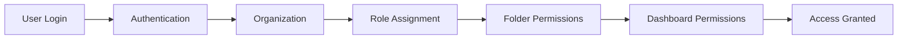

### Working Process

1. User logs into Grafana.
2. Authentication verifies identity.
3. User belongs to an organization.
4. A role is assigned.
5. Folder and dashboard permissions are evaluated.
6. User receives the allowed access.

---

## Key Components

| Component | Purpose |
|-----------|---------|
| User | Individual account |
| Team | Collection of users |
| Organization | Logical separation of resources |
| Role | Defines permissions |
| Folder | Groups dashboards |
| Dashboard | Visualization resource |
| Permission | Controls access |

---

## Types (if applicable)

### Grafana Roles

| Role | Permissions |
|------|-------------|
| Viewer | View dashboards only |
| Editor | Create and modify dashboards |
| Admin | Full administration within an organization |

---

### Permission Levels

| Permission | Access |
|------------|--------|
| View | Read-only |
| Edit | Modify dashboards |
| Admin | Full control |

---

## Lifecycle / Workflow

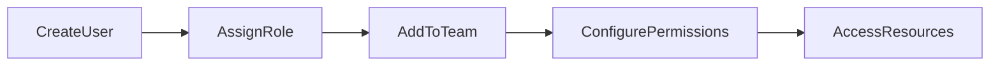

---

## Configuration / Syntax (if applicable)

Typical Permission Flow

```
User

↓

Organization

↓

Role

↓

Folder Permission

↓

Dashboard Permission

↓

Access
```

---

## Important Commands (if applicable)

Not applicable.

---

## Important Files (if applicable)

| File | Purpose |
|------|----------|
| grafana.ini | Authentication and authorization settings |

---

## Real-World Use Cases

- Developers can edit development dashboards.
- Operations team can manage production dashboards.
- Managers have view-only access.
- Security team monitors dashboards without editing them.
- Separate dashboards for Development, Testing, and Production.
- Restrict sensitive dashboards to administrators.

---

## Advantages

- Role-based access control
- Improved security
- Easy team management
- Centralized permission management
- Supports multi-team environments
- Prevents accidental dashboard modifications

---

## Limitations

- Default roles may be insufficient for complex permission requirements.
- Incorrect permission configuration may expose sensitive dashboards.
- Managing permissions manually becomes difficult in very large organizations.

---

## Common Interview Questions (Concept Only)

- What are the default Grafana roles?
- What is the difference between Viewer, Editor, and Admin?
- What is a Team in Grafana?
- Why are Folder Permissions used?
- How are Dashboard Permissions different from Folder Permissions?
- Can a user belong to multiple Teams?
- What is an Organization in Grafana?
- How do you restrict dashboard access?
- What is RBAC in Grafana?
- How does Grafana handle authorization?

---

## Common Mistakes

- Giving Admin access to every user.
- Not organizing dashboards into folders.
- Using individual user permissions instead of Teams.
- Forgetting inherited folder permissions.
- Allowing everyone to edit production dashboards.
- Not separating Development and Production environments.

---

## Troubleshooting

| Problem | Possible Cause | Solution |
|----------|----------------|----------|
| User cannot see dashboard | Missing View permission | Verify dashboard or folder permissions |
| User cannot edit dashboard | Viewer role assigned | Assign Editor role |
| Dashboard visible to everyone | Folder permissions configured incorrectly | Review folder access settings |
| User cannot access Grafana | Authentication issue | Verify login configuration |
| Team permissions not applied | User not added to team | Check team membership |
| Dashboard editing disabled | Folder is View-only | Modify folder permissions |
| Unexpected access | Inherited permissions | Review folder and organization permissions |

---

## Summary

Grafana uses a Role-Based Access Control (RBAC) model to manage access to dashboards, folders, and resources. Users are assigned roles such as Viewer, Editor, or Admin and can be organized into Teams for easier permission management. Folder and Dashboard permissions provide fine-grained access control, making Grafana secure and suitable for enterprise environments.

---

# Users

## Overview

A User represents an individual account that can log in to Grafana. Every user belongs to an organization and is assigned a role that determines the actions they can perform.

---

## Why It Is Used

Users enable:

- Individual authentication
- Personalized dashboards
- Secure access
- Activity tracking
- Role assignment

---

## Architecture / Working

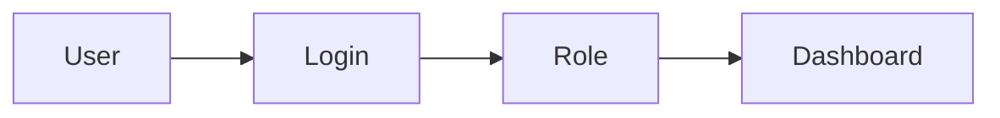

---

## Key Components

| Component | Description |
|-----------|-------------|
| Username | User identity |
| Password/SSO | Authentication |
| Role | Access level |
| Team | Group membership |

---

## Types (if applicable)

- Local Users
- LDAP Users
- OAuth Users
- Azure AD Users
- GitHub Users
- Google Users

---

## Lifecycle / Workflow

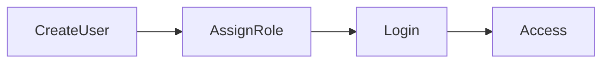

---

## Configuration / Syntax (if applicable)

Typical User Workflow

```
Create User

↓

Assign Role

↓

Login

↓

Access Dashboards
```

---

## Important Commands (if applicable)

Not applicable.

---

## Important Files (if applicable)

- `grafana.ini`

---

## Real-World Use Cases

- Developer accounts
- DevOps engineers
- SRE users
- Operations engineers
- Read-only business users

---

## Advantages

- Secure authentication
- Individual access
- Activity auditing

---

## Limitations

- Manual management for large environments without SSO

---

## Common Interview Questions (Concept Only)

- What is a Grafana user?
- Can Grafana authenticate with Azure AD?

---

## Common Mistakes

- Shared accounts
- Weak passwords

---

## Troubleshooting

- Verify login credentials
- Check authentication provider

---

## Summary

Users represent authenticated individuals who access Grafana resources based on assigned roles.

---

# Teams

## Overview

Teams group multiple users together so permissions can be assigned collectively instead of individually.

---

## Why It Is Used

Teams simplify:

- Permission management
- Department separation
- Large enterprise administration

---

## Architecture / Working

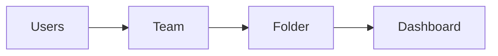

---

## Key Components

| Component | Purpose |
|-----------|---------|
| Team | Group of users |
| Members | Users in team |
| Permissions | Shared access |

---

## Types (if applicable)

Examples:

- DevOps Team
- SRE Team
- Developers
- QA Team
- Operations Team

---

## Lifecycle / Workflow

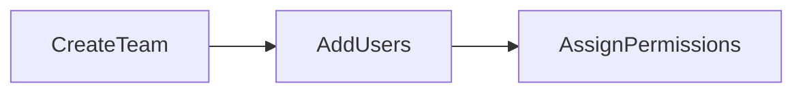

---

## Configuration / Syntax (if applicable)

```
Create Team

↓

Add Users

↓

Assign Folder Permissions
```

---

## Important Commands (if applicable)

Not applicable.

---

## Important Files (if applicable)

None

---

## Real-World Use Cases

- Operations team dashboards
- Developer dashboards
- Security dashboards

---

## Advantages

- Easier management
- Consistent permissions

---

## Limitations

- Teams cannot replace organization-level roles

---

## Common Interview Questions (Concept Only)

- Why use Teams?
- Can one user belong to multiple Teams?

---

## Common Mistakes

- Managing permissions individually

---

## Troubleshooting

- Verify team membership

---

## Summary

Teams simplify permission management by grouping users with similar responsibilities.

---

# Roles

## Overview

Roles define what actions users are allowed to perform inside Grafana.

---

## Why It Is Used

Roles provide:

- Authorization
- Security
- Controlled administration

---

## Architecture / Working

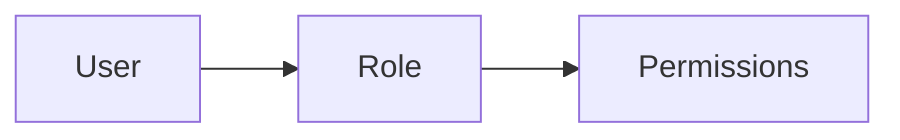

---

## Key Components

| Role | Access |
|------|--------|
| Viewer | Read-only |
| Editor | Modify dashboards |
| Admin | Full administration |

---

## Types (if applicable)

- Viewer
- Editor
- Admin

---

## Lifecycle / Workflow

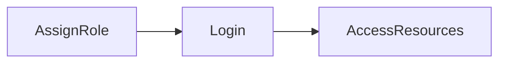

---

## Configuration / Syntax (if applicable)

```
User

↓

Role

↓

Permissions
```

---

## Important Commands (if applicable)

None

---

## Important Files (if applicable)

- `grafana.ini`

---

## Real-World Use Cases

- Viewer for managers
- Editor for developers
- Admin for DevOps engineers

---

## Advantages

- Secure authorization
- Easy administration

---

## Limitations

- Limited default roles in the open-source edition

---

## Common Interview Questions (Concept Only)

- What are Grafana roles?
- Difference between Viewer and Editor?

---

## Common Mistakes

- Overusing Admin role

---

## Troubleshooting

- Verify assigned role

---

## Summary

Roles determine the level of access granted to users within Grafana.

---

# Folder Permissions

## Overview

Folder Permissions control access to all dashboards stored within a folder.

Folder-level permissions are inherited by dashboards inside that folder unless explicitly overridden.

---

## Why It Is Used

- Organize dashboards
- Restrict department access
- Simplify administration

---

## Architecture / Working

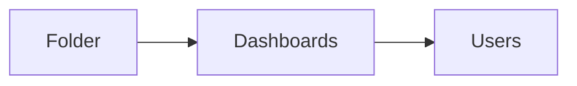

---

## Key Components

| Component | Purpose |
|-----------|---------|
| Folder | Dashboard container |
| Permission | Access control |

---

## Types (if applicable)

- View
- Edit
- Admin

---

## Lifecycle / Workflow

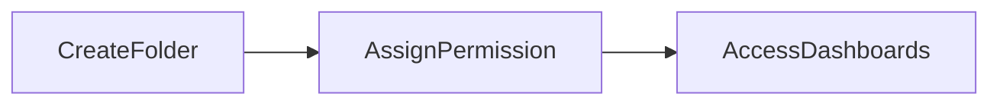

---

## Configuration / Syntax (if applicable)

```
Folder

↓

Permission

↓

Inherited by Dashboards
```

---

## Important Commands (if applicable)

None

---

## Important Files (if applicable)

None

---

## Real-World Use Cases

- Production dashboards
- Development dashboards
- Team-specific folders

---

## Advantages

- Centralized permission management
- Easier administration

---

## Limitations

- Incorrect inheritance may expose dashboards

---

## Common Interview Questions (Concept Only)

- What are Folder Permissions?
- Do dashboards inherit folder permissions?

---

## Common Mistakes

- Forgetting inherited permissions

---

## Troubleshooting

- Verify folder inheritance

---

## Summary

Folder Permissions provide centralized access control for all dashboards contained within a folder.

---

# Dashboard Permissions

## Overview

Dashboard Permissions provide access control for individual dashboards.

They override folder permissions when more specific access is required.

---

## Why It Is Used

- Restrict sensitive dashboards
- Provide exceptions
- Share selected dashboards

---

## Architecture / Working

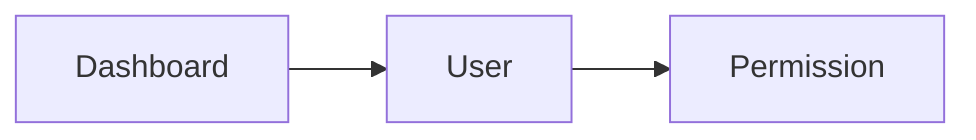

---

## Key Components

| Component | Purpose |
|-----------|---------|
| Dashboard | Visualization |
| User/Team | Access |
| Permission | View/Edit/Admin |

---

## Types (if applicable)

- View
- Edit
- Admin

---

## Lifecycle / Workflow

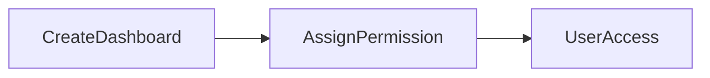

---

## Configuration / Syntax (if applicable)

```
Dashboard

↓

Permission

↓

User Access
```

---

## Important Commands (if applicable)

Not applicable.

---

## Important Files (if applicable)

None

---

## Real-World Use Cases

- Executive dashboards
- Security dashboards
- Compliance dashboards

---

## Advantages

- Fine-grained access control
- Flexible permissions
- Secure dashboard sharing

---

## Limitations

- Managing many individual permissions can become complex

---

## Common Interview Questions (Concept Only)

- What are Dashboard Permissions?
- When should Dashboard Permissions be used instead of Folder Permissions?

---

## Common Mistakes

- Assigning permissions individually for every dashboard
- Ignoring inherited folder permissions

---

## Troubleshooting

| Problem | Cause | Solution |
|----------|--------|----------|
| User cannot open dashboard | Missing View permission | Verify dashboard permissions |
| User cannot edit | Viewer permission | Assign Edit permission |
| Incorrect access | Permission inheritance | Review folder and dashboard permissions |

---

## Summary

Dashboard Permissions provide granular access control for individual dashboards and are commonly used when specific dashboards require different permissions than the folders that contain them.
