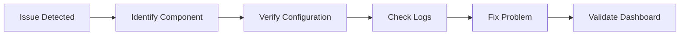
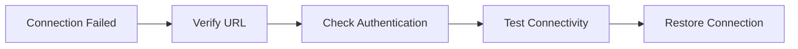
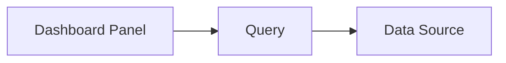
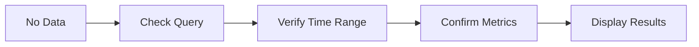
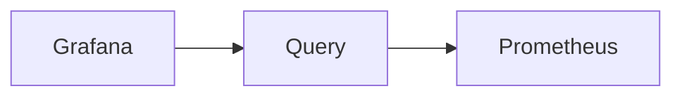
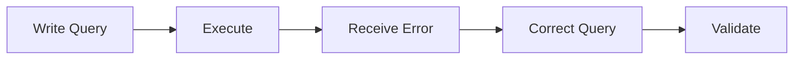
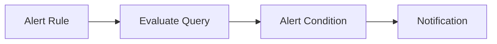
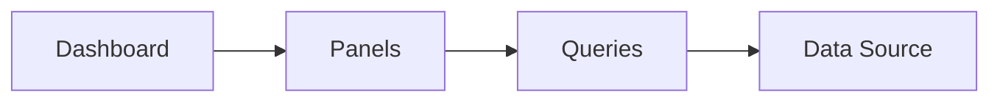
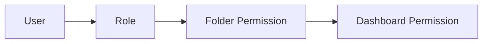
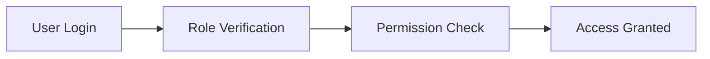

# Troubleshooting

## Overview

Troubleshooting in Grafana involves identifying and resolving issues related to **data sources, dashboards, queries, alerts, permissions, and visualization**.

Since Grafana acts as a **visualization layer**, most issues originate from:

- Data source connectivity problems
- Incorrect queries
- Authentication or authorization issues
- Network connectivity
- Backend monitoring systems (Prometheus, Loki, Elasticsearch, etc.)

> **Interview Tip**
>
> Grafana **does not store monitoring data** (except limited internal metadata). If a dashboard shows **"No Data"**, first verify that the data source is healthy.

---

## Why It Is Used

Troubleshooting helps to:

- Restore monitoring quickly
- Ensure dashboards display accurate data
- Resolve alert failures
- Fix query problems
- Improve monitoring reliability
- Reduce Mean Time To Resolution (MTTR)

---

## Architecture / Working


A failure at **any layer** can prevent Grafana from displaying monitoring data.

---

## Key Components

| Component | Purpose |
|------------|----------|
| Data Source | Retrieves monitoring data |
| Dashboard | Displays monitoring information |
| Panel | Visualizes metrics |
| Query | Retrieves data from backend |
| Alert Rule | Monitors thresholds |
| User Permissions | Controls access |

---

## Types (if applicable)

Common Grafana issues include:

- Data Source Connection Issues
- No Data in Panels
- Query Errors
- Alert Failures
- Dashboard Loading Issues
- Permission Issues

---

## Lifecycle / Workflow



---

## Configuration / Syntax (if applicable)

Recommended troubleshooting order:

```
Dashboard

↓

Panel

↓

Query

↓

Data Source

↓

Prometheus/Loki

↓

Exporter

↓

Application
```

---

## Important Commands (if applicable)

Check Grafana service

```bash
systemctl status grafana-server
```

Restart Grafana

```bash
systemctl restart grafana-server
```

View Grafana logs

```bash
journalctl -u grafana-server
```

Verify Grafana health

```bash
curl http://localhost:3000/api/health
```

Check Prometheus targets

```bash
curl http://localhost:9090/api/v1/targets
```

---

## Important Files (if applicable)

| File | Purpose |
|------|----------|
| `/etc/grafana/grafana.ini` | Main configuration |
| `/var/log/grafana/grafana.log` | Grafana logs |
| `dashboard.json` | Dashboard definition |
| `prometheus.yml` | Prometheus scrape configuration |

---

## Real-World Use Cases

- Prometheus becomes unreachable
- Dashboards display "No Data"
- Alerts stop triggering
- Users cannot access dashboards
- Slow dashboard rendering
- Invalid PromQL queries

---

## Advantages

- Faster issue resolution
- Better monitoring reliability
- Reduced downtime
- Improved operational visibility

---

## Limitations

- Most issues originate outside Grafana.
- Requires knowledge of Prometheus/Loki.
- Permission problems can become complex in enterprise environments.

---

## Common Interview Questions (Concept Only)

- Why does Grafana show "No Data"?
- How do you troubleshoot a failed data source?
- How do you troubleshoot Grafana alerts?
- What should you verify before blaming Grafana?
- Where are Grafana logs stored?
- Why is a dashboard loading slowly?

---

## Common Mistakes

- Assuming Grafana stores metrics
- Ignoring Prometheus health
- Using incorrect time ranges
- Not checking Grafana logs
- Writing invalid PromQL queries

---

## Troubleshooting

---

# Data Source Connection Issues

## Overview

A Data Source Connection Issue occurs when Grafana cannot communicate with Prometheus, Loki, Elasticsearch, Azure Monitor, or another configured backend.

---

## Why It Is Used

Without a healthy data source:

- Dashboards fail
- Panels show errors
- Alerts stop working

---

## Architecture / Working


---

## Key Components

- Data Source URL
- Authentication
- Network connectivity
- API endpoint

---

## Types (if applicable)

Common causes:

- Incorrect URL
- Invalid credentials
- Firewall blocking
- Backend service stopped
- TLS certificate issues

---

## Lifecycle / Workflow



---

## Configuration / Syntax (if applicable)

Always use **Save & Test** after configuring a data source.

---

## Important Commands (if applicable)

```bash
curl http://prometheus:9090
```

```bash
systemctl status prometheus
```

---

## Important Files (if applicable)

- `grafana.ini`
- `prometheus.yml`

---

## Real-World Use Cases

- Prometheus restarted
- DNS resolution failure
- Expired TLS certificate

---

## Advantages

- Easy to verify
- Built-in connection testing

---

## Limitations

- Network issues require external troubleshooting

---

## Common Interview Questions (Concept Only)

- Why does Save & Test fail?
- What causes data source connection failures?

---

## Common Mistakes

- Wrong URL
- Firewall restrictions
- Incorrect credentials

---

## Troubleshooting

| Problem | Cause | Solution |
|----------|--------|----------|
| Save & Test failed | Wrong URL | Verify endpoint |
| Timeout | Network issue | Test connectivity |
| Authentication failed | Invalid credentials | Update credentials |
| TLS error | Certificate issue | Verify SSL configuration |

---

## Summary

Always verify the data source before troubleshooting dashboards or queries.

---

# No Data in Panels

## Overview

A panel displays **"No Data"** when its query returns no results.

---

## Why It Is Used

Finding the root cause avoids unnecessary dashboard modifications.

---

## Architecture / Working



---

## Key Components

- Query
- Panel
- Time Range
- Data Source

---

## Types (if applicable)

Common causes:

- Wrong query
- Wrong time range
- Missing metrics
- Data source unavailable

---

## Lifecycle / Workflow



---

## Configuration / Syntax (if applicable)

Verify:

- PromQL query
- Selected time range
- Metric labels

---

## Important Commands (if applicable)

None

---

## Important Files (if applicable)

None

---

## Real-World Use Cases

- Metric removed
- Exporter unavailable
- Wrong dashboard variables

---

## Advantages

- Easy diagnosis

---

## Limitations

- Root cause often lies outside Grafana

---

## Common Interview Questions (Concept Only)

- Why does Grafana display "No Data"?

---

## Common Mistakes

- Wrong time range
- Incorrect PromQL
- Invalid labels

---

## Troubleshooting

| Problem | Cause | Solution |
|----------|--------|----------|
| No Data | Wrong query | Verify PromQL |
| Empty graph | Wrong labels | Check labels |
| Missing metric | Exporter unavailable | Verify exporter |

---

## Summary

"No Data" usually indicates query, metric, or data source problems—not a Grafana issue.

---

# Query Errors

## Overview

Query errors occur when Grafana cannot successfully execute a query against a data source.

---

## Why It Is Used

Correct queries are required for dashboards and alerts.

---

## Architecture / Working



---

## Key Components

- Query Editor
- PromQL
- Labels

---

## Types (if applicable)

Common errors:

- Syntax errors
- Unknown metrics
- Label mismatch
- Invalid aggregation

---

## Lifecycle / Workflow



---

## Configuration / Syntax (if applicable)

Always validate PromQL directly in Prometheus before adding it to Grafana.

---

## Important Commands (if applicable)

None

---

## Important Files (if applicable)

None

---

## Real-World Use Cases

- Typo in metric name
- Invalid PromQL
- Wrong label selector

---

## Advantages

- Easy to validate

---

## Limitations

- Requires PromQL knowledge

---

## Common Interview Questions (Concept Only)

- Why do Grafana queries fail?
- How do you troubleshoot PromQL?

---

## Common Mistakes

- Typographical errors
- Incorrect labels

---

## Troubleshooting

| Problem | Cause | Solution |
|----------|--------|----------|
| Parse error | Syntax issue | Fix PromQL |
| Unknown metric | Metric missing | Verify exporter |
| Empty result | Wrong labels | Correct selectors |

---

## Summary

Most query errors result from incorrect PromQL syntax or unavailable metrics.

---

# Alert Failures

## Overview

Alert failures occur when Grafana cannot evaluate alert rules or send notifications.

---

## Why It Is Used

Reliable alerting ensures rapid response to production incidents.

---

## Architecture / Working



---

## Key Components

- Alert Rule
- Query
- Contact Point
- Notification Policy

---

## Types (if applicable)

Common issues:

- Invalid query
- Missing contact point
- SMTP/Webhook failure

---

## Lifecycle / Workflow


---

## Configuration / Syntax (if applicable)

Always test alert rules before enabling them.

---

## Important Commands (if applicable)

None

---

## Important Files (if applicable)

- `grafana.ini`

---

## Real-World Use Cases

- Email alerts not received
- Webhook failures
- Invalid threshold

---

## Advantages

- Early incident detection

---

## Limitations

- Depends on notification services

---

## Common Interview Questions (Concept Only)

- Why are Grafana alerts not firing?
- How do you troubleshoot alert failures?

---

## Common Mistakes

- Invalid thresholds
- Incorrect notification policies

---

## Troubleshooting

| Problem | Cause | Solution |
|----------|--------|----------|
| Alert not firing | Invalid query | Verify query |
| Email not received | SMTP issue | Verify SMTP configuration |
| Rule evaluation failed | Missing data | Check data source |

---

## Summary

Alert failures usually originate from invalid queries or notification configuration issues.

---

# Dashboard Loading Issues

## Overview

Dashboard loading issues occur when dashboards are slow to open or fail to render.

---

## Why It Is Used

Fast dashboards improve operational efficiency.

---

## Architecture / Working



---

## Key Components

- Dashboard
- Panels
- Queries

---

## Types (if applicable)

Common causes:

- Heavy queries
- Large dashboards
- Slow backend

---

## Lifecycle / Workflow


---

## Configuration / Syntax (if applicable)

Optimize:

- Query complexity
- Panel count
- Refresh interval

---

## Important Commands (if applicable)

None

---

## Important Files (if applicable)

None

---

## Real-World Use Cases

- High-cardinality Prometheus queries
- Large production dashboards

---

## Advantages

- Better user experience

---

## Limitations

- Performance depends on backend systems

---

## Common Interview Questions (Concept Only)

- Why is a Grafana dashboard slow?

---

## Common Mistakes

- Too many panels
- Heavy queries

---

## Troubleshooting

| Problem | Cause | Solution |
|----------|--------|----------|
| Slow dashboard | Heavy PromQL | Optimize queries |
| Dashboard timeout | Backend delay | Improve backend performance |

---

## Summary

Dashboard performance is primarily determined by query efficiency and backend responsiveness.

---

# Permission Issues

## Overview

Permission issues occur when users cannot access dashboards, folders, or data sources because of insufficient privileges.

---

## Why It Is Used

Permissions secure Grafana resources.

---

## Architecture / Working



---

## Key Components

- User
- Team
- Role
- Folder Permission
- Dashboard Permission

---

## Types (if applicable)

Common issues:

- Viewer cannot edit
- Dashboard inaccessible
- Missing team permissions

---

## Lifecycle / Workflow



---

## Configuration / Syntax (if applicable)

Verify:

- User role
- Team membership
- Folder permissions
- Dashboard permissions

---

## Important Commands (if applicable)

None

---

## Important Files (if applicable)

- `grafana.ini`

---

## Real-World Use Cases

- Developers cannot edit dashboards
- Managers cannot view dashboards

---

## Advantages

- Secure access
- Role-based control

---

## Limitations

- Complex permission inheritance

---

## Common Interview Questions (Concept Only)

- Why can't a user edit a dashboard?
- What is the difference between Folder and Dashboard permissions?

---

## Common Mistakes

- Assigning Viewer instead of Editor
- Ignoring inherited permissions

---

## Troubleshooting

| Problem | Cause | Solution |
|----------|--------|----------|
| Dashboard inaccessible | Missing permission | Review access settings |
| Cannot edit | Viewer role | Assign Editor role |
| Access denied | Team missing | Verify team membership |

---

## Summary

Permission issues are generally caused by incorrect role assignments or folder/dashboard permissions. Always verify RBAC settings before troubleshooting other components.

---

# Summary

Follow this troubleshooting order whenever you encounter Grafana issues:

1. Verify Grafana service.
2. Check the data source connection.
3. Validate queries.
4. Confirm metrics exist in the monitoring backend.
5. Review alert configuration.
6. Optimize dashboard performance.
7. Verify user permissions.

> **Interview Tip**
>
> A systematic troubleshooting approach is:
>
> **Exporter → Prometheus/Loki → Data Source → Query → Panel → Dashboard → User Permissions**
>
> This method helps isolate issues efficiently and is commonly expected in DevOps, SRE, Platform Engineer, and Cloud Engineer interviews.
