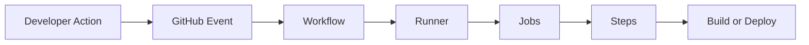
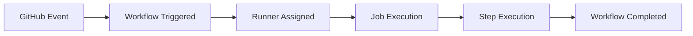
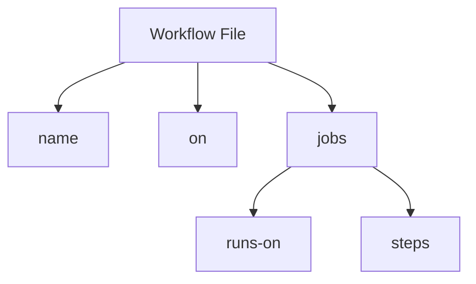
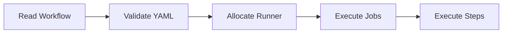
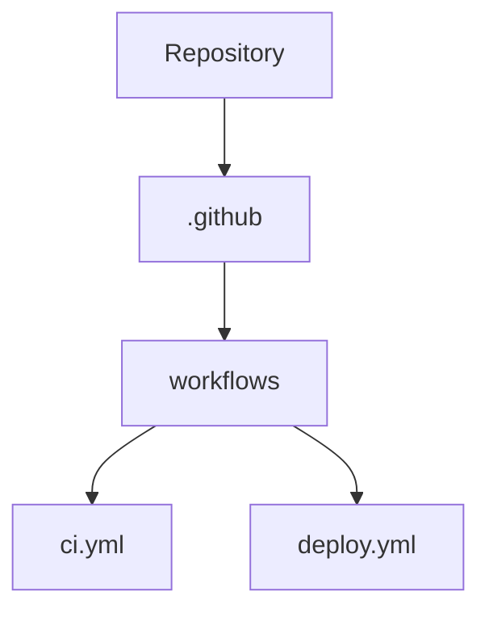
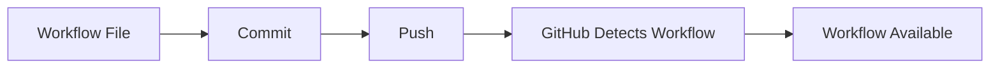
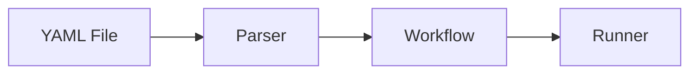
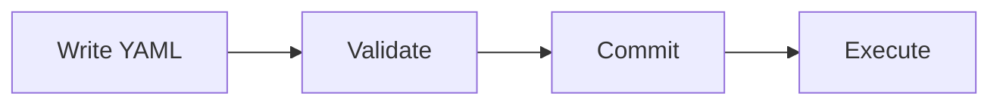
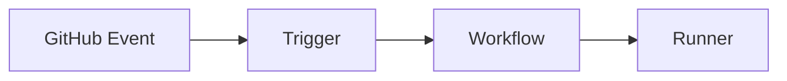
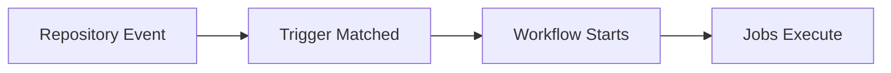

# Workflow Basics

## Overview

A **workflow** is the core automation unit in GitHub Actions. It is a YAML file that defines one or more jobs to automate tasks such as building, testing, scanning, and deploying applications.

Each workflow is stored in the repository and is automatically executed when specific events occur (for example, a code push or pull request).

> **Interview Tip**
>
> Every GitHub Actions workflow is simply a **YAML configuration file** stored inside the `.github/workflows/` directory.

---

## Why It Is Used

Workflows automate repetitive software development tasks, including:

- Continuous Integration (CI)
- Continuous Deployment (CD)
- Code testing
- Code quality checks
- Docker image creation
- Kubernetes deployment
- Infrastructure automation
- Scheduled maintenance
- Security scanning

Benefits include:

- Faster deployments
- Reduced manual work
- Consistent execution
- Improved software quality
- Early bug detection

---

## Architecture / Working



Workflow execution sequence:

1. A GitHub event occurs.
2. GitHub checks workflow trigger conditions.
3. A runner is assigned.
4. Jobs execute.
5. Each job runs multiple steps.
6. Results are stored or deployed.

---

## Key Components

| Component | Purpose |
|------------|----------|
| Workflow | Complete automation pipeline |
| Event | Starts workflow execution |
| Runner | Executes jobs |
| Job | Group of related steps |
| Step | Individual task |
| Action | Reusable automation component |
| Artifact | Generated output files |

---

## Types (if applicable)

### Common Workflow Types

| Workflow | Purpose |
|-----------|----------|
| CI Workflow | Build and test application |
| CD Workflow | Deploy application |
| Release Workflow | Publish software releases |
| Scheduled Workflow | Execute at scheduled times |
| Security Workflow | Perform code scanning |
| Infrastructure Workflow | Provision cloud resources |

---

## Lifecycle / Workflow



---

## Configuration / Syntax (if applicable)

### Workflow File Structure

A workflow consists of:

- Workflow name
- Trigger events
- Jobs
- Runner
- Steps

Example:

```yaml
name: CI Pipeline

on:
  push:
    branches:
      - main

jobs:
  build:

    runs-on: ubuntu-latest

    steps:

      - uses: actions/checkout@v4

      - name: Build

        run: echo "Building application"
```

---

### Basic Workflow Structure

```text
Workflow
│
├── name
├── on
└── jobs
     ├── build
     │    ├── runs-on
     │    └── steps
     └── deploy
```

---

## Important Commands (if applicable)

Commit changes

```bash
git add .
```

Commit workflow

```bash
git commit -m "Add workflow"
```

Push workflow

```bash
git push origin main
```

List workflows

```bash
gh workflow list
```

Run workflow manually

```bash
gh workflow run ci.yml
```

View workflow runs

```bash
gh run list
```

---

## Important Files (if applicable)

| File | Purpose |
|------|----------|
| `.github/workflows/ci.yml` | CI workflow |
| `.github/workflows/deploy.yml` | Deployment workflow |
| `.github/workflows/test.yml` | Testing workflow |
| `.github/workflows/security.yml` | Security scanning |

---

## Real-World Use Cases

- Build Java applications
- Run unit tests
- Build Docker images
- Deploy Kubernetes applications
- Deploy Azure resources
- Deploy AWS applications
- Execute Terraform automation
- Run Ansible playbooks
- Publish GitHub Releases

---

## Advantages

- Native GitHub integration
- YAML-based configuration
- Easy version control
- Supports reusable workflows
- Supports parallel execution
- Supports manual and automatic execution

---

## Limitations

- YAML indentation errors are common.
- Large workflows become difficult to maintain.
- GitHub-hosted runners have execution limits.
- Debugging complex workflows may require log analysis.

---

## Common Interview Questions (Concept Only)

- What is a workflow?
- Where are workflow files stored?
- Why are workflows written in YAML?
- What happens when a workflow is triggered?
- What are jobs and steps?
- Can one repository have multiple workflows?
- Can workflows call other workflows?
- How are workflows version controlled?

---

## Common Mistakes

- Storing workflows outside `.github/workflows`
- Incorrect YAML indentation
- Missing required keys
- Mixing tabs and spaces
- Incorrect trigger configuration

---

## Troubleshooting

| Problem | Cause | Solution |
|----------|--------|----------|
| Workflow not detected | Wrong directory | Place workflow in `.github/workflows/` |
| YAML parsing error | Invalid indentation | Validate YAML formatting |
| Workflow skipped | Trigger not matched | Verify `on:` configuration |
| Job not executed | Invalid syntax | Review workflow structure |
| Workflow missing in Actions tab | File not committed | Commit and push workflow |

---

## Summary

A workflow is the primary automation unit in GitHub Actions.

Key interview points:

- Workflows are defined using YAML.
- Workflow files are stored in `.github/workflows/`.
- A repository can contain multiple workflows.
- Workflows are triggered by GitHub events.
- Workflows consist of jobs, and jobs contain steps.
- Every CI/CD pipeline in GitHub Actions begins with a workflow.

---

# Workflow File Structure

## Overview

A workflow file is a YAML configuration that defines how GitHub Actions automates tasks. It specifies **when** the workflow runs, **where** it runs, and **what** it executes.

A workflow is composed of several top-level sections.

---

## Why It Is Used

The workflow file provides:

- Automation instructions
- Event definitions
- Job sequencing
- Runner selection
- Execution steps

Without a workflow file, GitHub Actions cannot execute automation.

---

## Architecture / Working



---

## Key Components

| Section | Purpose |
|----------|----------|
| `name` | Workflow name |
| `on` | Trigger event |
| `jobs` | Defines jobs |
| `runs-on` | Runner OS |
| `steps` | Individual tasks |
| `uses` | Reusable action |
| `run` | Shell command |

---

## Types (if applicable)

Common sections:

- name
- on
- jobs
- permissions
- env
- defaults

---

## Lifecycle / Workflow



---

## Configuration / Syntax (if applicable)

Example:

```yaml
name: Build Pipeline

on:
  push:

jobs:

  build:

    runs-on: ubuntu-latest

    steps:

      - uses: actions/checkout@v4

      - name: Install

        run: npm install

      - name: Test

        run: npm test
```

---

## Important Commands (if applicable)

Validate YAML using editor extensions.

View workflow:

```bash
cat .github/workflows/ci.yml
```

---

## Important Files (if applicable)

```
.github/
└── workflows/
     ├── ci.yml
     ├── deploy.yml
     └── release.yml
```

---

## Real-World Use Cases

- Multi-stage CI pipeline
- Automated deployments
- Security scanning
- Docker image publishing

---

## Advantages

- Easy to understand
- Version controlled
- Human-readable

---

## Limitations

- Sensitive to indentation
- Complex workflows require modularization

---

## Common Interview Questions (Concept Only)

- What are the mandatory workflow sections?
- What is the purpose of `jobs`?
- What is the difference between `run` and `uses`?

---

## Common Mistakes

- Incorrect indentation
- Missing `jobs`
- Missing `runs-on`

---

## Troubleshooting

| Problem | Cause | Solution |
|----------|--------|----------|
| YAML error | Bad indentation | Validate syntax |
| Job skipped | Missing `runs-on` | Add runner |
| Invalid workflow | Missing `jobs` | Define jobs |

---

## Summary

A workflow file defines the entire automation process and consists of `name`, `on`, and `jobs` as its core sections.

---

# Workflow Location

## Overview

GitHub only recognizes workflow files stored inside the **`.github/workflows/`** directory.

Any workflow placed outside this directory will be ignored.

---

## Why It Is Used

A standard location enables GitHub to automatically discover workflow definitions.

---

## Architecture / Working



---

## Key Components

- Repository
- `.github`
- `workflows`
- YAML files

---

## Types (if applicable)

Supported filenames:

- ci.yml
- deploy.yml
- release.yml
- security.yml

---

## Lifecycle / Workflow



---

## Configuration / Syntax (if applicable)

```
Repository

.github/

workflows/

ci.yml
```

---

## Important Commands (if applicable)

```bash
mkdir -p .github/workflows
```

---

## Important Files (if applicable)

```
.github/workflows/
```

---

## Real-World Use Cases

- CI pipeline
- CD pipeline
- Release automation

---

## Advantages

- Automatic discovery
- Standardized location

---

## Limitations

- No custom workflow directory

---

## Common Interview Questions (Concept Only)

- Where are GitHub workflow files stored?
- Can workflow files be stored elsewhere?

---

## Common Mistakes

- Creating `.github/workflow`
- Wrong folder spelling
- Storing YAML elsewhere

---

## Troubleshooting

| Problem | Cause | Solution |
|----------|--------|----------|
| Workflow missing | Wrong folder | Move to `.github/workflows/` |

---

## Summary

GitHub scans only the `.github/workflows/` directory for workflow files.

---

# YAML Syntax

## Overview

GitHub Actions workflows are written in **YAML (YAML Ain't Markup Language)**.

YAML is indentation-based and human-readable.

---

## Why It Is Used

YAML is easy to read, edit, and maintain.

---

## Architecture / Working



---

## Key Components

- Keys
- Values
- Lists
- Objects
- Indentation

---

## Types (if applicable)

Common YAML elements:

- String
- Integer
- Boolean
- List
- Dictionary

---

## Lifecycle / Workflow



---

## Configuration / Syntax (if applicable)

```yaml
name: Demo

on:
  push:

jobs:

  build:

    runs-on: ubuntu-latest

    steps:

      - run: echo "Hello"
```

---

## Important Commands (if applicable)

None

---

## Important Files (if applicable)

All workflow files use:

```
*.yml
```

or

```
*.yaml
```

---

## Real-World Use Cases

- CI pipelines
- Kubernetes manifests
- Docker Compose
- Ansible Playbooks

---

## Advantages

- Easy to read
- Easy to version control

---

## Limitations

- Indentation sensitive

---

## Common Interview Questions (Concept Only)

- Why does GitHub Actions use YAML?
- What causes YAML parsing errors?

---

## Common Mistakes

- Using tabs
- Wrong indentation
- Invalid lists

---

## Troubleshooting

| Problem | Cause | Solution |
|----------|--------|----------|
| YAML parsing error | Indentation | Use spaces only |
| Invalid workflow | Wrong syntax | Validate YAML |

---

## Summary

Correct YAML formatting is essential for successful workflow execution.

---

# Workflow Triggers

## Overview

Workflow triggers define **when a workflow starts**.

Triggers are configured using the `on` keyword.

---

## Why It Is Used

Triggers automate workflow execution based on repository activity.

---

## Architecture / Working



---

## Key Components

- Event
- Trigger
- Branch filter
- Tag filter

---

## Types (if applicable)

| Trigger | Purpose |
|----------|----------|
| push | Code pushed |
| pull_request | Pull request opened or updated |
| workflow_dispatch | Manual execution |
| schedule | Cron execution |
| release | GitHub release |
| create | Branch or tag creation |
| delete | Branch deletion |

---

## Lifecycle / Workflow



---

## Configuration / Syntax (if applicable)

Push trigger:

```yaml
on:
  push:
    branches:
      - main
```

Pull request trigger:

```yaml
on:
  pull_request:
```

Manual trigger:

```yaml
on:
  workflow_dispatch:
```

Scheduled trigger:

```yaml
on:
  schedule:
    - cron: "0 2 * * *"
```

Multiple triggers:

```yaml
on:
  push:
  pull_request:
  workflow_dispatch:
```

---

## Important Commands (if applicable)

Trigger via GitHub CLI:

```bash
gh workflow run ci.yml
```

---

## Important Files (if applicable)

```
.github/workflows/*.yml
```

---

## Real-World Use Cases

- Run CI on every push
- Deploy after merging to main
- Nightly security scans
- Weekly backup jobs
- Manual production deployment

---

## Advantages

- Fully automated execution
- Flexible trigger conditions
- Supports scheduled and manual runs

---

## Limitations

- Incorrect trigger configuration prevents workflow execution

---

## Common Interview Questions (Concept Only)

- What is the purpose of the `on` keyword?
- What are the most common workflow triggers?
- How do you trigger a workflow manually?
- How do scheduled workflows work?
- Can one workflow have multiple triggers?

---

## Common Mistakes

- Incorrect branch filters
- Wrong cron syntax
- Missing trigger configuration
- Expecting manual execution without `workflow_dispatch`

---

## Troubleshooting

| Problem | Cause | Solution |
|----------|--------|----------|
| Workflow never starts | Incorrect trigger | Verify `on` configuration |
| Push ignored | Wrong branch filter | Check branch names |
| Manual trigger unavailable | Missing `workflow_dispatch` | Add manual trigger |
| Scheduled job not running | Invalid cron expression | Validate cron syntax |

---

## Summary

Workflow triggers determine **when GitHub Actions executes automation**.

Key interview points:

- The `on` keyword defines workflow triggers.
- Multiple triggers can be configured in a single workflow.
- Common triggers include `push`, `pull_request`, `workflow_dispatch`, `schedule`, and `release`.
- Branch and tag filters provide fine-grained control over workflow execution.
