# Events (Triggers)

## Overview

GitHub Actions **Events**, also called **Triggers**, define **when a workflow should start**. Every workflow must specify at least one event using the `on` keyword.

Whenever the configured event occurs, GitHub automatically starts the workflow.

Some common events include:

- `push`
- `pull_request`
- `workflow_dispatch`
- `schedule`
- `release`

> **Interview Tip**
>
> **Events trigger workflows.** A workflow without an `on` section will never execute.

---

## Why It Is Used

Events allow automatic execution of CI/CD pipelines based on repository activity.

Common uses include:

- Build applications after code is pushed
- Test pull requests before merging
- Deploy applications after releases
- Run nightly maintenance jobs
- Trigger deployments manually

Benefits:

- Eliminates manual execution
- Ensures consistent automation
- Improves software quality
- Enables continuous integration
- Supports continuous delivery

---

## Architecture / Working

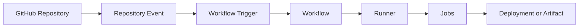

---

## Key Components

| Component | Purpose |
|------------|----------|
| Event | Starts workflow execution |
| Trigger | Event configuration |
| Branch Filter | Restricts branches |
| Tag Filter | Restricts tags |
| Workflow | Executes automation |
| Runner | Runs workflow jobs |

---

## Types (if applicable)

GitHub provides dozens of events.

The most commonly used are:

| Event | Purpose |
|---------|----------|
| push | Code pushed to repository |
| pull_request | Pull Request created or updated |
| workflow_dispatch | Manual execution |
| schedule | Scheduled execution using cron |
| release | GitHub Release published |

---

## Lifecycle / Workflow

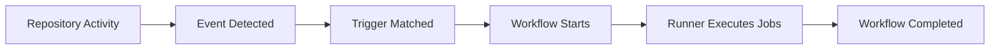

---

## Configuration / Syntax (if applicable)

General syntax

```yaml
on:
  push:
```

Multiple triggers

```yaml
on:
  push:
  pull_request:
  workflow_dispatch:
```

---

## Important Commands (if applicable)

Run workflow manually

```bash
gh workflow run ci.yml
```

List workflows

```bash
gh workflow list
```

List workflow runs

```bash
gh run list
```

View workflow details

```bash
gh run view
```

---

## Important Files (if applicable)

```
.github/
└── workflows/
     ├── ci.yml
     ├── deploy.yml
     └── release.yml
```

---

## Real-World Use Cases

- Run tests on every push
- Validate pull requests
- Deploy production after release
- Nightly backups
- Weekly security scans
- Manual production deployments

---

## Advantages

- Fully automated CI/CD
- Supports multiple trigger types
- Branch filtering
- Tag filtering
- Manual execution support
- Scheduled automation

---

## Limitations

- Incorrect trigger configuration prevents workflow execution.
- Poorly configured triggers can execute workflows unnecessarily.
- Scheduled workflows may experience slight delays.

---

## Common Interview Questions (Concept Only)

- What is an event in GitHub Actions?
- Which keyword defines workflow triggers?
- Can one workflow have multiple triggers?
- What is the difference between `push` and `pull_request`?
- What is `workflow_dispatch`?
- How do scheduled workflows work?
- What event is commonly used for production deployment?

---

## Common Mistakes

- Missing `on` section
- Wrong branch names
- Invalid cron expressions
- Expecting manual execution without `workflow_dispatch`
- Using incorrect release event

---

## Troubleshooting

| Problem | Possible Cause | Solution |
|----------|----------------|----------|
| Workflow never starts | Missing trigger | Verify `on:` section |
| Push ignored | Wrong branch filter | Check branch configuration |
| Manual run unavailable | Missing `workflow_dispatch` | Add manual trigger |
| Schedule not running | Invalid cron syntax | Validate cron expression |
| Release workflow not running | Wrong release type | Verify release trigger |

---

## Summary

Events define **when GitHub Actions workflows execute**.

Key interview points:

- Every workflow starts with an event.
- Events are configured using the `on` keyword.
- Multiple events can trigger the same workflow.
- The most common triggers are `push`, `pull_request`, `workflow_dispatch`, `schedule`, and `release`.

---

# push

## Overview

The **push** event triggers a workflow whenever commits are pushed to a repository.

It is the **most commonly used trigger** for Continuous Integration (CI).

---

## Why It Is Used

The `push` event is used to:

- Build applications automatically
- Run tests
- Execute code quality checks
- Build Docker images
- Deploy applications

---

## Architecture / Working

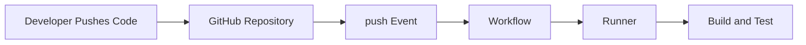

---

## Key Components

- Branch
- Commit
- Workflow
- Runner

---

## Types (if applicable)

Common configurations:

- All branches
- Specific branches
- Tags

---

## Lifecycle / Workflow

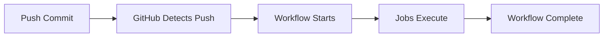

---

## Configuration / Syntax (if applicable)

Trigger on every push

```yaml
on:
  push:
```

Trigger only on main

```yaml
on:
  push:
    branches:
      - main
```

Multiple branches

```yaml
on:
  push:
    branches:
      - main
      - develop
```

Trigger on tags

```yaml
on:
  push:
    tags:
      - "v*"
```

---

## Important Commands (if applicable)

```bash
git push origin main
```

---

## Important Files (if applicable)

```
.github/workflows/*.yml
```

---

## Real-World Use Cases

- Build application
- Run unit tests
- Docker image creation
- Deploy development environment

---

## Advantages

- Fully automated
- Fast feedback
- Continuous Integration

---

## Limitations

- Every push may trigger builds
- Can increase CI usage

---

## Common Interview Questions (Concept Only)

- When does the push event execute?
- Can push events be limited to branches?
- Can push events be triggered by tags?

---

## Common Mistakes

- Wrong branch filters
- Forgetting tag filters
- Triggering unnecessary builds

---

## Troubleshooting

| Problem | Cause | Solution |
|----------|--------|----------|
| Workflow not triggered | Wrong branch | Verify branch filter |
| Workflow skipped | Tag mismatch | Verify tag filter |

---

## Summary

`push` is the primary trigger for Continuous Integration pipelines.

---

# pull_request

## Overview

The **pull_request** event triggers workflows whenever a Pull Request is opened, synchronized, reopened, or updated.

It helps validate changes before merging.

---

## Why It Is Used

Used for:

- CI validation
- Code quality
- Unit testing
- Security scanning
- Build verification

---

## Architecture / Working

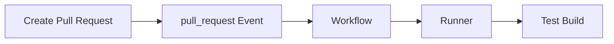

---

## Key Components

- Source branch
- Target branch
- Pull Request

---

## Types (if applicable)

Supported actions include:

- opened
- synchronize
- reopened
- closed

---

## Lifecycle / Workflow

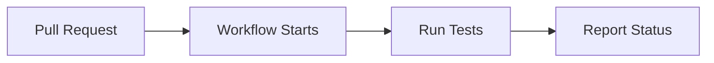

---

## Configuration / Syntax (if applicable)

```yaml
on:
  pull_request:
```

Specific branch

```yaml
on:
  pull_request:
    branches:
      - main
```

---

## Important Commands (if applicable)

Create Pull Request using GitHub UI or CLI.

---

## Important Files (if applicable)

```
.github/workflows/*.yml
```

---

## Real-World Use Cases

- Validate code before merge
- Execute automated testing
- Security scanning

---

## Advantages

- Prevents broken code
- Improves software quality

---

## Limitations

- Does not run on direct pushes unless configured separately

---

## Common Interview Questions (Concept Only)

- What is the difference between push and pull_request?
- Why is pull_request commonly used?

---

## Common Mistakes

- Using only push trigger
- Ignoring PR validation

---

## Troubleshooting

| Problem | Cause | Solution |
|----------|--------|----------|
| PR not triggering | Wrong branch | Verify branch filter |

---

## Summary

`pull_request` ensures code quality before merging.

---

# workflow_dispatch

## Overview

`workflow_dispatch` allows workflows to be started manually.

It adds a **Run workflow** button in the GitHub Actions UI.

---

## Why It Is Used

Manual execution is useful for:

- Production deployment
- Emergency fixes
- Infrastructure changes
- Testing workflows

---

## Architecture / Working

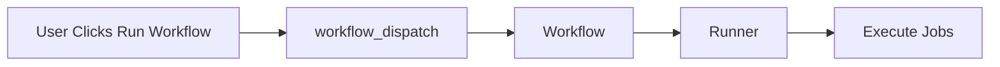

---

## Key Components

- Manual trigger
- GitHub UI
- Optional input parameters

---

## Types (if applicable)

- Simple manual execution
- Manual execution with inputs

---

## Lifecycle / Workflow

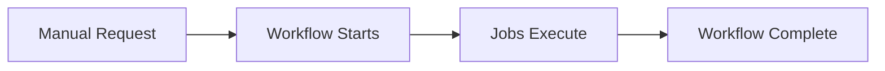

---

## Configuration / Syntax (if applicable)

```yaml
on:
  workflow_dispatch:
```

With inputs

```yaml
on:
  workflow_dispatch:
    inputs:
      environment:
        description: Deployment Environment
        required: true
```

---

## Important Commands (if applicable)

```bash
gh workflow run deploy.yml
```

---

## Important Files (if applicable)

```
.github/workflows/deploy.yml
```

---

## Real-World Use Cases

- Production deployment
- Rollback
- Infrastructure provisioning

---

## Advantages

- User-controlled execution
- Supports parameters

---

## Limitations

- Requires manual action

---

## Common Interview Questions (Concept Only)

- What is workflow_dispatch?
- Why use manual workflows?

---

## Common Mistakes

- Forgetting to configure manual trigger

---

## Troubleshooting

| Problem | Cause | Solution |
|----------|--------|----------|
| Run button missing | workflow_dispatch absent | Add manual trigger |

---

## Summary

`workflow_dispatch` enables secure manual execution of workflows.

---

# schedule

## Overview

The `schedule` event runs workflows automatically using **cron expressions**.

---

## Why It Is Used

Common scheduled tasks:

- Nightly builds
- Security scans
- Backups
- Cleanup jobs

---

## Architecture / Working

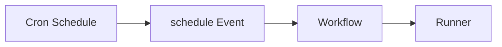

---

## Key Components

- Cron
- UTC time
- Scheduler

---

## Types (if applicable)

Daily

Weekly

Monthly

Hourly

---

## Lifecycle / Workflow

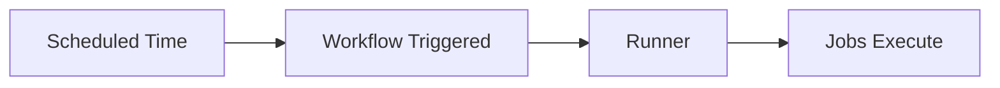

---

## Configuration / Syntax (if applicable)

```yaml
on:
  schedule:
    - cron: "0 2 * * *"
```

---

## Important Commands (if applicable)

None

---

## Important Files (if applicable)

```
.github/workflows/nightly.yml
```

---

## Real-World Use Cases

- Nightly builds
- Weekly reports
- Security scanning

---

## Advantages

- Fully automated
- No user interaction

---

## Limitations

- Uses UTC timezone
- May not execute at the exact scheduled second during high platform load

---

## Common Interview Questions (Concept Only)

- What is schedule?
- What syntax does schedule use?

---

## Common Mistakes

- Wrong cron expression
- Assuming local timezone

---

## Troubleshooting

| Problem | Cause | Solution |
|----------|--------|----------|
| Workflow not running | Invalid cron | Validate cron syntax |

---

## Summary

`schedule` executes workflows automatically using cron expressions.

---

# release

## Overview

The `release` event triggers workflows when a GitHub Release is created, published, edited, or deleted.

It is commonly used for production deployments and software publishing.

---

## Why It Is Used

Used for:

- Production deployment
- Publish releases
- Upload artifacts
- Package software

---

## Architecture / Working

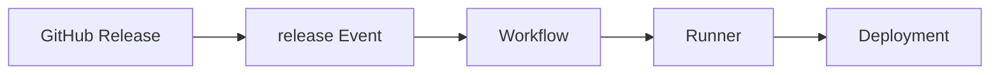

---

## Key Components

- Release
- Tag
- Workflow

---

## Types (if applicable)

- published
- created
- edited
- deleted

---

## Lifecycle / Workflow

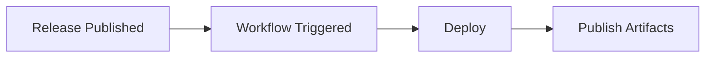

---

## Configuration / Syntax (if applicable)

```yaml
on:
  release:
    types:
      - published
```

---

## Important Commands (if applicable)

Create tag

```bash
git tag v1.0.0
```

Push tag

```bash
git push origin v1.0.0
```

---

## Important Files (if applicable)

```
.github/workflows/release.yml
```

---

## Real-World Use Cases

- Deploy production
- Publish binaries
- Upload Docker images

---

## Advantages

- Automated releases
- Production deployment

---

## Limitations

- Requires GitHub Releases

---

## Common Interview Questions (Concept Only)

- What is the release event?
- When is it used?

---

## Common Mistakes

- Confusing tag pushes with release events
- Not publishing the release after creating a tag

---

## Troubleshooting

| Problem | Cause | Solution |
|----------|--------|----------|
| Workflow not triggered | Release not published | Publish the release |
| Wrong event type | Incorrect `types` value | Verify release event configuration |

---

## Summary

The `release` event automates deployments and release-related tasks whenever a GitHub Release is published.

> **Interview Tip**
>
> Understand the differences between the five most common triggers:
>
> - **`push`** → Runs when code is pushed to a repository.
> - **`pull_request`** → Runs for pull request activities before merging.
> - **`workflow_dispatch`** → Runs manually from the GitHub UI or CLI.
> - **`schedule`** → Runs automatically based on a cron schedule.
> - **`release`** → Runs when a GitHub Release is published or updated.
