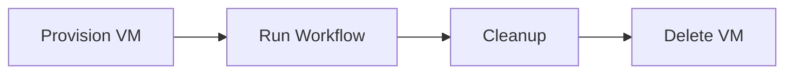

# Runners

## Overview

A **Runner** is the machine that executes a GitHub Actions workflow.

Whenever a workflow is triggered, GitHub assigns a runner to execute the jobs defined in the workflow.

A runner can be:

- GitHub-hosted (managed by GitHub)
- Self-hosted (managed by your organization)

> **Interview Tip**
>
> Every **job** runs on a runner. The runner is specified using the `runs-on` keyword.

---

## Why It Is Used

Runners provide the execution environment for CI/CD pipelines.

They are responsible for:

- Checking out source code
- Installing dependencies
- Building applications
- Running tests
- Creating artifacts
- Deploying applications
- Executing scripts

Without a runner, GitHub Actions workflows cannot execute.

---

## Architecture / Working


---

## Key Components

| Component | Purpose |
|-----------|----------|
| Workflow | Defines automation pipeline |
| Job | Unit executed by a runner |
| Runner | Machine executing jobs |
| Steps | Individual tasks inside a job |
| Runner Labels | Select specific runner types |

---

## Types (if applicable)

There are two primary runner types.

| Runner Type | Managed By | Common Use Case |
|-------------|------------|-----------------|
| GitHub-Hosted Runner | GitHub | General CI/CD |
| Self-Hosted Runner | Organization | Custom infrastructure and secure environments |

---

## Lifecycle / Workflow (if applicable)


---

## Configuration / Syntax (if applicable)

Use a GitHub-hosted runner:

```yaml
jobs:
  build:
    runs-on: ubuntu-latest
```

Use a Windows runner:

```yaml
runs-on: windows-latest
```

Use a macOS runner:

```yaml
runs-on: macos-latest
```

Use a self-hosted runner:

```yaml
runs-on: self-hosted
```

Specify multiple labels:

```yaml
runs-on:
  - self-hosted
  - linux
  - x64
```

---

## Important Commands (if applicable)

List available self-hosted runners (GitHub CLI):

```bash
gh api repos/<owner>/<repo>/actions/runners
```

Start a self-hosted runner:

```bash
./run.sh
```

Install runner as a Linux service:

```bash
sudo ./svc.sh install
```

Start runner service:

```bash
sudo ./svc.sh start
```

Stop runner service:

```bash
sudo ./svc.sh stop
```

Remove runner configuration:

```bash
./config.sh remove
```

---

## Important Files (if applicable)

GitHub-hosted runners require no configuration files.

For self-hosted runners:

```
actions-runner/

├── config.sh
├── run.sh
├── svc.sh
├── .runner
├── .credentials
└── _work/
```

Workflow files:

```
.github/
└── workflows/
    └── ci.yml
```

---

## Real-World Use Cases

- Build Java applications
- Build Docker images
- Deploy Kubernetes workloads
- Deploy Azure infrastructure
- Execute Terraform
- Run Ansible playbooks
- Perform security scanning
- Execute integration tests

---

## Advantages

- Supports Linux, Windows, and macOS
- Automatic environment provisioning
- Easy scaling
- Supports custom environments
- Enables secure deployment pipelines
- Supports hardware-specific workloads

---

## Limitations

- GitHub-hosted runners have execution time and resource limits.
- Self-hosted runners require installation, maintenance, and security management.
- Each GitHub-hosted job starts with a fresh environment.

---

## Common Interview Questions (Concept Only)

- What is a runner in GitHub Actions?
- Why is a runner required?
- What is the difference between GitHub-hosted and self-hosted runners?
- Which keyword specifies the runner?
- Can multiple jobs use different runners?
- Why would an organization choose self-hosted runners?
- What are runner labels?
- Does each job receive a new GitHub-hosted runner?

---

## Common Mistakes

- Using an unavailable runner label
- Forgetting to register self-hosted runners
- Assuming files persist between GitHub-hosted jobs
- Using self-hosted runners without proper security
- Selecting the wrong operating system for the workload

---

## Troubleshooting

| Problem | Possible Cause | Solution |
|----------|----------------|----------|
| Job waiting indefinitely | No runner available | Verify runner availability |
| Runner offline | Service stopped | Restart the runner service |
| Invalid runner label | Label mismatch | Verify labels configured on the runner |
| Job fails immediately | Unsupported OS | Select the correct runner image |
| Self-hosted runner not detected | Registration issue | Reconfigure and register the runner |

---

## Summary

A runner is the execution environment for GitHub Actions workflows.

Key interview points:

- Every job runs on a runner.
- Use `runs-on` to specify the runner.
- GitHub-hosted runners are fully managed.
- Self-hosted runners provide greater flexibility and control.
- Runner labels help route jobs to the appropriate runner.

---

# GitHub-Hosted Runners

## Overview

GitHub-hosted runners are **virtual machines managed by GitHub**.

A new runner is automatically provisioned for each job and destroyed after execution.

No installation or maintenance is required.

> **Interview Tip**
>
> GitHub-hosted runners are **ephemeral**—each job starts with a clean environment.

---

## Why It Is Used

GitHub-hosted runners are commonly used for:

- Continuous Integration
- Continuous Delivery
- Automated testing
- Docker builds
- Small to medium-sized projects

---

## Architecture / Working


---

## Key Components

| Component | Description |
|-----------|-------------|
| Virtual Machine | Temporary execution environment |
| Operating System | Linux, Windows, or macOS |
| Pre-installed Tools | Git, Docker, Node.js, Python, Java, etc. |

---

## Types (if applicable)

Common GitHub-hosted runners:

| Runner | Operating System |
|----------|-----------------|
| ubuntu-latest | Ubuntu Linux |
| windows-latest | Windows Server |
| macos-latest | macOS |

---

## Lifecycle / Workflow (if applicable)



---

## Configuration / Syntax (if applicable)

Ubuntu

```yaml
runs-on: ubuntu-latest
```

Windows

```yaml
runs-on: windows-latest
```

macOS

```yaml
runs-on: macos-latest
```

---

## Important Commands (if applicable)

No installation commands are required.

---

## Important Files (if applicable)

Workflow YAML

---

## Real-World Use Cases

- Build web applications
- Execute unit tests
- Build Docker images
- Deploy Azure Web Apps
- Publish packages

---

## Advantages

- No maintenance
- Fast setup
- Secure by default
- Automatic updates
- Easy to use

---

## Limitations

- Limited execution time
- Resource limits
- No persistent storage between jobs
- Less control over the environment

---

## Common Interview Questions (Concept Only)

- What is a GitHub-hosted runner?
- Why are GitHub-hosted runners ephemeral?
- Which operating systems are available?

---

## Common Mistakes

- Expecting data persistence across jobs
- Assuming installed software remains after execution

---

## Troubleshooting

| Problem | Cause | Solution |
|----------|--------|----------|
| Missing file | Fresh environment | Upload/download artifacts if needed |
| Resource limitations | Large workload | Optimize workflow or use a larger/self-hosted runner |

---

## Summary

GitHub-hosted runners provide a fully managed, temporary execution environment for GitHub Actions workflows.

---

# Self-Hosted Runners

## Overview

Self-hosted runners are machines owned and managed by your organization.

They can be physical servers, virtual machines, cloud instances, or Kubernetes pods.

---

## Why It Is Used

Organizations choose self-hosted runners when they need:

- Custom software
- Access to internal networks
- Higher performance
- Specialized hardware
- Compliance with security policies

---

## Architecture / Working


---

## Key Components

| Component | Purpose |
|-----------|----------|
| Runner Agent | Receives jobs from GitHub |
| Host Machine | Executes workflows |
| Labels | Route jobs to specific runners |

---

## Types (if applicable)

Common deployment options:

- Linux server
- Windows server
- macOS machine
- Azure VM
- AWS EC2
- Kubernetes-based runners

---

## Lifecycle / Workflow (if applicable)


---

## Configuration / Syntax (if applicable)

```yaml
runs-on: self-hosted
```

With multiple labels:

```yaml
runs-on:
  - self-hosted
  - linux
  - docker
```

---

## Important Commands (if applicable)

Configure runner:

```bash
./config.sh
```

Run runner:

```bash
./run.sh
```

Install service:

```bash
sudo ./svc.sh install
```

---

## Important Files (if applicable)

```
actions-runner/

├── config.sh
├── run.sh
├── svc.sh
└── _work/
```

---

## Real-World Use Cases

- Internal deployments
- Production Kubernetes deployments
- Access private databases
- Build large applications
- GPU workloads
- Enterprise CI/CD

---

## Advantages

- Full environment control
- Persistent tools and dependencies
- Access to private networks
- Supports custom hardware

---

## Limitations

- Requires maintenance
- Security responsibility lies with the organization
- Manual updates
- Higher operational overhead

---

## Common Interview Questions (Concept Only)

- What is a self-hosted runner?
- Why use self-hosted runners?
- What are the disadvantages of self-hosted runners?

---

## Common Mistakes

- Leaving runners unpatched
- Not restricting runner access
- Running production workloads as root

---

## Troubleshooting

| Problem | Cause | Solution |
|----------|--------|----------|
| Runner offline | Service stopped | Restart the runner |
| Runner not receiving jobs | Label mismatch | Verify runner labels |
| Registration failed | Invalid token | Generate a new registration token |

---

## Summary

Self-hosted runners provide complete control over the execution environment and are commonly used in enterprise environments.

---

# Runner Labels

## Overview

Runner labels identify the capabilities of a runner.

GitHub uses labels to determine **which runner should execute a job**.

---

## Why It Is Used

Labels allow workflows to target runners with:

- Specific operating systems
- Architecture
- Installed software
- Hardware capabilities
- Environment requirements

---

## Architecture / Working


---

## Key Components

| Label | Purpose |
|--------|----------|
| self-hosted | Select self-hosted runners |
| linux | Linux operating system |
| windows | Windows operating system |
| macOS | macOS operating system |
| x64 | 64-bit architecture |
| gpu | GPU-enabled runner (custom label) |
| docker | Runner with Docker installed (custom label) |

---

## Types (if applicable)

### Default Labels

- self-hosted
- linux
- windows
- macOS
- x64
- ARM64

### Custom Labels

- production
- docker
- kubernetes
- terraform
- gpu

---

## Lifecycle / Workflow (if applicable)


---

## Configuration / Syntax (if applicable)

Single label

```yaml
runs-on: ubuntu-latest
```

Multiple labels

```yaml
runs-on:
  - self-hosted
  - linux
  - docker
```

---

## Important Commands (if applicable)

Labels are managed through the GitHub repository or organization runner settings.

---

## Important Files (if applicable)

Workflow YAML

---

## Real-World Use Cases

- Deploy only from production runners
- Run GPU workloads
- Execute Kubernetes deployments
- Route jobs to Docker-enabled runners

---

## Advantages

- Flexible runner selection
- Better workload isolation
- Supports specialized infrastructure

---

## Limitations

- Incorrect labels prevent job execution
- Requires proper runner management

---

## Common Interview Questions (Concept Only)

- What are runner labels?
- Why are multiple labels used?
- Can custom labels be created?
- How does GitHub choose a runner?

---

## Common Mistakes

- Using labels that do not exist
- Misspelling labels
- Forgetting to assign labels to self-hosted runners

---

## Troubleshooting

| Problem | Cause | Solution |
|----------|--------|----------|
| No runner found | Label mismatch | Verify configured labels |
| Job remains queued | No matching runner online | Start or register an appropriate runner |
| Wrong runner selected | Incorrect labels | Update workflow or runner labels |

---

## Summary

Runner labels help GitHub Actions select the correct runner for a job.

> **Interview Tip**
>
> Remember these key differences:
>
> - **GitHub-hosted runners** are managed by GitHub, start with a clean environment for every job, and require no maintenance.
> - **Self-hosted runners** are managed by your organization, allow custom environments, and provide access to private infrastructure.
> - **Runner labels** are used to match jobs with the appropriate runner based on operating system, architecture, or custom capabilities.
> - The **`runs-on`** keyword determines which runner executes a job.
