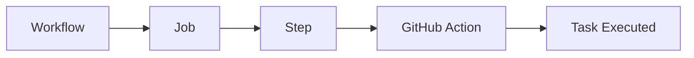
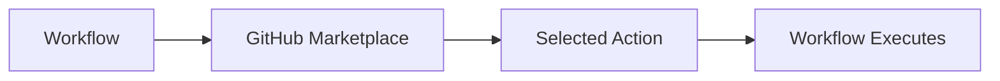
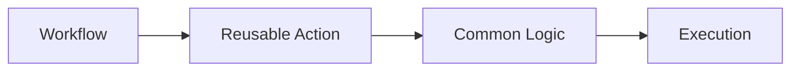
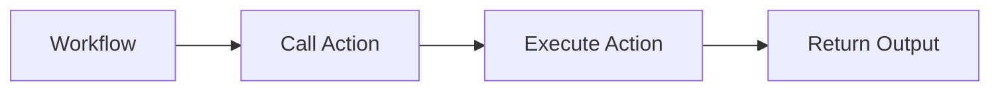
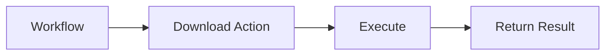
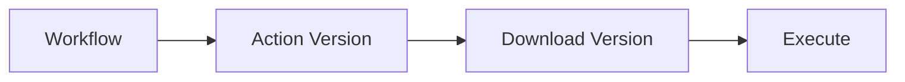
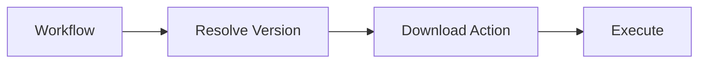

# Actions

## Overview

A **GitHub Action** is a reusable unit of automation that performs a specific task within a workflow.

Instead of writing shell scripts for every task, you can use Actions created by GitHub, the community, or your own organization.

Examples:

- Checkout source code
- Setup Java
- Setup Node.js
- Build Docker images
- Login to Azure
- Deploy to Kubernetes

> **Interview Tip**
>
> A **Workflow** is made up of **Jobs**, Jobs contain **Steps**, and Steps often use **Actions**.

---

## Why It Is Used

Actions simplify workflow development by providing reusable automation.

They help:

- Reduce duplicate code
- Standardize CI/CD pipelines
- Improve maintainability
- Speed up workflow development
- Integrate with cloud providers and DevOps tools

---

## Architecture / Working



---

## Key Components

| Component | Purpose |
|------------|----------|
| Workflow | Defines CI/CD pipeline |
| Job | Collection of steps |
| Step | Executes commands or actions |
| Action | Reusable automation |
| Marketplace | Repository of Actions |
| Repository | Stores custom actions |

---

## Types (if applicable)

GitHub supports several types of Actions.

| Type | Description |
|------|-------------|
| JavaScript Action | Runs JavaScript code |
| Docker Action | Runs inside a Docker container |
| Composite Action | Combines multiple workflow steps into one reusable action |

---

## Lifecycle / Workflow (if applicable)


---

## Configuration / Syntax (if applicable)

Using an action

```yaml
steps:
  - uses: actions/checkout@v4
```

Using multiple actions

```yaml
steps:

  - uses: actions/checkout@v4

  - uses: actions/setup-node@v4

  - run: npm install

  - run: npm test
```

---

## Important Commands (if applicable)

View available actions

```bash
gh search repos "github action"
```

---

## Important Files (if applicable)

Workflow

```
.github/
└── workflows/
    └── ci.yml
```

Custom Action

```
.github/
└── actions/
    └── my-action/
```

---

## Real-World Use Cases

- Checkout repository
- Install Java
- Install Python
- Build Docker images
- Login to Azure
- Deploy Kubernetes applications
- Upload build artifacts
- Publish releases

---

## Advantages

- Reusable
- Easy integration
- Large Marketplace
- Reduces scripting
- Community maintained

---

## Limitations

- Third-party actions may introduce security risks.
- Older action versions may contain bugs.
- External actions depend on repository availability.

---

## Common Interview Questions (Concept Only)

- What is a GitHub Action?
- How is an Action different from a workflow?
- Where are Actions stored?
- What are the different types of Actions?
- Why are Actions reusable?

---

## Common Mistakes

- Using outdated action versions
- Blindly trusting third-party actions
- Hardcoding secrets inside Actions
- Forgetting to pin action versions

---

## Troubleshooting

| Problem | Possible Cause | Solution |
|----------|----------------|----------|
| Action not found | Wrong repository name | Verify `uses` path |
| Workflow fails | Invalid version | Use a valid version tag |
| Authentication failed | Missing secret | Configure repository secrets |
| Permission denied | Insufficient permissions | Update workflow permissions |

---

## Summary

Actions are reusable automation components that simplify GitHub Actions workflows and eliminate repetitive scripting.

---

# Marketplace Actions

## Overview

GitHub Marketplace is the official repository of reusable GitHub Actions.

It contains thousands of Actions developed by:

- GitHub
- Microsoft
- Docker
- HashiCorp
- Azure
- AWS
- Community contributors

---

## Why It Is Used

Marketplace Actions reduce development effort by providing ready-to-use integrations.

Examples include:

- Checkout code
- Build Docker images
- Login to Azure
- Deploy Kubernetes
- Upload artifacts

---

## Architecture / Working



---

## Key Components

| Component | Purpose |
|------------|----------|
| Marketplace | Hosts reusable Actions |
| Repository | Stores Action code |
| Version | Identifies release |
| Documentation | Usage instructions |

---

## Types (if applicable)

Common Marketplace Actions

| Action | Purpose |
|---------|----------|
| actions/checkout | Clone repository |
| actions/setup-node | Install Node.js |
| actions/setup-java | Install Java |
| docker/build-push-action | Build Docker images |
| azure/login | Azure authentication |

---

## Lifecycle / Workflow (if applicable)


---

## Configuration / Syntax (if applicable)

```yaml
steps:

  - uses: actions/checkout@v4

  - uses: actions/setup-java@v4
```

---

## Important Commands (if applicable)

None

---

## Important Files (if applicable)

Workflow YAML

---

## Real-World Use Cases

- Azure deployments
- AWS deployments
- Docker builds
- Kubernetes deployments
- Terraform automation

---

## Advantages

- Large ecosystem
- Saves development time
- Well documented
- Frequently updated

---

## Limitations

- Quality varies between community actions.
- Some actions become unmaintained.

---

## Common Interview Questions (Concept Only)

- What is GitHub Marketplace?
- Why use Marketplace Actions?

---

## Common Mistakes

- Using unverified Actions
- Ignoring security recommendations

---

## Troubleshooting

| Problem | Cause | Solution |
|----------|--------|----------|
| Action unavailable | Repository removed | Choose another version or action |
| Build failure | Incorrect usage | Follow documentation |

---

## Summary

Marketplace Actions provide reusable integrations for common CI/CD tasks.

---

# Reusable Actions

## Overview

Reusable Actions allow organizations to package common automation into reusable components.

Instead of copying steps across workflows, one Action can be reused by multiple repositories.

---

## Why It Is Used

Reusable Actions help:

- Standardize CI/CD
- Reduce duplicate code
- Simplify maintenance
- Improve consistency

---

## Architecture / Working



---

## Key Components

- Action repository
- Metadata file
- Inputs
- Outputs

---

## Types (if applicable)

- Composite Action
- JavaScript Action
- Docker Action

---

## Lifecycle / Workflow (if applicable)



---

## Configuration / Syntax (if applicable)

```yaml
steps:

  - uses: organization/my-action@v1
```

---

## Important Commands (if applicable)

None

---

## Important Files (if applicable)

```
action.yml
```

---

## Real-World Use Cases

- Company-wide build process
- Shared security scanning
- Shared deployment logic

---

## Advantages

- Reusable
- Easier maintenance
- Centralized updates

---

## Limitations

- Requires version management
- Changes affect dependent workflows

---

## Common Interview Questions (Concept Only)

- What are reusable Actions?
- Why create custom Actions?

---

## Common Mistakes

- No versioning strategy
- Breaking backward compatibility

---

## Troubleshooting

| Problem | Cause | Solution |
|----------|--------|----------|
| Action not loading | Wrong repository path | Verify repository |
| Invalid metadata | Incorrect `action.yml` | Validate syntax |

---

## Summary

Reusable Actions eliminate duplicate workflow logic and promote consistency across repositories.

---

# Using Third-Party Actions

## Overview

Third-party Actions are created by developers or organizations outside GitHub.

They provide integrations with external tools and services.

Examples:

- AWS
- Azure
- Docker
- Terraform
- Kubernetes

---

## Why It Is Used

Third-party Actions simplify integration with external platforms.

---

## Architecture / Working


---

## Key Components

- Repository
- Version
- Documentation

---

## Types (if applicable)

- Verified Actions
- Community Actions

---

## Lifecycle / Workflow (if applicable)



---

## Configuration / Syntax (if applicable)

```yaml
steps:

  - uses: azure/login@v2
```

---

## Important Commands (if applicable)

None

---

## Important Files (if applicable)

Workflow YAML

---

## Real-World Use Cases

- Azure deployment
- AWS authentication
- Docker publishing
- Kubernetes deployment

---

## Advantages

- Fast integration
- Community support
- Rich ecosystem

---

## Limitations

- Security depends on the publisher.
- Repository changes may introduce breaking changes.

---

## Common Interview Questions (Concept Only)

- What are third-party Actions?
- What security precautions should be taken?

---

## Common Mistakes

- Using untrusted Actions
- Always using `@main` instead of a fixed version

---

## Troubleshooting

| Problem | Cause | Solution |
|----------|--------|----------|
| Action unavailable | Repository removed | Use supported version |
| Unexpected behavior | Breaking update | Pin to a stable version |

---

## Summary

Third-party Actions enable rapid integration with external services but should be used carefully after reviewing their source and documentation.

---

# Action Versions

## Overview

Every Action should be referenced using a version.

Versioning ensures workflow stability and reproducibility.

---

## Why It Is Used

Versioning:

- Prevents unexpected changes
- Enables rollback
- Improves security
- Ensures predictable builds

---

## Architecture / Working



---

## Key Components

| Version Type | Example |
|--------------|----------|
| Major Version | `v4` |
| Minor Version | `v4.2` |
| Patch Version | `v4.2.1` |
| Commit SHA | `a824008...` |

---

## Types (if applicable)

Common version references:

```yaml
@v4
```

```yaml
@v4.2.0
```

```yaml
@main
```

```yaml
@<commit-sha>
```

---

## Lifecycle / Workflow (if applicable)



---

## Configuration / Syntax (if applicable)

Recommended

```yaml
uses: actions/checkout@v4
```

Most secure

```yaml
uses: actions/checkout@<commit-sha>
```

Avoid

```yaml
uses: actions/checkout@main
```

---

## Important Commands (if applicable)

None

---

## Important Files (if applicable)

Workflow YAML

---

## Real-World Use Cases

- Stable production pipelines
- Secure enterprise CI/CD
- Version-controlled deployments

---

## Advantages

- Predictable builds
- Easier rollback
- Improved security
- Better compatibility management

---

## Limitations

- Older versions may miss bug fixes.
- Frequent upgrades require testing.

---

## Common Interview Questions (Concept Only)

- Why should Actions be versioned?
- Why avoid using `@main` in production?
- What is the safest way to reference an Action?

---

## Common Mistakes

- Using floating versions like `@main`
- Never updating old versions
- Ignoring security advisories

---

## Troubleshooting

| Problem | Cause | Solution |
|----------|--------|----------|
| Action behavior changed | Floating version | Pin to a specific version |
| Version not found | Incorrect tag | Verify available releases |
| Security warning | Outdated version | Upgrade to a supported release |

---

## Summary

Action versions ensure workflows remain stable, secure, and reproducible.

> **Interview Tip**
>
> Remember these key points:
>
> - **Actions** are reusable automation units executed within workflow steps.
> - **Marketplace Actions** provide prebuilt integrations for common DevOps tasks.
> - **Reusable Actions** help standardize automation across repositories.
> - **Third-party Actions** should be reviewed for trust and security before use.
> - **Pin Actions to a stable version or commit SHA** instead of using floating references like `@main` for production workflows.
