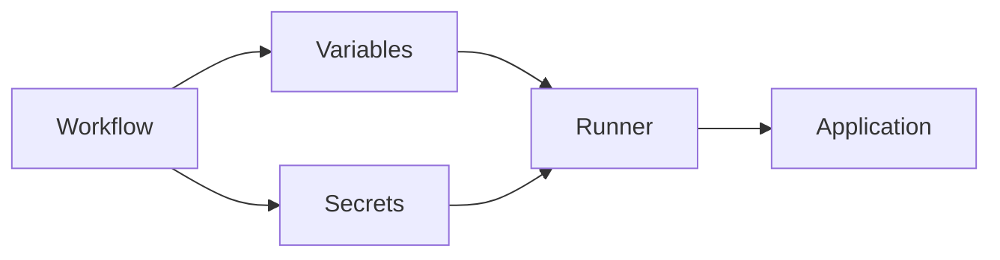
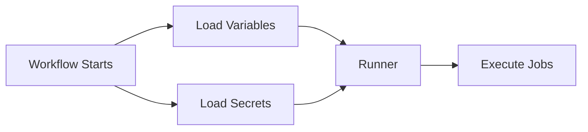
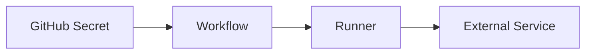

# Variables & Secrets

## Overview

Variables and Secrets are used to store values that workflows need during execution.

They help avoid hardcoding values such as:

- Environment names
- Docker image names
- Application URLs
- API keys
- Passwords
- Cloud credentials
- Access tokens

GitHub provides two types of stored values:

| Type | Purpose | Encrypted |
|------|---------|-----------|
| Variables | Store non-sensitive configuration values | ❌ No |
| Secrets | Store sensitive information | ✅ Yes |

> **Interview Tip**
>
> - Use **Variables** for configuration values.
> - Use **Secrets** for passwords, tokens, certificates, and cloud credentials.

---

## Why It Is Used

Variables and Secrets help to:

- Improve security
- Avoid hardcoded values
- Reuse configuration
- Support multiple environments
- Simplify deployment automation
- Separate configuration from code

---

## Architecture / Working



---

## Key Components

| Component | Purpose |
|------------|----------|
| Repository Variables | Shared configuration values |
| Environment Variables | Values for specific environments |
| Secrets | Encrypted sensitive data |
| GitHub Secrets | Repository or organization secrets |
| Environment Secrets | Environment-specific sensitive values |

---

## Types (if applicable)

| Type | Purpose |
|------|----------|
| Repository Variables | Shared configuration |
| Environment Variables | Workflow or job configuration |
| Repository Secrets | Repository credentials |
| Organization Secrets | Shared credentials |
| Environment Secrets | Environment-specific credentials |

---

## Lifecycle / Workflow (if applicable)



---

## Configuration / Syntax (if applicable)

Variable

```yaml
env:
  APP_NAME: myapp
```

Use variable

```yaml
run: echo $APP_NAME
```

Secret

```yaml
${{ secrets.AZURE_CREDENTIALS }}
```

Repository variable

```yaml
${{ vars.APP_NAME }}
```

Repository secret

```yaml
${{ secrets.DOCKER_PASSWORD }}
```

---

## Important Commands (if applicable)

Using GitHub CLI

List repository secrets

```bash
gh secret list
```

Create repository secret

```bash
gh secret set MY_SECRET
```

List repository variables

```bash
gh variable list
```

Create repository variable

```bash
gh variable set APP_NAME --body "myapp"
```

---

## Important Files (if applicable)

```
.github/
└── workflows/
      ci.yml
```

---

## Real-World Use Cases

- Azure Service Principal credentials
- AWS Access Keys
- Docker Hub credentials
- Kubernetes kubeconfig
- Database passwords
- Slack Webhook URL
- Application environment names
- API endpoints

---

## Advantages

- Improves security
- Eliminates hardcoded credentials
- Easy configuration management
- Supports multiple environments
- Centralized management

---

## Limitations

- Secrets cannot be viewed after creation.
- Variables are not encrypted.
- Secrets cannot be directly printed in workflow logs.

---

## Common Interview Questions (Concept Only)

- What is the difference between Variables and Secrets?
- Why should passwords never be stored as Variables?
- What is GitHub Secrets?
- What are Environment Secrets?
- Can Secrets be viewed after creation?
- How are Variables accessed inside workflows?

---

## Common Mistakes

- Hardcoding passwords
- Printing Secrets in logs
- Using Variables instead of Secrets for credentials
- Creating duplicate configuration values
- Storing certificates in workflow files

---

## Troubleshooting

| Problem | Possible Cause | Solution |
|----------|----------------|----------|
| Secret empty | Incorrect name | Verify secret name |
| Variable not found | Wrong context | Use `${{ vars.NAME }}` |
| Secret unavailable | Missing permissions | Verify repository or environment access |
| Workflow fails | Secret not configured | Create the missing secret |
| Authentication failure | Invalid credentials | Update the stored secret |

---

## Summary

Variables store configuration values, while Secrets securely store sensitive information.

Key interview points:

- Variables are **not encrypted**.
- Secrets are **encrypted**.
- Never hardcode credentials.
- Use repository or environment-specific configuration when appropriate.

---

# Repository Variables

## Overview

Repository Variables are reusable configuration values available to workflows within a repository.

They are intended for non-sensitive information.

Examples:

- Application name
- Region
- Environment name
- Docker image name

---

## Why It Is Used

Repository Variables:

- Reduce duplication
- Simplify configuration
- Improve maintainability

---

## Architecture / Working


---

## Key Components

| Component | Purpose |
|------------|----------|
| Variable Name | Identifier |
| Variable Value | Configuration |
| Repository | Storage location |

---

## Types (if applicable)

Common repository variables

- APP_NAME
- REGION
- IMAGE_NAME
- ENVIRONMENT

---

## Lifecycle / Workflow (if applicable)


---

## Configuration / Syntax (if applicable)

Reference repository variable

```yaml
${{ vars.APP_NAME }}
```

Example

```yaml
run: echo ${{ vars.APP_NAME }}
```

---

## Important Commands (if applicable)

```bash
gh variable list
```

---

## Important Files (if applicable)

Workflow YAML

---

## Real-World Use Cases

- Docker image names
- Deployment region
- Resource group names
- Cluster names

---

## Advantages

- Reusable
- Easy to update
- Centralized configuration

---

## Limitations

- Not encrypted
- Visible to authorized users

---

## Common Interview Questions (Concept Only)

- What are Repository Variables?
- When should Repository Variables be used?

---

## Common Mistakes

- Storing passwords as variables
- Duplicate variable names

---

## Troubleshooting

| Problem | Cause | Solution |
|----------|--------|----------|
| Variable missing | Wrong name | Verify variable |
| Empty value | Not configured | Update repository variable |

---

## Summary

Repository Variables store reusable, non-sensitive configuration values.

---

# Environment Variables

## Overview

Environment Variables (defined with `env`) are values available during workflow execution.

They can be defined at:

- Workflow level
- Job level
- Step level

---

## Why It Is Used

Environment Variables help avoid repeating the same values throughout a workflow.

---

## Architecture / Working


---

## Key Components

| Scope | Description |
|--------|-------------|
| Workflow | Available to all jobs |
| Job | Available within one job |
| Step | Available within one step |

---

## Types (if applicable)

- Workflow-level
- Job-level
- Step-level

---

## Lifecycle / Workflow (if applicable)


---

## Configuration / Syntax (if applicable)

Workflow level

```yaml
env:
  APP_NAME: myapp
```

Job level

```yaml
jobs:
  build:
    env:
      REGION: eastus
```

Step level

```yaml
steps:
  - env:
      VERSION: "1.0"
```

---

## Important Commands (if applicable)

None

---

## Important Files (if applicable)

Workflow YAML

---

## Real-World Use Cases

- Environment names
- Build versions
- Regions
- Application URLs

---

## Advantages

- Easy configuration
- Flexible scope
- Simple syntax

---

## Limitations

- Not encrypted
- Temporary during workflow execution

---

## Common Interview Questions (Concept Only)

- What is the scope of an environment variable?
- Can environment variables override each other?

---

## Common Mistakes

- Using incorrect scope
- Expecting persistence across workflows

---

## Troubleshooting

| Problem | Cause | Solution |
|----------|--------|----------|
| Variable unavailable | Wrong scope | Define at the correct level |
| Wrong value | Overridden variable | Check precedence |

---

## Summary

Environment Variables provide temporary configuration during workflow execution.

---

# Secrets

## Overview

Secrets securely store sensitive information required by workflows.

Secrets are encrypted and automatically masked in workflow logs.

Examples:

- Passwords
- API Keys
- Access Tokens
- SSH Keys
- Certificates

---

## Why It Is Used

Secrets protect confidential information from exposure.

---

## Architecture / Working


---

## Key Components

- Secret Name
- Secret Value
- Encryption
- Workflow Access

---

## Types (if applicable)

- Repository Secret
- Organization Secret
- Environment Secret

---

## Lifecycle / Workflow (if applicable)


---

## Configuration / Syntax (if applicable)

```yaml
${{ secrets.MY_SECRET }}
```

---

## Important Commands (if applicable)

```bash
gh secret list
```

---

## Important Files (if applicable)

Workflow YAML

---

## Real-World Use Cases

- Azure credentials
- AWS credentials
- Docker Hub password
- Database password

---

## Advantages

- Encrypted
- Secure
- Automatically masked

---

## Limitations

- Cannot be retrieved after creation
- Cannot be printed in logs

---

## Common Interview Questions (Concept Only)

- Why are Secrets encrypted?
- Can Secrets be viewed after creation?

---

## Common Mistakes

- Printing Secrets
- Storing passwords as Variables

---

## Troubleshooting

| Problem | Cause | Solution |
|----------|--------|----------|
| Secret unavailable | Missing configuration | Create secret |
| Authentication failure | Incorrect value | Update secret |

---

## Summary

Secrets securely store confidential information used by workflows.

---

# GitHub Secrets

## Overview

GitHub Secrets are encrypted credentials stored at the repository or organization level.

They are accessed using the `secrets` context.

---

## Why It Is Used

GitHub Secrets centralize credential management for workflows.

---

## Architecture / Working



---

## Key Components

- Repository Secret
- Organization Secret
- Secret Context

---

## Types (if applicable)

- Repository Secrets
- Organization Secrets

---

## Lifecycle / Workflow (if applicable)


---

## Configuration / Syntax (if applicable)

```yaml
${{ secrets.AZURE_CREDENTIALS }}
```

---

## Important Commands (if applicable)

```bash
gh secret list
```

---

## Important Files (if applicable)

Workflow YAML

---

## Real-World Use Cases

- Azure Login
- Docker Login
- AWS Authentication

---

## Advantages

- Centralized
- Secure
- Easy to manage

---

## Limitations

- Repository permissions determine access.

---

## Common Interview Questions (Concept Only)

- What are GitHub Secrets?
- Where are GitHub Secrets stored?

---

## Common Mistakes

- Wrong secret names
- Missing repository permissions

---

## Troubleshooting

| Problem | Cause | Solution |
|----------|--------|----------|
| Secret unavailable | Access restriction | Verify permissions |

---

## Summary

GitHub Secrets securely store repository and organization credentials.

---

# Environment Secrets

## Overview

Environment Secrets are encrypted credentials associated with a specific GitHub Environment (such as Development, Staging, or Production).

They allow different credentials to be used for different deployment environments.

---

## Why It Is Used

Environment Secrets:

- Separate development and production credentials
- Improve deployment security
- Support approval workflows

---

## Architecture / Working


---

## Key Components

| Component | Purpose |
|------------|----------|
| Environment | Deployment target |
| Secret | Environment-specific credential |
| Approval Rule | Optional deployment approval |

---

## Types (if applicable)

Common environments:

- Development
- Testing
- Staging
- Production

---

## Lifecycle / Workflow (if applicable)


---

## Configuration / Syntax (if applicable)

Specify environment

```yaml
jobs:
  deploy:
    environment: production
```

Access environment secret

```yaml
${{ secrets.AZURE_CREDENTIALS }}
```

---

## Important Commands (if applicable)

Environment Secrets are managed through the GitHub repository settings.

---

## Important Files (if applicable)

Workflow YAML

---

## Real-World Use Cases

- Production Azure credentials
- Production Kubernetes credentials
- Production API keys
- Staging database passwords

---

## Advantages

- Environment isolation
- Improved security
- Supports deployment approvals
- Prevents accidental use of production credentials

---

## Limitations

- Requires environment configuration.
- More administrative overhead than repository-level secrets.

---

## Common Interview Questions (Concept Only)

- What are Environment Secrets?
- Why use Environment Secrets instead of Repository Secrets?
- Can different environments have different credentials?

---

## Common Mistakes

- Using repository secrets for every environment
- Sharing production credentials with development workflows
- Forgetting to assign the correct environment to a deployment job

---

## Troubleshooting

| Problem | Cause | Solution |
|----------|--------|----------|
| Secret unavailable | Wrong environment | Verify job environment |
| Deployment failed | Missing environment secret | Create the required secret |
| Approval pending | Required reviewers not approved | Complete environment approval |

---

## Summary

Environment Secrets securely store credentials that are specific to deployment environments.

> **Interview Tip**
>
> Remember these key differences:
>
> - **Variables** → Non-sensitive configuration values (`${{ vars.NAME }}`)
> - **Environment Variables (`env`)** → Temporary values available during workflow execution
> - **Secrets** → Encrypted sensitive data (`${{ secrets.NAME }}`)
> - **Repository Secrets** → Shared across all workflows in a repository
> - **Environment Secrets** → Used for environment-specific credentials such as Development, Staging, and Production
> - Never store passwords, tokens, or cloud credentials in Variables or directly in workflow files.
