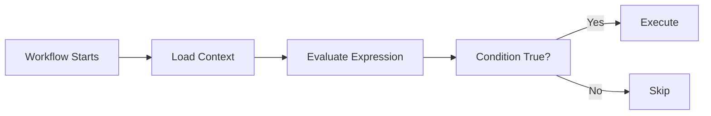
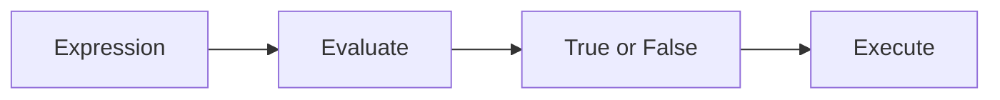
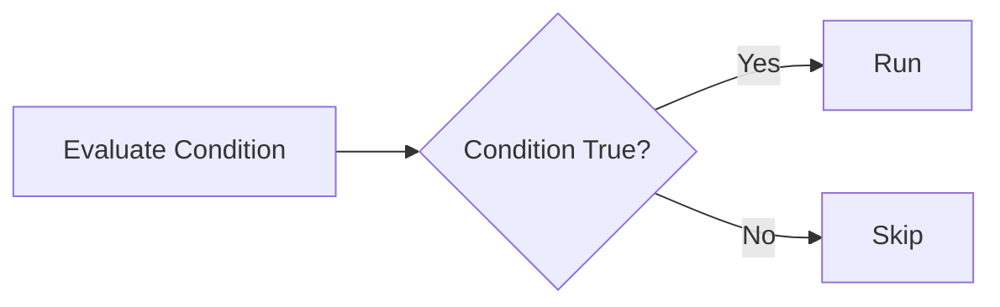
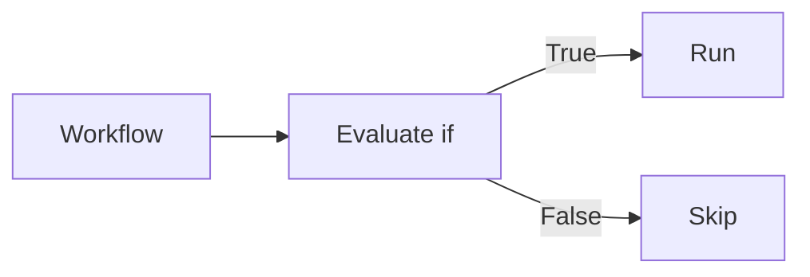
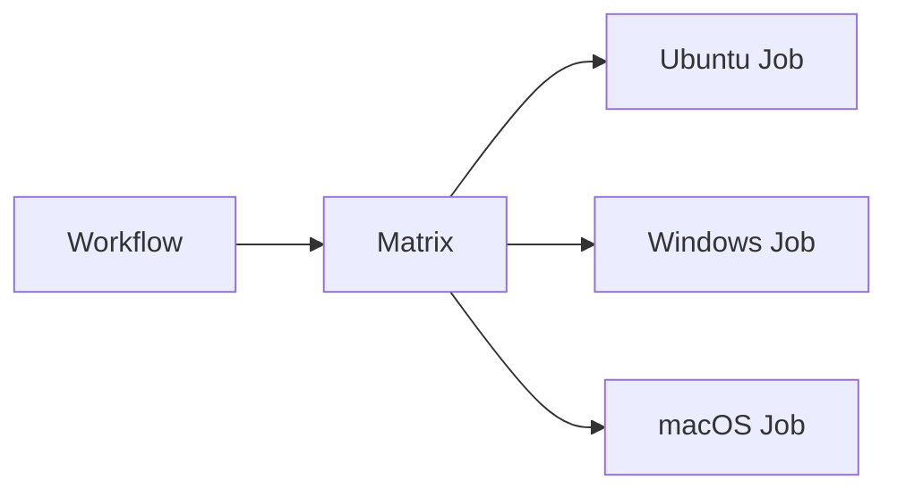

# Workflow Expressions

## Overview

Workflow Expressions allow GitHub Actions workflows to evaluate values dynamically during execution.

They are written using the **`${{ }}`** syntax and are used to:

- Access variables
- Read secrets
- Access GitHub event data
- Perform comparisons
- Execute conditional logic
- Create dynamic workflows

Expressions make workflows flexible and reusable.

> **Interview Tip**
>
> Anything inside **`${{ }}`** is evaluated by GitHub Actions before the step executes.

---

## Why It Is Used

Workflow Expressions help to:

- Make workflows dynamic
- Reduce duplicate workflows
- Execute jobs conditionally
- Access runtime information
- Configure deployments automatically
- Improve workflow reusability

---

## Architecture / Working


---

## Key Components

| Component | Purpose |
|------------|----------|
| Expression | Dynamic evaluation |
| Context | Runtime information |
| Operator | Comparison and logic |
| Function | Built-in helper methods |
| Matrix | Dynamic job generation |

---

## Types (if applicable)

Common expression categories:

- Context expressions
- Conditional expressions
- Logical expressions
- Comparison expressions
- Function expressions

---

## Lifecycle / Workflow (if applicable)



---

## Configuration / Syntax (if applicable)

Basic expression

```yaml
${{ github.ref }}
```

Comparison

```yaml
${{ github.ref == 'refs/heads/main' }}
```

Logical operator

```yaml
${{ success() }}
```

---

## Important Commands (if applicable)

No CLI commands.

---

## Important Files (if applicable)

```
.github/
└── workflows/
      ci.yml
```

---

## Real-World Use Cases

- Deploy only from the main branch
- Skip deployment for pull requests
- Run jobs only after successful tests
- Select deployment environment dynamically
- Generate matrix builds

---

## Advantages

- Dynamic workflows
- Reusable pipelines
- Conditional execution
- Cleaner YAML
- Supports automation

---

## Limitations

- Complex expressions reduce readability.
- Incorrect context names cause workflow failures.
- Expressions cannot access values that are unavailable at evaluation time.

---

## Common Interview Questions (Concept Only)

- What are Workflow Expressions?
- Why are expressions used?
- What syntax is used for expressions?
- Can expressions access secrets?
- Where can expressions be used?

---

## Common Mistakes

- Missing `${{ }}`
- Typing incorrect context names
- Comparing incorrect branch names
- Using unsupported functions

---

## Troubleshooting

| Problem | Possible Cause | Solution |
|----------|----------------|----------|
| Expression not evaluated | Missing `${{ }}` | Add expression syntax |
| Value empty | Incorrect context | Verify context name |
| Job skipped | Condition false | Review expression logic |
| Workflow fails | Invalid syntax | Validate YAML and expression |

---

## Summary

Workflow Expressions provide dynamic behavior by evaluating values at runtime.

Key interview points:

- Expressions use `${{ }}` syntax.
- Expressions access contexts and evaluate conditions.
- Expressions simplify dynamic workflows.

---

# Contexts

## Overview

Contexts provide information about the workflow, repository, runner, jobs, steps, events, variables, and secrets.

Contexts are accessed using expressions.

Example:

```yaml
${{ github.actor }}
```

> **Interview Tip**
>
> Contexts expose runtime information to workflows.

---

## Why It Is Used

Contexts allow workflows to:

- Access GitHub event information
- Read variables
- Access secrets
- Detect branches
- Read job outputs
- Access runner information

---

## Architecture / Working


---

## Key Components

| Context | Purpose |
|----------|----------|
| github | Repository and event data |
| env | Environment variables |
| vars | Repository variables |
| secrets | Secrets |
| runner | Runner information |
| matrix | Matrix values |
| steps | Step outputs |
| job | Job information |

---

## Types (if applicable)

Common contexts

| Context | Example |
|----------|----------|
| github | github.ref |
| env | env.APP_NAME |
| vars | vars.REGION |
| secrets | secrets.AZURE_CREDENTIALS |
| runner | runner.os |
| matrix | matrix.os |

---

## Lifecycle / Workflow (if applicable)


---

## Configuration / Syntax (if applicable)

GitHub context

```yaml
${{ github.actor }}
```

Branch

```yaml
${{ github.ref }}
```

Runner

```yaml
${{ runner.os }}
```

Variable

```yaml
${{ vars.APP_NAME }}
```

Secret

```yaml
${{ secrets.DOCKER_PASSWORD }}
```

---

## Important Commands (if applicable)

None

---

## Important Files (if applicable)

Workflow YAML

---

## Real-World Use Cases

- Deploy only from main
- Display actor name
- Select operating system
- Access repository variables

---

## Advantages

- Dynamic execution
- Rich runtime information
- Supports automation

---

## Limitations

- Some contexts are unavailable in specific scopes.
- Incorrect references return empty values.

---

## Common Interview Questions (Concept Only)

- What is a context?
- What is the github context?
- How are secrets accessed?

---

## Common Mistakes

- Wrong context name
- Using unavailable contexts

---

## Troubleshooting

| Problem | Cause | Solution |
|----------|--------|----------|
| Empty value | Wrong context | Verify context |
| Invalid expression | Syntax error | Review YAML |

---

## Summary

Contexts expose workflow information used by expressions.

---

# Expressions

## Overview

Expressions evaluate values and return results used by workflows.

They support:

- Comparisons
- Logical operations
- Built-in functions

---

## Why It Is Used

Expressions allow workflows to make decisions automatically.

---

## Architecture / Working



---

## Key Components

- Operators
- Functions
- Contexts

---

## Types (if applicable)

Comparison

Logical

Function

---

## Lifecycle / Workflow (if applicable)


---

## Configuration / Syntax (if applicable)

Comparison

```yaml
${{ github.ref == 'refs/heads/main' }}
```

Logical

```yaml
${{ success() }}
```

Negation

```yaml
${{ !cancelled() }}
```

---

## Important Commands (if applicable)

None

---

## Important Files (if applicable)

Workflow YAML

---

## Real-World Use Cases

- Branch validation
- Deployment conditions
- Skip failed builds

---

## Advantages

- Flexible
- Dynamic
- Easy automation

---

## Limitations

- Complex expressions reduce readability.

---

## Common Interview Questions (Concept Only)

- What is an expression?
- Which syntax is used?

---

## Common Mistakes

- Invalid comparison
- Missing quotes

---

## Troubleshooting

| Problem | Cause | Solution |
|----------|--------|----------|
| Always false | Wrong comparison | Verify values |
| Invalid syntax | Incorrect operator | Correct expression |

---

## Summary

Expressions evaluate runtime conditions for workflows.

---

# Conditional Execution

## Overview

Conditional execution controls whether a job or step should run.

It uses the **`if`** keyword.

---

## Why It Is Used

Conditional execution helps:

- Deploy only after successful builds
- Skip unnecessary jobs
- Run platform-specific tasks
- Reduce workflow time

---

## Architecture / Working



---

## Key Components

| Component | Purpose |
|-----------|----------|
| if | Condition |
| Expression | Evaluation |
| Job | Conditional execution |
| Step | Conditional execution |

---

## Types (if applicable)

- Job condition
- Step condition

---

## Lifecycle / Workflow (if applicable)



---

## Configuration / Syntax (if applicable)

Run only on main

```yaml
if: github.ref == 'refs/heads/main'
```

Run only after success

```yaml
if: success()
```

Run after failure

```yaml
if: failure()
```

Always run

```yaml
if: always()
```

---

## Important Commands (if applicable)

None

---

## Important Files (if applicable)

Workflow YAML

---

## Real-World Use Cases

- Production deployment
- Cleanup tasks
- Failure notifications
- Rollback workflows

---

## Advantages

- Saves execution time
- Improves automation
- Prevents unnecessary deployments

---

## Limitations

- Incorrect conditions skip jobs unexpectedly.
- Complex logic is harder to maintain.

---

## Common Interview Questions (Concept Only)

- What is the `if` keyword?
- What does `success()` do?
- What does `always()` do?

---

## Common Mistakes

- Wrong branch comparison
- Invalid expression
- Incorrect function usage

---

## Troubleshooting

| Problem | Cause | Solution |
|----------|--------|----------|
| Job skipped | Condition false | Verify expression |
| Cleanup skipped | Missing `always()` | Use `always()` |

---

## Summary

Conditional execution allows workflows to run only when specified conditions are met.

---

# Matrix Strategy

## Overview

Matrix Strategy allows a single job definition to execute multiple times using different configurations.

Instead of creating multiple jobs manually, GitHub automatically generates them.

Example:

- Ubuntu
- Windows
- macOS

All from one job definition.

> **Interview Tip**
>
> Matrix builds are frequently used to test software on multiple operating systems or language versions.

---

## Why It Is Used

Matrix Strategy helps:

- Test multiple operating systems
- Test multiple language versions
- Reduce YAML duplication
- Improve CI coverage

---

## Architecture / Working



---

## Key Components

| Component | Purpose |
|-----------|----------|
| strategy | Enables matrix |
| matrix | Defines combinations |
| runs-on | Uses matrix value |

---

## Types (if applicable)

Common matrix configurations:

- Operating Systems
- Programming Languages
- Runtime Versions

---

## Lifecycle / Workflow (if applicable)


---

## Configuration / Syntax (if applicable)

Example

```yaml
strategy:
  matrix:
    os:
      - ubuntu-latest
      - windows-latest
      - macos-latest

runs-on: ${{ matrix.os }}
```

Language versions

```yaml
matrix:
  node:
    - 18
    - 20
```

---

## Important Commands (if applicable)

None

---

## Important Files (if applicable)

Workflow YAML

---

## Real-World Use Cases

- Test Node.js 18 and 20
- Test Java 17 and 21
- Multi-platform builds
- Cross-platform applications

---

## Advantages

- Less YAML
- Better test coverage
- Parallel execution
- Easier maintenance

---

## Limitations

- Large matrices increase workflow execution time and runner usage.
- Complex matrices can be difficult to troubleshoot.

---

## Common Interview Questions (Concept Only)

- What is Matrix Strategy?
- Why use matrix builds?
- Can matrix jobs run in parallel?
- What is `matrix.os`?

---

## Common Mistakes

- Creating too many matrix combinations
- Incorrect matrix variable names
- Forgetting to reference `matrix` values

---

## Troubleshooting

| Problem | Cause | Solution |
|----------|--------|----------|
| Matrix not expanding | Incorrect strategy syntax | Validate YAML |
| Wrong runner | Incorrect matrix value | Verify `runs-on` |
| Too many jobs | Large matrix | Reduce combinations |

---

## Summary

Matrix Strategy enables one workflow definition to execute multiple job variations automatically.

> **Interview Tip**
>
> Remember these key concepts:
>
> - **Expressions** use `${{ }}` to evaluate values dynamically.
> - **Contexts** provide workflow, repository, runner, variable, and secret information.
> - Use the **`if`** keyword for conditional execution.
> - Built-in functions like `success()`, `failure()`, `cancelled()`, and `always()` control workflow behavior.
> - **Matrix Strategy** creates multiple jobs automatically from a single job definition, commonly used for multi-OS or multi-version testing.
