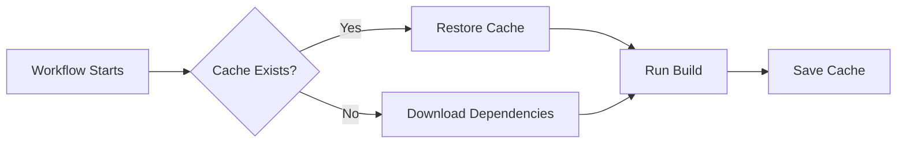
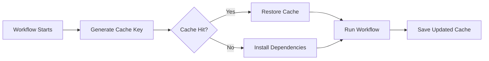
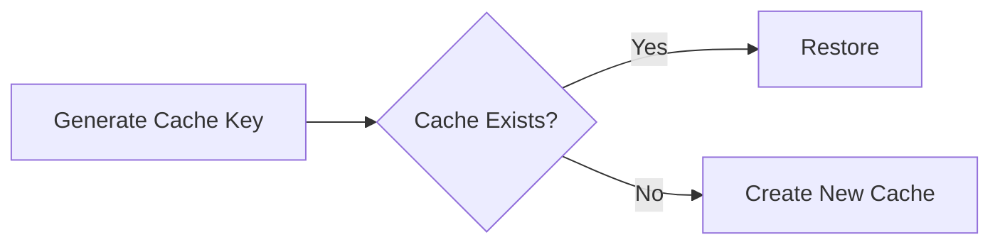
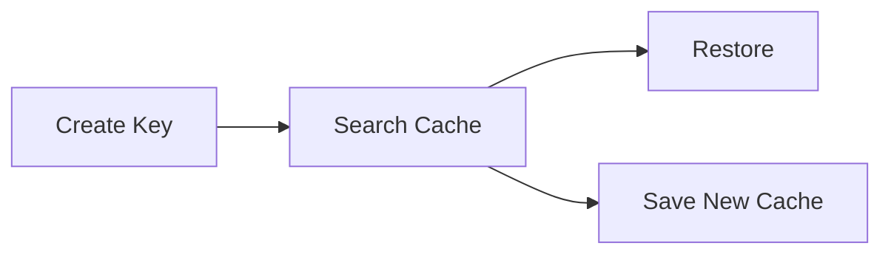
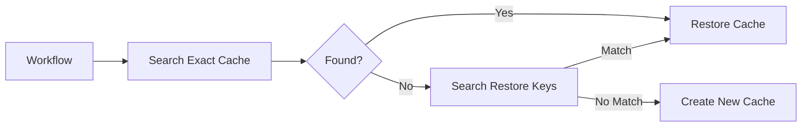

# Caching

## Overview

Caching in GitHub Actions is a technique used to **store and reuse dependencies, packages, and build outputs** between workflow runs.

Instead of downloading dependencies every time a workflow executes, GitHub restores them from the cache if available, significantly reducing workflow execution time.

Common items that are cached include:

- npm packages
- Maven dependencies
- Gradle cache
- pip packages
- NuGet packages
- Docker build cache
- Terraform plugins

> **Interview Tip**
>
> **Caching improves workflow performance.**
>
> It is **not** intended for sharing build artifacts between jobs.

---

## Why It Is Used

Caching helps to:

- Reduce workflow execution time
- Avoid downloading dependencies repeatedly
- Reduce bandwidth usage
- Improve CI/CD performance
- Speed up builds

---

## Architecture / Working



---

## Key Components

| Component | Purpose |
|-----------|----------|
| Cache | Stored dependencies |
| Cache Key | Unique cache identifier |
| Restore Key | Backup cache lookup |
| Cache Action | Upload and restore cache |

---

## Types (if applicable)

Common cache types

- npm cache
- Maven repository
- Gradle cache
- pip packages
- NuGet packages
- Composer cache
- Docker layer cache
- Terraform plugins

---

## Lifecycle / Workflow (if applicable)



---

## Configuration / Syntax (if applicable)

Basic cache

```yaml
- uses: actions/cache@v4
  with:
    path: ~/.npm
    key: npm-${{ hashFiles('package-lock.json') }}
```

Cache Maven

```yaml
path: ~/.m2/repository
```

Cache Gradle

```yaml
path: ~/.gradle/caches
```

Cache pip

```yaml
path: ~/.cache/pip
```

---

## Important Commands (if applicable)

Caching is handled automatically by the `actions/cache` action.

No CLI commands are required.

---

## Important Files (if applicable)

```
.github/
└── workflows/
      ci.yml
```

Common dependency files

```
package-lock.json
pom.xml
build.gradle
requirements.txt
packages.lock.json
```

---

## Real-World Use Cases

- Cache Node.js packages
- Cache Maven dependencies
- Cache Gradle libraries
- Cache Python packages
- Cache Terraform providers
- Cache Docker build layers

---

## Advantages

- Faster workflow execution
- Reduced internet downloads
- Lower CI/CD costs
- Better developer productivity
- Improved pipeline performance

---

## Limitations

- Cache storage is limited.
- Large caches increase upload/download time.
- Incorrect cache keys reduce cache efficiency.
- Cache should not store sensitive data.

---

## Common Interview Questions (Concept Only)

- What is caching in GitHub Actions?
- Why is caching used?
- What is cached?
- How is cache different from artifacts?
- When is cache restored?
- When is cache updated?

---

## Common Mistakes

- Caching build artifacts instead of dependencies
- Using static cache keys
- Caching unnecessary directories
- Including temporary files in cache
- Forgetting dependency lock files

---

## Troubleshooting

| Problem | Possible Cause | Solution |
|----------|----------------|----------|
| Cache miss | Cache key changed | Verify cache key |
| Cache not restored | Wrong cache path | Check dependency directory |
| Slow workflow | Large cache | Cache only required files |
| Dependencies downloaded every run | Incorrect key | Use dependency hash |

---

## Summary

Caching stores reusable dependencies between workflow runs to improve CI/CD performance.

> **Interview Tip**
>
> Caching is designed for **dependency reuse**, not for sharing workflow outputs.

---

# Dependency Caching

## Overview

Dependency Caching stores downloaded packages and libraries so future workflow runs can reuse them instead of downloading them again.

This is the most common use case for caching.

Examples

- npm packages
- Maven repository
- pip packages
- Gradle cache
- NuGet packages

---

## Why It Is Used

Dependency caching:

- Speeds up builds
- Reduces network usage
- Improves developer productivity

---

## Architecture / Working


---

## Key Components

| Component | Purpose |
|-----------|----------|
| Dependency Folder | Cached files |
| Cache Action | Upload/restore |
| Lock File | Cache version |

---

## Types (if applicable)

Common dependency folders

- ~/.npm
- ~/.m2
- ~/.gradle
- ~/.cache/pip

---

## Lifecycle / Workflow (if applicable)


---

## Configuration / Syntax (if applicable)

Example

```yaml
- uses: actions/cache@v4
  with:
    path: ~/.npm
    key: npm-${{ hashFiles('package-lock.json') }}
```

---

## Important Commands (if applicable)

None

---

## Important Files (if applicable)

```
package-lock.json
pom.xml
requirements.txt
```

---

## Real-World Use Cases

- Node.js CI
- Java builds
- Python CI
- .NET builds

---

## Advantages

- Faster installations
- Reduced downloads
- Better CI performance

---

## Limitations

- Dependency changes invalidate cache.

---

## Common Interview Questions (Concept Only)

- What is dependency caching?
- Which folders are commonly cached?

---

## Common Mistakes

- Caching source code
- Missing dependency lock file

---

## Troubleshooting

| Problem | Cause | Solution |
|----------|--------|----------|
| Cache unused | Wrong path | Verify dependency folder |
| Cache invalid | Dependency update | Generate new cache |

---

## Summary

Dependency Caching stores reusable libraries to improve workflow performance.

---

# Cache Keys

## Overview

A Cache Key uniquely identifies a cache.

GitHub uses the key to determine whether an existing cache can be restored.

If the key changes, a new cache is created.

---

## Why It Is Used

Cache Keys ensure:

- Correct dependency version
- Automatic cache invalidation
- Cache reuse

---

## Architecture / Working



---

## Key Components

| Component | Purpose |
|-----------|----------|
| key | Primary cache lookup |
| hashFiles() | Detect dependency changes |
| restore-keys | Partial cache lookup |

---

## Types (if applicable)

- Static key
- Dynamic key
- Hash-based key

---

## Lifecycle / Workflow (if applicable)



---

## Configuration / Syntax (if applicable)

Example

```yaml
key: npm-${{ hashFiles('package-lock.json') }}
```

Branch-specific key

```yaml
key: ${{ runner.os }}-npm-${{ github.ref }}
```

---

## Important Commands (if applicable)

None

---

## Important Files (if applicable)

Dependency lock files

---

## Real-World Use Cases

- Cache Node packages
- Cache Java dependencies
- Cache Docker layers

---

## Advantages

- Automatic cache versioning
- Efficient cache lookup
- Prevents stale dependencies

---

## Limitations

- Frequent key changes reduce cache hits.
- Static keys may reuse outdated dependencies.

---

## Common Interview Questions (Concept Only)

- What is a cache key?
- Why use `hashFiles()`?
- What happens if the key changes?

---

## Common Mistakes

- Static cache keys
- Ignoring dependency changes
- Using incorrect hash files

---

## Troubleshooting

| Problem | Cause | Solution |
|----------|--------|----------|
| Cache miss | Changed key | Verify key generation |
| Old dependencies | Static key | Use dependency hash |

---

## Summary

Cache Keys uniquely identify cached dependencies and control cache reuse.

---

# Restore Cache

## Overview

Restore Cache is the process of retrieving an existing cache before installing dependencies.

GitHub first searches for an exact cache key.

If no exact match exists, it can search using **Restore Keys**.

---

## Why It Is Used

Restore Cache helps:

- Reuse older caches
- Reduce dependency downloads
- Improve workflow speed

---

## Architecture / Working



---

## Key Components

| Component | Purpose |
|-----------|----------|
| Exact Key | Primary lookup |
| Restore Keys | Fallback lookup |
| Cache Storage | Stores dependencies |

---

## Types (if applicable)

- Exact cache
- Partial cache
- New cache

---

## Lifecycle / Workflow (if applicable)


---

## Configuration / Syntax (if applicable)

Example

```yaml
restore-keys: |
  npm-
```

Multiple restore keys

```yaml
restore-keys: |
  ubuntu-npm-
  npm-
```

---

## Important Commands (if applicable)

None

---

## Important Files (if applicable)

Workflow YAML

---

## Real-World Use Cases

- Restore previous Node.js cache
- Reuse Maven cache
- Restore Python packages
- Speed up Docker builds

---

## Advantages

- Improves cache hit rate
- Faster builds
- Reduces downloads

---

## Limitations

- Partial cache may not contain all dependencies.
- Old caches can increase dependency installation time.

---

## Common Interview Questions (Concept Only)

- What are Restore Keys?
- When are Restore Keys used?
- What happens if no cache exists?

---

## Common Mistakes

- No restore keys configured
- Incorrect restore order
- Assuming restore keys always return the latest cache

---

## Troubleshooting

| Problem | Cause | Solution |
|----------|--------|----------|
| Cache miss | No matching key | Configure restore keys |
| Slow build | Partial cache | Regenerate cache |

---

## Summary

Restore Cache allows GitHub Actions to reuse existing dependency caches, even when an exact cache key is unavailable.

> **Interview Tip**
>
> Remember these key differences:
>
> | Feature | Cache | Artifact |
> |---------|-------|----------|
> | Purpose | Reuse dependencies | Store workflow outputs |
> | Speeds up builds | ✅ Yes | ❌ No |
> | Shared between jobs | Not its primary purpose | ✅ Yes |
> | Stored after workflow | Yes (temporary) | Yes (temporary) |
> | Common Examples | npm, Maven, Gradle, pip | Logs, reports, binaries |
>
> **Cache = Faster builds**
>
> **Artifacts = Preserve workflow files**
