# Build & Test Automation

## Overview

Build & Test Automation is one of the most common uses of GitHub Actions. It automatically performs tasks whenever code is pushed or a Pull Request is created, including:

- Checking out source code
- Installing dependencies
- Building the application
- Running automated tests
- Publishing build artifacts

This ensures every code change is verified before deployment.

> **Interview Tip**
>
> A typical CI workflow follows this sequence:
>
> **Checkout → Install Dependencies → Build → Test → Upload Artifacts**

---

## Why It Is Used

Build & Test Automation helps to:

- Detect bugs early
- Verify every code change
- Reduce manual work
- Improve software quality
- Enable Continuous Integration (CI)
- Produce deployment-ready build packages

---

## Architecture / Working

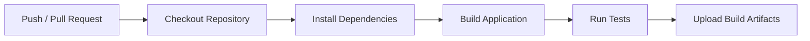

---

## Key Components

| Component | Purpose |
|-----------|----------|
| Checkout | Downloads repository code |
| Dependency Installation | Installs required libraries |
| Build | Compiles or packages the application |
| Tests | Validates application functionality |
| Artifacts | Stores generated build outputs |

---

## Types (if applicable)

Common Build Pipelines

- Node.js
- Java (Maven/Gradle)
- Python
- .NET
- Go
- Docker

---

## Lifecycle / Workflow (if applicable)

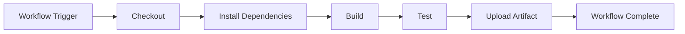

---

## Configuration / Syntax (if applicable)

Example CI workflow

```yaml
name: Build

on:
  push:
    branches:
      - main

jobs:
  build:
    runs-on: ubuntu-latest

    steps:
      - uses: actions/checkout@v4

      - run: npm install

      - run: npm run build

      - run: npm test

      - uses: actions/upload-artifact@v4
        with:
          name: build
          path: dist/
```

---

## Important Commands (if applicable)

Common commands

Node.js

```bash
npm install
npm run build
npm test
```

Java

```bash
mvn clean install
mvn test
```

Python

```bash
pip install -r requirements.txt
pytest
```

.NET

```bash
dotnet restore
dotnet build
dotnet test
```

---

## Important Files (if applicable)

```
.github/
└── workflows/
      build.yml
```

Common project files

```
package.json
package-lock.json
pom.xml
build.gradle
requirements.txt
Dockerfile
```

---

## Real-World Use Cases

- Continuous Integration
- Build verification
- Pull Request validation
- Automated testing
- Release package creation
- Build report generation

---

## Advantages

- Detects errors early
- Improves software quality
- Automates repetitive tasks
- Enables Continuous Integration
- Produces deployment-ready packages

---

## Limitations

- Poorly designed tests increase execution time.
- Build failures stop downstream jobs.
- Large dependency downloads slow workflows without caching.

---

## Common Interview Questions (Concept Only)

- What is Build Automation?
- What is Test Automation?
- What is the normal CI workflow?
- Why run tests before deployment?
- Why publish build artifacts?

---

## Common Mistakes

- Skipping automated tests
- Building before installing dependencies
- Not uploading build artifacts
- Ignoring failed tests
- Missing dependency installation

---

## Troubleshooting

| Problem | Possible Cause | Solution |
|----------|----------------|----------|
| Build failed | Compilation error | Review build logs |
| Tests failed | Code issue | Fix failing tests |
| Dependency installation failed | Missing packages | Verify dependency manager |
| Artifact missing | Wrong upload path | Check artifact configuration |
| Workflow slow | Large dependency downloads | Enable dependency caching |

---

## Summary

Build & Test Automation automatically verifies source code by checking out the repository, installing dependencies, building the application, running tests, and publishing artifacts.

> **Interview Tip**
>
> Every CI pipeline should answer these questions:
>
> - Can the application build successfully?
> - Do all automated tests pass?
> - Is the generated build ready for deployment?

---

# Checkout Repository

## Overview

The **Checkout Repository** step downloads the repository source code onto the GitHub Actions runner.

Without checking out the repository, the workflow cannot access the project's files.

The official action used is:

```yaml
actions/checkout
```

> **Interview Tip**
>
> `actions/checkout` is usually the **first step** in almost every GitHub Actions workflow.

---

## Why It Is Used

Checkout is required to:

- Access source code
- Build the application
- Execute tests
- Read project files
- Generate deployment packages

---

## Architecture / Working

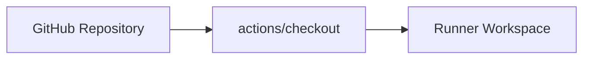

---

## Key Components

| Component | Purpose |
|-----------|----------|
| Repository | Source code |
| Runner | Execution environment |
| Workspace | Local copy of repository |

---

## Types (if applicable)

Common checkout scenarios

- Default checkout
- Checkout specific branch
- Checkout another repository

---

## Lifecycle / Workflow (if applicable)

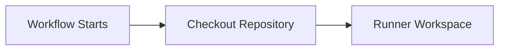

---

## Configuration / Syntax (if applicable)

Basic checkout

```yaml
- uses: actions/checkout@v4
```

Checkout specific branch

```yaml
- uses: actions/checkout@v4
  with:
    ref: main
```

---

## Important Commands (if applicable)

None

---

## Important Files (if applicable)

Repository source code

---

## Real-World Use Cases

- Build applications
- Run tests
- Docker builds
- Terraform deployments

---

## Advantages

- Simple configuration
- Official GitHub Action
- Required for most workflows

---

## Limitations

- Repository must be accessible
- Large repositories increase checkout time

---

## Common Interview Questions (Concept Only)

- Why is `actions/checkout` required?
- What happens if checkout is skipped?

---

## Common Mistakes

- Forgetting checkout
- Wrong branch reference

---

## Troubleshooting

| Problem | Cause | Solution |
|----------|--------|----------|
| Files missing | Checkout skipped | Add checkout step |
| Wrong branch | Incorrect `ref` | Verify branch name |

---

## Summary

Checkout downloads repository code to the runner before build or test execution.

---

# Install Dependencies

## Overview

After checking out the repository, dependencies required by the application are installed.

Examples include:

- Node.js packages
- Maven libraries
- Python packages
- .NET packages

---

## Why It Is Used

Dependency installation ensures the application has all required libraries before building or testing.

---

## Architecture / Working

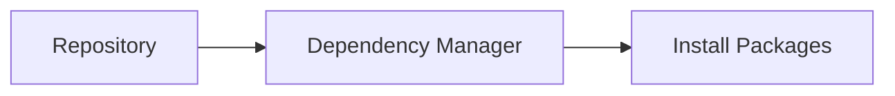

---

## Key Components

| Dependency Manager | Example Command |
|--------------------|-----------------|
| npm | npm install |
| Maven | mvn install |
| pip | pip install |
| NuGet | dotnet restore |

---

## Types (if applicable)

- Node.js
- Java
- Python
- .NET

---

## Lifecycle / Workflow (if applicable)

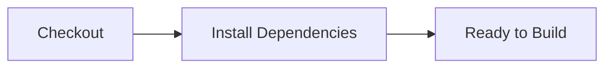

---

## Configuration / Syntax (if applicable)

```yaml
- run: npm install
```

Java

```yaml
- run: mvn install
```

Python

```yaml
- run: pip install -r requirements.txt
```

---

## Important Commands (if applicable)

```bash
npm install
mvn install
pip install
dotnet restore
```

---

## Important Files (if applicable)

```
package.json
pom.xml
requirements.txt
```

---

## Real-World Use Cases

- Install project libraries
- Prepare build environment
- Download dependencies

---

## Advantages

- Reproducible builds
- Automated dependency management

---

## Limitations

- Network dependency
- Large downloads without caching

---

## Common Interview Questions (Concept Only)

- Why install dependencies before building?
- Which dependency managers are commonly used?

---

## Common Mistakes

- Skipping dependency installation
- Missing lock files

---

## Troubleshooting

| Problem | Cause | Solution |
|----------|--------|----------|
| Install failed | Missing package | Verify dependency file |
| Slow installation | No cache | Enable dependency caching |

---

## Summary

Installing dependencies prepares the project for successful builds and testing.

---

# Build Application

## Overview

The Build step compiles or packages the application into deployable output.

The build process depends on the technology stack.

---

## Why It Is Used

Building verifies that the source code compiles successfully and generates deployment-ready artifacts.

---

## Architecture / Working

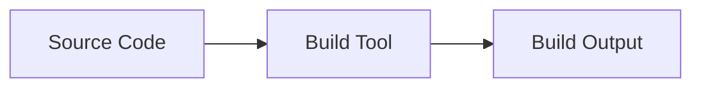

---

## Key Components

| Component | Purpose |
|-----------|----------|
| Source Code | Application |
| Build Tool | Compile/package |
| Output | Executable package |

---

## Types (if applicable)

- Java
- Node.js
- Python
- .NET
- Docker

---

## Lifecycle / Workflow (if applicable)


---

## Configuration / Syntax (if applicable)

```yaml
- run: npm run build
```

Java

```yaml
- run: mvn package
```

.NET

```yaml
- run: dotnet build
```

---

## Important Commands (if applicable)

```bash
npm run build
mvn package
dotnet build
```

---

## Important Files (if applicable)

Project source code

---

## Real-World Use Cases

- Create application package
- Generate Docker image
- Build web application

---

## Advantages

- Detects compilation errors
- Produces deployable artifacts

---

## Limitations

- Build failures stop the workflow

---

## Common Interview Questions (Concept Only)

- What happens during the build stage?
- Why is build automation important?

---

## Common Mistakes

- Running build before installing dependencies

---

## Troubleshooting

| Problem | Cause | Solution |
|----------|--------|----------|
| Compilation failed | Code error | Review build logs |

---

## Summary

The Build stage converts source code into deployable output.

---

# Run Tests

## Overview

Automated tests verify that the application behaves as expected after the build.

Tests execute automatically during CI.

---

## Why It Is Used

Testing ensures new code does not introduce bugs before deployment.

---

## Architecture / Working

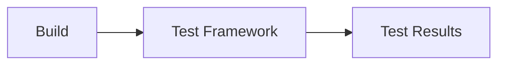

---

## Key Components

| Component | Purpose |
|-----------|----------|
| Test Framework | Executes tests |
| Test Cases | Validate functionality |
| Results | Pass/Fail status |

---

## Types (if applicable)

- Unit Tests
- Integration Tests
- Smoke Tests

---

## Lifecycle / Workflow (if applicable)

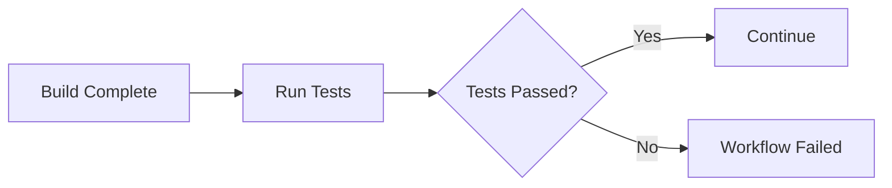

---

## Configuration / Syntax (if applicable)

```yaml
- run: npm test
```

Java

```yaml
- run: mvn test
```

Python

```yaml
- run: pytest
```

---

## Important Commands (if applicable)

```bash
npm test
mvn test
pytest
dotnet test
```

---

## Important Files (if applicable)

Test source code

---

## Real-World Use Cases

- Pull Request validation
- Regression testing
- Quality assurance

---

## Advantages

- Detects bugs early
- Improves software quality

---

## Limitations

- Poor tests reduce reliability
- Long-running test suites slow CI

---

## Common Interview Questions (Concept Only)

- Why run automated tests?
- What happens when tests fail?

---

## Common Mistakes

- Ignoring failed tests
- Running deployment before tests

---

## Troubleshooting

| Problem | Cause | Solution |
|----------|--------|----------|
| Tests failed | Code defect | Fix application or tests |

---

## Summary

Automated tests validate application quality before deployment.

---

# Publish Build Artifacts

## Overview

After a successful build and test, build outputs are uploaded as **Artifacts** so they can be downloaded or used by later workflow jobs.

Artifacts commonly include:

- Compiled binaries
- ZIP packages
- JAR/WAR files
- Test reports
- Coverage reports

---

## Why It Is Used

Publishing artifacts allows workflows to preserve build outputs and reuse them during deployment.

---

## Architecture / Working

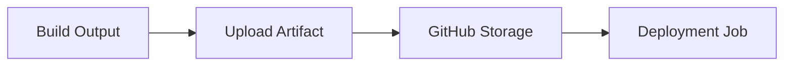

---

## Key Components

| Component | Purpose |
|-----------|----------|
| Artifact | Stored build output |
| Upload Action | Upload files |
| Storage | GitHub artifact storage |

---

## Types (if applicable)

Common artifacts

- Application package
- Test reports
- Logs
- HTML reports

---

## Lifecycle /Workflow (if applicable)

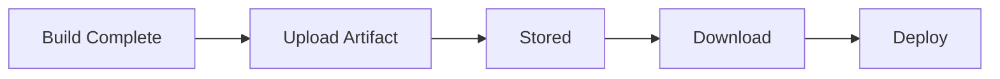

---

## Configuration / Syntax (if applicable)

```yaml
- uses: actions/upload-artifact@v4
  with:
    name: build
    path: dist/
```

---

## Important Commands (if applicable)

None

---

## Important Files (if applicable)

Workflow YAML

---

## Real-World Use Cases

- Share build outputs
- Deploy applications
- Archive reports
- Preserve logs

---

## Advantages

- Easy file sharing
- Persistent workflow outputs
- Supports multi-job pipelines

---

## Limitations

- Artifacts consume storage
- Large artifacts increase upload time

---

## Common Interview Questions (Concept Only)

- Why publish build artifacts?
- What files are commonly uploaded?

---

## Common Mistakes

- Wrong artifact path
- Uploading unnecessary files

---

## Troubleshooting

| Problem | Cause | Solution |
|----------|--------|----------|
| Artifact missing | Incorrect path | Verify upload configuration |
| Empty artifact | Build output not generated | Check build step |

---

## Summary

Publishing Build Artifacts preserves workflow outputs for deployment, debugging, and later workflow stages.

> **Interview Tip**
>
> The standard GitHub Actions CI pipeline is:
>
> **1. Checkout Repository** → Download source code.
>
> **2. Install Dependencies** → Prepare the build environment.
>
> **3. Build Application** → Compile/package the application.
>
> **4. Run Tests** → Validate functionality.
>
> **5. Publish Build Artifacts** → Store deployment-ready outputs for later jobs or releases.
