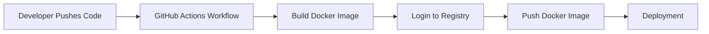
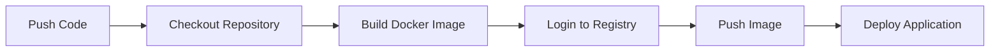
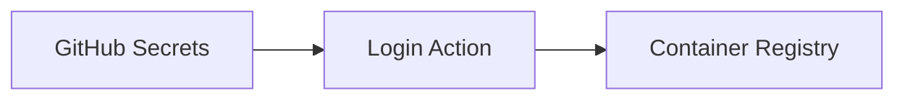
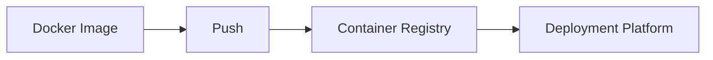
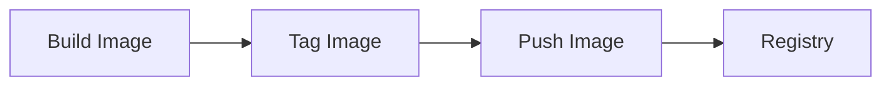

# Docker Integration

## Overview

GitHub Actions integrates seamlessly with Docker, allowing workflows to automatically build, test, and publish Docker images whenever code changes are pushed to a repository.

A typical Docker CI pipeline performs the following tasks:

- Checkout source code
- Build Docker image
- Run tests (optional)
- Authenticate with a container registry
- Push Docker image
- Deploy (optional)

> **Interview Tip**
>
> Docker integration is one of the most common GitHub Actions interview topics. A standard workflow is:
>
> **Checkout → Build Image → Login to Registry → Push Image → Deploy**

---

## Why It Is Used

Docker Integration helps to:

- Automate container image creation
- Maintain consistent application environments
- Publish images to registries
- Simplify Kubernetes deployments
- Enable Continuous Integration and Continuous Delivery (CI/CD)
- Reduce manual deployment effort

---

## Architecture / Working



---

## Key Components

| Component | Purpose |
|-----------|----------|
| Dockerfile | Defines how the image is built |
| Docker Engine | Builds the image |
| Container Registry | Stores Docker images |
| GitHub Actions Runner | Executes workflow |
| Docker Login Action | Authenticates with registry |

---

## Types (if applicable)

Common Container Registries

| Registry | Example |
|-----------|----------|
| Docker Hub | docker.io |
| GitHub Container Registry | ghcr.io |
| Azure Container Registry | ACR |
| Amazon Elastic Container Registry | ECR |
| Google Artifact Registry | GAR |

---

## Lifecycle / Workflow (if applicable)



---

## Configuration / Syntax (if applicable)

Example Workflow

```yaml
name: Docker Build

on:
  push:
    branches:
      - main

jobs:
  docker:
    runs-on: ubuntu-latest

    steps:

      - uses: actions/checkout@v4

      - uses: docker/login-action@v3
        with:
          username: ${{ secrets.DOCKER_USERNAME }}
          password: ${{ secrets.DOCKER_PASSWORD }}

      - uses: docker/build-push-action@v6
        with:
          context: .
          push: true
          tags: username/myapp:latest
```

---

## Important Commands (if applicable)

Docker Build

```bash
docker build -t myapp .
```

Docker Login

```bash
docker login
```

Docker Push

```bash
docker push username/myapp:latest
```

Docker Pull

```bash
docker pull username/myapp:latest
```

List Images

```bash
docker images
```

---

## Important Files (if applicable)

```
.github/
└── workflows/
      docker.yml

Dockerfile

.dockerignore
```

---

## Real-World Use Cases

- Build Docker images automatically
- Push images to Docker Hub
- Publish images to Azure Container Registry
- Push images to Amazon ECR
- Kubernetes deployments
- Microservices CI/CD

---

## Advantages

- Fully automated image creation
- Consistent deployments
- Easy integration with Kubernetes
- Supports multiple registries
- Versioned container images

---

## Limitations

- Docker image builds can be time-consuming.
- Large images increase build and upload time.
- Registry authentication must be configured securely.
- Poorly optimized Dockerfiles slow CI pipelines.

---

## Common Interview Questions (Concept Only)

- How does GitHub Actions integrate with Docker?
- What is the purpose of a Dockerfile?
- Why push Docker images to a registry?
- Which container registries are commonly used?
- How are Docker credentials stored securely?

---

## Common Mistakes

- Forgetting Docker login before pushing images
- Hardcoding registry credentials
- Missing Dockerfile
- Using the `latest` tag for every release
- Building unnecessarily large images
- Not using `.dockerignore`

---

## Troubleshooting

| Problem | Possible Cause | Solution |
|----------|----------------|----------|
| Docker build failed | Dockerfile error | Verify Dockerfile syntax |
| Push denied | Authentication failure | Check registry credentials |
| Image not found | Wrong image tag | Verify image name and tag |
| Docker login failed | Invalid username/password | Update GitHub Secrets |
| Build very slow | Large build context | Use `.dockerignore` and optimize Dockerfile |

---

## Summary

GitHub Actions enables automated Docker image creation, authentication with container registries, and image publishing as part of a CI/CD pipeline.

> **Interview Tip**
>
> The Docker workflow typically follows:
>
> **Checkout → Build Docker Image → Login to Registry → Push Image → Deploy**

---

# Build Docker Images

## Overview

Building a Docker image packages an application and its dependencies into a portable container image.

GitHub Actions commonly uses the official Docker Build Action:

```yaml
docker/build-push-action
```

---

## Why It Is Used

Building Docker images:

- Creates portable application packages
- Ensures consistent runtime environments
- Produces deployment-ready artifacts
- Simplifies container orchestration

---

## Architecture / Working


---

## Key Components

| Component | Purpose |
|-----------|----------|
| Dockerfile | Build instructions |
| Build Context | Source files |
| Docker Engine | Creates image |
| Image Tag | Image version |

---

## Types (if applicable)

Common image tags

- latest
- v1.0
- v2.0
- commit SHA
- release tag

---

## Lifecycle / Workflow (if applicable)


---

## Configuration / Syntax (if applicable)

```yaml
- uses: docker/build-push-action@v6
  with:
    context: .
    push: false
    tags: myapp:latest
```

---

## Important Commands (if applicable)

```bash
docker build -t myapp .
docker images
```

---

## Important Files (if applicable)

```
Dockerfile
.dockerignore
```

---

## Real-World Use Cases

- CI builds
- Microservices
- Kubernetes deployments

---

## Advantages

- Consistent application packaging
- Portable deployments
- Easy versioning

---

## Limitations

- Large images slow builds
- Poor Dockerfile design impacts performance

---

## Common Interview Questions (Concept Only)

- What is Docker image build?
- Why is a Dockerfile required?
- What is build context?

---

## Common Mistakes

- Missing Dockerfile
- Incorrect image tags
- Large build context

---

## Troubleshooting

| Problem | Cause | Solution |
|----------|--------|----------|
| Build failed | Dockerfile issue | Validate Dockerfile |
| Image too large | Unoptimized Dockerfile | Reduce layers and use `.dockerignore` |

---

## Summary

The Build step converts application source code into a reusable Docker image.

---

# Login to Container Registry

## Overview

Before pushing Docker images, GitHub Actions must authenticate with a container registry.

Authentication is typically handled using:

```yaml
docker/login-action
```

Credentials should always be stored as GitHub Secrets.

---

## Why It Is Used

Registry login allows:

- Secure authentication
- Image push operations
- Image pull operations
- Private registry access

---

## Architecture / Working



---

## Key Components

| Component | Purpose |
|-----------|----------|
| Registry | Stores images |
| Username | Authentication |
| Password/Token | Authentication |
| GitHub Secrets | Secure credential storage |

---

## Types (if applicable)

Supported registries

- Docker Hub
- GitHub Container Registry
- Azure Container Registry
- Amazon ECR
- Google Artifact Registry

---

## Lifecycle / Workflow (if applicable)


---

## Configuration / Syntax (if applicable)

```yaml
- uses: docker/login-action@v3
  with:
    username: ${{ secrets.DOCKER_USERNAME }}
    password: ${{ secrets.DOCKER_PASSWORD }}
```

---

## Important Commands (if applicable)

```bash
docker login
docker logout
```

---

## Important Files (if applicable)

Workflow YAML

---

## Real-World Use Cases

- Docker Hub authentication
- Azure Container Registry login
- Amazon ECR login
- GitHub Container Registry login

---

## Advantages

- Secure authentication
- Supports multiple registries
- Uses encrypted secrets

---

## Limitations

- Credentials must be managed securely
- Expired tokens cause authentication failures

---

## Common Interview Questions (Concept Only)

- Why is Docker login required?
- Where should registry credentials be stored?
- What action performs registry login?

---

## Common Mistakes

- Hardcoding passwords
- Using personal credentials in workflows
- Expired access tokens

---

## Troubleshooting

| Problem | Cause | Solution |
|----------|--------|----------|
| Login failed | Wrong credentials | Update GitHub Secrets |
| Unauthorized | Token expired | Generate new token |

---

## Summary

Logging in to the container registry securely authenticates GitHub Actions before pushing or pulling images.

---

# Push Docker Images

## Overview

After building an image, GitHub Actions uploads it to a container registry where it can be used for deployments.

The push operation makes the image available to Kubernetes, Docker Swarm, Azure App Service, and other deployment platforms.

---

## Why It Is Used

Image push enables:

- Centralized image storage
- Deployment automation
- Image versioning
- Rollbacks
- Sharing images across environments

---

## Architecture / Working



---

## Key Components

| Component | Purpose |
|-----------|----------|
| Image | Built application |
| Registry | Stores image |
| Tag | Image version |

---

## Types (if applicable)

Common tags

- latest
- release
- v1.0
- commit SHA

---

## Lifecycle / Workflow (if applicable)



---

## Configuration / Syntax (if applicable)

```yaml
- uses: docker/build-push-action@v6
  with:
    push: true
    tags: username/myapp:latest
```

---

## Important Commands (if applicable)

```bash
docker push username/myapp:latest
docker pull username/myapp:latest
```

---

## Important Files (if applicable)

Dockerfile

Workflow YAML

---

## Real-World Use Cases

- Kubernetes deployment
- Azure Container Apps
- Azure Kubernetes Service (AKS)
- Amazon ECS
- Amazon EKS
- Docker Swarm

---

## Advantages

- Centralized image repository
- Easy deployments
- Version-controlled releases
- Supports rollbacks

---

## Limitations

- Large image uploads take longer
- Registry storage limits may apply

---

## Common Interview Questions (Concept Only)

- Why push Docker images?
- What registries are commonly used?
- What happens if image tags conflict?
- Why should images be versioned?

---

## Common Mistakes

- Pushing without logging in
- Reusing `latest` for every release
- Incorrect repository name
- Missing image tags

---

## Troubleshooting

| Problem | Cause | Solution |
|----------|--------|----------|
| Push denied | Authentication failure | Login again |
| Repository not found | Wrong image name | Verify repository path |
| Tag not found | Image not built | Build image before push |

---

## Summary

Pushing Docker images publishes container images to a registry, making them available for deployment across development, staging, and production environments.

> **Interview Tip**
>
> A production-ready Docker CI/CD pipeline usually follows this order:
>
> 1. Checkout Repository
> 2. Build Docker Image
> 3. Login to Container Registry
> 4. Push Docker Image
> 5. Deploy to Kubernetes, Docker, or Cloud Services
