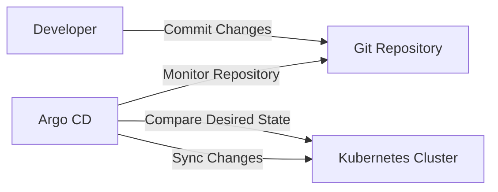
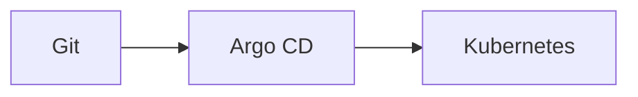
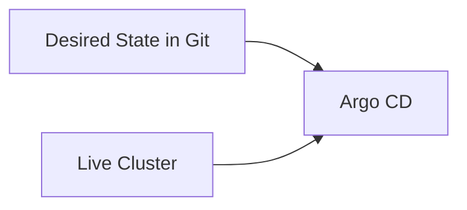
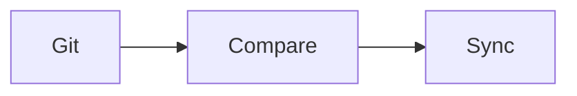
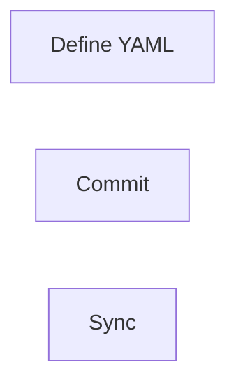
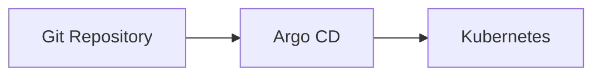
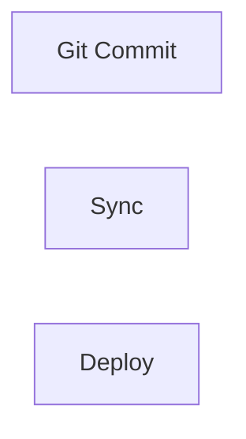
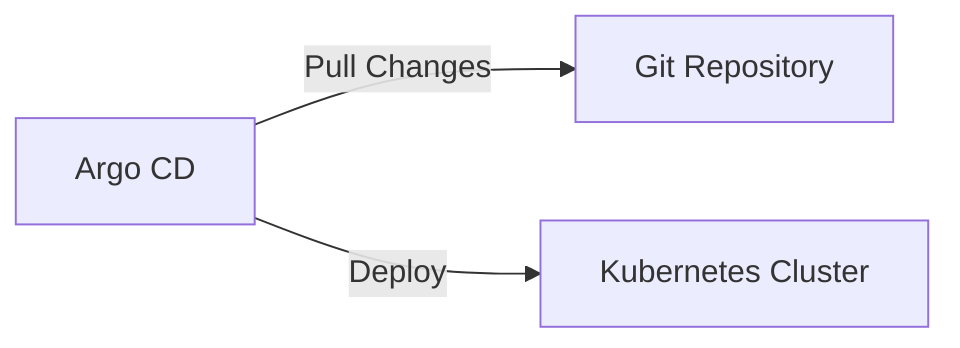

# GitOps Fundamentals

## Overview

GitOps is an operational framework that uses **Git as the single source of truth** for managing infrastructure and application deployments. Instead of manually deploying applications, GitOps continuously synchronizes the actual state of the environment with the desired state defined in Git.

Argo CD is one of the most popular GitOps tools for Kubernetes.

> **Interview Tip**
>
> GitOps = **Git + Declarative Configuration + Automated Reconciliation**

---

## Why It Is Used

GitOps helps to:

- Automate Kubernetes deployments
- Maintain consistent environments
- Enable version-controlled infrastructure
- Simplify rollbacks
- Improve security and auditability
- Eliminate manual configuration drift
- Support Continuous Delivery

---

## Architecture / Working



---

## Key Components

| Component | Purpose |
|-----------|----------|
| Git Repository | Stores application manifests |
| Desired State | Target configuration stored in Git |
| Argo CD | GitOps controller |
| Kubernetes Cluster | Deployment target |
| Synchronization | Matches cluster to Git |
| Declarative Manifests | Define application resources |

---

## Types (if applicable)

GitOps deployment models

| Model | Description |
|--------|-------------|
| Pull-Based | Cluster pulls changes from Git (Argo CD) |
| Push-Based | CI/CD pipeline pushes changes to cluster |

> **Interview Tip**
>
> Argo CD uses the **Pull-Based** deployment model.

---

## Lifecycle / Workflow (if applicable)


---

## Configuration / Syntax (if applicable)

Example Kubernetes Deployment

```yaml
apiVersion: apps/v1
kind: Deployment
metadata:
  name: nginx

spec:
  replicas: 2

  selector:
    matchLabels:
      app: nginx

  template:
    metadata:
      labels:
        app: nginx

    spec:
      containers:
      - name: nginx
        image: nginx:latest
```

---

## Important Commands (if applicable)

Git commands

```bash
git add .

git commit -m "Update deployment"

git push
```

Argo CD CLI

```bash
argocd app list

argocd app sync

argocd app get
```

---

## Important Files (if applicable)

```
repository/

├── manifests/
│   ├── deployment.yaml
│   ├── service.yaml
│   └── ingress.yaml

└── kustomization.yaml
```

---

## Real-World Use Cases

- Kubernetes application deployment
- Multi-cluster management
- Infrastructure management
- Production deployments
- Disaster recovery
- Continuous Delivery

---

## Advantages

- Version-controlled deployments
- Easy rollback
- Automated synchronization
- Improved auditing
- Reduced manual changes
- Prevents configuration drift
- Better collaboration

---

## Limitations

- Kubernetes-focused
- Git repository must remain accurate
- Requires Git discipline
- Initial setup can be complex

---

## Common Interview Questions (Concept Only)

- What is GitOps?
- Why is Git the source of truth?
- What problem does GitOps solve?
- How does GitOps differ from traditional CI/CD?
- What is configuration drift?

---

## Common Mistakes

- Editing Kubernetes resources manually
- Storing invalid manifests in Git
- Bypassing Git workflow
- Ignoring synchronization status
- Mixing manual and Git-managed changes

---

## Troubleshooting

| Problem | Possible Cause | Solution |
|----------|----------------|----------|
| Cluster differs from Git | Manual changes | Sync application |
| Application not updating | Git change not detected | Verify repository and branch |
| Sync failed | Invalid manifest | Validate YAML |
| Configuration drift | Manual resource edits | Restore desired state from Git |

---

## Summary

GitOps is a deployment methodology that uses Git as the single source of truth and continuously reconciles Kubernetes resources with declarative configuration stored in Git.

> **Interview Tip**
>
> Remember the GitOps workflow:
>
> **Git Commit → Argo CD Detects Change → Compare State → Sync Cluster**

---

# GitOps Concepts

## Overview

GitOps is based on four core principles:

- Declarative configuration
- Version control
- Automated reconciliation
- Continuous synchronization

Instead of manually applying changes, all infrastructure and application updates are made through Git.

---

## Why It Is Used

GitOps concepts help to:

- Automate deployments
- Improve consistency
- Enable Git-based collaboration
- Maintain audit history

---

## Architecture / Working



---

## Key Components

| Concept | Description |
|----------|-------------|
| Git | Source of truth |
| Desired State | Target configuration |
| Live State | Current cluster state |
| Reconciliation | Aligns live state with Git |

---

## Types (if applicable)

Core concepts

- Desired State
- Live State
- Synchronization
- Reconciliation

---

## Lifecycle / Workflow (if applicable)


---

## Configuration / Syntax (if applicable)

Git stores Kubernetes YAML manifests.

---

## Important Commands (if applicable)

```bash
git commit

git push
```

---

## Important Files (if applicable)

```
deployment.yaml
service.yaml
```

---

## Real-World Use Cases

- Kubernetes deployments
- Configuration management
- Infrastructure automation

---

## Advantages

- Reliable deployments
- Version control
- Easy rollback

---

## Limitations

- Git workflow required

---

## Common Interview Questions (Concept Only)

- What are GitOps principles?
- What is reconciliation?

---

## Common Mistakes

- Manual Kubernetes edits

---

## Troubleshooting

- Verify Git repository
- Validate manifests

---

## Summary

GitOps revolves around Git-driven automation and continuous reconciliation.

---

# Desired State

## Overview

Desired State is the expected configuration of an application or infrastructure stored in Git.

It defines:

- Number of replicas
- Container images
- Services
- ConfigMaps
- Secrets
- Ingress rules

Argo CD continuously compares the desired state with the live cluster state.

---

## Why It Is Used

Desired State ensures:

- Predictable deployments
- Automatic recovery
- Consistency across environments

---

## Architecture / Working



---

## Key Components

| Component | Purpose |
|-----------|----------|
| Git | Stores desired state |
| Cluster | Current state |
| Sync | Aligns states |

---

## Types (if applicable)

- Application desired state
- Infrastructure desired state

---

## Lifecycle / Workflow (if applicable)



---

## Configuration / Syntax (if applicable)

Desired state example

```yaml
replicas: 3
```

---

## Important Commands (if applicable)

```bash
argocd app diff
```

---

## Important Files (if applicable)

Deployment YAML

---

## Real-World Use Cases

- Scaling applications
- Updating images
- Rolling deployments

---

## Advantages

- Automated reconciliation
- Predictable infrastructure

---

## Limitations

- Git must remain updated

---

## Common Interview Questions (Concept Only)

- What is desired state?
- How does Argo CD use desired state?

---

## Common Mistakes

- Editing live cluster directly

---

## Troubleshooting

- Compare Git and cluster state

---

## Summary

Desired State represents the configuration that should exist in the Kubernetes cluster.

---

# Declarative Configuration

## Overview

Declarative configuration describes **what the system should look like**, rather than the steps required to create it.

Kubernetes manifests are declarative.

---

## Why It Is Used

- Easier management
- Repeatable deployments
- Version control
- Automation

---

## Architecture / Working


---

## Key Components

| Component | Description |
|-----------|-------------|
| YAML | Desired configuration |
| Kubernetes | Applies configuration |

---

## Types (if applicable)

- Deployment
- Service
- ConfigMap
- Secret
- Ingress

---

## Lifecycle / Workflow (if applicable)



---

## Configuration / Syntax (if applicable)

```yaml
replicas: 2
```

---

## Important Commands (if applicable)

```bash
kubectl apply -f deployment.yaml
```

---

## Important Files (if applicable)

```
deployment.yaml
```

---

## Real-World Use Cases

- Kubernetes deployments
- Infrastructure automation

---

## Advantages

- Easy rollback
- Version control

---

## Limitations

- YAML syntax errors

---

## Common Interview Questions (Concept Only)

- What is declarative configuration?
- Declarative vs imperative?

---

## Common Mistakes

- Mixing imperative and declarative changes

---

## Troubleshooting

- Validate YAML

---

## Summary

Declarative configuration defines the desired system state instead of deployment steps.

---

# Git as Source of Truth

## Overview

Git acts as the authoritative source for all Kubernetes configuration.

Every deployment originates from Git.

No manual cluster modifications should occur.

---

## Why It Is Used

- Centralized management
- Audit history
- Version control
- Rollback capability

---

## Architecture / Working



---

## Key Components

- Git repository
- Commit history
- Branches
- Pull requests

---

## Types (if applicable)

Single Git repository

Multiple Git repositories

---

## Lifecycle / Workflow (if applicable)



---

## Configuration / Syntax (if applicable)

Git commit

```bash
git commit -m "Update deployment"
```

---

## Important Commands (if applicable)

```bash
git push
```

---

## Important Files (if applicable)

Repository manifests

---

## Real-World Use Cases

- Infrastructure management
- Multi-environment deployments

---

## Advantages

- Full audit trail
- Easy rollback

---

## Limitations

- Requires Git workflow discipline

---

## Common Interview Questions (Concept Only)

- Why is Git the source of truth?
- Can Argo CD work without Git?

---

## Common Mistakes

- Manual kubectl updates

---

## Troubleshooting

- Verify Git branch

---

## Summary

Git is the single authoritative source for Kubernetes deployments in GitOps.

---

# Pull-Based Deployment

## Overview

Pull-Based Deployment means the Kubernetes cluster continuously **pulls** deployment changes from Git rather than receiving deployments pushed by a CI/CD pipeline.

Argo CD periodically checks Git for updates and synchronizes changes automatically.

> **Interview Tip**
>
> **Argo CD uses Pull-Based Deployment. Jenkins and many traditional CI/CD tools commonly use Push-Based Deployment.**

---

## Why It Is Used

- Improves security
- Reduces cluster exposure
- Enables continuous reconciliation
- Simplifies multi-cluster deployments

---

## Architecture / Working



---

## Key Components

| Component | Purpose |
|-----------|----------|
| Git | Stores desired state |
| Argo CD | Pulls changes |
| Cluster | Applies updates |

---

## Types (if applicable)

| Model | Description |
|--------|-------------|
| Pull-Based | Cluster retrieves changes from Git |
| Push-Based | CI/CD pushes changes to cluster |

---

## Lifecycle / Workflow (if applicable)


---

## Configuration / Syntax (if applicable)

Configured in the Argo CD Application resource using:

- Repository URL
- Target Revision
- Path
- Sync Policy

---

## Important Commands (if applicable)

```bash
argocd app sync

argocd app get

argocd app diff
```

---

## Important Files (if applicable)

```
application.yaml
deployment.yaml
service.yaml
```

---

## Real-World Use Cases

- Production Kubernetes deployments
- Multi-cluster GitOps
- Secure enterprise deployments
- Continuous Delivery

---

## Advantages

- More secure than push-based deployments
- No inbound cluster access required
- Automatic reconciliation
- Easier auditing
- Supports GitOps workflows

---

## Limitations

- Requires Git repository availability
- Synchronization interval may introduce slight deployment delay

---

## Common Interview Questions (Concept Only)

- What is Pull-Based Deployment?
- Why does Argo CD use Pull-Based Deployment?
- Pull-Based vs Push-Based deployment?
- What are the security benefits of Pull-Based deployment?

---

## Common Mistakes

- Assuming CI/CD directly deploys to Kubernetes
- Mixing manual deployments with GitOps-managed resources
- Forgetting to synchronize after Git changes

---

## Troubleshooting

| Problem | Solution |
|----------|----------|
| Changes not deployed | Verify Git commit and branch |
| Sync not occurring | Check application sync status |
| Cluster differs from Git | Perform application synchronization |
| Deployment delayed | Verify repository polling and sync settings |

---

## Summary

Pull-Based Deployment is the core deployment model used by Argo CD. It continuously monitors Git for changes, compares the desired state with the live cluster state, and automatically synchronizes Kubernetes resources.

> **Interview Tip**
>
> Remember these key differences:
>
> | Feature | Pull-Based | Push-Based |
> |---------|------------|------------|
> | Deployment Initiator | Argo CD | CI/CD Pipeline |
> | Git Required | Yes | Optional |
> | Continuous Reconciliation | Yes | No |
> | Security | Higher | Lower |
> | Example | Argo CD | Jenkins, Azure DevOps, GitHub Actions |
>
> **One-line Interview Answer:**  
> **GitOps uses Git as the source of truth, declarative configuration to define the desired state, and pull-based deployment to continuously reconcile Kubernetes clusters with Git.**
