# Argo CD Fundamentals

## Overview

Argo CD is a **declarative GitOps Continuous Delivery (CD) tool** for Kubernetes. It continuously monitors Git repositories and automatically synchronizes Kubernetes clusters to match the desired state stored in Git.

Instead of manually applying Kubernetes manifests using `kubectl`, Argo CD deploys and manages applications by comparing the desired state in Git with the live state in the Kubernetes cluster.

> **Interview Tip**
>
> Argo CD is **only a Continuous Delivery (CD) tool**, not a Continuous Integration (CI) tool.
>
> Typical pipeline:
>
> **GitHub Actions / Jenkins → Build & Test → Push Image → Update Git → Argo CD Deploys**

---

## Why It Is Used

Argo CD is used to:

- Implement GitOps practices
- Automate Kubernetes deployments
- Reduce manual deployment errors
- Continuously synchronize clusters
- Detect and fix configuration drift
- Roll back applications easily
- Manage multiple Kubernetes clusters

---

## Architecture / Working

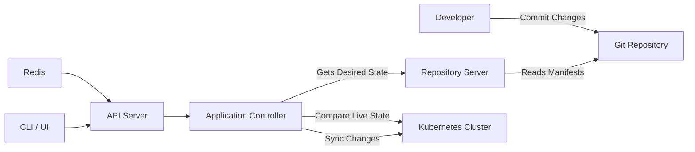

---

## Key Components

| Component | Purpose |
|-----------|----------|
| API Server | Provides REST API, CLI, and Web UI |
| Repository Server | Retrieves manifests from Git |
| Application Controller | Compares and synchronizes desired state |
| Redis | Caches application information |
| Kubernetes Cluster | Deployment target |
| CLI | Command-line management |
| Web UI | Graphical application management |

---

## Types (if applicable)

Deployment synchronization modes

| Mode | Description |
|------|-------------|
| Manual Sync | User manually triggers deployment |
| Automatic Sync | Argo CD automatically deploys changes |

---

## Lifecycle / Workflow (if applicable)

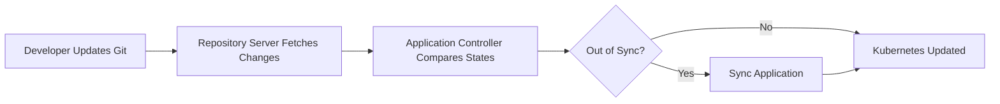

---

## Configuration / Syntax (if applicable)

Example Application resource

```yaml
apiVersion: argoproj.io/v1alpha1
kind: Application
metadata:
  name: nginx

spec:
  project: default

  source:
    repoURL: https://github.com/example/repository.git
    targetRevision: main
    path: manifests

  destination:
    server: https://kubernetes.default.svc
    namespace: default

  syncPolicy:
    automated: {}
```

---

## Important Commands (if applicable)

```bash
argocd login

argocd app list

argocd app get <application-name>

argocd app sync <application-name>

argocd app diff <application-name>

argocd app delete <application-name>

argocd cluster list

argocd repo list
```

---

## Important Files (if applicable)

```
Git Repository

├── manifests/
│   ├── deployment.yaml
│   ├── service.yaml
│   └── ingress.yaml
│
└── application.yaml
```

---

## Real-World Use Cases

- Kubernetes application deployment
- Multi-cluster management
- Production Continuous Delivery
- Disaster recovery
- Blue-Green deployments
- Canary deployments
- Infrastructure management using GitOps

---

## Advantages

- GitOps-based deployment
- Automated synchronization
- Easy rollback
- Continuous drift detection
- Kubernetes-native
- Multi-cluster support
- Declarative deployments

---

## Limitations

- Works only with Kubernetes
- Requires Git repository availability
- Initial configuration is more complex than traditional deployments
- Does not replace CI tools

---

## Common Interview Questions (Concept Only)

- What is Argo CD?
- Is Argo CD a CI or CD tool?
- What problem does Argo CD solve?
- How does Argo CD implement GitOps?
- What is configuration drift?
- How does Argo CD detect changes?

---

## Common Mistakes

- Treating Argo CD as a CI tool
- Editing Kubernetes resources manually
- Forgetting to commit configuration changes to Git
- Mixing manual deployments with GitOps deployments
- Ignoring OutOfSync status

---

## Troubleshooting

| Problem | Possible Cause | Solution |
|----------|----------------|----------|
| Application OutOfSync | Cluster differs from Git | Sync application |
| Sync failed | Invalid manifest | Validate YAML |
| Repository not accessible | Git credentials incorrect | Verify repository configuration |
| Application not updating | Git branch incorrect | Verify target revision |
| Resource missing | Incorrect manifest path | Check repository path |

---

## Summary

Argo CD continuously compares the desired state stored in Git with the live state of the Kubernetes cluster and synchronizes them automatically.

> **Interview Tip**
>
> Remember the deployment flow:
>
> **Git Commit → Repository Server → Application Controller → Kubernetes Cluster**

---

# What is Argo CD

## Overview

Argo CD is an **open-source GitOps Continuous Delivery tool** designed specifically for Kubernetes.

It watches Git repositories for changes and deploys them automatically to Kubernetes clusters.

---

## Why It Is Used

- Automate Kubernetes deployments
- Implement GitOps
- Maintain cluster consistency
- Enable continuous delivery

---

## Architecture / Working

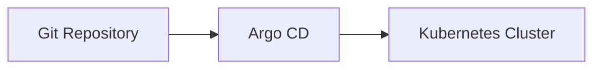

---

## Key Components

| Component | Purpose |
|-----------|----------|
| Git | Source of truth |
| Argo CD | Deployment engine |
| Kubernetes | Target platform |

---

## Types (if applicable)

- Manual Sync
- Automatic Sync

---

## Lifecycle / Workflow (if applicable)

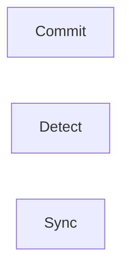

---

## Configuration / Syntax (if applicable)

Application YAML

---

## Important Commands (if applicable)

```bash
argocd app list
```

---

## Important Files (if applicable)

```
application.yaml
```

---

## Real-World Use Cases

- Continuous Delivery
- GitOps
- Kubernetes deployments

---

## Advantages

- Automated deployment
- Version controlled
- Easy rollback

---

## Limitations

- Kubernetes only

---

## Common Interview Questions (Concept Only)

- What is Argo CD?
- Why is Argo CD used?

---

## Common Mistakes

- Using Argo CD for CI

---

## Troubleshooting

- Verify Git repository

---

## Summary

Argo CD is a GitOps Continuous Delivery platform for Kubernetes.

---

# Argo CD Architecture

## Overview

Argo CD consists of several components that work together to continuously synchronize Kubernetes clusters with Git.

---

## Why It Is Used

The architecture provides:

- High availability
- Separation of responsibilities
- Scalable deployments
- Efficient synchronization

---

## Architecture / Working

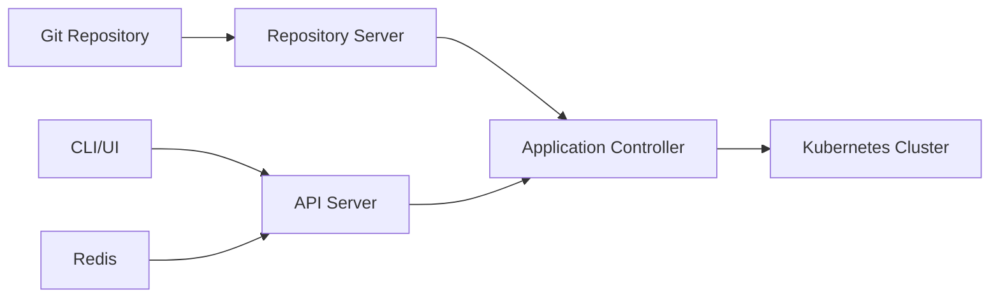

---

## Key Components

| Component | Responsibility |
|-----------|----------------|
| API Server | REST API |
| Repository Server | Git operations |
| Controller | Synchronization |
| Redis | Cache |
| CLI/UI | User interaction |

---

## Types (if applicable)

Core services

---

## Lifecycle / Workflow (if applicable)

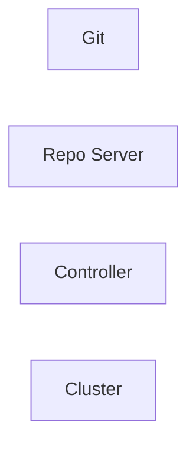

---

## Configuration / Syntax (if applicable)

Configured during installation.

---

## Important Commands (if applicable)

```bash
kubectl get pods -n argocd
```

---

## Important Files (if applicable)

```
install.yaml
```

---

## Real-World Use Cases

- Enterprise Kubernetes
- Multi-cluster GitOps

---

## Advantages

- Modular architecture
- Scalable

---

## Limitations

- Multiple components to manage

---

## Common Interview Questions (Concept Only)

- Explain Argo CD architecture.
- What are the core components?

---

## Common Mistakes

- Confusing component responsibilities

---

## Troubleshooting

- Check component pods

---

## Summary

Argo CD architecture separates Git access, synchronization, API management, and caching into dedicated services.

---

# API Server

## Overview

The API Server is the central communication point of Argo CD.

It provides:

- REST API
- Web UI
- CLI interface
- Authentication
- Authorization

---

## Why It Is Used

- Accept user requests
- Authenticate users
- Manage applications
- Expose APIs

---

## Architecture / Working

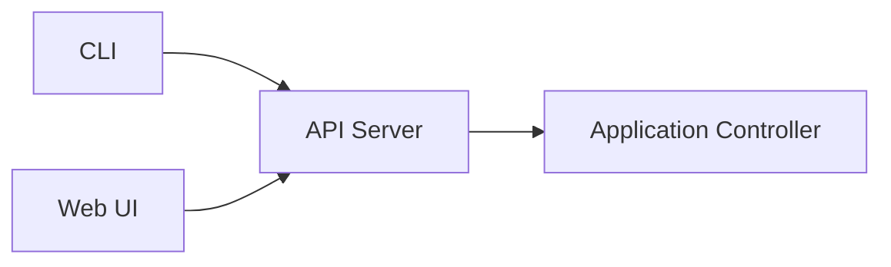

---

## Key Components

- REST API
- Authentication
- RBAC
- Session management

---

## Types (if applicable)

API interfaces

- REST
- gRPC

---

## Lifecycle / Workflow (if applicable)

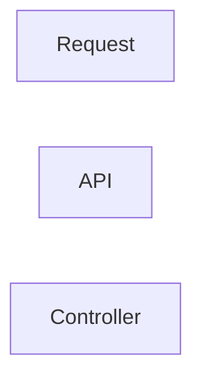

---

## Configuration / Syntax (if applicable)

No user configuration required for normal operations.

---

## Important Commands (if applicable)

```bash
argocd login
```

---

## Important Files (if applicable)

Server deployment manifest

---

## Real-World Use Cases

- UI login
- CLI operations
- API integrations

---

## Advantages

- Centralized management

---

## Limitations

- API unavailable if server is down

---

## Common Interview Questions (Concept Only)

- What is the API Server?
- What services does it provide?

---

## Common Mistakes

- Assuming controller communicates directly with users

---

## Troubleshooting

- Verify API Server pod

---

## Summary

The API Server manages all user interactions with Argo CD.

---

# Repository Server

## Overview

The Repository Server connects to Git repositories and retrieves Kubernetes manifests, Helm charts, or Kustomize configurations.

---

## Why It Is Used

- Clone repositories
- Read manifests
- Generate Kubernetes resources

---

## Architecture / Working

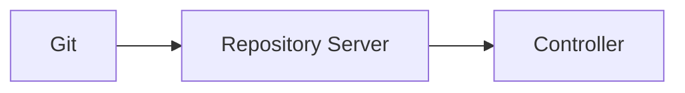

---

## Key Components

- Git client
- Manifest generation
- Repository cache

---

## Types (if applicable)

Supports

- Git
- Helm
- Kustomize

---

## Lifecycle / Workflow (if applicable)

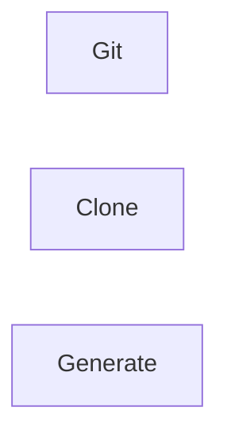

---

## Configuration / Syntax (if applicable)

Repository configured in Argo CD.

---

## Important Commands (if applicable)

```bash
argocd repo list
```

---

## Important Files (if applicable)

Git manifests

---

## Real-World Use Cases

- GitOps deployments

---

## Advantages

- Supports multiple configuration formats

---

## Limitations

- Depends on repository availability

---

## Common Interview Questions (Concept Only)

- What does the Repository Server do?

---

## Common Mistakes

- Incorrect repository credentials

---

## Troubleshooting

- Verify Git access

---

## Summary

The Repository Server retrieves deployment configurations from Git.

---

# Application Controller

## Overview

The Application Controller is the core component responsible for continuously comparing the desired state with the live cluster state.

---

## Why It Is Used

- Detect drift
- Synchronize applications
- Maintain desired state

---

## Architecture / Working

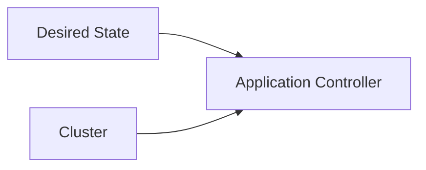

---

## Key Components

- Comparison engine
- Synchronization engine

---

## Types (if applicable)

- Manual Sync
- Auto Sync

---

## Lifecycle / Workflow (if applicable)

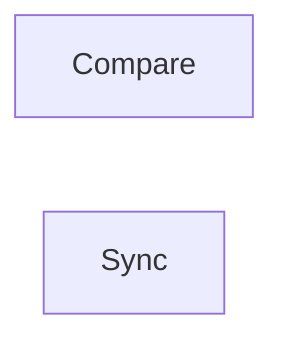

---

## Configuration / Syntax (if applicable)

Configured in Application resource.

---

## Important Commands (if applicable)

```bash
argocd app sync
```

---

## Important Files (if applicable)

Application manifest

---

## Real-World Use Cases

- Automatic deployments
- Drift correction

---

## Advantages

- Continuous reconciliation

---

## Limitations

- Requires cluster connectivity

---

## Common Interview Questions (Concept Only)

- What is the Application Controller?

---

## Common Mistakes

- Disabling synchronization

---

## Troubleshooting

- Verify controller pod

---

## Summary

The Application Controller performs reconciliation between Git and Kubernetes.

---

# Redis

## Overview

Redis is used as an **in-memory cache** by Argo CD.

It improves performance by caching application metadata and reducing repeated repository operations.

---

## Why It Is Used

- Faster responses
- Reduced Git access
- Improved performance

---

## Architecture / Working

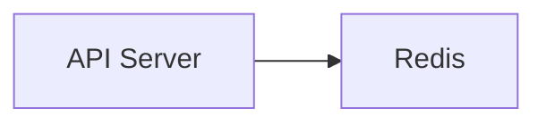

---

## Key Components

- In-memory cache

---

## Types (if applicable)

Internal cache

---

## Lifecycle / Workflow (if applicable)

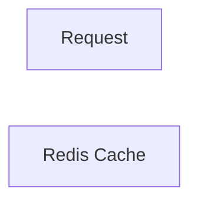

---

## Configuration / Syntax (if applicable)

Automatically configured.

---

## Important Commands (if applicable)

```bash
kubectl get pods -n argocd
```

---

## Important Files (if applicable)

Redis deployment

---

## Real-World Use Cases

- Large enterprise deployments

---

## Advantages

- Fast cache
- Reduced latency

---

## Limitations

- Cached data is temporary

---

## Common Interview Questions (Concept Only)

- Why does Argo CD use Redis?

---

## Common Mistakes

- Assuming Redis stores Kubernetes manifests

---

## Troubleshooting

- Verify Redis pod status

---

## Summary

Redis provides caching to improve Argo CD performance.

---

# CLI & UI

## Overview

Argo CD provides both a **Command Line Interface (CLI)** and a **Web User Interface (UI)** for managing applications.

Both communicate with the API Server.

---

## Why It Is Used

- Manage applications
- View synchronization status
- Trigger deployments
- Monitor health

---

## Architecture / Working

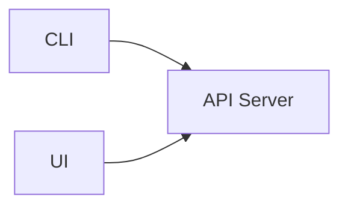

---

## Key Components

| Component | Purpose |
|-----------|----------|
| CLI | Command-line management |
| UI | Web management |
| API | Backend services |

---

## Types (if applicable)

- CLI
- Browser UI

---

## Lifecycle / Workflow (if applicable)

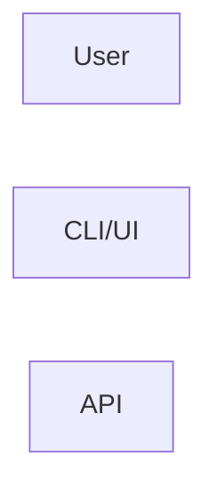

---

## Configuration / Syntax (if applicable)

Login

```bash
argocd login <server>
```

---

## Important Commands (if applicable)

```bash
argocd app list

argocd app sync

argocd app get

argocd app delete
```

---

## Important Files (if applicable)

None

---

## Real-World Use Cases

- Monitor deployments
- Manual synchronization
- Troubleshooting

---

## Advantages

- Easy management
- Visual monitoring
- CLI automation

---

## Limitations

- Requires API Server availability

---

## Common Interview Questions (Concept Only)

- What is the difference between CLI and UI?
- How does the CLI communicate with Argo CD?

---

## Common Mistakes

- Using outdated CLI versions

---

## Troubleshooting

- Verify API connectivity
- Check authentication

---

## Summary

The CLI and Web UI provide user-friendly interfaces for interacting with Argo CD, both relying on the API Server for application management.

> **Interview Tip**
>
> Remember the responsibilities of each core component:
>
> | Component | Responsibility |
> |-----------|----------------|
> | API Server | REST API, CLI, UI, Authentication |
> | Repository Server | Fetches manifests from Git |
> | Application Controller | Compares desired and live state, performs synchronization |
> | Redis | Caches application metadata |
> | CLI/UI | User interaction with Argo CD |
