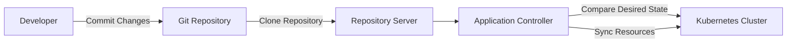
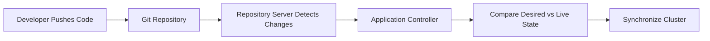
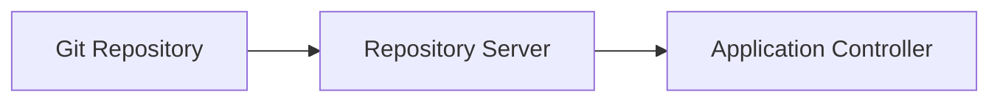
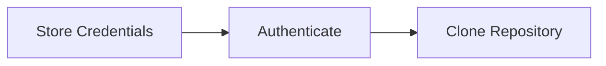
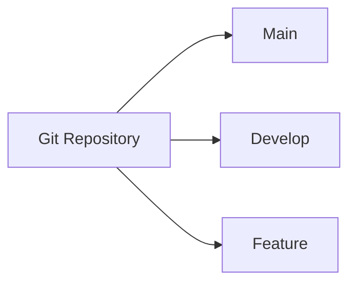
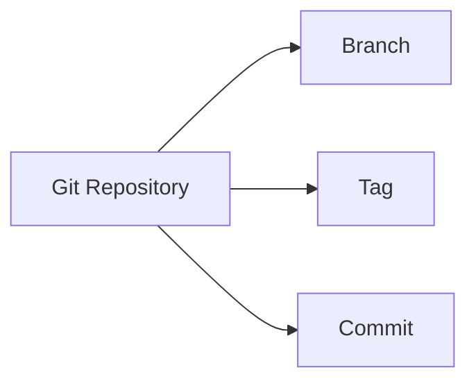

# Git Repository Integration

## Overview

Git Repository Integration is the process of connecting Argo CD to a Git repository that contains Kubernetes manifests, Helm charts, or Kustomize configurations.

Argo CD continuously monitors the configured Git repository and synchronizes the Kubernetes cluster with the desired state stored in Git.

> **Interview Tip**
>
> Git is the **Single Source of Truth** in GitOps. Argo CD does **not** deploy from a developer's local machine—it always deploys from Git.

---

## Why It Is Used

Git Repository Integration enables Argo CD to:

- Implement GitOps workflows
- Automatically detect configuration changes
- Deploy Kubernetes applications
- Maintain version-controlled infrastructure
- Support rollback using Git history
- Synchronize multiple environments

---

## Architecture / Working



---

## Key Components

| Component | Purpose |
|-----------|----------|
| Git Repository | Stores Kubernetes manifests |
| Repository Server | Reads repository contents |
| Application Controller | Compares Git with cluster |
| Repository Credentials | Authenticates Git access |
| Target Revision | Defines branch/tag/commit |
| Path | Specifies manifest location |

---

## Types (if applicable)

Supported repository types

| Repository Type | Supported |
|-----------------|-----------|
| GitHub | Yes |
| GitLab | Yes |
| Azure Repos | Yes |
| Bitbucket | Yes |
| Helm Repository | Yes |
| OCI Helm Registry | Yes |

Authentication methods

| Method | Common Usage |
|---------|--------------|
| HTTPS + Username/PAT | Most common |
| SSH Key | Production environments |
| GitHub App | Enterprise GitHub |

---

## Lifecycle / Workflow (if applicable)



---

## Configuration / Syntax (if applicable)

Example Application source configuration

```yaml
spec:
  source:
    repoURL: https://github.com/example/demo.git
    targetRevision: main
    path: manifests
```

Example repository registration

```bash
argocd repo add https://github.com/example/demo.git \
  --username myuser \
  --password mytoken
```

---

## Important Commands (if applicable)

```bash
argocd repo add

argocd repo list

argocd repo get

argocd repo rm

argocd app create

argocd app sync
```

---

## Important Files (if applicable)

```
Repository

├── manifests/
│   ├── deployment.yaml
│   ├── service.yaml
│   └── ingress.yaml
│
├── Chart.yaml
├── values.yaml
└── kustomization.yaml
```

---

## Real-World Use Cases

- GitHub-based deployments
- Azure DevOps Git repositories
- GitLab repositories
- Multi-environment deployments
- Infrastructure as Code (IaC)
- Helm application deployment

---

## Advantages

- Version-controlled deployments
- Automatic synchronization
- Easy rollback
- Audit trail
- Supports multiple Git providers
- Enables GitOps workflow

---

## Limitations

- Git repository must be available
- Repository credentials must be managed securely
- Invalid manifests prevent deployment
- Branch protection policies may delay deployments

---

## Common Interview Questions (Concept Only)

- How does Argo CD connect to Git?
- Which Git providers are supported?
- Can Argo CD deploy directly from a local machine?
- What is the role of the Repository Server?
- What is the purpose of `targetRevision`?

---

## Common Mistakes

- Incorrect repository URL
- Invalid repository credentials
- Wrong manifest path
- Incorrect target revision
- Expired Personal Access Token (PAT)
- Repository permissions not configured

---

## Troubleshooting

| Problem | Possible Cause | Solution |
|----------|----------------|----------|
| Repository connection failed | Invalid URL | Verify repository URL |
| Authentication failed | Wrong credentials | Update PAT or SSH key |
| Repository not found | Repository permissions | Verify repository access |
| Sync failed | Invalid manifests | Validate YAML |
| Branch not found | Incorrect target revision | Verify branch or tag |

---

## Summary

Git Repository Integration enables Argo CD to continuously monitor Git repositories and deploy Kubernetes resources automatically. It is the foundation of GitOps and ensures that Kubernetes clusters always match the desired state stored in Git.

> **Interview Tip**
>
> Repository Flow:
>
> **Git Commit → Repository Server → Application Controller → Kubernetes Cluster**

---

# Connect Git Repository

## Overview

Before deploying applications, Argo CD must be connected to a Git repository.

The repository can contain:

- Kubernetes YAML manifests
- Helm charts
- Kustomize configurations

---

## Why It Is Used

Connecting a repository allows Argo CD to:

- Read application manifests
- Detect changes
- Synchronize deployments

---

## Architecture / Working



---

## Key Components

| Component | Purpose |
|-----------|----------|
| Repository URL | Git location |
| Credentials | Authentication |
| Repository Server | Fetches content |

---

## Types (if applicable)

- HTTPS
- SSH
- GitHub App

---

## Lifecycle / Workflow (if applicable)


---

## Configuration / Syntax (if applicable)

```bash
argocd repo add https://github.com/example/demo.git
```

---

## Important Commands (if applicable)

```bash
argocd repo add

argocd repo list

argocd repo get
```

---

## Important Files (if applicable)

Repository manifests

---

## Real-World Use Cases

- GitHub integration
- GitLab integration
- Azure Repos integration

---

## Advantages

- Centralized configuration
- Automatic synchronization

---

## Limitations

- Requires authentication

---

## Common Interview Questions (Concept Only)

- How do you connect a Git repository?
- Which Git providers are supported?

---

## Common Mistakes

- Wrong repository URL

---

## Troubleshooting

- Verify repository connectivity

---

## Summary

A connected Git repository becomes the source of truth for Argo CD deployments.

---

# Repository Credentials

## Overview

Repository credentials allow Argo CD to securely authenticate with Git repositories.

Without valid credentials, private repositories cannot be accessed.

---

## Why It Is Used

Credentials provide:

- Secure repository access
- Authentication
- Authorization
- Automated Git operations

---

## Architecture / Working


---

## Key Components

| Credential Type | Purpose |
|-----------------|----------|
| Username/Password | HTTPS authentication |
| Personal Access Token (PAT) | Secure HTTPS authentication |
| SSH Private Key | SSH authentication |
| GitHub App | Enterprise authentication |

---

## Types (if applicable)

| Type | Recommended |
|------|-------------|
| PAT | Yes |
| SSH Key | Yes |
| Username/Password | Legacy |
| GitHub App | Enterprise |

---

## Lifecycle / Workflow (if applicable)



---

## Configuration / Syntax (if applicable)

Example

```bash
argocd repo add https://github.com/example/demo.git \
--username user \
--password <PAT>
```

---

## Important Commands (if applicable)

```bash
argocd repo add

argocd repo list
```

---

## Important Files (if applicable)

```
argocd-secret
```

---

## Real-World Use Cases

- Private GitHub repositories
- Azure DevOps repositories
- Enterprise GitLab

---

## Advantages

- Secure authentication
- Supports multiple authentication methods

---

## Limitations

- Credential rotation required

---

## Common Interview Questions (Concept Only)

- Which authentication methods are supported?
- Why is PAT preferred?

---

## Common Mistakes

- Expired PAT
- Incorrect SSH key

---

## Troubleshooting

- Verify repository credentials
- Check Git permissions

---

## Summary

Repository credentials enable secure communication between Argo CD and Git repositories.

---

# Git Branches

## Overview

Git branches allow different versions of an application to be deployed.

The branch is specified using the `targetRevision` field.

---

## Why It Is Used

Branches help manage:

- Development
- Testing
- Production
- Feature development

---

## Architecture / Working



---

## Key Components

| Branch | Usage |
|---------|-------|
| main | Production |
| develop | Development |
| feature/* | Feature work |
| release/* | Release testing |

---

## Types (if applicable)

- Main
- Develop
- Feature
- Release
- Hotfix

---

## Lifecycle / Workflow (if applicable)


---

## Configuration / Syntax (if applicable)

```yaml
targetRevision: main
```

---

## Important Commands (if applicable)

```bash
git branch

git checkout

git switch
```

---

## Important Files (if applicable)

Git repository

---

## Real-World Use Cases

- Environment separation
- CI/CD pipelines

---

## Advantages

- Easy environment management
- Isolated development

---

## Limitations

- Branch management required

---

## Common Interview Questions (Concept Only)

- What branch does Argo CD deploy from?
- Can multiple applications use different branches?

---

## Common Mistakes

- Wrong target branch

---

## Troubleshooting

- Verify branch exists

---

## Summary

Argo CD can deploy from any Git branch specified by `targetRevision`.

---

# Git Revisions

## Overview

A Git revision specifies **which version** of the repository Argo CD deploys.

The revision can reference:

- Branch
- Tag
- Commit SHA

The revision is configured using the `targetRevision` field.

---

## Why It Is Used

Git revisions provide:

- Version-controlled deployments
- Rollback capability
- Reproducible deployments
- Release management

---

## Architecture / Working



---

## Key Components

| Revision Type | Example |
|---------------|---------|
| Branch | main |
| Tag | v1.0.0 |
| Commit | 8f93bc2 |

---

## Types (if applicable)

| Type | Description |
|------|-------------|
| Branch | Latest code on branch |
| Tag | Fixed release |
| Commit SHA | Exact commit |

---

## Lifecycle / Workflow (if applicable)


---

## Configuration / Syntax (if applicable)

Deploy from a branch

```yaml
targetRevision: main
```

Deploy from a tag

```yaml
targetRevision: v1.2.0
```

Deploy from a commit

```yaml
targetRevision: 8f93bc2
```

---

## Important Commands (if applicable)

```bash
git tag

git log

git branch
```

---

## Important Files (if applicable)

Git repository

---

## Real-World Use Cases

- Production releases
- Rollbacks
- Canary deployments
- Version pinning

---

## Advantages

- Precise version control
- Safe production deployments
- Easy rollback

---

## Limitations

- Wrong revision prevents deployment

---

## Common Interview Questions (Concept Only)

- What is `targetRevision`?
- Can Argo CD deploy from a Git tag?
- Can Argo CD deploy a specific commit?

---

## Common Mistakes

- Typographical errors in revision names
- Deploying from the wrong branch
- Forgetting to update `targetRevision`

---

## Troubleshooting

| Problem | Solution |
|----------|----------|
| Branch not found | Verify branch name |
| Tag missing | Check Git tags |
| Commit not found | Verify commit SHA |
| Deployment outdated | Confirm `targetRevision` value |

---

## Summary

Git revisions define exactly which version of the application Argo CD deploys. The `targetRevision` field can reference a branch, tag, or commit SHA, providing flexible and version-controlled deployments.

> **Interview Tip**
>
> Remember the three deployment targets supported by `targetRevision`:
>
> | Revision | Example | Typical Use |
> |----------|---------|-------------|
> | Branch | `main` | Continuous deployment |
> | Tag | `v1.0.0` | Production releases |
> | Commit SHA | `8f93bc2` | Exact reproducible deployment |
>
> **One-line Interview Answer:**  
> **Argo CD integrates with Git repositories by authenticating using repository credentials, monitoring a specified branch, tag, or commit (`targetRevision`), and synchronizing the Kubernetes cluster with the desired state stored in Git.**
